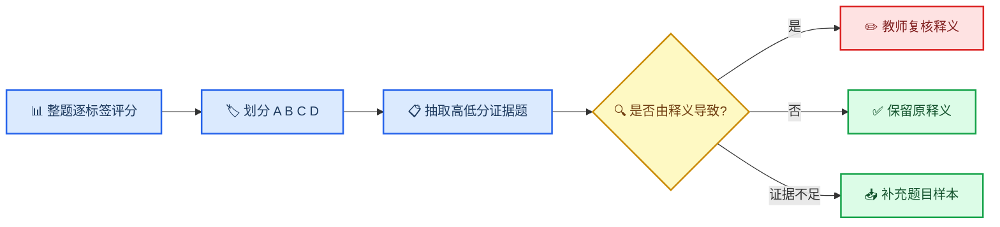

# 高中地理知识点释义诊断报告

> 面向地理学科教师与项目 mentor。报告目标不是重新评判历史标签本身，而是识别哪些现有释义会影响 DeepSeek 后续知识点打标，并给出可复核的题目证据。

## 📌 结论摘要

本轮第二阶段共有 **412 个标签**进入诊断，其中 **410 个完成模型诊断，2 个转人工确认**。在已完成的 410 个标签中，**321 个释义足够，42 个释义过宽，15 个释义过窄，32 个证据不足**。

真正建议老师复核的是 **57 个可通过修改释义改善打标的标签**，占已完成诊断标签的 **13.90%**。这些标签共保留 **353 道完整证据题**，用于核对模型为何认为释义过宽或过窄。其余低匹配题如果属于无关误标或模型误判，不建议通过扩大或收紧释义来迁就。

本报告的直接建议是：

1. 优先复核 42 个“释义过宽”标签，防止 DS 因定义覆盖范围过大而接受只具有背景关联的题目。
2. 其次复核 15 个“释义过窄”标签，避免 DS 排除本应属于该标签的常见考查形式。
3. 32 个“证据不足”标签暂不改释义，等待更多题目样本后再判断。
4. 两个反复未通过结构校验的标签不再继续自动重试，直接请老师确认其知识边界。

## 📊 当前结果只支持修改 57 个标签

| 诊断结论 | 标签数 | 占 410 个成功诊断标签 | 是否建议教师复核 |
| --- | ---: | ---: | --- |
| 释义足够 | 321 | 78.29% | 否，保留原释义 |
| 释义过宽 | 42 | 10.24% | 是，收紧知识边界 |
| 释义过窄 | 15 | 3.66% | 是，补充合理适用范围 |
| 证据不足 | 32 | 7.80% | 暂否，补充样本后再判断 |
| 合计 | 410 | 100.00% | 57 个进入教师复核 |

这里的“释义足够”不表示历史标签一定正确，只表示在抽取的高低匹配样本中，没有发现能通过修改释义解决的稳定问题。“无关题目被误打标签”属于历史标签噪声；“模型没有按释义正确判断”属于模型误判；两者都不应通过改变知识点定义来修复。

## 🔄 诊断流程只回答‘释义是否导致误判’



每个标签最多抽取 10 道 A/B 级高匹配题和 10 道 C/D 级低匹配题。高分样本用于发现释义是否过宽，低分样本用于发现释义是否过窄；同时强制把样本归入有效匹配、释义问题、无关误标或模型误判，避免把所有异常都归咎于释义。

## 🧭 各知识领域的诊断分布

| 一级领域 | 释义足够 | 释义过宽 | 释义过窄 | 证据不足 | 合计 |
| --- | ---: | ---: | ---: | ---: | ---: |
| 世界地理 | 38 | 1 | 2 | 2 | 43 |
| 中国地理 | 45 | 4 | 0 | 5 | 54 |
| 人文地理 | 44 | 12 | 3 | 8 | 67 |
| 区域发展 | 12 | 3 | 0 | 5 | 20 |
| 地理工具 | 17 | 0 | 1 | 0 | 18 |
| 自然地理 | 156 | 18 | 9 | 12 | 195 |
| 资源、环境与国家安全 | 9 | 2 | 0 | 0 | 11 |
| 选修地理（旧） | 0 | 2 | 0 | 0 | 2 |

该表用于安排复核工作量，不用于判断哪个领域的知识体系质量更差。各领域进入当前 40% 运行快照的题量和标签样本量不同，不能直接横向比较比例。

## 📋 建议教师复核的 57 个标签

| 序号 | 标签 ID | 知识点路径 | 问题类型 | 完整证据题数 |
| ---: | --- | --- | --- | ---: |
| 1 | 2276112915215175680 | 人文地理 → 农业 → 农业区位 | 释义过宽 | 4 |
| 2 | 2276112166666129408 | 自然地理 → 地表形态的塑造 → 地表形态的塑造综合 | 释义过窄 | 3 |
| 3 | 2276112284408631296 | 自然地理 → 大气的运动 → 气候 → 气压带和风带 | 释义过宽 | 5 |
| 4 | 2276112982894465024 | 人文地理 → 农业 → 农业综合 | 释义过宽 | 6 |
| 5 | 2276111993407819776 | 自然地理 → 地表形态的塑造 → 外力作用与地貌 → 外力作用与沉积岩 | 释义过宽 | 10 |
| 6 | 2276112403627528192 | 自然地理 → 地球上的水 → 水循环 | 释义过宽 | 6 |
| 7 | 2276112478118367232 | 自然地理 → 水的运动 → 河流 → 河流综合 | 释义过宽 | 5 |
| 8 | 2276112869983801344 | 人文地理 → 乡村和城镇 → 城镇化 | 释义过宽 | 5 |
| 9 | 2276113029551902720 | 人文地理 → 工业 → 工业综合 | 释义过宽 | 5 |
| 10 | 2276113556473925632 | 世界地理 → 世界地理综合 | 释义过窄 | 8 |
| 11 | 2276112865588170752 | 人文地理 → 乡村和城镇 → 城镇的空间结构 | 释义过宽 | 5 |
| 12 | 2276113856534433792 | 选修地理（旧） → 环境保护综合题 | 释义过宽 | 5 |
| 13 | 2276112718519095296 | 自然地理 → 自然环境的整体性与差异性 → 自然环境的地域差异性 → 垂直地域分异 | 释义过宽 | 6 |
| 14 | 2276112076740251648 | 自然地理 → 地表形态的塑造 → 地表形态的塑造微专题 → 河流地貌 | 释义过宽 | 5 |
| 15 | 2276113318723997696 | 资源、环境与国家安全 → 环境安全与国家安全 → 碳排放与碳减排国际合作 | 释义过宽 | 5 |
| 16 | 2276113200226521088 | 区域发展 → 区域发展 → 荒漠化的成因与治理 | 释义过宽 | 15 |
| 17 | 2276112875251847168 | 人文地理 → 乡村和城镇 → 地域文化与城乡景观 | 释义过宽 | 5 |
| 18 | 2276113852054917120 | 选修地理（旧） → 旅游地理综合题 | 释义过宽 | 5 |
| 19 | 2276112015134314496 | 自然地理 → 地表形态的塑造 → 外力作用与地貌 → 海浪作用与地貌 | 释义过宽 | 5 |
| 20 | 2276112651997433856 | 自然地理 → 植被与土壤 → 土壤 → 土壤的观察 | 释义过宽 | 5 |
| 21 | 2276113268761448448 | 区域发展 → 区域发展综合 | 释义过宽 | 6 |
| 22 | 2276113114578833408 | 人文地理 → 环境与发展 → 走向人地协调——可持续发展 | 释义过宽 | 5 |
| 23 | 2276112780880007168 | 自然地理 → 自然灾害 → 自然灾害综合 | 释义过宽 | 7 |
| 24 | 2276112046373490688 | 自然地理 → 地表形态的塑造 → 人类活动与地表形态 → 人类活动与地表形态综合 | 释义过宽 | 5 |
| 25 | 2276113100989288448 | 人文地理 → 交通 → 交通综合 | 释义过窄 | 7 |
| 26 | 2276111915326656512 | 自然地理 → 地球的运动 → 地球的运动综合 | 释义过窄 | 10 |
| 27 | 2276112906373582848 | 人文地理 → 乡村和城镇 → 乡村和城镇综合 | 释义过宽 | 8 |
| 28 | 2276112852132843520 | 人文地理 → 人口 → 人口综合 | 释义过宽 | 14 |
| 29 | 2276113209152000000 | 区域发展 → 区域发展 → 森林资源的保护与开发 | 释义过宽 | 3 |
| 30 | 2276113842827448320 | 中国地理 → 中国地理综合 | 释义过宽 | 9 |
| 31 | 2276111810854932480 | 自然地理 → 宇宙中的地球 → 宇宙中的地球综合 | 释义过窄 | 5 |
| 32 | 2276111712221679616 | 地理工具 → 地图 → 地图综合 | 释义过窄 | 4 |
| 33 | 2276113159793430528 | 人文地理 → 人文地理综合 | 释义过窄 | 2 |
| 34 | 2276112616664616960 | 自然地理 → 水的运动 → 水的运动综合 | 释义过宽 | 17 |
| 35 | 2276112219044597760 | 自然地理 → 地球上的大气 → 地球上的大气微专题 → 与大气的受热过程相关的现象 | 释义过窄 | 3 |
| 36 | 2276112271305625600 | 自然地理 → 大气的运动 → 天气 → 天气综合 | 释义过宽 | 6 |
| 37 | 2276112236643897344 | 自然地理 → 地球上的大气 → 地球上的大气综合 | 释义过窄 | 12 |
| 38 | 2276113630260121600 | 中国地理 → 中国地理全貌 → 中国经济发展综合 | 释义过宽 | 4 |
| 39 | 2276113345651429376 | 世界地理 → 居民与文化 | 释义过宽 | 11 |
| 40 | 2276113418632318976 | 世界地理 → 世界重要的地区 → 欧洲西部 | 释义过窄 | 6 |
| 41 | 2276112394802712576 | 自然地理 → 大气的运动 → 大气的运动综合 | 释义过宽 | 5 |
| 42 | 2276112951068086272 | 人文地理 → 农业 → 农业微专题 → 混合农业 | 释义过宽 | 5 |
| 43 | 2276113327666253824 | 资源、环境与国家安全 → 资源、环境战略与行动 | 释义过宽 | 8 |
| 44 | 2276112037448011776 | 自然地理 → 地表形态的塑造 → 人类活动与地表形态 → 构造地貌对人类活动的影响 | 释义过宽 | 1 |
| 45 | 2276113060757524480 | 人文地理 → 服务业 → 服务业综合 | 释义过窄 | 1 |
| 46 | 2276113648446623744 | 中国地理 → 中国地理分区 → 北方地区 → 北方地区的自然特征与农业 | 释义过宽 | 7 |
| 47 | 2276111958662205440 | 自然地理 → 地貌 → 地貌综合 | 释义过窄 | 3 |
| 48 | 2276112665251434496 | 自然地理 → 植被与土壤 → 土壤 → 土壤综合 | 释义过宽 | 5 |
| 49 | 2276112937562427392 | 人文地理 → 农业 → 农业微专题 → 大棚农业与地膜覆盖 | 释义过宽 | 4 |
| 50 | 2276112447332175872 | 自然地理 → 地球上的水 → 地球上的水综合 | 释义过窄 | 12 |
| 51 | 2276112643273281536 | 自然地理 → 植被与土壤 → 植被 → 植被综合 | 释义过宽 | 12 |
| 52 | 2276112727293579264 | 自然地理 → 自然环境的整体性与差异性 → 自然环境的地域差异性 → 自然环境的地域差异性综合 | 释义过窄 | 10 |
| 53 | 2276112517578379264 | 自然地理 → 水的运动 → 海洋 → 海洋综合 | 释义过宽 | 5 |
| 54 | 2276113625545723904 | 中国地理 → 中国地理全貌 → 中国的文化特色与旅游业 | 释义过宽 | 5 |
| 55 | 2276113150817619968 | 人文地理 → 环境与发展 → 环境与发展综合 | 释义过宽 | 6 |
| 56 | 2276112162002063360 | 自然地理 → 地表形态的塑造 → 地表形态的塑造微专题 → 地热 | 释义过窄 | 1 |
| 57 | 2276112336669659136 | 自然地理 → 大气的运动 → 大气的运动微专题 → 焚风效应分析 | 释义过宽 | 1 |

## 🔍 两个标签需要直接确认知识边界

这两个标签的数据结构完整，均有 10 道高匹配样本和 10 道低匹配样本；反复报错不是端口或缺少数据，而是模型结论无法同时满足严格分类规则。它们更适合由老师直接确认知识边界。

### 1. 自然地理 → 自然地理综合

- 标签 ID：`2276112789788708864`
- 当前样本：255 道；A/B/C/D = 114/26/0/115
- 需要老师确认：**“自然地理综合”是否必须同时调用至少 3 个自然地理模块，还是只要 2 个模块形成明确的跨模块因果分析也可以归入？**
- 原因：样本中既有气候—植被—地形等多模块综合题，也有水文—地貌、气候—植被等双模块题。现有释义的“至少 3 个模块”阈值与部分历史题目标签存在边界冲突。
- 高匹配样本 ID：2139834166097338368, 2139842752435486726, 2139856420262936576, 2139856612023312384, 2139856771129380865, 2158618743399464960, 2158611084818464768, 2262120217568649216, 2141172738336567296, 2139860322650034177
- 低匹配样本 ID：2139841526159740928, 2139855285238468608, 2139856196209872902, 2141131378556481536, 2141601069838184448, 2139864594874343424, 2139841719979188224, 2158840775122829312, 2139856235837657088, 2139856192451776512

原释义：

| 定义/核心内容 | 核心概念/关键术语 | 常见考查方式 | 易混淆区分（帮助 LLM 判断） |
| --- | --- | --- | --- |
| 将自然地理的全部模块（地球运动、地貌、大气、水、植被与土壤、自然环境的整体性与差异性、自然灾害）以及自然地理实践进行最高层级的系统整合，要求从地球表层系统的视角综合分析多圈层、多要素、多尺度的自然地理问题。 | 自然地理各圈层（大气圈/水圈/岩石圈/土壤圈/生物圈）的物质循环与能量交换、各模块之间的内在联系（如气候→水文→地貌→植被→土壤的因果关系链）、自然环境的整体性与差异性在不同尺度（全球/区域/局地）的表现、地球表层系统的核心运行机制、自然地理要素对人类社会的影响与响应、自然地理实践在验证理论和解决实际问题中的关键作用 | 选择题：题目设问涉及多个自然地理模块知识点的跨模块联动（如“气候+地貌+水文+植被”的综合分析、“地质灾害+气象灾害+防灾减灾”的综合分析）；非选择题：给出某一完整区域自然地理综合资料（含气候/地形/水文/植被/土壤/灾害等多方面数据），要求综合调用多个模块的知识进行分析（如分析区域自然环境特征、解释各要素之间的相互作用、评价区域生态环境状况、提出可持续发展建议）。 | 本条属于“自然地理”的最高层级整合性标签，覆盖全部自然地理模块。若题目同时涉及≥3个自然地理模块（如大气+水+地貌+植被与土壤等）并需要进行跨要素、跨圈层的综合分析，则归入本条；若题目仅涉及某一模块内的具体要素，则应归入对应的模块细分知识点。 |

### 2. 世界地理 → 世界地理微区域 → 中美洲及加勒比海地区

- 标签 ID：`2276113546910912512`
- 当前样本：67 道；A/B/C/D = 39/0/0/28
- 需要老师确认：**“中美洲及加勒比海地区”的范围是否包含墨西哥整体、尤卡坦半岛以及墨西哥加勒比海/墨西哥湾沿岸？**
- 原因：多数高匹配题明确位于哥斯达黎加、尼加拉瓜和加勒比海岛屿；争议样本集中在墨西哥与尤卡坦半岛。需要先确定区域口径，才能判断是释义边界缺失还是历史误标。
- 高匹配样本 ID：2141732613412171776, 2158842842512048128, 2141167007726120960, 2139836730267377664, 2139849391119405056, 2141171328983314432, 2158893533259579392, 2158644297666347008, 2139854385226846211, 2158676974045970432
- 低匹配样本 ID：2158644750500184064, 2141128579563204608, 2158602407491354624, 2158632810675650560, 2158643260935061504, 2158841230137704448, 2158624847554625536, 2158651152316710912, 2158648781444431872, 2139893855420518400

原释义：

| 定义/核心内容 | 核心概念/关键术语 | 常见考查方式 | 易混淆区分（帮助 LLM 判断） |
| --- | --- | --- | --- |
| 中美洲及加勒比海地区的自然地理、人口与经济特征。 | 中美洲（连接北美与南美的地峡，含危地马拉/洪都拉斯/巴拿马等）、加勒比海（岛屿国家如古巴/牙买加等）、热带气候、巴拿马运河战略地位重要、经济以农业/旅游为主 | 选择题：判断中美洲或加勒比海地区的地理位置/气候/经济特征；非选择题：分析巴拿马运河的战略意义或该地区的经济特征。 | 中美洲及加勒比海地区是连接北美与南美的“微区域”（属拉丁美洲一部分）。若题目涉及中美地峡、西印度群岛、巴拿马运河等特征，归入本条；若涉及北美洲/南美洲的宏观背景，归入相应大洲或“拉丁美洲”。 |

## ⚠️ 结论的适用范围与限制

- 图谱原始释义文件包含 414 个标签，本轮诊断输入包含 412 个标签，覆盖率为 99.52%。未进入诊断的标签是当前 40% 题目运行快照中没有形成可分析样本，不应被记为“释义足够”。
- 进入诊断的 412 个标签中有 2 个未形成合格模型结论，因此自动完成率为 99.51%。本报告将它们单列人工确认，没有补造模型结果。
- 当前分析只基于第一阶段已完成约 40% 的题目结果。后续题目继续完成后，标签分数分布、代表性样本和证据充分性都可能变化。
- 每个标签用于第二阶段诊断的是抽样题目，不是该标签下的全部题目。抽样兼顾分数阈值附近题目与确定性随机样本，用于发现边界问题，但不能替代教师对知识体系的最终裁定。
- 题目中的图片无法由当前模型读取时，只能依赖题干、选项和解析中的文字信息；图像信息缺失可能造成个别评分偏差。
- A/B/C/D 是题目与现有释义的匹配等级，不是题目质量等级，也不是原始标签正确率。

当前未进入第二阶段的两个标签：

- `2276112678522212352`：自然地理 → 植被与土壤 → 植被与土壤微专题 → 土壤剖面图的分析
- `2276112687464468480`：自然地理 → 植被与土壤 → 植被与土壤微专题 → 气候对土壤形成的作用

## ✅ 建议的处理顺序

1. 老师先确认两个人工边界标签，避免继续让模型在不明确的口径上反复重试。
2. 按本报告的 42 个“过宽”与 15 个“过窄”标签逐项审阅原释义、修改方向和完整证据题。
3. 只修改老师认可的问题标签；释义足够、无关误标和模型误判均保留原释义。
4. 使用修订后的释义重新跑一轮代表性题目评分，确认高分假阳性或低分假阴性是否减少，再进入正式知识点打标。
5. 第一阶段剩余题目完成后重新生成汇总，重点观察 32 个证据不足标签是否获得足够样本，以及当前 57 个问题标签的结论是否稳定。

## ❓ 仍需确认的问题

- 老师是否接受报告中的“释义过宽/过窄”修改方向，还是希望维持现有教学口径？
- 对“综合类”标签是否需要统一定义最少跨模块数量，避免不同综合标签采用不同阈值？
- 对区域地理标签是否需要统一给出明确的空间范围清单，尤其是跨传统分区边界的国家和半岛？
- 第一阶段全量完成后，是否以同一抽样规则重跑第二阶段，以便与当前 40% 快照做稳定性对比？

## 🧾 教师复核明细与完整题目证据

以下仅列出被判定为可通过修改释义解决的 57 个标签。每个标签保留原释义、模型诊断、修改方向以及触发判断的完整题目证据。

### 1. 知识点@人文地理@农业@农业区位

- 标签 ID：`2276112915215175680`
- 诊断：**释义过宽**
- 样本总量：12745；A/B/C/D = 10809/22/1/1913
- 诊断说明：高匹配样本中，部分题目（如2141456880202756096、2498176701506830336、2499683566920753152、2511046082516049920）的核心考查点为生态农业、混合农业、农业科技或销售模式，而非农业区位因素分析，但因释义中包含了“科技、市场”等社会经济因素，导致这些边界题目被误判为有效匹配，说明释义过宽。低匹配样本中，2515027159411085312的第3小题明确考查水源制约和灌溉设施，属于农业区位因素，但因整题主要考查区域地理而被判低分，属于模型误判；其余低匹配题与农业区位无关，属于无关误标。因此，当前问题可通过收紧释义边界解决，将“农业区位”限定为直接分析农业选址的区位因素，排除仅背景涉及农业或仅考查农业技术、生态模式等非区位核心的题目。
- 建议修改方向：收紧释义边界，明确农业区位仅指直接分析农业选址的区位因素（自然与社会经济），排除仅背景涉及农业或仅考查农业技术、生态模式、销售模式等非区位核心的题目。

#### 原释义

| 定义/核心内容 | 核心概念/关键术语 | 常见考查方式 | 易混淆区分（帮助 LLM 判断） |
| --- | --- | --- | --- |
| 农业区位是指农业生产活动在空间上的位置及其与地理环境各要素之间的联系。影响农业区位选择的因素包括自然因素（气候、地形、土壤、水源）和社会经济因素（市场、交通、政策、劳动力、科技、地价等）。农业区位选择的核心原则是因地制宜、因时制宜——充分发挥区域优势条件，避开不利条件。农业区位因素随生产力发展而不断变化：自然因素对农业的制约在减弱，社会经济因素（尤其是市场和科技）的影响日益增强。农业生产区位选择需要考虑“比较优势”——即在特定区域生产特定农产品的相对效率优势。 | 农业区位的含义（农业生产活动的地理位置与地理环境的关系）、自然区位因素（气候—光照/热量/降水/昼夜温差/生长期；地形—海拔/坡度/坡向；土壤—肥力/酸碱度/质地；水源—灌溉条件）、社会经济区位因素（市场—需求量/距离/购买力；交通—运输成本/保鲜条件；政策—补贴/税收/土地政策；劳动力—数量与技能；科技—良种/农业技术/设施；地价—土地成本）、区位因素的变化规律（科技减弱自然因素制约、市场决定生产类型和规模）、因地制宜原则与农业比较优势 | 选择题：判断某地农业发展的主导区位因素（“青藏高原河谷农业的主导因素是热量”）、分析某农业区位选择是否合理；非选择题：给出某区域自然和社会经济条件资料，要求分析该地发展某种农业的区位条件（有利与不利因素），提出农业区位优化建议。 | 本条区别于“世界主要的农业地域类型”——农业区位是“农业为什么选在这里”（区位因素分析），农业地域类型是“在某种区位条件下形成的特定农业经营方式”（如季风水田农业/商品谷物农业等）。本条区别于具体农作物的区位分析——本条是“所有农业活动”的通用区位分析框架，后者针对特定农作物（如水稻/小麦/棉花）的区位条件。 |

#### 有效证据题

证据题 1：2141456880202756096（B 级，得分 0.75，high_score_false_positive）

```text
模型判断依据： 题目以生态农业模式图考查循环经济与可持续发展，虽涉及农业活动，但核心是生态农业的流程与效益，而非农业区位因素分析，属于边界关联。
大题题干： 读图完成题目。
小题 1（2326302352267026432）： 图中箭头( )
选项：A. ①表示秸秆、沼渣和沼液供给养殖业 B. ②表示粮食、蔬菜和棉花等供给农户 C. ③表示太阳能产生沼气 D. ④表示饲料、花卉和油料等供给市场
解析： A.①表示饲料供给养殖业，A 错误；B.②表示粮食、蔬菜和棉花供给农户，B 正确；C.③表示粮食等供给食品加工，C 错误；D.④表示养殖业的产品供给市场，D 错误。
小题 2（2326302352267026433）： 生态农业建设，使留民营村已经步入良性发展轨道，具体体现在( )①发展生物能②规模化经营③清洁化生产④增加化肥的施用量
选项：A. ①③④ B. ②③④ C. ①②③ D. ①②④
解析： 结合上题分析，该村通过发展生物能，实现了规模化经营和清洁化①②③正确；由图可知，该村的种植业利用了沼气、养殖的废液、粪便、沼渣等，减少了化肥的使用量，④错误。故选 C。
```

---

证据题 2：2498176701506830336（B 级，得分 0.75，high_score_false_positive）

```text
模型判断依据： 题目以直播带货为背景，涉及农户生产销售模式，但核心考查的是混合农业概念和销售渠道，而非农业区位因素分析，属于边界关联。
大题题干： 直播带货，是指通过一些互联网平台，使用直播技术进行商品线上展示、咨询答疑、导购销售的新型服务方式。在广大农村，“数字成为新农资、手机成为新农具、直播成为新农活”的景象也已经很普遍。下图是某农户的生产及销售过程，完成下面小题。
小题 1（2498176701506830337）： 关于该农户的生产及销售模式，下列分析不合理的有( )
选项：A. 在对接外采平台、销售过程中体现了数字经济 B. 该农户的生产方式属于小型混合农业 C. 该农户的生产商品主要用于网络销售 D. ①的环节是根据销售情况反馈市场需求
解析： 读图可知，外采平台为半成品库提供数据和实物，体现了数字经济，A说法正确；该农户既种植菜树中草药又养殖鸡、猪等，属于混合农业，B说法正确；该农户的成品库既面向线下销售，又面向网络销售，C说法错误；①环节由线上、线下销售指向市场调查，可以反映出在销售过程中获取的用户反馈的市场需求，D说法正确，题目要求选不合理的说法，故选C。
小题 2（2498176701506830338）： 2020年初至6月，很多新农户加入到直播带货的大军中，最主要的原因是( )
选项：A. 互联网技术发展 B. 线下渠道受阻 C. 物流交通完善 D. 直播利润更高
解析： 2020年初至6月，时间较短，互联网技术不会跳跃式发展，A错误；2020年初爆发新冠疫情，多地采取居家隔离的政策，导致线下销售渠道受阻，农户为了降低损失，加入到直播带货的大军中，B正确；受疫情影响，物流交通效率下降，C错误；农产品通过直播销售，对包装、冷藏、保鲜等环节要求较高，成本上升，利润未必更高，D错误。故选B。
```

---

证据题 3：2499683566920753152（B 级，得分 0.75，high_score_false_positive）

```text
模型判断依据： 题目以酵素农业为背景，涉及农业区位因素（如原料、市场、技术等），但核心考查的是生态农业的效益和问题，而非直接分析农业区位选择，属于边界关联。
大题题干： 酵素农业是一种新型的生态农业，其生产流程如图所示。浙江山区的箭岭村自2017年起使用酵素种植大米果蔬，并探索“生态环境教育+”的发展路径。该村的许多酵素农产品市场价格较高，却在刚种下时就被预定一空。受酵素液产量不足等影响，目前酵素农业还是“小众”农业。据此完成下面小题。
小题 1（2499683566920753153）： 箭岭村发展酵素农业，有利于( )①减少生活垃圾污染 ②丰富农产品的种类③提高农业生产效率 ④提升农产品的品质
选项：A. ①③ B. ①④ C. ②③ D. ②④
解析： 根据图示信息可知，酵素农业是以厨余垃圾、农业鲜垃圾为原料，发展酵素农业可以减少垃圾的排放量，减少生活垃圾污染，①正确；不能丰富农产品的种类，②错误；对农业生产效率的影响较小，③错误；根据材料信息“2017年起使用酵素种植大米果蔬”和图示信息可知，酵素农业能够为农作物提供肥料，并且可以浇灌喷洒农作物，可以提高农产品的品质，④正确。所以选B。
小题 2（2499683566920753154）： 推测酵素液产量不足的主要原因是其生产过程中的( )
选项：A. 技术难度大 B. 水量消耗多 C. 能源消耗大 D. 原料供应不稳定
解析： 根据图示信息可知，酵素液生产需要垃圾需要经过切碎，与糖、水混合，再经过三个月以上的发酵，生产过程需要控制温度湿度等，对于能源的消耗较大，山区能源供应不足，导致酵素液产量不足，C正确；根据材料信息可知，酵素液已经可以生产，说明技术不是限制酵素液产量的主要因素，A错误；该地位于浙江，水资源充足，B错误；酵素液是以厨余垃圾和农业鲜垃圾为原料，该地位于农村，原料供应充足，D错误。所以选C。
小题 3（2499683566920753155）： 为进一步提高酵素农业的经济效益，箭岭村应采取的合理措施是( )
选项：A. 适当施用化肥，提高作物产量 B. 改山林为耕地，扩大生产规模 C. 挖掘市场潜力，拓宽产业类型 D. 降低产品价格，扩大销售市场
解析： 根据材料信息可知，目前酵素液产量不足，导致农作物产量受限，应该适当施用化肥，提高作物产量，提高当地酵素农业的经济效益，A正确；改山林为耕地，会破坏生态环境，B错误；当地酵素液产量不足，不适宜拓宽产业类型，C错误；根据材料信息“该村的许多酵素农产品市场价格较高，却在刚种下时就被预定一空。”可知，目前该村酵素农业产品市场需求旺盛，不需要扩大销售市场，D错误。所以选A。
```

---

证据题 4：2511046082516049920（B 级，得分 0.75，high_score_false_positive）

```text
模型判断依据： 题目围绕‘藏粮于地’和‘藏粮于技’战略，考查农业科技进步和耕地保护，与农业区位因素（尤其是科技、政策等社会经济因素）有较强关联，但未直接要求分析农业区位选择，属于边界性考查。
大题题干： 阅读图文材料，完成下列要求。“藏粮于地”目的是要保护好现有的耕地，科学合理利用耕地资源，实现粮食稳产高产；“藏粮于技”即依靠科技进步提高粮食单产。2022年，我国农业科技进步贡献率已达62.4\%。下图为新中国成立以来农业科技进步贡献率趋势。
小题 1（2511046082516049921）： 说明新中国成立以来，我国农业科技进步贡献率的变化趋势特点。
解析： 据图示图表信息可知，从“一五”到“二五”、“六五”到“七五”这两个期间，贡献率降低，其他时期如“二五”到“六五”、“七五”以后贡献率持续增长。总体趋势为波动上升。
小题 2（2511046082516049922）： 简述我国农业科技进步贡献的具体体现。
解析： 农业科技进步对农业的贡献表现在：发展科技，培育良种，提高弄作物单产及其抗病和抗灾能力，保证作物高产、稳产；通过技术手段改造中低产田，改善土壤肥力，提高耕地质量，增加作物产量；提高机械化水平，提高劳动生产效率，解放一部分农业劳动力。
小题 3（2511046082516049923）： 简析目前我国实施“藏粮于地”战略的必要性。
解析： 目前我国实施“藏粮于地”战略，是结合我国国情与耕地资源的特点所提出的，重在保护耕地数量的同时提高耕地质量。我国人多地少，后备耕地资源不足，粮食供给压力大，藏粮于地可以保障粮食安全；城市化过程中交通、工矿和城市建设等大量占用耕地，粮食安全风险较大；有些地区过度占用耕地及耕地污染，退化问题严重，粮食安全风险大，保护好耕地资源，确保耕地数量和生产能力，利于保障粮食安全。
```

---

### 2. 知识点@自然地理@地表形态的塑造@地表形态的塑造综合

- 标签 ID：`2276112166666129408`
- 诊断：**释义过窄**
- 样本总量：8737；A/B/C/D = 7183/540/7/1007
- 诊断说明：低匹配样本中，多道题目（如2540006079471067136、2565995864039895040、2642529711617507328）虽仅涉及单一外力地貌（冲积扇、三角洲、沙丘），但均属于地表形态塑造综合的组成部分，且题目设问涉及地貌成因、演化及与人类活动的关系，符合整合性标签的考查范围。现有释义要求“同时涉及≥3个要素”过于严格，导致这些本应属于该标签的题目被排除。同时，高匹配样本中无证据表明释义过宽。因此，释义存在过窄问题，需放宽对要素数量的要求。
- 建议修改方向：降低对要素数量的硬性要求，将‘同时涉及≥3个地表形态塑造相关要素’改为‘涉及多个地表形态塑造相关要素（如内外力作用、岩石圈物质循环、人类活动等）或对单一要素进行深入综合分析’，并明确包含单一外力地貌（如冲积扇、三角洲）的成因、演化及与人类活动关系的内容。

#### 原释义

| 定义/核心内容 | 核心概念/关键术语 | 常见考查方式 | 易混淆区分（帮助 LLM 判断） |
| --- | --- | --- | --- |
| 将内力作用（岩浆活动/变质作用/地质构造/板块构造）、外力作用（风化/流水/风力/冰川/海浪）、岩石圈物质循环、人类活动与地表形态的相互关系，以及各类微专题进行系统整合。 | 内外力共同塑造地表形态的整体框架、岩石圈物质循环与地表形态的关联、各类地貌的成因与演化过程、地貌与人类活动的双向互动 | 选择题：题目设问涉及多个内力/外力作用或多种地貌类型的联动；非选择题：给出某一完整区域图（可能涉及多种地质构造、多种外营力作用和多类地貌），要求综合调用多个相关知识进行分析。 | 本条属于整合性标签。若题目同时涉及≥3个地表形态塑造相关要素（如内力作用+外力作用+岩石圈物质循环+人类活动等）并需要进行综合分析，则归入本条；若题目仅涉及某一具体过程或地貌，应归入对应的细分知识点。 |

#### 有效证据题

证据题 1：2540006079471067136（C 级，得分 0.6，low_score_definition_issue）

```text
模型判断依据： 题目主要考查河流堆积地貌（冲积扇、三角洲）和风力堆积地貌（沙丘），属于外力作用的具体地貌类型，未涉及内力作用、岩石圈物质循环或人类活动等≥3个要素的综合分析，因此与整合性标签‘地表形态的塑造综合’关联有限，但可归入该知识点的边界范围。
大题题干： 读图，完成下列问题。
小题 1（2540006079471067137）： 从地貌上看，甲图是______，乙图是______，二者都是河流______ 地貌。
解析： 甲位于河流出山口，呈扇形，是冲积扇；乙位于河流入海口，呈三角形，是河口三角洲。当河流流出谷口时，摆脱了侧向约束，其携带物质便铺散沉积下来，形成冲积扇；三角洲是河流流入海洋、湖泊或其他河流时，因流速减低，所携带泥沙大量沉积，逐渐发展成的冲积平原。故二者都是流水的堆积作用形成的地貌。
小题 2（2540006079471067138）： 若甲、乙两地貌在丙图中有分布，则其对应为甲在______ (填字母)处分布，乙在______ (填字母)处分布。图甲所示地貌的沉积物从扇顶到扇缘，堆积物颗粒逐渐变______。
解析： 甲是冲积扇分布在山前，即河流流出山口的位置，对应丙图的B；乙是三角洲，分布在河流入海口位置，即丙图的A。河流流出山谷，随着流速减慢，可形成冲积扇地形，地貌特征是以山谷口为顶点呈扇形，从扇顶到扇缘地势逐渐降低，颗粒物逐渐变小。
小题 3（2540006079471067139）： 下图所示地貌从成因上讲属于______ 地貌，该地貌主要分布在我国______ 地区，图中迎风坡为______ (填字母)。
解析： 图中地貌呈新月状，为沙丘地貌；沙丘地貌因风力堆积而成，主要分布在我国西北干旱、半干旱地区。沙丘地貌，迎风坡为缓坡、背风坡为陡坡，图中a处为缓坡，即迎风坡。
```

---

证据题 2：2565995864039895040（C 级，得分 0.6，low_score_definition_issue）

```text
模型判断依据： 题目考查洪积扇的识别与形成条件，属于外力作用中的流水堆积地貌，但仅涉及单一地貌类型，未达到整合性标签要求的≥3个地表形态塑造要素的综合分析。
大题题干： 下图景观位于我国内陆地区，完成下面小题。
小题 1（2565995864039895041）： 甲处地貌是( )
选项：A. 洪积扇 B. 河漫滩平原 C. 三角洲 D. 新月形沙丘
解析： 读图可知，甲处地貌位于河流出山口处，甲地处貌的形态是扇形堆积体，材料信息表明，该地貌景观位于我国内陆地区，大多是临时性水流流出谷口时摆脱侧向约束，其携带物质便铺散沉积下来形成的洪积扇，A符合题意；河漫滩平原应分布在宽阔河谷的两侧，三角洲应分布在入海口，新月形沙丘一般不会分布在河谷谷口、依附山麓分布，因此甲处地貌不是河漫滩平原、三角洲、新月形沙丘，排除BCD。故选A。
小题 2（2565995864039895042）： 该山区不利于甲地貌形成的条件是( )
选项：A. 土质疏松 B. 河流落差大 C. 夏季流量小 D. 植被覆盖度低
解析： 甲处地貌是流水堆积作用形成的沉积地貌，径流输往山口的泥沙越多，越有利于该地貌形成，反之则不利于甲地貌形成。土质疏松、河流落差大、植被覆盖度低，会导致流域内水土流失严重，河流输往谷口的泥沙多，有利于甲 处地貌形成，ABD不符合题意；夏季流量小，洪水出现频率小，则河流携带的泥沙物质少，则不利于甲地貌形成，C符合题意。故选C。
```

---

证据题 3：2642529711617507328（C 级，得分 0.6，low_score_definition_issue）

```text
模型判断依据： 题目仅考查冲积扇和三角洲两种具体地貌的成因、特征和农业利用，未涉及内力作用、岩石圈物质循环或人类活动等≥3个要素的综合分析，属于细分知识点而非整合性标签。
大题题干： 下面甲、乙两图分别为冲积扇与河口三角洲地貌景观示意图。完成下面小题。
小题 1（2642529711617507329）： 冲积扇地貌一般分布在______，是______ 作用形成的。
解析： 冲积扇地貌位于河流出山口，河流流速明显变慢，河流带来的泥沙在此大量沉积形成堆积地貌，地貌呈扇状形态，为冲积扇；是流水堆积作用形成的。
小题 2（2642529711617507330）： 冲积扇从扇顶到扇缘，沉积物颗粒情况是______，地势______。
解析： 流水堆积过程中先堆积颗粒大的，再堆积颗粒小的，由扇顶到扇缘表层沉积物颗粒由大变小，地势由高变低。
小题 3（2642529711617507331）： 三角洲多位于______ 地区。
解析： 三角洲多位于河流的入海口或入湖口，由河流携带的泥沙在河口处沉积而形成。
小题 4（2642529711617507332）： 两种地貌类型中，岔流较多，多受波浪作用影响的是______。
解析： 冲积扇位于河流出山口，不受波浪作用影响。三角洲位于入湖、入海口附近，波浪作用明显，岔流较多。
小题 5（2642529711617507333）： 上述两种地貌的农业土地利用类型多为______。
解析： 两种地貌地势平坦，土壤肥沃，水源充足，利于发展种植业，农业土地利用类型多为耕地。
```

---

### 3. 知识点@自然地理@大气的运动@气候@气压带和风带

- 标签 ID：`2276112284408631296`
- 诊断：**释义过宽**
- 样本总量：6581；A/B/C/D = 4243/6/0/2332
- 诊断说明：高匹配样本中，部分题目（如2434146134533136384、2539983547673436160、2549020312302084096、2563382749653721088、2638419051500556288）仅间接涉及气压带风带，核心考点实为季风、气候类型或地形等，但因释义中包含了海陆分布对气压带的影响及季风环流相关内容，导致这些边界题被纳入。低匹配样本中，题目2544575620337901568的第3小题直接考查中纬环流与西风带，应属于该知识点，但因其他小题不相关而被低分，属于模型误判。其他低匹配题（如2139868884315017216、2158713298631213056等）核心考点为季风或气候类型，与气压带风带无直接关系，属于无关误标。因此，释义存在过宽问题，需明确区分气压带风带与季风环流，并收紧边界。
- 建议修改方向：收紧释义边界，明确区分气压带风带（三圈环流）与季风环流（海陆热力性质差异主导），将季风环流相关内容从关键词和定义中移除，仅保留海陆分布对气压带的影响作为背景知识，并强调核心考点为三圈环流、气压带风带的名称、分布、移动及对气候的影响。

#### 原释义

| 定义/核心内容 | 核心概念/关键术语 | 常见考查方式 | 易混淆区分（帮助 LLM 判断） |
| --- | --- | --- | --- |
| 全球性大气环流的理想模式（假设均匀下垫面）由三圈环流构成，形成七个气压带和六个风带：赤道低气压带、南北副热带高气压带、南北副极地低气压带、南北极地高气压带；信风带（东北/东南信风）、盛行西风带（中纬西风，北半球西南/南半球西北）、极地东风带。气压带风带随太阳直射点季节移动而南北移动。 | 三圈环流（哈德莱环流/费雷尔环流/极地环流）、七个气压带（赤道低压/副热带高压×2/副极地低压×2/极地高压×2）、六个风带（东北信风/东南信风/盛行西风×2/极地东风×2）、气压带风带的季节性移动（随直射点移动，约5—10个纬度）、海陆分布对气压带的影响（冬季亚洲高压/夏季亚洲低压、阿留申低压/冰岛低压、夏威夷高压/亚速尔高压） | 选择题：判断某纬度对应的气压带或风带、判断气压带风带的移动方向及对某地气候的影响；非选择题：给出某月全球气压带分布图（如1月/7月），分析气压带位置的季节性移动及其对某区域气候的影响。 | 本条区别于“影响气候的因素”——气压带风带是“环流因素”本身，是气候形成的重要内因；而“影响气候的因素”是更宏观的框架（含纬度/海陆/地形/洋流/大气环流等）。本条与“世界主要气候类型”是“原因”与“结果”的关系——气压带风带决定气候类型的宏观分布格局。 |

#### 有效证据题

证据题 1：2434146134533136384（B 级，得分 0.75，high_score_false_positive）

```text
模型判断依据： 题目涉及南美洲42°S西风带背风坡的荒漠气候，解题需理解西风带（气压带风带）及其对降水的影响，属于边界性考查。
大题题干： 下图为纬度42°附近某区域沙尘暴遥感影像，其中黑色部分为海洋，浅色部分为陆地和沙尘。该区域荒漠直抵海岸，来自陆地的沙尘在海洋上空形成了一条条弧线。读图，完成下列各题。
小题 1（2434146134533136385）： 图示区域位于
选项：A. 澳大利亚太平洋沿岸地区 B. 亚欧大陆太平洋沿岸地区 C. 北美洲大西洋沿岸地区 D. 南美洲大西洋沿岸地区
解析： 分析选项，澳大利亚42°S的太平洋沿岸为温带海洋性气候，不会出现荒漠直抵海岸的景观，答案A错误，亚欧大陆42°N的太平洋沿岸为温带季风气候，生长的是温带落叶阔叶林，不可能在海边出现荒漠直抵海岸的景观，答案B错误，北美洲42°N大西洋沿岸为温带大陆性气候，生长的也是温带落叶阔叶林，也不可能出现荒漠直抵海岸的景观，答案C错误，南美洲42°S大西洋沿岸位于安第斯山脉东侧，处于西风带的背风一侧，降水较少，形成温带大陆性气候，出现荒漠直抵海岸的景观，故答案选D。
小题 2（2434146134533136386）： 影响图示区域降水量的主导因素是
选项：A. 纬度位置 B. 海陆位置 C. 地形 D. 大气环流
解析： 分析图示地区，结合所学知识可知，该地位于安第斯山脉东侧，高大的安第斯山脉阻挡了西风从大西洋上带来的水汽，不利于形成降水，故降水较少，形成干旱的温带大陆性气候，所以影响该区域降水量的主导因素是地形，故答案选C。
小题 3（2434146134533136387）： 图示区域气候类型主要为
选项：A. 温带海洋气候 B. 温带大陆性气候 C. 温带季风气候 D. 亚热带季风性湿润气候
解析： 分析图示地区，结合所学知识可知，该地位于安第斯山脉东侧，高大的安第斯山脉阻挡了西风从大西洋上带来的水汽，而且山脉东侧气流下沉，空气增温，不利于形成降水，故降水较少，形成干旱的温带大陆性气候，故答案选B。考点：本题考查自然地理环境区域差异、天气和气候、大气运动。
```

---

证据题 2：2539983547673436160（B 级，得分 0.75，high_score_false_positive）

```text
模型判断依据： 题目考查季风环流，涉及海陆分布对气压带的影响（如印度低压、夏威夷高压）及气压带风带季节性移动（西南季风成因），与气压带和风带知识点有边界关联，但核心是季风而非直接考查三圈环流或气压带风带本身。
大题题干： 读下图，回答下列问题。 (1)此图表示的是______ (冬季或夏季)季风图，气压中心B的名称是______。(2)A、B、C三地中，气压最低的是______，其形成原因是______ (热力\动力)作用。(3)盛行E季风时，我国东部地区的气候特点是______，地中海沿岸的气候特点是______。(4)在成因上，F季风是______ 形成的，E季风是______ 形成的，此时北太平洋上的大气活动中心是______
解析： 本题考查东亚和南亚的季风气候的形成原因，以及冬夏气压中心的形成原因等。需要熟练掌握季风环流的形成原因和过程。(1)读图可知，风向是海洋吹向大陆，此题反映的是7月，北半球陆地是低压，形成印度低压中心，也就是图中B。(2)由上题可知，B处是此时亚洲大陆的低压中心，是印度低压中心B处的气压比A低；而南半球此时为冬季，大陆上形成高压，故C是高压。所以B的气压最低，其形成原因是受热空气上升，近地面形成低压，属于热力原因。(3)盛行E季风时，北半球是夏季，我国东部是季风气候，夏季盛行东南季风，都是高温多雨的特征；地中海沿岸属于地中海气候，夏季炎热干燥。(4)F季风为夏季的西南季风，在成因上，是因为南半球的东南信风向北移动，越过赤道后，地转偏向力向右偏，形成西南季风，故属于气压带和风带的季节移动造成的。E季风为东亚的东南季风，是由于海陆热力性质差异形成的。此时大陆上形成的热低压切断了副热带高压带，使高压其保留在海洋上，形成夏威夷高压。季风环流具有全球性的有规律的大气运动，通常称为大气环流。大范围地区的盛行风随季节而有显著改变的现象，称为季风。季风环流也是大气环流的一个组成部分。亚洲东部的季风环流最为典型。海陆热力性质的差异，导致冬夏间海陆气压中心的季节变化，是形成季风环流的主要原因。
```

---

证据题 3：2549020312302084096（B 级，得分 0.75，high_score_false_positive）

```text
模型判断依据： 题目涉及地中海气候和热带沙漠气候的成因与自然带，虽与气压带风带（如副热带高压、西风带）有间接关联，但核心考点是大气环流、洋流、地形等综合因素，而非直接考查气压带风带本身。
大题题干： 下图为“世界某地区年均降水总量空间分布示意图”，根据图中提供的相关信息，思考并回答下列各题。
小题 1（2549020312302084097）： 影响图中甲区域降水丰富的主要因素是( )
选项：A. 大气环流与洋流 B. 洋流与地形 C. 大气环流与地形 D. 太阳辐射与人类活动
解析： 图中甲区域位于非洲北部，地中海沿岸，阿特拉斯山山脉北坡，冬季受来自大西洋暖湿气流影响，位于山地迎风坡，降水多，C正确。
小题 2（2549020312302084098）： 沿箭头方向从甲到乙的过程中，所经过的自然带主要是( )
选项：A. 温带落叶阔叶林带、亚热带常绿硬叶林带 B. 亚热带常绿硬叶林带、热带荒漠带、热带草原带 C. 亚热带常绿硬叶林带、热带荒漠带 D. 温带落叶阔叶林带、亚热带常绿硬叶林带、热带草原带
解析： 从甲到乙气候类型由地中海气候变为热带沙漠气候，自然带由亚热带常绿硬叶林带过渡到热带荒漠带，C正确。
```

---

证据题 4：2563382749653721088（B 级，得分 0.75，high_score_false_positive）

```text
模型判断依据： 题目涉及几内亚湾西南季风，其形成与气压带风带（如副热带高压、信风）的季节性移动有关，但核心考点更偏向季风与降水类型，气压带风带作为背景知识辅助解题，属于边界关联。
大题题干： 几内亚湾沿岸具有比较明显的夏季风，即西南季风。西南季风给几内亚湾沿岸带来丰富的水汽，登陆以后形成丰富的降水。图为非洲几内亚湾西南季风示意图。据此完成下面小题。
小题 1（2563382749653721089）： 几内亚湾西南季风带来的降水类型主要为( )
选项：A. 地形雨 B. 对流雨 C. 锋面雨 D. 气旋雨
解析： 几内亚湾位于低纬度地带，难以形成锋面系统，但夏季气温高，抬升西南季风带来的水汽，多对流雨，B正确、ACD错误。故选B。
小题 2（2563382749653721090）： 地中海表层海水温度上升的年份，几内亚湾西南季风( )
选项：A. 势力减弱，影响范围缩小 B. 势力增强，影响范围缩小 C. 势力减弱，影响范围扩大 D. 势力增强，影响范围扩大
解析： 几内亚湾西南季风出现在夏季，夏季副热带高气压带控制地中海地区。若夏季地中海表层海水温度上升，则副高势力减弱，东北信风势力减弱，西南季风可长驱直入非洲大陆腹地，势力增强，影响范围扩大，D正确、ABC错误。故选D。
小题 3（2563382749653721091）： 西南季风过境西非北部，带来的天气过程是( )
选项：A. 电闪雷鸣—沙尘遮天—大雨倾盆 B. 大雨倾盆—沙尘遮天—电闪雷鸣 C. 沙尘遮天—电闪雷鸣—大雨倾盆 D. 电闪雷鸣—大雨倾盆—沙尘遮天
解析： 西非北部位于撒哈拉沙漠南缘，植被稀疏，沙化严重，西南季风过境会扬起沙尘，形成遮天蔽日的沙尘天气，后因受热，空气对流上升，带来雷暴大雨天气，C正确、ABD错误。故选C。
```

---

证据题 5：2638419051500556288（B 级，得分 0.75，high_score_false_positive）

```text
模型判断依据： 题目通过季风指数考查我国东部季风环流，间接涉及副热带高气压带对江淮伏旱的影响，属于气压带风带知识的边界应用，但核心考点是季风而非气压带风带本身。
大题题干： 季风指数是季风现象明显程度的量值，其大小反映一个地区季风环流的强弱程度。下图示意我国东部地区1880-2000年的夏季风指数(a)和冬季风指数(b)距平(距平是某一系列数值中的某一个数值与平均值的差)值曲线。据此完成下列各题。
小题 1（2638419051500556289）： 下列年份，我国江淮地区伏旱期最明显的是( )
选项：A. 1900年 B. 1930年 C. 1960年 D. 1990年
解析： 夏季风强的年份，我国南旱北涝，江淮地区受副热带高气压带影响时间长，伏旱期明显。读图可知1960年距平值最大且大于0，说明夏季风最强。故C正确。
小题 2（2638419051500556290）： 1910—1920年期间，与多年平均状况相比( )
选项：A. 东北地区寒潮频次增多 B. 西北地区天山雪线偏低 C. 南方地区羽绒服畅销 D. 华北地区植物发芽较早
解析： 距平大于0，季风势力强，小于0，季风势力弱。读图可知1910—1920年期间，夏季风较强，冬季风较弱；因此与多年平均状况相比，我国北方降水增多，冬季较暖。我国东北地区寒潮频次减少；西北地区天山雪线应偏高；冬季风较弱，南方羽绒服滞销；夏季风较强，春季气温回升早，华北地区植物发芽较早。故D正确，A、B、C错误。
小题 3（2638419051500556291）： 与1960年相比，1980年黄河( )
选项：A. 结冰期较长，凌汛灾害严重 B. 含沙量增大，三角洲增长快 C. 径流量减小，下游断流加剧 D. 径流量增大，下游洪涝严重
解析： 与1960年相比，1980年夏季风弱，冬季风强，因此北方黄河流域降水少，径流量减小，下游断流加剧，故C正确，D错误。结冰期虽然长，但河流流量小，凌汛灾害不一定严重，故A错误。河流径流量减小会导致河流含沙量减少，三角洲增长减慢，故B错误。
```

---

### 4. 知识点@人文地理@农业@农业综合

- 标签 ID：`2276112982894465024`
- 诊断：**释义过宽**
- 样本总量：6157；A/B/C/D = 5659/197/1/300
- 诊断说明：现有释义要求题目同时涉及≥3个农业要素并进行综合分析，但高匹配样本中多题仅考查单一或两个要素（如区位制约因素、耕地集约度、品牌市场等），却被归入高匹配，说明释义过宽导致边界模糊。低匹配样本中部分题目虽涉及农业环境问题或背景，但未达到多要素综合要求，属于正常排除，未发现因释义过窄而漏判的题目。因此，当前问题可通过收紧释义、明确多要素综合的量化标准来解决。
- 建议修改方向：收紧释义，明确要求题目必须同时涉及至少三个农业核心要素（如区位、农作物、地域类型、技术措施、环境影响、可持续发展等）并进行综合分析，避免将仅考查单一或两个要素的题目纳入。

#### 原释义

| 定义/核心内容 | 核心概念/关键术语 | 常见考查方式 | 易混淆区分（帮助 LLM 判断） |
| --- | --- | --- | --- |
| 将农业区位理论、世界主要农作物分布、农业生产与自然条件（气温/气象灾害/品质）的关系、农业技术措施（大棚/地膜）、农业地域类型（含混合农业/城郊农业/立体农业）、现代农业与生态农业的发展方向，以及农业对地理环境的影响进行系统整合，从多维度综合分析农业相关问题。 | 自然因素（气候/地形/土壤/水源）与农业区位选择、社会经济因素（市场/交通/政策/科技/劳动力）对农业的驱动作用、主要农作物分布与自然条件的对应关系、农业地域类型的形成条件与经营特征（季风水田/商品谷物/大牧场/混合/地中海/热带种植园/乳畜业等）、农业技术（大棚/地膜/设施/精准）对生产条件的改善、现代农业与生态农业的发展趋势、农业对地理环境的正反影响与可持续发展、因地制宜与农业区位优化的统一框架 | 选择题：题目设问涉及多个农业知识点的联动（如“自然条件+区位选择+农业地域类型+农业环境影响”）；非选择题：给出某一区域农业综合资料（含气候/地形/土壤/市场/劳动力/政策等数据），要求综合调用多个相关知识进行分析（如分析该区域适宜发展的农业类型和地域模式、评价农业区位条件、提出农业技术措施、预测农业生产对地理环境的影响、设计农业可持续发展路径）。 | 本条属于“农业”模块的最高层级整合性标签。若题目同时涉及≥3个农业相关要素（如区位分析、农作物适宜性、农业地域类型、农业技术措施、环境影响等）并需要进行综合分析，则归入本条；若题目仅涉及某一具体要素或单一模块，则应归入对应的细分知识点。 |

#### 有效证据题

证据题 1：2158719520763756544（B 级，得分 0.7，high_score_false_positive）

```text
模型判断依据： 第一小题要求分析农业经济效益低的原因，涉及农业区位与市场因素，属于农业综合分析的边界考查，但其他小题与农业无关，整体匹配度偏边界。
大题题干： 根据图文材料，回答问题。 尼日利亚位于西非东南部，其石油出口量居非洲首位，是非洲最大的经济独立体，但经济较为落后。据此完成题目。
小题 1（2326068240931364864）： 该国农产品类型多样且多出口，但当地农业经济效益低下。试分析其原因。
解析： 尼日利亚在非洲，经济发展水平低，产品一般是初级产品，经济效益低，对市场风险的适宜性小。
小题 2（2326068240931364865）： 简要分析该国石油资源出口量大的原因。
解析： 该国石油资源丰富，石油是当今世界能源的主导。
小题 3（2326068240931364866）： 分析尼日尔河下游河段的水文特征。
解析： 尼日尔河下游河段的水文特征可从汛期、结冰期、凌汛、含沙量等方面回答。
```

---

证据题 2：2566112564223684608（B 级，得分 0.7，high_score_false_positive）

```text
模型判断依据： 题目仅在第2小题中涉及农业（种植业）的适宜性判断，属于农业区位选择的单一要素，未达到整合≥3个农业要素进行综合分析的要求，因此归入边界/辅助匹配。
大题题干： 下图为世界某地区海陆分布图。读图完成下面小题。
小题 1（2566112564223684609）： 图中甲地地貌( )
选项：A. 以冰川侵蚀地貌为主 B. 以风力堆积地貌为主 C. 以流水侵蚀地貌为主 D. 以流水堆积地貌为主
解析： 读图可知，甲地位于河流入海口附近，位于冲积平原与三角洲，这是流水携带泥沙在此沉积形成，属于流水堆积地貌，D符合题意；甲处地貌与冰川侵蚀地貌、风力堆积地貌和流水侵蚀地貌的形态、位置不同，排除ABC。故选D。
小题 2（2566112564223684610）： 图中甲地貌类型多适宜于发展( )
选项：A. 林业 B. 畜牧业 C. 种植业 D. 养鱼业
解析： 图中甲地貌类型地形平坦、水源丰富、灌溉便利，一般适宜发展种植业，林业、畜牧业和养鱼业不是该类地貌最适宜发展的农业类型，C符合题意，排除ABD。故选C。
```

---

证据题 3：2139837229157875712（B 级，得分 0.75，high_score_false_positive）

```text
模型判断依据： 题目考查甲、乙两地发展种植业的主要制约因素，涉及气候（光热、降水）对农业区位的影响，属于农业综合知识点中的自然因素分析，但仅聚焦单一要素，未达到多维度综合整合要求。
大题题干： 下图是一组世界区域地图。图中甲、乙两地发展种植业生产的主要制约因素分别是( )
选项：A. 土壤、水源 B. 光热、降水 C. 风向、地势 D. 地形、河流
解析： 两地发展种植业的制约因素要从两地的气候特点分析，甲为温带海洋性气候，光热不足是其制约因素；乙为温带大陆性气候，降水不足是其制约因素。
```

---

证据题 4：2139843564591484929（B 级，得分 0.75，high_score_false_positive）

```text
模型判断依据： 题目涉及耕地集约利用指数，考查了农业投入（劳动力、资金、技术）与集约度的关系、社会经济因素（农产品价格、城市经济比较利益）对农业的影响，以及提高集约度的措施（农业机械化），属于农业综合分析的边界案例，但未直接涉及农作物分布、农业地域类型等核心要素，因此归入偏边界/辅助。
大题题干： 如图为湖北省耕地集约利用指数发展趋势图。耕地利用集约度是指在考虑耕地生态环境质量的前提下，在一定时间内投入到单位面积耕地上的劳动力、资金、物质、技术等的密集程度，耕地集约度越高则集约指数越大。读图，回答
小题 1（2325636010102759424）： 从1990年至2008年，湖北省耕地利用集约度呈现出的总体趋势是( )
选项：A. 呈波动上升趋势 B. 一直稳步上升 C. 自1994年到2000年快速上升 D. 上升趋势不明显
解析： 读图可知，湖北省耕地利用集约度呈现出有时上升，有时下降，但总体趋势是上升的，即呈波动上升趋势。故选A。
小题 2（2325636010102759425）： 下列有关耕地集约利用指数的叙述，正确的是( )
选项：A. 农产品价格与耕地利用集约度呈正向关系 B. 耕地质量与耕地利用集约度呈负向关系 C. 经济快速发展，耕地集约利用水平下降 D. 在城市经济的比较利益影响下，耕地集约利用水平上升
解析： 农产品价格越高，农民对耕地的投入越多，所以农产品价格与耕地利用集约度呈正向关系；耕地质量的好坏关系到耕地利用的效率，耕地质量越好，耕地利用效率越高；另一方面，质量好的耕地，风险低、见效快，农民愿意投入；经济快速发展，对耕地投入越多，所以耕地集约利用水平上升；在城市经济的比较利益影响下，主要是指相同的投入，第二与第三产业产出高，耕地产出相对少，所以耕地集约利用水平下降。故选A。
小题 3（2325636010102759426）： 湖北省要继续提高耕地利用集约度，可采取的合理措施有( )
选项：A. 大力提高农业机械化水平 B. 减少政府对农业的扶持力度 C. 大量使用农药和化肥 D. 禁止农村劳动力外出务工
解析： 大力提高农业机械化水平有利于提高耕地利用集约度；加大政府对农业的扶持力度，可以提高耕地利用集约度；当农村劳动力相对过剩时，过多的乡村劳动力反而导致农业低效生产，降低耕地利用集约度。故选A。
```

---

证据题 5：2139856013673762821（B 级，得分 0.75，high_score_false_positive）

```text
模型判断依据： 题目涉及耕地撂荒的原因、影响及对策，虽未直接考查农业区位、农作物分布等核心内容，但属于农业土地利用与可持续发展问题，与农业综合知识点有边界关联。
大题题干： 耕地撂荒是指在耕地利用过程中，生产经营者由于主观原因放弃耕种而造成的耕地处于闲置或未充分利用的状态。伴随着我国经济和城镇化的快速发展，四川省许多地方的大量耕地存在长期撂荒现象。据此回答
小题 1（2325768270533632000）： 造成四川省多地耕地长期撂荒的主要原因是( )
选项：A. 农业生产条件差 B. 农村劳动力缺乏 C. 灌溉水源成本高 D. 粮食已自给有余
解析： 造成四川省多地耕地长期撂荒的主要原因是农村劳动力缺乏，故选B。
小题 2（2325768270533632001）： 农村大量耕地长期撂荒，将( )
选项：A. 缓解人均耕地压力 B. 利于耕地积蓄肥力 C. 危及国家粮食安全 D. 抑制民工大量外出
解析： A.与缓解人均耕地压力无关，A错误；B.与耕地积蓄肥力无关，B错误；C.农村大量耕地长期撂荒，粮食产量减少，将危及国家粮食安全，C正确；D.土地撂荒是民工大量外出的结果，D错误。故选C。
小题 3（2325768270533632002）： 缓解农村耕地长期撂荒的有效措施是( )
选项：A. 禁止民工外出打工 B. 统一管理撂荒耕地 C. 加强农田水利建设 D. 稳定农产品的价格
解析： A.禁止民工外出打工不符实际，A错误；B.缓解农村耕地长期撂荒的有效措施是统一管理撂荒耕地，B正确；CD.加强农田水利建设、稳定农产品的价格不能改变民工外出的趋势，效果不明显，CD错误。故选B。
```

---

证据题 6：2615022691260600320（B 级，得分 0.75，high_score_false_positive）

```text
模型判断依据： 题目涉及和牛的等级划分（适应市场）和保持竞争优势（保障肉质、打造品牌），属于农业综合中社会经济因素与品牌化、市场导向的考查，但未涉及自然条件、地域类型、技术措施等核心要素，属于边界性关联。
大题题干： 日本和牛是以日本原种牛为基础，经长期选育的家畜牛。其肉质柔软细嫩，油脂丰厚，大理石花纹明显。近年来，日本食肉协会依据肌肉色泽度、肉松弛度、脂肪交杂度等指标将和牛肉划分为不同等级，产品销往多地。据此完成下面小题。
小题 1（2615022691260600321）： 日本对和牛肉进行等级划分的主要目的是( )
选项：A. 延长产业链，提高附加值 B. 适应市场，满足多元需求 C. 扩大宣传，增强品牌效应 D. 方便切割，降低生产成本
解析： 日本对和牛肉进行等级划分的主要目的是满足不同的需求层次，适应市场的需求，B正确；只是分类，没有延长产业链。A错误；对宣传和品牌没有影响，C错误；分类切割，人工成本提高，D错误，故选B。
小题 2（2615022691260600322）： 为保持和牛肉市场竞争优势，日本可以( )①提高价格②保障肉质③限制出口④打造品牌
选项：A. ①③ B. ①④ C. ②③ D. ②④
解析： 提高价格不利于竞争，限制出口不利于发展，①③错误；保障肉质可以提高产品的竞争力，打造品牌有利于扩大影响范围，增强竞争，②④正确，D正确，ABC错误，故选D。
```

---

### 5. 知识点@自然地理@地表形态的塑造@外力作用与地貌@外力作用与沉积岩

- 标签 ID：`2276111993407819776`
- 诊断：**释义过宽**
- 样本总量：5949；A/B/C/D = 2240/81/10/3618
- 诊断说明：高匹配样本中，多道题目（如2513713532422868992、2566182960498769920、2139856587586637824、2352989020379688960、2364367907123376128）仅涉及外力作用中的沉积过程（如冲积扇、黄土塬、沙滩），并未直接考查沉积岩的识别、特征（层理、化石）或固结成岩过程，但因释义中包含了“外力作用序列（风化→侵蚀→搬运→沉积→固结成岩）”而被纳入，说明释义过宽，将仅涉及沉积过程而未涉及沉积岩本身的题目也纳入了。低匹配样本中，部分题目（如2139840594302832640、2139856379725979648、2513984332777742336、2525683693735198720、2525738902979203072）同样涉及外力作用中的沉积过程，但被判定为低分，说明边界不清晰。因此，当前问题可通过缩小释义范围，明确强调“沉积岩”的核心特征（层理、化石、固结成岩）来解决，将仅涉及沉积过程而未涉及沉积岩本身的题目排除。
- 建议修改方向：缩小释义范围，将核心聚焦于“沉积岩”的识别、特征（层理、化石）和固结成岩过程，明确区分“外力作用中的沉积过程”与“沉积岩”本身，避免将仅涉及沉积过程而未涉及沉积岩的题目纳入。

#### 原释义

| 定义/核心内容 | 核心概念/关键术语 | 常见考查方式 | 易混淆区分（帮助 LLM 判断） |
| --- | --- | --- | --- |
| 外力作用通过风化、侵蚀、搬运和沉积过程改造地表，沉积物经压实、胶结成岩作用形成沉积岩。沉积岩是岩石圈三大类岩石之一，具有层理结构、常含化石，典型的有砂岩、页岩、石灰岩等。 | 外力作用序列（风化→侵蚀→搬运→沉积→固结成岩）、沉积岩特征（层理构造/化石/碎屑结构）、常见沉积岩（砂岩/页岩/石灰岩/砾岩）、沉积环境（陆地/河流/湖泊/海洋）、沉积岩是三大类岩石中分布最广的类型（覆盖地壳表面约75%） | 选择题：判断某岩石属于沉积岩并说明依据（层理/化石）、识别沉积岩的形成过程；非选择题：给出某地层剖面图，分析沉积岩的层序及沉积环境变化。 | 本条属于外力作用的最终产物（沉积岩），区别于“岩浆岩”（岩浆冷却）和“变质岩”（变质作用）。沉积岩的核心特征是“层理”和“化石”，区别于另外两类岩石。 |

#### 有效证据题

证据题 1：2513713532422868992（B 级，得分 0.7，high_score_false_positive）

```text
模型判断依据： 题目考查宁夏平原和贺兰山东麓堆积地貌的成因与形成过程，涉及外力作用的搬运和沉积，但未直接考查沉积岩的特征或识别，属于边界关联。
大题题干： 读图，回答下列问题。
小题 1（2513713532422868993）： 从地质构造的角度分析宁夏平原的成因。
解析： 从图中可以看出，宁夏平原位于贺兰山和鄂尔多斯高原之间，地壳有明显的断裂下陷，说明地壳断裂下陷之后形成低地；之后黄河携带大量的泥沙以及贺兰山的沉积物在此沉积形成平原。
小题 2（2513713532422868994）： 说出贺兰山东麓堆积地貌的类型及沉积物分布特点。
解析： 根据所学知识可知，贺兰山东麓河流携带泥沙在出山口处地势变低平，形成冲积扇地貌；因河流流速从扇顶到冲积扇边缘流速逐渐变慢，所以冲积扇的颗粒物从扇顶出山口处到扇缘逐渐由粗变细。
小题 3（2513713532422868995）： 简述贺兰山东麓堆积地貌的形成过程。
解析： 东麓的地貌为冲积扇，冲积扇是由于贺兰山上的泥沙碎石，经过流水的搬运作用，在山麓地区，地势变低平堆积形成冲积扇地貌。
```

---

证据题 2：2566182960498769920（B 级，得分 0.7，high_score_false_positive）

```text
模型判断依据： 题目考查宁夏平原和冲积扇的成因，涉及外力沉积作用，但未直接考查沉积岩特征（层理、化石等），属于边界关联。
大题题干： 读下列图文材料，回答问题。材料一：宁夏平原又称银川平原，位于宁夏回族自治区中部黄河两岸。宁夏平原北起石嘴山，南止黄土高原，东到鄂尔多斯高原，西接贺兰山，面积1.7万平方公里，滔滔黄河斜贯其间，流程397公里，水面宽阔，水流平缓。宁夏平原沿黄两岸地势平坦，早在2000多年以前先民们就凿渠引水，灌溉农田，秦渠、汉渠、唐渠延名至今。流淌至今，形成了大面积的自流灌溉区。材料二：下图为宁夏平原周边地区地质剖面图及P地区等高线示意图
小题 1（2566182960498769921）： 根据材料，从地质角度分析宁夏平原的成因。
解析： 根据图中信息可知，宁夏平原所处的地质构造为地堑，主要由于该地发生断层，两侧岩块相对上升，宁夏平原相对下降，形成相对凹陷地区；后经黄河流经该地，携带大量泥沙，该地地势较低，水流速度减慢，泥沙大量沉积，不断沉积，形成平原。
小题 2（2566182960498769922）： 说明左上图中，P地的地形名称及成因
解析： 结合图中信息可知，P地形区位于山前位置属于山前冲积扇。形成原因主要在于河流流经山区地区，由于坡度较大，流速较快，侵蚀能力较强，携带大量泥沙；流出出山口处，地势平坦，水流紊乱，流速减缓，携带的大量泥沙逐渐沉积，形成山麓冲积扇。
```

---

证据题 3：2139856587586637824（B 级，得分 0.75，high_score_false_positive）

```text
模型判断依据： 题目考查黄土塬顶面平坦的自然原因，涉及风化、风蚀等外力作用，与外力作用序列相关，但未直接考查沉积岩特征或形成过程，属于边界关联。
大题题干： 黄土塬又称黄土平台。塬是我国西北地区群众对顶面平坦宽阔，周边为沟谷切割的黄土堆积高地的俗称。塬的顶面平坦宽阔，其主要自然原因( )
选项：A. 风化、风蚀 B. 流水侵蚀 C. 流水沉积 D. 风力沉积
解析： 由材料“周边为沟谷切割的黄土堆积高地的俗称”可知，黄土塬是风力沉积作用形成，塬的顶面平坦是风化和风蚀作用形成，A正确；周边沟谷是流水侵蚀作用形成。故选A。
```

---

证据题 4：2352989020379688960（B 级，得分 0.75，high_score_false_positive）

```text
模型判断依据： 题目考查黄土塬演变与流水侵蚀，涉及外力作用中的侵蚀过程，但未直接考查沉积岩的形成或特征，属于边界关联。
大题题干： 塬是黄土高原地区顶面平坦宽阔、周边为沟谷切割的黄土高地。下图为某黄土塬演变示意图，完成下面小题。
小题 1（2352989020379688961）： 该黄土塬地貌演变的顺序是( )
选项：A. ②③①④ B. ④①③② C. ④③②① D. ④①②③
解析： 黄土塬抗侵蚀能力弱，在流水的侵蚀作用下，完整的黄土塬会不断被侵蚀缩小，变得破碎，因此其演变顺序为④①③②，B正确，ACD错误。所以选B。
小题 2（2352989020379688962）： 影响该黄土地貌变化的主要外力作用是( )
选项：A. 流水侵蚀 B. 流水堆积 C. 风力沉积 D. 风力侵蚀
解析： 由材料“周边为沟谷切割”可知，黄土塬地貌变得破碎是由侵蚀作用导致的，BC错误；黄土高原位于温带季风气候区向温带大陆性气候区的过渡地带，夏季偶有暴雨，且由材料“沟谷”可知，影响其地貌变化的主要原因是流水侵蚀，A正确；当地夏季有降水，故风力侵蚀不是形成黄土地貌变化的主要外力作用，D错误。所以选A。
```

---

证据题 5：2364367907123376128（B 级，得分 0.75，high_score_false_positive）

```text
模型判断依据： 题目涉及石灰岩（沉积岩）及白沙滩的沉积成因，但核心考查是外力作用（侵蚀、搬运、沉积）而非沉积岩的识别与特征，属于边界关联。
大题题干： 阅读图文材料，完成下列要求。索科特拉岛是西印度洋上的一座岛屿，全年降水较少，主岛面积3635km2，整座岛屿以山地和丘陵为主，地势中间高、四周低，岛上的山脉呈东北—西南走向，最高峰海拔1372m，只有北岸和南岸有狭窄平原，石灰岩层遍布全岛。索科特拉岛西北和东北部各一处白沙滩，洁白纯净，让人直呼不可思议。
小题 1（2364367907123376129）： 分析索科特拉岛河流发育程度低的原因。
解析： 读图可知，区域位于中东地区，以热带沙漠气候，全年高温干燥，降水少，气温高，蒸发旺盛，地表水少；岛屿面积狭小，水分储藏面积有限；石灰岩层遍布全岛，地表水易下渗，地表径流量少。
小题 2（2364367907123376130）： 推测索科特拉岛上白沙滩的成因。
解析： 读图可知，区域四面环海，海浪侵蚀和搬运现象严重，海浪侵蚀将贝类磨碎并形成细小的贝类碎粒；同时海浪搬运作用将这些贝类碎粒运移到海岸线附近，搬运能力减弱时候贝类碎粒沉积下来形成白沙滩。
小题 3（2364367907123376131）： 说明图中索马里洋流的形成过程。
解析： 结合所学知识，夏季，在西南季风的吹拂下，阿拉伯海表层海水离岸而去，受西南季风影响，表层海水被吹走，深层冷海水不断上泛来补偿流失的海水，形成上升流。
```

---

证据题 6：2139840594302832640（C 级，得分 0.4，low_score_definition_issue）

```text
模型判断依据： 题目涉及风力侵蚀、沉积和流水侵蚀、沉积，属于外力作用序列，但未考查沉积岩特征（层理/化石）或固结成岩过程，仅部分关联外力作用中的沉积环节。
大题题干： 图为我国北方地区主要外力作用示意图。图中①、②、③、④各区域的主要外力作用依次是( )
选项：A. 风力沉积、风力侵蚀、流水沉积、流水侵蚀 B. 风力沉积、风力侵蚀、流水侵蚀、流水沉积 C. 风力侵蚀、风力沉积、流水侵蚀、流水沉积 D. 风力侵蚀、风力沉积、流水沉积、流水侵蚀
解析： 选C。图中显示高空西风在①区域吹起沙尘，并把沙尘带到②区域降尘，则①、②分别是风力侵蚀和风力沉积作用，③④区域接近沿海地区，降水较多使其外力作用主要表现为流水作用，③对应区域地势较高且落差较大，流水主要表现的是侵蚀作用；④地势低平，流水主要表现的是沉积作用。
```

---

证据题 7：2139856379725979648（C 级，得分 0.4，low_score_definition_issue）

```text
模型判断依据： 题干和第一小题涉及风化、侵蚀、搬运、堆积等外力作用过程，但未明确考查沉积岩的识别、特征或形成，仅与外力作用序列有弱关联。
大题题干： 在干旱地区大山的山麓，某些风蚀洼地或干河洼地的底部，在岩石裸露的平坦地面，覆盖着一层薄薄的尖角石块和砾石，其岩性与基岩一致，此称为岩漠。读岩漠的地貌结构示意图，回答
小题 1（2325768432517652480）： 岩漠地貌的尖角石块和砾石形成的主要外力作用是( )
选项：A. 风化、堆积作用 B. 风化、侵蚀作用 C. 搬运、堆积作用 D. 固结成岩作用
解析： 干旱地区的岩石受物理风化作用可崩解破碎成尖角石块和砾石，但题目中的岩漠只分布于区域内地势低洼之处，应为从基岩剥离后被外力如风力搬运、堆积所形成。故选C。
小题 2（2325768432517652481）： 图中干盐湖形成的主要原因是当地( )
选项：A. 降水量小，蒸发量大 B. 喀斯特地貌，地表水下渗 C. 地势低洼，酸雨严重 D. 农业生产灌溉用水量大
解析： 岩石风化产物之一为可溶性盐类，当地气候干旱降水少，蒸发旺盛，土壤的盐分被流水带到地势低洼处积累，水分蒸发后析出，形成干盐湖。A正确。故选A。
```

---

证据题 8：2513984332777742336（C 级，得分 0.4，low_score_definition_issue）

```text
模型判断依据： 题目考查冲积扇地貌，属于河流沉积地貌，与沉积岩的形成过程（沉积→固结成岩）有间接关联，但未直接考查沉积岩的特征或成岩作用，关联度较低。
大题题干： 读某地地貌图，完成下面小题。
小题 1（2513984332777742337）： 图中地貌名称为( )
选项：A. 三角洲 B. 冲积扇 C. 沙丘 D. 冲积平原
解析： 图中地貌发育在河流流出山口地区，由于河道变宽，流速减慢，沉积形成冲积扇地貌，B正确；三角洲一般在河流入海口或者入湖口地区，A错误；沙丘为风力沉积地貌，C错误；冲积平原一般分布在河流中下游，D错误。故选B。
小题 2（2513984332777742338）： 图中地貌一般位于( )
选项：A. 河流入海口 B. 河流转弯处 C. 河流出山口 D. 河流源头
解析： 冲积扇是河流出山口处的扇形堆积体，当河流流出谷口时，摆脱了侧向约束，其携带物质便铺散沉积下来，所以说图中地貌一般位于山口。河流入海口形成三角洲，河流转弯处 形成河曲，河流源头形成沟谷地貌。C正确，ABD错误，故选C。
```

---

证据题 9：2525683693735198720（C 级，得分 0.4，low_score_definition_issue）

```text
模型判断依据： 题干和选项涉及外力作用（乙处冲积扇为沉积作用），但未直接考查沉积岩特征（层理、化石）或固结成岩过程，仅属弱关联。
大题题干： 读“某内陆湖及周边区域示意图”，回答下列小题。
小题 1（2525683693735198721）： 图中( )
选项：A. 甲处以变质作用为主 B. 乙处以外力作用为主 C. 丙处因沉积作用形成凹岸 D. 地层形成顺序是③②①
解析： 结合图示可知甲处岩石为岩浆岩，以岩浆活动为主，A错误；乙处为山麓冲积扇，主要以流水沉积作用为主，B正确；丙处为河流的凹岸，以流水侵蚀作用为主，C错误；②岩层在底部，③岩层为上覆岩层，①岩浆岩切断了②③岩层的连续性，岩层地层的形成顺序是②③①，D错误。故选B。
小题 2（2525683693735198722）： 据图中信息推测，湖泊( )
选项：A. 冬季水位高于夏季 B. 周边河流的流域面积不断缩小 C. 水量年际变化明显 D. 对丙河的流量具有调蓄作用
解析： 结合图示可知无法判断此处为地中海气候类型，A错误；图示湖泊面积在不断缩小，但是周边河流的流域面积没有发生变化，B错误；湖泊面积缩小，说明该内陆地区气候趋于干旱，湖泊水量年际变化更加明显，C正确；丙河在湖泊附近有冲积扇，说明此河是流入湖泊的，因此湖泊并不能对丙河进行调蓄，D错误。故选C。
```

---

证据题 10：2525738902979203072（C 级，得分 0.4，low_score_definition_issue）

```text
模型判断依据： 题目主要考查内外力作用对河流形成的影响及沉积物颗粒差异，仅间接涉及外力作用与沉积岩概念，未明确考查沉积岩特征、层理或化石等核心内容。
大题题干： 阅读图文资料，完成下列要求。渭河的形成是区域地质、地势、岩性、洪流(降雨后沿沟谷及河道流动的暂时性线状流水)对沟谷的冲蚀和稳定的地下水补给共同作用的结果。下图左示意渭河流域，下图右示意该区域地质构造。
小题 1（2525738902979203073）： 从内、外力作用的角度，简述渭河的形成过程。
解析： 从内力的角度来说，渭河所在地区受地壳运动的影响，形成断层，断层附近岩石破碎，为外力侵蚀搬运提供了前提条件；从外力的角度来说，区域属季风气候，夏季降水集中，易形成洪流，而断层附近岩石破碎，易被流水等外力作用侵蚀、搬运，形成较深的沟谷，加剧流水下蚀，下蚀至地下含水层以后，可获得稳定的地下水补给，发育成为河流。所以渭河的形成是受内外力共同作用的结果。
小题 2（2525738902979203074）： 与渭河平原南侧相比，指出北侧沉积物颗粒的大小，并分析原因。
解析： 根据图片分析，北侧沉积物主要来自于黄土高原地区，本身的黄土颗粒较小，同时，北侧河流长，河床比降较小，河流的搬运能力较弱，沉积物颗粒较小；而南侧沉积物主要来自秦岭北侧山区，河流短小，比降大，河流的搬运能力强，沉积物颗粒较粗。
```

---

### 6. 知识点@自然地理@地球上的水@水循环

- 标签 ID：`2276112403627528192`
- 诊断：**释义过宽**
- 样本总量：5739；A/B/C/D = 3753/19/1/1966
- 诊断说明：高匹配样本中，多道B级题（如2540022879320104960、2139896876687400960、2471863101166026752）的核心考查是水土保持措施（淤地坝、耕作措施、平整土地）对径流、下渗的影响，水循环仅为背景环节，并非直接考查水循环过程、类型或地理意义。这些题目因释义中包含了“下渗、径流等环节”而被接受，属于释义过宽。低匹配样本中，2564218178704523268明确要求从水循环角度分析宁夏水资源短缺原因，涉及降水、蒸发、径流等环节，应属于有效匹配，但因释义边界不清晰而被排除，属于边界缺失。其他低匹配题（如2464568219233976320、2507989734387138560）主要考查水资源分布、河流水文特征等，与水循环核心关联弱，属于无关误标。
- 建议修改方向：收紧释义边界，明确水循环的核心是‘水在地球各圈层间的整体运动过程、环节及地理意义’，将水土保持、耕作措施等对径流、下渗的影响归入相邻标签（如水土流失治理、人类活动对水循环的影响），并补充边界说明：仅涉及单一环节（如下渗、径流）且核心是其他主题（如水土保持）的题目不属于本标签。同时，明确本标签包含从水循环角度分析水资源问题（如降水、蒸发、径流）的题目。

#### 原释义

| 定义/核心内容 | 核心概念/关键术语 | 常见考查方式 | 易混淆区分（帮助 LLM 判断） |
| --- | --- | --- | --- |
| 水循环是指水在地球表层（大气圈、水圈、岩石圈、生物圈）之间持续迁移和交换的过程，包括蒸发、水汽输送、降水、下渗、径流等环节。水循环分为海上循环、内陆循环和海陆间大循环，其中海陆间循环是陆地水资源再生的最重要途径。水循环是联系各圈层的纽带，对全球气候和生态格局具有深远影响。 | 水循环的基本环节（蒸发/蒸腾、水汽输送、降水、下渗、地表径流/地下径流）、海陆间循环（海洋→大气→陆地→海洋，使陆地水得到补给）、海上循环（海洋蒸发→海上降水，维持海水储量平衡）、内陆循环（陆地蒸发/蒸腾→陆地降水，内陆地区水循环的主体）、水循环的地理意义（调节全球热量与水分的时空分布、塑造地表形态、影响土壤和植被分布、更新和净化陆地水资源） | 选择题：判断某一过程属于水循环的哪个环节（如“植物叶片水分释放到大气中”属于蒸腾作用）、区分海陆间循环与其他循环类型；非选择题：给出某区域水循环示意图，要求描述水循环过程，分析人类活动（如城市化、植树造林）对水循环环节（如下渗、径流）的影响。 | 水循环是“水在地球各圈层间的整体运动过程”，区别于“陆地水体及其相互关系”——后者聚焦陆地水体之间的补给关系。水循环强调“过程”与“循环路径”，而陆地水体相互关系强调“水源补给方向”。 |

#### 有效证据题

证据题 1：2540022879320104960（B 级，得分 0.7，high_score_false_positive）

```text
模型判断依据： 题目涉及淤地坝对水循环环节（下渗、径流）的影响，与水循环知识点有边界关联，但核心考查水土流失治理，非直接核心依据。
大题题干： 阅读图文材料，完成下列要求。黄河在河口镇至龙门区间流经黄土高原，是黄河流域的主要泥沙来源区(简称河龙区间)。20世纪60年代，国家在河龙区间开始实施水土流失综合治理。淤地坝是指在水土流失地区各级沟道中，以拦泥淤地为目的而修建的坝，按建筑材料不同可分为土坝、石坝、石土混合坝。淤地坝拦泥淤成的地叫坝地，主要由坡面上流失下来的表层土淤积而成。黄土高原地区沟壑面积占总面积的40\%~60\%，筑坝淤地已有几百年的发展历史。随着小流域综合治理工程的实施，淤地坝数量迅速增加。下图为河龙区间范围及大型淤地坝分布图。 (1)描述河龙区间大型淤地坝的分布特点。(2)从建设条件角度，说明黄土高原地区淤地坝数量迅速增加的原因。(3)从地理环境整体性角度简述“打坝淤地”的作用。
解析： 本题考查了水土流失的治理措施和水循序等知识点，考查了学生获取和解读地理信息、调动和运用地理知识、描述和阐释地理事物的能力，渗透了区域认知、综合思维、人地协调观等学科核心素养。(1)该小题属于分布特征描述类题型，可以从总体分布特征和具体分布格局进行描述。总体特征，该区域大型淤地坝数量多，密度大；分布不均。具体分布，中部最为密集，西部和南部密度小；黄河干流西侧密度差异大，东侧密度差异小。(2)水土流失的治理需要调整农业生产结构，采取工程、农业技术、生物相结合的措施，包括塬地上平整土地，营造农田防护林网；沟谷中打坝淤地；陡坡封坡育林育草，缓坡修建水平梯田等。(3)结合材料信息“科学研究中可以用降水到地表径流的转化率来定量表达径流的可再生性”可知，河龙区间黄河径流可再生性降低意味着降水转化为地表径流的比例降低，结合水循环的过程分析，黄土高原植被覆盖率增加，植物吸收的水分增多，蒸腾作用增强；全球气候变暖，地表水的蒸发作用增强；水土保持工程的实施使下渗增加，从而导致降水转化为地表径流的比例降低。
```

---

证据题 2：2139896876687400960（B 级，得分 0.75，high_score_false_positive）

```text
模型判断依据： 题目涉及填洼、下渗、径流等水循环环节，但核心是耕作措施对地表糙度的影响，水循环作为背景知识辅助理解，属于边界关联。
大题题干： 填洼是降雨或融水产生的充填、滞蓄于地面坑洼的现象，是径流形成过程中重要的损失项。充填坑洼的水量称填洼量，最终耗于下渗、蒸发和地下水的补给。下图为黄土高原某地不同耕作措施地表最大填 洼量随坡度变化图。据此完成题目。
小题 1（2326044981452087296）： 在同一坡度下，不同耕作措施地表填洼量最大的是( )
选项：A. 等高条播 B. 人工锄耕 C. 等高犁耕 D. 平整坡
解析： 读图可知，在同一坡度下，不同耕作措施地表填洼量从大到小的顺序是：等高条播、人工锄耕、等高犁耕、平整坡(平整坡填洼量为 0)。
小题 2（2326044981452087297）： 在同一坡度下，造成该地地表填洼量变化的重要因素是( )
选项：A. 降水强度 B. 风速大小 C. 土壤结构 D. 地表糙度
解析： 地表糙度是指由人类活动和自然因素作用引起的地表高低起伏、凸凹不平的程度，既反映了地表微地貌形态的变化，又影响着地表渗透速率、地表径流、地表填洼量及径流对地表土粒的冲蚀过程，是影响土壤侵蚀的重要凶素。凶此，地表糙度反映了微地形变化，影响入渗与产流(是指降雨量扣除损失形成净雨的过程)，是造成地表填洼最变化的重要原因。
```

---

证据题 3：2158706470086197248（B 级，得分 0.75，high_score_false_positive）

```text
模型判断依据： 第4小题明确要求从水循环角度分析污染差异，涉及水循环对污染物净化的影响，属于边界性考查；其他小题主要考查水资源分布与保护，与水循环核心知识点关联较弱。
大题题干： 阅读下列材料，回答问题。材料1：近几年，我国主要河流污染状况排名。 材料2：我国部分流域水资源人均拥有量柱状图。
小题 1（2325986657994022912）： 由材料分析海河流域水资源的现状。
解析： 材料1反映海河流域污染严重；材料2反映海河流域人均水资源拥有量少。
小题 2（2325986657994022913）： 材料中反映我国水资源分布特点是 ______。
解析： 材料2反映我国水资源南多北少。
小题 3（2325986657994022914）： [多选]针对我国水资源现状，下列采取的措施合理的是( )
选项：A. 提高水资源的利用率 B. 节约用水 C. 跨流域调水 D. 防治水污染 E. 研究和利用海水和咸水
解析： 从“开源”、“节流”方面分析。
小题 4（2325986657994022915）： 试从水循环角度分析北方河流污染重于南方的原因。
解析： 水循环速度快，污染的净化速度就快，反之则慢，污染严重。
```

---

证据题 4：2445565207318945792（B 级，得分 0.75，high_score_false_positive）

```text
模型判断依据： 题目涉及河流径流变化和植被对水循环环节（下渗、地下径流）的影响，与水循环知识点有明确关联，但核心考查的是河流地貌和植被的水文效应，水循环并非直接核心依据。
大题题干： 下图示意我国东部地区某河流一年两个时期同一河床的断面形态，甲是河床最低时期的河床断面。读图回答下列各题。
小题 1（2445565207318945793）： 河床断面形态从甲至乙的变化过程中，河流( )
选项：A. 径流量增大 B. 流速减慢 C. 含沙量增加 D. 侵蚀增强
解析： 读图可知，从甲至乙的变化过程中，河床在变浅。说明河流侵蚀作用减弱，堆积作用加强。因此河流含沙量减少，径流量减少，流速减慢。B正确，ACD错误。故选B。
小题 2（2445565207318945794）： 随着该河流所在山区植被的恢复，河流径流的年内波动减缓，这是由于( )
选项：A. 降水更多转化为地下径流 B. 降水变率减小 C. 降水更多转化为地表径流 D. 河道加深拓宽
解析： 随着该河流所在山区植被的恢复，下渗作用增强，降水更多转化为地下径流，河流径流的年内波动减缓。A正确、C错误；降水变率受天气等多种因素影响，受植被影响不大，B错误；植被恢复有助于河流两岸保持水土，流水的侵蚀作用减弱，而河道加深拓宽是流水侵蚀的结果，D错误。故选A。
```

---

证据题 5：2471863101166026752（B 级，得分 0.75，high_score_false_positive）

```text
模型判断依据： 题目涉及淤地坝建设和平整土地对径流的影响，与水循环中的下渗、地表径流等环节相关，但核心是水土保持措施，水循环仅为辅助背景。
大题题干： 近年来，黄河中游地区的水土保持和生态环境建设取得了长足的发展，为当地经济社会的可持续发展和生态环境改善作出了巨大贡献。尤其是以淤地坝为龙头的“亮点工程”的建设，带动了流域水土保持工作全面开展。结合下图，完成下列各题。
小题 1（2471863101166026753）： 淤地坝具有拦泥、蓄水、缓洪、淤地、增产、增收等综合功能，可谓一举多得。图中淤地坝应建在( )
选项：A. ①处 B. ②处 C. ③处 D. ④处
解析： 黄土高原水土流失严重，淤地坝应建在沟谷，能拦截流失的泥沙。读图①为塬面，②为陡坡，③为沟谷，④为缓坡，所以图中淤地坝应建在③处，所以C正确。ABD错误。故选C。
小题 2（2471863101166026754）： 在小流域综合治理中，“平整土地”可以减小( )
选项：A. 地表径流 B. 蒸发量 C. 下渗量 D. 地下径流
解析： 平整土地可使坡面变缓，水流减慢，地表水下渗增加，地表径流减小，A正确，C错误。不能减小蒸发量，下渗量增多，则地下径流增多，BD错误，故选A。
```

---

证据题 6：2564218178704523264（C 级，得分 0.4，low_score_definition_issue）

```text
模型判断依据： 第4小题解析明确从水循环角度分析宁夏水资源短缺原因，涉及水循环环节（降水、蒸发、径流），但整题核心是生态系统服务与城市化，水循环仅为辅助分析角度，关联度有限。
大题题干： 阅读图文材料，完成下列要求。宁夏回族自治区作为唯一一个全境属于黄河流域的省域，随着“一带一路”倡议和黄河流域生态保护和高质量发展战略的实施，其经济发展具有很大的潜力，然而该地区生态系统服务与发展之间关系的时空动态信息是否利于城市建设与生态保护成了关键问题。分析该地区生态系统服务的变化特征及其与城市化之间的关系，这将增强对“过去—当前”状况的了解，并助力“未来”发展政策的制定。图1示意宁夏在黄河流域的位置，图2示意宁夏粮食产量、土壤保持量这两种生态系统服务在1980—2020年的时间变化特征。
小题 1（2564218178704523265）： 指出黄河对宁夏地貌的影响。
解析： 读图1及材料“宁夏回族自治区作为唯一一个全境属于黄河流域的省域”、结合所学知识可知，黄河对宁夏地貌的影响包括黄河的侵蚀和堆积作用下分别形成的(流水侵蚀地貌)峡谷地貌和宁夏平原(流水堆积地貌)。
小题 2（2564218178704523266）： 分析1980—2020年宁夏粮食产量总体变化特征。
解析： 读图2左图，1980—2020年宁夏粮食产量总体变化特征：宁夏的粮食产量呈现持续增加趋势。结合所学知识，20世纪80年代以后耕地面积和播种面积总体呈减少趋势，粮食总产量的增加主要是通过提高单位面积产量实现的。而提高单位面积产量得益于农业设施发展和现代技术进步。
小题 3（2564218178704523267）： 指出2020年以后土壤保持量的变化，并推测原因。
解析： 读图2右图，2020年以后土壤保持量的变化：增加。结合所学知识，宁夏平原为灌溉农业区，其土壤保持量增加是因为大规模实施退耕还林(草)工程，显著改善了当地的生态系统，使土壤保持量增加。
小题 4（2564218178704523268）： 黄河流经宁夏，但宁夏依然是水资源极为短缺的省区，请说出理由。
解析： 从水循环的角度来看黄河流经宁夏，但宁夏依然是水资源极为短缺的省区原因可以从来水少、去水多两大方面分析。来水少：宁夏深居内陆，受海洋影响小，年降水量小，补给河流水量小；黄河径流量较小，仅能部分满足宁夏北部的宁夏平原用水；宁夏地势南高北低，宁夏中部、南部以及北部的山区无法得到外部径流来水。去水多：夏季高温，蒸发量大。综上所述，使得水资源缺乏，导致黄河流经宁夏，但宁夏依然是水资源极为短缺的省区。
小题 5（2564218178704523269）： 说明在现有水资源条件下，宁夏科学合理发展城市的措施。
解析： 现有水资源条件为：黄河流经宁夏，但宁夏依然水资源极为短缺。所以宁夏科学合理发展城市的措施有：“以水定城”：集约利用现有建设用地，控制城市扩张规模；““以水定人”：控制城市人口规模，缓解人口压力；“提升生态系统服务能力”：适当加快绿地、公园等绿色基础设施建设，以提升生态系统供给能力；“科学合理发展”：在保证区域生态安全的前提下，科学进行建设活动。
```

---

### 7. 知识点@自然地理@水的运动@河流@河流综合

- 标签 ID：`2276112478118367232`
- 诊断：**释义过宽**
- 样本总量：4899；A/B/C/D = 3887/155/3/854
- 诊断说明：高匹配样本中，部分题目仅涉及单一河流要素（如森林对河流的影响、河流特征描述、河流补给类型等），未达到释义要求的“≥3个河流相关要素的综合分析”，但因释义边界模糊而被接受，属于too_broad。低匹配样本中，部分题目虽涉及多个河流要素（如科罗拉多河综合开发、塔里木河洪水形成等），但因后几小题转向其他主题或设问角度不同而被判为低分，但根据“大题标签是公共题干和所有小题知识点的并集”规则，这些题目应属于有效匹配，故部分低分属于model_misjudgement。整体上，释义需明确“≥3个要素”的具体要求，并强调“系统整合”而非简单罗列。
- 建议修改方向：在释义中明确“≥3个河流相关要素”的具体要求，并强调“系统整合”而非简单罗列；同时，在distinction中补充说明：若题目仅涉及单一要素或仅作为背景提及河流，应归入对应细分标签。

#### 原释义

| 定义/核心内容 | 核心概念/关键术语 | 常见考查方式 | 易混淆区分（帮助 LLM 判断） |
| --- | --- | --- | --- |
| 将河流补给、水系特征、水文特征以及河流与自然环境/人类活动的关系进行系统整合，从多维度综合分析河流相关问题。 | 河流补给类型（来源）→水系特征（空间结构）→水文特征（动态表现）→河流与自然环境（气候/地形/植被/土壤的相互作用）→河流与人类活动（水资源利用/水能开发/航运/防洪/水利工程）的完整知识链条 | 选择题：题目设问涉及多个河流相关知识点的联动（如“补给类型+水文特征+水系特征+人类活动”的综合分析）；非选择题：给出某河流流域完整资料（含气候/地形/水系图/径流数据/人类活动信息），要求综合调用多个相关知识进行分析（如描述河流特征、分析成因、评价开发条件、提出治理建议）。 | 本条属于整合性标签。若题目同时涉及≥3个河流相关要素（如补给类型、水系特征、水文特征、人类活动等）并需要进行综合分析，则归入本条；若题目仅涉及某一具体要素，则应归入对应的细分知识点。 |

#### 有效证据题

证据题 1：2139910108096860161（B 级，得分 0.7，high_score_false_positive）

```text
模型判断依据： 题目涉及森林对河流的影响（保持水土、流量变化、河道淤积），但仅部分关联河流综合的多要素系统分析，且未涉及补给类型、水系特征等核心要素，属于边界性关联。
大题题干： 读下图，回答以下三题。
小题 1（2326157032501551104）： 该图揭示森林具有的作用是( )
选项：A. 净化空气 B. 防风固沙 C. 保持水土 D. 保护农田
解析： 由图中信息可得该区域的森林主要功能是涵养水源、保持水土
小题 2（2326157032501551105）： 若图中河流是西欧的莱茵河，下列叙述不符合图中河流特征的是( )
选项：A. 地形平坦，水流平稳 B. 冬季流量大，夏季流量小 C. 水系发达，支流众多 D. 社会经济发达，航运价值高
解析： 西欧地区以温带海洋性气候为主，降水均匀，水量季节变化小
小题 3（2326157032501551106）： 若图中森林被破坏，下列叙述较为符合河流特征变化的是( )①河水流量减少 ②河道淤浅 ③水患加剧 ④结冰期延长
选项：A. ① B. ①② C. ①②③ D. ①②③④
解析： 用排除法。森林资源破坏会导致河水流量减少，结冰期与气温有关而与森林覆盖率没有任何关系
```

---

证据题 2：2158649665754710016（B 级，得分 0.7，high_score_false_positive）

```text
模型判断依据： 题目仅第2小题直接考查河流特征，未涉及≥3个河流要素的综合分析，属于边界性关联。
大题题干： 阅读图文材料，回答下列问题。格林纳达年平均气温26℃，6—12月降雨最多，年降水量1520mm。格林纳达植物资源比较丰富，植被面积广阔，几乎覆盖全岛，无大型野生动物，以小型野生动物为主，如犰狳、蜥蜴、刺猬鼠、鸟类等。
小题 1（2325774380980248576）： 分析格林纳达气候特点的形成原因。
解析： 本题主要考查影响气候形成的因素。主要结合材料和图中信息，从纬度位置、大气环流、洋流等角度分析作答。
小题 2（2325774380980248577）： 推断格林纳达的河流特征。
解析： 本题主要考查河流特征的描述。主要从河流的水系形状、流程、年径流量、汛期、流速等方面分析作答。
小题 3（2325774380980248578）： 从整体性的角度分析格林纳达无大型野生动物的原因。
解析： 本题主要考查自然地理环境的整体性。格林纳达无大型野生动物的原因，主要结合该岛屿的面积大小以及人类活动对大型野生动物生存的影响等角度分析作答。
```

---

证据题 3：2551730614458400768（B 级，得分 0.7，high_score_false_positive）

```text
模型判断依据： 题目涉及雅砻江的补给类型、水文特征（缺电原因中的径流变化）及人类活动（水风光互补开发），但气候差异和‘一山有四季’现象主要考查垂直地域分异，整体上河流综合要素覆盖不足3个，属于边界性关联。
大题题干： 阅读图文材料，完成下列要求。材料一四川有3962座水电站，可供给3亿人用电，但2022年的夏天，四川居然缺电了。材料二雅砻江是典型的高山峡谷型河流，流域气候条件十分复杂，同一地区山上阴湿多雨且气温低，河谷晴干少雨且气温高，可称“一山有四季，十里不同天”。2022年6月7日，国家首批大型风电光伏基地项目、雅砻江流域水风光互补绿色清洁可再生能源示范基地标志性项目——位于四川省凉山州德昌县的腊巴山风电项目正式开工建设。下图示意雅砻江流域水风光互补绿色清洁可再生能源示范基地分布。
小题 1（2551730614458400769）： 指出雅砻江流域内气候的区域差异。
解析： 从图中可以看出，雅砻江流域南北狭长，所跨纬度范围广，所以南北气候差异大；另外，流域内山高谷深，气候垂直差显著。
小题 2（2551730614458400770）： 指出雅砻江的主要水源补给类型。
解析： 结合所学知识可知，雅砻江位于亚热带季风气候区，且位于横断山区，周围海拔较高，故雅砻江的主要补给水源为大气降水、地下水和冰雪融水。
小题 3（2551730614458400771）： 指出在雅砻江流域内能够真正(或最接近)看到“一山有四季，十里不同天”奇特景象的季节，并说明原因。
解析： 雅砻江流域位于横断山区，山高谷深，自然景观垂直差异显著，常说的“一山有四季，十里不同天”奇特现象就出现在这里，但这里也不是任何时候都能看到这一奇特现象，只有夏季时山谷低海拔地区才能看到，而其他季节整个区域都没有夏季，自然看不到“一山有四季”的景象。
小题 4（2551730614458400772）： 从气候和水文的角度，推测2022年夏天四川缺电的原因。
解析： 夏天四川缺电的原因主要与降水量、河流流量减少、水力发电量减少、气温偏高及用电量高有关。四川省能源以水能发电为主，2022年夏季南方地区受副热带高气压带控制时间长，气流下沉，降水较少，区域内河流水量减少，导致水力发电量减少；由于当年夏季气温偏高，人们生产、生活用电量提高。
小题 5（2551730614458400773）： 说明雅砻江流域建设水风光互补绿色清洁可再生能源示范基地的优势自然条件。
解析： 雅砻江流域风光发电绿色清洁可再生能源示范基地的优势自然条件与风力强、光能资源丰富、水力资源丰富有关。雅砻江河谷位于山地背风坡，降水较少，且背风坡气流下沉，形成干热河谷，光照资源充足；当地位于川西高原，海拔高，空气稀薄，光照资源丰富；大气削弱与保温作用弱，昼夜温差大，且河谷地区山谷风较强，风能资源丰富；河流径流量大，流域内落差大，水能资源丰富。
```

---

证据题 4：2568965924805947392（B 级，得分 0.7，high_score_false_positive）

```text
模型判断依据： 题目涉及中央谷地东部河流流量季节变化（水文特征）及农业与城市化关系，但仅部分考查河流综合知识，且未覆盖≥3个河流要素，属于边界/辅助匹配。
大题题干： 读图文材料，回答下列问题。材料一 加利福尼亚州位于美国西海岸，是全美第一人口大州，城市化水平高达94\%。该州有发达的航空运输系统及高速、快速公路系统，高科技产业、农业等为其经济支柱。材料二 中央谷地(位置见下图)位于美国加利福尼亚州中部，海岸山脉与内华达山脉之间，为南北狭长的平原。谷地东部河网密集且径流量稳定，西部河网稀疏且流量的季节变化大。
小题 1（2568965924805947393）： 分析中央谷地东部河流流量季节变化小的原因。
解析： 河流流量稳定的原因主要从河流补给类型角度分析。东部内华达山海拔更高，夏季有大量的高山冰雪融水补给，冬季受西风控制且位于西风的迎风坡，降水量多，由于河流的补给水量季节变化小，所以东部河流流量更稳定，流量的季节变化也小。
小题 2（2568965924805947394）： 加州农业是经济支柱产业之一，但城市化水平很高，请说明原因。
解析： 我们一般用城市人口占总人口的比重来表示城市化水平的高低，加州农业从业人员少，城市人口占总人口的比重高，所以该地城市化水平高。同时，加州发展农业的区位优势明显，该地地势平坦，经济发达，机械化程度高；农业技术先进，专业化、集约化水平高，因此尽管该地城市化水平高，但因为农业发达，农业成为加州经济支柱产业之一。
小题 3（2568965924805947395）： 分析加州航空运输业发达的原因。
解析： 加州航空运输业发达的原因应从地形方面分析发展航空的优越性，以及航空运输需求方面、与其他国家联系方面分析必要性。地形方面，加州周围是山地和海洋，需要发展航空运输进行对外联系；运输需求方面，加州人口众多，经济发达，高科技产业突出，航空运输需求量大；与其他国家联系方面，加州远离美国东部发达地区，航空运输能够快速到达；加州是美国联系亚洲的重要航空中转站。
```

---

证据题 5：2139843237226717189（B 级，得分 0.75，high_score_false_positive）

```text
模型判断依据： 题目涉及河流补给、湖泊水文特征及两湖盐度差异，虽未直接考查河流综合的多个要素，但需调用河流与湖泊关系、水文特征等知识，属于边界性综合应用。
大题题干： 在柴达木盆地东部的巴音河，蒙古语，意为“幸福的河”，她源出祁连山，源头海拔5 000 m左右，全程200 km有余。读图完成下题。 巴音河出蓄集峡后注入克鲁克湖，克鲁克湖又与托素湖以一条水道相通，两湖一咸一淡，人称“塔琏湖”，下面关于两湖的叙述，不正确的是( )
选项：A. 克鲁克湖为淡水湖，湖中飞禽群集，湖畔芦苇广布 B. 托素湖是典型的内陆咸水湖，湖的周围全是茫茫的戈壁滩 C. 克鲁克湖水位高于托素湖，且有河流注入，有水道与托素湖相连，盐度低 D. 托素湖水位高于克鲁克湖，有水道注入克鲁克湖，导致托素湖盐度高
解析： 柴达木盆地的东部的巴音河，源出祁连山，由图可知，克鲁克湖有巴音河流入和流出，故克鲁克为淡水湖，A正确； 托素湖没有河水注入，只有少量湖水从克鲁克湖流过来，所以为咸水湖，B正确； 克鲁克湖又与托素湖以一条水道相通，有巴音河流入，克鲁克湖水位高于托素湖，C正确； 克鲁克湖水位高于托素湖，故D错误。
```

---

### 8. 知识点@人文地理@乡村和城镇@城镇化

- 标签 ID：`2276112869983801344`
- 诊断：**释义过宽**
- 样本总量：4856；A/B/C/D = 3117/33/3/1703
- 诊断说明：高匹配样本中，多道B级题（如2139854887316459520、2139856920153661440、2139889532166836224、2141595933258625024）仅涉及城镇化带来的交通拥堵、环境问题及解决措施，并未直接考查城镇化的定义、衡量指标、动力机制或阶段规律等核心内容，属于城镇化影响的边界应用。这些题目因释义中包含了“城镇化的影响（不利：环境问题/住房/交通/社会问题）”而被接受，导致释义过宽。低匹配样本中，部分题目（如2635505135111684096、2641515551877054464）虽涉及人口流动或城市问题，但核心考点并非城镇化本身，不应纳入。因此，当前问题可通过缩小释义范围解决，将“城镇化的影响”限定为直接考查城镇化过程对地理环境的影响，而非泛泛的城市问题。
- 建议修改方向：缩小释义范围，将‘城镇化的影响’明确为直接考查城镇化过程对地理环境的影响（如城镇化水平提高导致的环境问题），删除泛泛的城市问题（如交通拥堵、住房紧张）作为核心考查内容。同时，明确区分城镇化与城市问题、城市管理等相邻知识点。

#### 原释义

| 定义/核心内容 | 核心概念/关键术语 | 常见考查方式 | 易混淆区分（帮助 LLM 判断） |
| --- | --- | --- | --- |
| 城镇化（城市化）是指人口向城镇聚集、城镇规模扩大以及乡村转变为城镇的过程，表现为城镇人口占总人口比重上升、城镇用地规模扩大、产业结构由第一产业向第二/三产业转变。城镇化水平用“城镇人口占总人口的比重”衡量。城镇化的主要动力是社会经济的发展——工业化是城镇化的核心驱动力，第三产业的发展进一步推动了城镇化。城镇化进程呈现阶段性规律：初期阶段（缓慢发展）、加速阶段（快速发展）、后期阶段（成熟期，城镇化水平高、增速趋缓）。城镇化对地理环境产生深远影响（有利：促进经济发展/优化资源配置；不利：环境问题/住房紧张/交通拥堵/社会问题）。 | 城镇化的定义（人口向城镇聚集、城镇规模扩大、乡村→城镇转变的过程）、城镇化的三个表现（城镇人口增加+城镇用地规模扩大+产业结构转变）、城镇化水平的衡量指标（城镇人口占总人口的比重）、城镇化的动力机制（工业化是核心驱动力，社会经济发展是根本动力，第三产业推动后期城镇化）、城镇化进程的阶段规律（初期缓慢→加速→后期成熟，呈“S”形曲线）、城镇化的影响（有利：经济集聚/基础设施改善/生活水平提高；不利：环境问题/住房/交通/社会问题）、城镇化与经济发展的关系（城镇化水平与人均GDP正相关，但不同国家差异显著） | 选择题：判断城镇化水平的衡量指标、分析某地区城镇化进程所处阶段及其特征；非选择题：给出某地区城镇化数据（城镇人口比重变化/产业结构变化/城市用地扩张），要求描述城镇化特征，分析其社会经济驱动力，评价城镇化带来的影响，提出可持续发展策略。 | 本条区别于“城镇的空间结构”——城镇化是“动态过程”（时间维度，乡村→城镇的转变过程），城镇空间结构是“静态格局”（空间维度，城镇内部各功能区的分布）。本条区别于“中国城镇化发展”——前者是一般性的城镇化理论（全球性规律），后者是中国情境下的城镇化专题（具体特征/政策/问题）。 |

#### 有效证据题

证据题 1：2139854887316459520（B 级，得分 0.7，high_score_false_positive）

```text
模型判断依据： 题目讨论城市交通拥堵的解决措施，属于城镇化带来的不利影响（交通问题）的延伸应用，但核心是交通管理而非城镇化过程本身，故归为边界/辅助匹配。
大题题干： “没有最堵，只有更堵”，北京、武汉等城市因交通拥堵而被称为“堵城”。以下关于有效解决城市交通拥堵问题的措施，你认为不合理的是( )
选项：A. 开辟公共汽车、自行车绿色通道 B. 限制私家车的使用 C. 减少市区主干道红绿灯设置 D. 合理规划城市道路
解析： 减少市区主干道红绿灯设置，容易使交通混乱，增加城市交通拥堵，C不合理；而开辟公共汽车、自行车绿色通道，限制私家车的使用和合理规划城市道路有利于解决城市交通拥堵问题，ABD合理。故选C。
```

---

证据题 2：2139848046626869248（B 级，得分 0.75，high_score_false_positive）

```text
模型判断依据： 题目涉及城市与乡村的联系及逆城市化现象，与城镇化过程及阶段规律相关，但未直接考查城镇化定义、衡量指标或动力机制等核心内容，属于边界关联。
大题题干： 下图表示城市与乡村之间的产品、服务联系及其两者的差别。读图，完成
小题 1（2325696787815866368）： 关于城市与乡村之间的联系与差异的叙述，正确的是( )
选项：A. 乡村景观复杂，城市景观简单 B. 乡村功能多样，城市功能单一 C. 乡村为城市居民提供日常生活用品 D. 城市为乡村提供丰富多样的服务
解析： 从图中可以看出乡村为城市提供粮食、蔬菜、工业原料，城市为乡村提供日用品、工业品和第三产业多项服务。
小题 2（2325696787815866369）： 从20世纪80年代中期开始，一些发达国家的城市人口向乡村和小城镇回流，其主要原因是( )
选项：A. 第二、三产业不断衰退 B. 大城市经济发展缓慢，生活水平下降 C. 大城市环境恶化以及老城区地价上涨 D. 乡村地域对城镇地域产生带动作用
解析： 从20世纪80年代中期开始，由于大城市环境恶化以及老城区地价上涨等原因，发达国家出现了逆城市化现象。
```

---

证据题 3：2139856920153661440（B 级，得分 0.75，high_score_false_positive）

```text
模型判断依据： 题目以城市交通拥堵为背景，涉及城镇化带来的交通问题及解决措施，属于城镇化影响的边界/辅助考查。
大题题干： “拥堵延时指数”是城市拥堵程度的评价指标，即城市居民平均一次出行实际旅行时间与自由流状态下旅行时间的比值。拼车是指相同路线的几个人乘坐同一辆车上下班、上下学、旅游等，且车费由乘客平均分摊的出行方式。读“2016年我国部分城市拥堵延时指数示意图”，完成
小题 1（2325774349355196416）： 由图文信息可以判断( )
选项：A. 城市拥堵情况与其服务范围呈正相关 B. 北京市拥堵延时指数约为2.09小时 C. 人口越多的城市，交通拥堵延时指数越高 D. 上海拥堵延时指数没有进入前十，与道路建设改善有关
解析： 由图可知，哈尔滨的拥堵延时指数最高，但哈尔滨与北京、上海等城市相比服务范围更少，人口更少，故A，C项错误；由材料可知，拥堵延时指数指的是比值而不是具体时间，故B项错误；城市道路建设的改善可以提高交通运输效率，故D项正确。
小题 2（2325774349355196417）： 为解决城市交通拥堵，可采取( )
选项：A. 严禁私家车上路 B. 倡导拼车和公交出行 C. 大力发展新能源汽车 D. 过境交通干线经过市中心
解析： 在目前社会状况下，严禁私家车上路是不现实的，故A项错误；大力发展新能源汽车可以减轻环境污染但不能缓解交通压力，故C项错误；过境交通干线经过市区会加大市区交通压力，起不到缓解交通拥堵的作用，故D项错误；拼车和公交都是高效率的出行方式，既可以减少市区道路上的通行车辆，又可以缓解交通压力，故B项正确。
```

---

证据题 4：2139889532166836224（B 级，得分 0.75，high_score_false_positive）

```text
模型判断依据： 题目以生态城市为背景，涉及城镇化带来的环境问题及可持续发展措施，与城镇化影响及应对策略有边界关联，但核心考点更偏向城市环境治理而非城镇化动态过程本身。
大题题干： 生态城市是目前现代城市建设的新潮流，它以环境为中心，注重可持续发展，强调资源的高效低耗和生态优先等原则。回答
小题 1（2325977424820969472）： 目前城市生态环境恶化的根本原因是( )
选项：A. 城市地域结构模式不合理 B. 城市人口、工业的膨胀产生大量废弃物,超过了环境的自净能力 C. 城市所在地地形、气候、河流等自然条件太差 D. 城市环境是人类改造自然最彻底的地方,自净能力最强
解析： 目前城市生态环境恶化主要是城市人口、工业大量排放废弃物，而城市环境不能对这些废弃物完全净化造成的。故选B。
小题 2（2325977424820969473）： 生态城市中心区面积最大的功能区最有可能是( )
选项：A. 绿地 B. 工业区 C. 交通区 D. 住宅区
解析： 生态城市环境优美，在城市中心区环境问题通常较严重，为了改变这种状况，生态城市多在市中心修建大量的绿地来改善环境。故选A。
小题 3（2325977424820969474）： 将天津建设成为生态城市的合理措施有( )①增加城市绿地面积 ②控制城市化进程 ③积极发展城市轨道交通 ④限制高耗能高污染产业的发展 ⑤集中布置城市用地 ⑥分散城市职能
选项：A. ①③④⑥ B. ②③④⑤ C. ①②⑤⑥ D. ①③④⑤
解析： 生态城市在发展城市经济的同时非常注重生态环境的建设，这可以通过增加城市绿地面积、积极发展城市轨道交通、限制高耗能高污染产业的发展、分散城市职能等途径来实现。故选A。
```

---

证据题 5：2141595933258625024（B 级，得分 0.75，high_score_false_positive）

```text
模型判断依据： 题目通过‘鬼城’现象和资源型城市可持续发展，间接涉及城镇化进程中的问题与对策，但核心更偏向资源型城市转型和产城融合，属于城镇化知识点的边界性应用。
大题题干： “鬼城”原指资源枯竭并被废弃的城市。现指一些大城市高标准建设的城市新区，这些新城新区因空置率过高，鲜有人居住，夜晚漆黑一片，被形象地称为“鬼城”。回答
小题 1（2326455096890105856）： 资源型城市可持续发展的有效措施( )
选项：A. 资源进行深加工，延长产业链，增加附加值 B. 扩大资源开采规模，大量输出原料 C. 培育新兴优势产业，提高竞争力 D. 发展传统产业，吸收剩余劳动力
解析： 单纯依靠资源的做法不能“可持续”发展，资源型城市总会面临“资源枯竭”的问题。选项ABD都是围绕传统的资源着手发展，故排除。发展新兴产业才是出路。故选C
小题 2（2326455096890105857）： 针对我国现在出现的“鬼城”现象，应采取的措施( )
选项：A. 政府鼓励大量农村人口入住“鬼城” B. 发展产业园区、开发区，建设产业新城，房地产业先行 C. 提高配套基础设施的标准，减少房子的空置和浪费 D. 调整现行的房地产调控政策，城镇化和工业化要同步推进，要切实实现“产城融合”
解析： “鬼城”出现是因为资源枯竭，制约工业发展和城市发展，单纯调入人口发展城市不可行，故A排除；“鬼城”有大量空置的住房，先行发展房地产只会导致更多的空房，故B排除；提高配套基础设施标准，只吸引人口进入城市，没有解决工业问题，不从根本上解决问题，故C排除；只有工业与城市同步发展才是从根子上解决问题。故选D
```

---

### 9. 知识点@人文地理@工业@工业综合

- 标签 ID：`2276113029551902720`
- 诊断：**释义过宽**
- 样本总量：4523；A/B/C/D = 3838/114/0/571
- 诊断说明：高匹配样本中，多道B级题（如2139833684028809216、2139833849243373575、2139842419865260034、2139854315785949184、2139854820854177794）仅涉及1-2个工业要素（如区位因素、产业转移、环境影响），未达到释义要求的“≥3个工业相关要素”的综合分析标准，但因释义中“多维度综合分析”表述宽泛而被接受，属于too_broad。低匹配样本中，2550410374277513216、2560645116057968640、2563139255760674816、2564194046855962624、2139901531854606336、2576204108602290176、2577376000266055680、2651346317197705216、2563358774501138432、2630965845736308736均与工业综合核心内容（区位、集聚、转型等）无关，属于unrelated_mislabel。无证据表明释义过窄或边界缺失。
- 建议修改方向：收紧释义，明确要求题目必须同时涉及≥3个工业相关要素（如区位、集聚/分散、工业类型、部门案例、环境影响等）并进行综合分析，删除“多维度综合分析”等模糊表述，增加具体示例说明边界案例的排除标准。

#### 原释义

| 定义/核心内容 | 核心概念/关键术语 | 常见考查方式 | 易混淆区分（帮助 LLM 判断） |
| --- | --- | --- | --- |
| 将工业区位理论、工业集聚与工业分散、传统工业区与新工业区、钢铁工业的区位变化、汽车工业全球生产网络、高新技术产业以及工业对地理环境的影响进行系统整合，从多维度综合分析工业相关问题。 | 工业区位选择的一般原理（自然+社会经济因素）、不同工业类型的区位导向（原料/市场/动力/劳动力/技术）、工业空间组织（集聚的合力与分散的驱动力）、传统工业区的特征与转型路径、新工业区的形成条件与竞争优势、典型工业部门（钢铁的区位演变、汽车工业的全球生产网络）的动态分析、高新技术产业的区位特征与发展趋势、工业活动与地理环境的双向互动（环境影响工业布局，工业改造地理环境）、工业可持续发展的综合路径 | 选择题：题目设问涉及多个工业知识点的联动（如“工业区位因素分析+产业集聚效应+工业环境影响+传统产业转型”）；非选择题：给出某一区域工业发展综合资料（含区位条件、产业结构、企业规模、环境数据、政策信息），要求综合调用多个相关知识进行分析（如评价工业区位条件、分析产业结构特征、评价工业布局合理性、提出产业升级和环境治理建议、预测工业发展趋势）。 | 本条属于“工业”模块的最高层级整合性标签。若题目同时涉及≥3个工业相关要素（如区位分析、集聚/分散、工业类型、部门案例、环境影响等）并需要进行综合分析，则归入本条；若题目仅涉及某一具体要素或单一模块，则应归入对应的细分知识点。 |

#### 有效证据题

证据题 1：2139833684028809216（B 级，得分 0.75，high_score_false_positive）

```text
模型判断依据： 题目涉及服装贸易份额变化，考查了工业区位因素（市场距离、劳动力等）和产业转移/升级，属于工业综合分析的边界案例，但未全面覆盖工业集聚、传统工业区等核心要素。
大题题干： 下图为1990—2000年各服装贸易伙伴占美国服装进口份额的变化统计图。据此完成
小题 1（2325518260369891328）： 较之中国，墨西哥占美国服装进口份额变化主要得益于( )
选项：A. 技术更先进 B. 市场距离近 C. 劳动力丰富 D. 优惠政策多
解析： 较之中国，墨西哥也属于发展中国家，墨西哥在劳动力、技术、政策等方面没有优势，但墨西哥与美国接壤，所以其优势主要是市场距离近。
小题 2（2325518260369891329）： 十年间，中国、韩国和新加坡占美国服装进口份额快速下降。下列与此现象相关的叙述，正确的是( )
选项：A. 中、韩等国向美国出口的服装产值必然快速下降 B. 发达国家的竞争是中、韩等国所占份额下降的主因 C. 份额下降将推动中、韩等国高端服装产业发展 D. 中、韩等国国内服装产业将呈现大幅度萎缩
解析： 占美国服装进口份额快速下降是多因素造成的，份额下降不一定产值下降，A错；中国、韩国是发展中国家，份额下降与发达国家的竞争关系不大，B错；份额下降将推动中国、韩国等国高端服装产业发展，C对；产业升级是企业的新发展契机，不会导致产业的大幅度萎缩。
```

---

证据题 2：2139833849243373575（B 级，得分 0.75，high_score_false_positive）

```text
模型判断依据： 题目涉及对外贴牌加工到自主品牌的发展历程，考查了工业类型（劳动力导向到技术导向）和产业升级，属于工业综合分析的边界案例。
大题题干： 对外贴牌加工是指企业按照外商订单生产，产品贴印外商销售，下图示意某企业的发展历程。据此完成
小题 1（2325518254850187264）： 该企业贴牌发展的10年中，为经营模式转型积累了( )
选项：A. 产品销路 B. 产品出口量 C. 资金和技术 D. 劳动力
解析： 由材料可知，产品由外商销售，企业没有积累产品销路，10年中，企业积累了资金和技术，可以发展自主品牌。由图中信息可知，产品不同，需要的劳动力不同。
小题 2（2325518254850187265）： 2011年，该公司( )
选项：A. 以自主品牌生产为主 B. 以对外贴牌加工为主 C. 以工业分散为主 D. 转型为劳动力导向性工业
解析： 根据图中信息可知，2011年该公司以自主品牌生产为主，该公司是在多个国家注册商标，不是建分厂，不能表明以工业分散为主，从产品看，应是转型为技术导向性工业。
```

---

证据题 3：2139842419865260034（B 级，得分 0.75，high_score_false_positive）

```text
模型判断依据： 题目以造纸业为案例，涉及自然条件、原料、劳动力、市场、政策等工业区位因素，并分析了产业兴衰原因，属于工业综合分析的边界案例，但未深入考查集聚、分散、传统工业区转型等核心要素，因此归入偏边界/辅助层级。
大题题干： 造纸术作为我国古代的四大发明之一，至今已有 2000 多年的历史。泽雅素有温州“西雁荡”之美誉，该地山多地少，山上多竹林，川间多溪流瀑布，目前仍有十几个村落沿用古法造纸术生产泽雅屏纸。20 世纪 90 年代初期，泽雅屏纸生产日渐衰落。2011 年，国务院将屏纸作坊的典型代表列为第五批全国重点文保单位，被誉为“中国造纸术活化石”的古老造纸术又焕发出了新的生机和活力。据此完成题目。
小题 1（2325620892354748416）： 泽雅古法造纸术成为“中国造纸术活化石”的基础条件是( )
选项：A. 独特的自然条件 B. 充足的原料供应 C. 广阔的市场需求 D. 廉价的劳动力
解析： 由材料信息可知，泽雅古法造纸术是在“该地山多地少，山上多竹林，川间多溪流瀑布”的自然条件基础上进行的，这种独特的自然条件一方面为泽雅古法造纸提供了独特的生产条件，另一方面相对封闭的自然环境使该造纸术受外界干扰较少，便于古造纸术的传承。故 A 项正确。
小题 2（2325620892354748417）： 20 世纪 90 年代初期，泽雅屏纸生产日渐衰落的主要原因是( )
选项：A. 生产成本提高 B. 市场需求减少 C. 造纸收入较低 D. 交通运输不便
解析： 该造纸业一直沿用古法造纸术生产，生产成本变化很小，故 A 项错误；市场需求没有减少，故 B 项错误；相对于其他行业，造纸收入较低，导致泽雅人造纸的积极性大幅度下降，从而使生产日渐衰落，故 C 项正确；交通条件对其影响较小，故 D 项错误。
小题 3（2325620892354748418）： 如今泽雅古法造纸术得以焕发生机的主要原因是( )
选项：A. 工艺改进 B. 原料替换 C. 需求扩大 D. 政策扶持
解析： 得以焕发生机的主要原因与其被称为“中国造纸术活化石”，获得了政府的政策支持密切相关，故 D 项正确；工艺改进、原料替换、需求扩大与事实不符，故 A，B，C 项错误。
```

---

证据题 4：2139854315785949184（B 级，得分 0.75，high_score_false_positive）

```text
模型判断依据： 题目涉及工业类型判断（劳动密集型）和产业转移伴随的环境问题，属于工业综合分析的边界案例，但仅考查了工业区位导向和环境影响两个要素，未达到≥3个要素的综合分析要求。
大题题干： 拆船业是将报废船只拆毁的工业，拆船过程中会不同程度地对环境和工人健康造成危害。如图为“1956年~2006年世界废船年拆解量和拆船中心国际转移示意图”。读图，回答
小题 1（2325749815394705408）： 拆船业属于( )
选项：A. 劳动密集型 B. 资源密集型 C. 技术密集型 D. 资金密集型
解析： 图中显示，随着时间推移，拆船业逐渐转向劳动力价格更低的国家，可推知拆船业属于劳动密集型企业。故选A。
小题 2（2325749815394705409）： 伴随拆船业转移的最可能是( )
选项：A. 拆船技术 B. 拆船工人 C. 环境污染 D. 企业资金
解析： 由材料可知拆船过程中会不同程度地对环境和工人健康造成危害，可推知伴随转移的最可能为环境污染。拆船业属于劳动密集型工业，对技术和资金条件要求不高，主要由转入国提供。故选C。
```

---

证据题 5：2139854820854177794（B 级，得分 0.75，high_score_false_positive）

```text
模型判断依据： 题目涉及传统造纸工业的区位因素（原料、水源）、工业对环境的影响（水污染）、以及传统工业受现代技术冲击和恢复传承的原因，综合了工业区位、工业类型、工业影响等多个要素，但未深入涉及集聚/分散、产业转型等高级整合内容，属于边界性综合考查。
大题题干： 临朐桑皮纸又称“山东老纸”，以桑树的嫩皮及地表泉水为原料制成。桑皮纸制作工序繁杂，有淋灰(用水泡开生石灰)、熏蒸、洗灰(将熏蒸出锅的桑皮在水中清洗)、撞瓤(即在河里进一步清洗石灰和杂质)、捞纸、揭纸、打捆等几十道工艺。桑皮纸质地柔韧，耐磨损，耐折叠，无毒无味，防腐防蛀，吸水性能好，着墨不退色，适合做家谱、古旧书籍、写经用纸等，全国各大图书馆等部门专门采购此纸，用于修复古代文献、书籍等。据此，回答
小题 1（2325749946827415552）： “淋灰”“洗灰”“撞瓤”等工序可能( )
选项：A. 造成严重水污染 B. 释放大量温室气体 C. 造成土壤盐渍化 D. 大量减少河流径流量
解析： “淋灰”“洗灰”“撞瓢”等工序均需用水，因此最可能造成水污染，但不会大量减少河流径流量，且与释放温室气体和土壤盐化等无关。故选A。
小题 2（2325749946827415553）： 传统古法造纸市场不断萎缩的原因是( )
选项：A. 政策限制 B. 机械化造纸技术的冲击 C. 原料供应短缺 D. 工序繁杂，成本低，效率高
解析： 由材料可知，古法造纸工艺繁多，因此成本较高、效率较低，而现代机械化造纸技术速度快、成本低，因此对古法造纸产生较大冲击，造成古法造纸市场不断萎缩，故选B。
小题 3（2325749946827415554）： 近年来，临朐古法桑皮造纸术得以恢复和传承的主要原因是( )
选项：A. 造纸工艺的不断改进 B. 原材料的不断改变 C. 材质特点的不可替代性 D. 优惠政策的扶持
解析： 结合材料，临朐桑皮纸具有质地柔韧，耐磨损，耐折叠，无毒无味，防腐防蛀，吸水性能好，着墨不褪色等优点，适合做家谱、古旧书籍、写经用纸等，其材质特点具有不可替代性，因此近年来临朐古法桑皮造纸术能够得以恢复和传承，故选C。
```

---

### 10. 知识点@世界地理@世界地理综合

- 标签 ID：`2276113556473925632`
- 诊断：**释义过窄**
- 样本总量：4478；A/B/C/D = 984/31/0/3463
- 诊断说明：低匹配样本中，多道题目涉及多个世界地理区域（如荷兰与江苏、非洲之角与地中海、中欧多国、南海等），且需要调用区域特征、比较分析等综合能力，符合释义中“跨区域比较或综合分析”的要求，但因释义中“≥3个区域”的硬性数量限制而被排除，导致释义过窄。高匹配样本中，部分题目仅涉及单一区域（如太巴列湖、马来西亚水稻），但被误判为有效匹配，说明边界模糊。建议将“≥3个区域”改为“两个及以上区域”，并明确“跨区域比较或综合分析”的核心标准。
- 建议修改方向：将释义中‘≥3个区域’改为‘两个及以上区域’，并强调‘跨区域比较或综合分析’的核心标准，删除硬性数量限制。

#### 原释义

| 定义/核心内容 | 核心概念/关键术语 | 常见考查方式 | 易混淆区分（帮助 LLM 判断） |
| --- | --- | --- | --- |
| 将陆地和海洋基础、居民与文化、发展与合作、空间定位技能、各大洲概况、各重要地区及各重要国家的知识进行系统整合，用于综合分析世界地理相关问题。 | 七大洲四大洋的宏观格局、大洲分界线、世界人口/文化/发展格局、重要地区的区域特征（东亚/东南亚/南亚/中亚/中东/撒哈拉以南非洲/欧洲西部/北美/拉美/两极）、重要国家的自然与人文地理特征（日本/印度/俄罗斯/美国/巴西等）、区域空间定位与区域综合分析能力 | 选择题：题目设问涉及多个世界地理知识点的跨区域联动（如“东亚+东南亚+南亚的季风气候比较”）；非选择题：给出某一完整区域资料或跨区域的比较分析任务，要求综合调用多个区域知识进行分析（如比较亚洲与欧洲的气候差异、分析中东与北美的能源格局、评价某区域的地理位置对发展的影响）。 | 本条为“世界地理”模块的最高层级整合性标签，覆盖大洲、地区、国家和微区域全部内容。若题目同时涉及≥3个世界地理区域/国家知识要点并需要进行综合分析或跨区域比较，归入本条；若题目仅涉及某一特定区域或单一国家，归入对应的地区/国家条目。 |

#### 有效证据题

证据题 1：2139841907539415040（B 级，得分 0.75，high_score_false_positive）

```text
模型判断依据： 题目以太巴列湖为案例，涉及中东地区的水源补给、区域特征和资源问题，需要调用世界地理综合知识中的区域定位和综合分析能力，但仅聚焦于单一地区，未达到跨区域比较或整合≥3个区域的要求，属于边界性考查。
大题题干： 太巴列湖(如图)是巴勒斯坦地区最大的淡水湖。湖面低于海平面210米，是地球上海拔最低的淡水湖。太巴列湖周围地区冬季温暖，无霜冻，气候温和，水分较充足，地势平坦，湖北与西北为革尼撒勒平原，东北为伯赛大平原，东岸中段为戈兰高地，南岸为约旦平原，风景如画、土肥水丰、无冰冻，有利于葡萄、无花果等农作物生长，人口稠密。据此，回答下列问题。
小题 1（2325609490038661120）： 太巴列湖丰富的淡水孕育了古老的犹太文明，其主要水源补给是( )
选项：A. 雨水补给 B. 地下水补给 C. 冰雪融水补给 D. 河流水补给
解析： 本题以太巴列湖的文字叙述和区域分布图为信息载体考查湖泊水的补给类型。考查获取和解读地理信息、调动和运用知识的能力。考查区域认知和综合思维的核心素养。根据地图可得知该湖泊上游有河流注入，该区域雨水和地下水量较小，不是湖泊主要补给来源，本地山地海拔较低，无冰雪融水补给，所以选D。
小题 2（2325609490038661121）： 关于太巴列湖湖区周围地理现象及其成因的分析，合理的是( )
选项：A. 湖面地势很低 - 流水侵蚀 B. 湖区周围纷争不断 - 周围多国水荒 C. 成为淡水湖的原因 - 蒸发弱 D. 湖区周围农业发展 - 围湖造田
解析： 本题以太巴列湖的文字叙述和区域分布图为信息载体考查人与自然环境之间的关系。考查获取和解读地理信息、调动和运用知识的能力。考查区域认知和人地协调观的核心素养。图示区域位于印度洋板块与非洲板块交界处，同时太巴列湖东部地区山地海拔明显高于西部地区，可知东部地区地壳抬升，西部地区地壳下陷，因此造成湖面地势较低，所以A错；湖区周围气候干旱，径流稀少，所以多国会有水荒，会造成争水现象，B项正确；太巴列湖位于约旦河上游，水源补给多，因而形成淡水湖，C错误；湖区水源短缺，围湖造田会造成生态恶化，不适宜农业发展，D错误。
小题 3（2325609490038661122）： 太巴列湖近年来正面临严重的水位下降问题，对其原因分析不合理的是( )
选项：A. 灌溉用水增加 B. 人为大量抽水 C. 上游河流改道 D. 气候快速变干
解析： 本题以太巴列湖的文字叙述和区域分布图为信息载体考查区域资源开发与利用过程所带来的环境问题。考查获取和解读地理信息、调动和运用知识的能力。考查区域认知和人地协调观的核心素养。根据材料叙述得知该湖区周围是葡萄、无花果种植地，因此存在因农业灌溉用水需求增加而进行人为抽水和河流改道而导致水位下降的可能，而气候特征在短时间内不可能变化太大，所以选D。
```

---

证据题 2：2139854974876749824（B 级，得分 0.75，high_score_false_positive）

```text
模型判断依据： 题目涉及亚洲水稻种植业危机和马来西亚水稻种植，需要调用亚洲农业、东南亚区域特征等世界地理综合知识，但仅聚焦于水稻种植，未达到跨≥3个区域进行综合分析的要求，属于边界性考查。
大题题干： 有农业专家预言，亚洲水稻种植业将面临危机。马来西亚总理2008年4月19日宣布，计划扩大水稻种植区，增加水稻产量，应对粮价上涨造成的粮食安全危机。据此，完成
小题 1（2325749494832439296）： 下列选项中，与亚洲水稻种植业面临危机的原因不相关的是( )
选项：A. B. C. D.
解析： 亚洲水稻种植业面临的危机与耕地面积减少、农业生态环境恶化及农业科技水平低有关。故选C
小题 2（2325749494832439297）： 影响马来西亚水稻种植业分布的主导因素是( )
选项：A. 国家政策 B. 高温多雨的气候 C. 便利的水陆交通 D. 国际市场需求
解析： 气候是影响农业分布的主导因素。水稻适宜生长在高温多雨的环境中，马来西亚高温多雨适合水稻的生长。故选B
```

---

证据题 3：2158645071834202112（D 级，得分 0.2，low_score_definition_issue）

```text
模型判断依据： 题目主要考查荷兰与江苏地理位置比较、现代农业技术作用及高新技术产业布局，仅涉及两个区域且未进行跨≥3区域的综合分析，与‘世界地理综合’要求的多区域系统整合关联较弱。
大题题干： 读图文材料，回答下列问题。材料一 荷兰与江苏省地理位置示意图。 材料二 荷兰 70\%的花卉生产采用温室栽培，花卉生产中的温度、湿度、光照、施肥、喷药等都实现了电脑自动控制，大部分生产企业应用了无土栽培技术、分子育种技术、克隆技术等。材料三 近年来，苏州软件园区的高新技术产业，如光电产业、新医药产业、计算机及办公设备制造业、新材料产业等快速兴起。苏州工业园区通过沪宁高速公路到上海的行车时间不到 1 小时。
小题 1（2325755207289937920）： 根据材料一，分析荷兰与江苏在地理位置方面的差异。
解析： 一般来说，某地的地理位置主要从绝对位置(经纬度、五带位置)、相对位置(海陆位置、大洲位置、周边邻国)进行描述。荷兰与江苏在地理位置方面的差异则结合具体情况进行对比即可。荷兰位于欧洲西部，西临大西洋(北海)；江苏省位于亚洲东部，东临太平洋(黄海)；荷兰的纬度比江苏省高。
小题 2（2325755207289937921）： 依据材料二，分析现代农业技术在荷兰农业生产中的主要作用。
解析： 现代技术对农业的作用主要体现在改善某些自然条件(地形、热量、水分、土壤肥力等)、改变农业生产方式(机械化、专业化等)、提高农产品的产量和品质、提高农业生产效率、改善农业生产的社会经济条件(交通的发展、冷藏保鲜技术的运用)等。结合具体的材料信息进行提炼即可。
小题 3（2325755207289937922）： 结合高新技术产业的特点，分析高新技术产业通常布局在机场和高速公路附近的原因。
解析： 结合所学知识可知，高新技术产业的特点是产品的科技含量高、产品附加值高、更新换代快、生产周期短以及更多依赖国际市场等，结合这些特点对其布局原因分析即可。
```

---

证据题 4：2263573300953784320（D 级，得分 0.2，low_score_definition_issue）

```text
模型判断依据： 题目仅涉及南海这一局部海域，未要求跨区域比较或综合调用多个世界地理区域知识，与‘世界地理综合’标签要求的≥3个区域综合分析不符。
大题题干： 如图为南海岛礁分布图。读图，完成下列问题。 ​
小题 1（2327372971565916167）： 根据板块构造学说，南海地处______ 板块。
解析： 根据板块构造学说，南海地处亚欧板块。
小题 2（2327372971565916168）： 随着三沙旅游线路的开通，国人南海游的愿望得以实现，南海发展海岛旅游的优势有______。
解析： 南海处于低纬度地区，旅游季节长；南海跨纬度大，旅游资源多样。
小题 3（2327372971565916169）： 南沙群岛按成因属于______，它在开发南海资源中的作用主要有______。
解析： 南沙群岛按成因属于珊瑚岛，岛屿可以给人类提供停靠休息，提供补给；建设通信设施，提供通信支持；建设避风港等。
小题 4（2327372971565916170）： 影响南海资源开发利用的自然灾害主要是______，其防御措施主要有哪些。
解析： 影响南海资源开发利用的自然灾害主要是台风、风暴潮。其防御的措施主要有提高海洋灾害的监测与预报能力；加固海岸防护工程；建立与健全海洋灾害的防灾应急体系；提高人们的防灾、减灾意识与自救能力。
```

---

证据题 5：2141995817128243201（D 级，得分 0.15，low_score_definition_issue）

```text
模型判断依据： 题目仅涉及加那利群岛中的兰萨罗特岛这一微区域，未要求跨≥3个区域进行综合分析或比较，不符合世界地理综合标签的整合性要求，仅属弱关联。
大题题干： 兰萨罗特岛是加那利群岛的一部分，有300多座火山分布在这个面积仅为750平方千米的岛上。该岛的葡萄种植方式很独特：葡萄单株种植在被火山灰覆盖的鱼鳞状的坑里，坑边垒有半圆形的石墙。下左图为兰萨罗特岛位置示意图，下右图为该地葡萄种植景观图。读图，完成下面小题。
小题 1（2326685235162914816）： 兰萨罗特岛( )①附近海域多海雾 ②附近渔业资源丰富③全年高温多雨 ④地处板块生长边界
选项：A. ①② B. ②③ C. ①④ D. ②④
解析： 由材料结合经纬度位置可知，兰萨罗特岛附近有加纳利寒流流经，受寒流影响，附近海域多海雾，①对。加纳利寒流为上升补偿流，将深层营养盐类带到表层，饵料丰富，渔业资源丰富，②对。受寒流及大气环流影响，兰萨罗特岛降水较少，③错。该岛屿位于板块消亡边界，④错。故选A。
小题 2（2326685235162914817）： 葡萄种植户挖坑、垒墙主要是为了( )
选项：A. 御寒、防晒 B. 集水、挡风 C. 防塌、挡风 D. 遮光、挡水
解析： 由题中图可以看出，该地位于回归线附近大陆西岸且有寒流流经，降水较少，受信风带影响也较大，故葡萄种植户挖坑、垒墙主要是为了集水、挡风，B正确；该地纬度较低，热量较为充足，不需要防寒，A错误；挖坑、垒墙与防塌没有关系，C错。该地降水较少，光照充足，葡萄是喜光照作物，不需要遮光，D错误。故选B。
```

---

证据题 6：2158643084187090944（D 级，得分 0.15，low_score_definition_issue）

```text
模型判断依据： 题目以中欧陆海快线和匈塞铁路为背景，主要考查交通区位、港口作用、铁路建设注意事项及社会经济意义，仅涉及欧洲局部区域，未要求跨≥3个世界地理区域进行综合分析或比较，与‘世界地理综合’的核心要求关联很弱。
大题题干： 阅读图文材料，完成2014年，中国与塞尔维亚、匈牙利、马其顿和希腊四国政府联合宣布启动建设“中欧陆海快线”项目，其中，匈牙利是参与此项目积极性最高的国家。匈塞铁路是“中欧陆海快线”的重要组成部分，全长350千米，该铁路首次将中国铁路成套技术和装备引入欧洲，建成后最高时速可达200千米，现今8小时的路程将缩短至3小时以内，铁路建设将依据欧洲铁路建设标准。“中欧陆海快线”的起点——希腊比雷埃夫斯港，这个被誉为“欧洲南大门”的港口，2016年被中国远洋海运集团(中远海运)收购。如图示意中欧陆海快线。
小题 1（2325749769408356352）： 说明匈牙利积极参与建设“中欧陆海快线”的主要原因。
解析： 该题可从匈牙利地理位置闭塞和出海通道少两个方面回答。
小题 2（2325749769408356353）： 指出我国收购比雷埃夫斯港对建造匈塞铁路的作用。
解析： 由题意可知匈塞铁路完全由我国承建，所以来自于我国的人员和物资运输量大，比雷埃夫斯港是欧洲南大门，是向匈塞铁路运输最便利的通道，对匈塞铁路建设作用巨大。
小题 3（2325749769408356354）： 匈塞铁路是我国铁路首次进入欧洲，说明在设计建设时需要注意的问题。
解析： 匈塞铁路的设计和建设是我国铁路首次进入欧洲，需要注意保证产品的品质，符合欧洲标准，获得国际认可，使我国铁路“走出去”可持续发展。
小题 4（2325749769408356355）： 分析匈塞铁路修建对于塞尔维亚社会经济发展的意义。
解析： 匈塞铁路建立可以加强塞尔维亚与国内外区域联系，带动相关产业发展，增加就业，促进经济良性发展。
```

---

证据题 7：2158645036014845952（D 级，得分 0.15，low_score_definition_issue）

```text
模型判断依据： 题目仅涉及非洲之角（一个区域）和地中海地区（一个区域），未达到≥3个世界地理区域/国家知识要点进行综合分析或跨区域比较的要求，属于弱关联。
大题题干： 材料一：2011年7月以来，“非洲之角”遭遇最近60年不遇的罕见旱情，持续数月的粮食危机不断恶化，大面积饥荒引起国际社会广泛关注。我国政府向非洲之角国家提供了紧急粮食和现汇援助。材料二：下图分别为地中海地区冬雨率等值线图，和“非洲之角”示意图。 注：冬雨率为冬季降水量占全年降水量的百分率，单位：\%
小题 1（2325755133621182464）： 根据图中所示信息，分析图中等值线的分布特征，并分析原因。
解析： 等值线的分布特征从走向、数值变化和疏密变化来分析，根据冬雨率的概念可知，越向北冬季降水所占比重逐渐变小，而春夏秋三季降水比重增加，说明降水的季节变化减小，根本原因是受西风带影响的时间长短不同造成的，南部受西风带控制时间短，越向北控制时间越长。
小题 2（2325755133621182465）： 请简要分析本次非洲东部国家出现严重干旱的自然原因。
解析： 旱灾的形成，主要考虑降水少、蒸发旺盛，而气候异常也是重要原因，“拉尼娜现象”是造成饥荒的“天灾”因素。
```

---

证据题 8：2263568106106953728（D 级，得分 0.0，low_score_definition_issue）

```text
模型判断依据： 题目仅涉及非洲尼日利亚单一国家的地理位置描述，未要求跨区域综合分析或比较，不符合世界地理综合标签需同时涉及≥3个区域知识要点的整合性要求。
大题题干： 以下图2为非洲某区域图，图1是图2中甲国的放大图，读图回答下列各题。 图1图2描述尼日利亚的地理位置。
解析： 地理位置的描述应从经纬度位置、半球位置、海陆位置等角度分析。
```

---

### 11. 知识点@人文地理@乡村和城镇@城镇的空间结构

- 标签 ID：`2276112865588170752`
- 诊断：**释义过宽**
- 样本总量：3995；A/B/C/D = 2453/91/1/1450
- 诊断说明：高匹配样本中，部分题目仅涉及城市功能区分布或交通对功能区的影响，未直接考查地租理论、空间结构模式等核心内容，但因释义过宽而被接受。低匹配样本中，部分题目虽涉及功能区分布或影响因素，但核心考查点并非城镇空间结构，且无证据表明因释义遗漏而被排除。因此，当前问题可通过适当收紧释义边界解决。
- 建议修改方向：适当收紧释义边界，明确核心考查内容为地租理论、空间结构模式（同心圆/扇形/多核心）及功能区分布规律，避免将仅涉及功能区分布或交通影响的题目纳入。

#### 原释义

| 定义/核心内容 | 核心概念/关键术语 | 常见考查方式 | 易混淆区分（帮助 LLM 判断） |
| --- | --- | --- | --- |
| 城镇是以非农业活动为主、人口和产业高度集聚的居民聚居点。城镇空间结构指城镇内部各功能区（商业区/住宅区/工业区/行政区/文教区/交通区等）的空间组合与分布格局。城镇空间结构的主要理论模型有：同心圆模式（城市围绕中心商业区呈同心圆状向外扩展）、扇形模式（功能区沿交通轴线呈扇形向外延伸）、多核心模式（城市形成多个功能中心）。影响城镇空间结构的核心因素是地租（土地价格），地租高低取决于距市中心距离和交通通达度。其他影响因素包括历史基础、交通条件、自然地形、政策规划等。 | 城镇定义（以非农业为主、人口产业高度集聚的居民点）、城镇内部主要功能区（商业区/住宅区/工业区/行政区/文教区/绿地/交通区）、城镇空间结构理论（同心圆模式/扇形模式/多核心模式）、影响城镇空间结构的因素（地租理论：距市中心远近+交通通达度共同决定地租高低、历史基础、交通条件、自然地形限制、政策与规划）、各功能区的分布特征（商业区：市中心或交通枢纽，地租最高，占地面积小；住宅区：城市中面积最大的功能区，地价因区位而异；工业区：城市外围，地租低，交通便利，考虑环境因素）、城市功能分区的动态变化（中心商务区CBD、城市郊区化、旧城改造） | 选择题：根据城市地租曲线判断功能区分布（“距市中心最近且交通最便捷处为商业区”）、判断城市空间结构的模式类型；非选择题：给出某城市功能分区图或地租分布图，要求描述功能区分布特征，分析影响城市空间结构的主要因素，评价城市用地布局的合理性。 | 本条区别于“乡村的空间结构”——城镇以非农业为主、人口密集、功能分区复杂；乡村以农业为主、人口分散、功能分区简单。本条区别于“地租曲线图的判读”——本条是“城镇空间结构的整体知识”（含各类理论和因素），后者是“地租曲线图”这一特定读图工具的专题判读方法。 |

#### 有效证据题

证据题 1：2139889474193825792（B 级，得分 0.7，high_score_false_positive）

```text
模型判断依据： 题目考查城市空间布局形态的主导因素及建成区面积差异，涉及地形、河流等影响城镇空间结构的因素，属于该知识点的边界性应用。
大题题干： 如图为我国某城市城区的空间分布图。读图，回答下列各题。
小题 1（2325977388229861376）： 形成该城市空间布局形态的主导因素是( )
选项：A. 河流 B. 资源 C. 地形 D. 交通
解析： 图示城市城区主要沿河呈条带状分布。河流沿岸地形较为平坦、水源充足，还兼有航运之便，故选A。
小题 2（2325977388229861377）： ①②两城市建成区较其他建成区面积大的共同原因是( )
选项：A. 河流沿岸，水运条件优越 B. 河流沉积岸，地形平坦开阔 C. 水能丰富，发展水电 D. 技术密集型工业迁入
解析： ①②两城市位于河曲，河流以沉积作用为主，平原面积较其他河谷地带面积广阔，利于城市发展。故选B。
```

---

证据题 2：2545705162479591424（B 级，得分 0.7，high_score_false_positive）

```text
模型判断依据： 题目通过口袋公园的分布特征考查城市内部功能区（居民区）的分布，属于城镇空间结构的边界/辅助应用，但未直接考查地租理论或空间结构模式等核心内容。
大题题干： “口袋公园”是指对城市的拆迁腾退地、边角地、废弃地、闲置地等进行人工绿化，打造规模不大、贴近百姓生活、具有一定功能的公共开放空间。图为“某城市口袋公园景观图”,完成下面小题。
小题 1（2545705162479591425）： “口袋公园”在城市的分布特征是( )①斑块状散落②集中连片③居民区较多④工业区较多
选项：A. ①③ B. ①④ C. ②③ D. ②④
解析： 根据材料信息可知，“口袋公园”主要改造于城市的拆迁腾退地、边角地、废弃地、闲置地，且规模不大，所以应呈斑块状散落，①对，②错；由材料“贴近百姓生活”可知，“口袋公园”多分布在居民区，③对，④错。综上分享，A正确，BCD错误。故选A。
小题 2（2545705162479591426）： “口袋公园”的主要功能是( )
选项：A. 增加城市用地 B. 解决旱涝灾害 C. 拓展生态空间 D. 方便居民出行
解析： 口袋公园位于城市，没有增加城市用地规模，A错误；绿化后可以涵养水源，但由于规模小，缓解旱涝灾害作用小，更无法解决，B错误；小面积绿化公园可以拓展生态空间，但对居民的出行影响不大，C正确，D错误。故选C。
```

---

证据题 3：2551609200241631232（B 级，得分 0.7，high_score_false_positive）

```text
模型判断依据： 第三小题明确考查仓储区分布的主要因素（地租、交通），属于城镇空间结构中影响功能区分布的因素，但整体题目前两小题主要考查物流技术和消费能力，与城镇空间结构核心知识关联偏边界。
大题题干： 2018年天猫“双十一”再创新纪录,其多形态、多业态的“分钟级配送”渐成新物流常态。相比往年,更多消费者享受到了“午夜下单,早晨收件”的物流体验,截至11月11日上午8时,全国有263个城市(舍港澳台)已经签收包裹。天猫“双十一”是一次商业、支付、物流与服务等社会商业基础设施的大考,大量包裹高效送达的背后,是中国快递物流业数字化、智能化全面升级的体现。据此完成下面小题。
小题 1（2551609200241631233）： 消费者能够享受到“午夜下单,早晨收件”的物流体验主要得益于
选项：A. 发货网点集中 B. 网购支付快 C. 技术手段高 D. 包裹重量轻，体积小
解析： 消费者能够享受到物业下单，早上送达主要得益于电商的发展，以及交通科技的进步，因此下单速度快，并且物流运送配置较快， C对。发货网点并不集中，描述错误，跟包裹的质量体积大小无关，且支付手段的快慢无关，ABD错。故选C。
小题 2（2551609200241631234）： 截至11日上午8时,消费者收到包裹最多的城市可能是
选项：A. 上海 B. 乌鲁木齐 C. 合肥 D. 海口
解析： 消费者收到的包裹越多，说明该城市的消费能力越强，也就是经济越发达。上海市我国第一大城市，经济实力强大，因此正确答案选A。
小题 3（2551609200241631235）： 仓储与配送是电子商务末端的服务,影响仓储区分布的主要因素是
选项：A. 货源、市场 B. 市场、科技 C. 地租、交通 D. 货源、劳动力
解析： 仓储区即仓库，也就是工业区要求占地面积广阔，并且交通便利城市空间结构中影响工业区分布的主要因素就是地租水平，以及交通通达度，因此正确答案选C。仓储区不一定要接近市场、劳动力、货源，与科技无关，ABD错误。故选C。
```

---

证据题 4：2562115387206754304（B 级，得分 0.7，high_score_false_positive）

```text
模型判断依据： 题目以高铁站为核心，考查其核心区产业布局和选址规律，涉及交通枢纽对城市功能区（商务区）和空间结构（郊区城市化）的影响，与城镇空间结构知识点有边界关联，但更侧重交通枢纽的产业集聚和选址规律，而非直接考查城镇内部功能区的空间组合或地租理论。
大题题干： 高铁客运站不仅是城市对外的枢纽，更是城市发展的新引擎，对城市产业活动由有较强的集聚性。读我国某城市高铁战示意图，完成下面小题。
小题 1（2562115387206754305）： 在高铁站核心区域最适宜布局的产业活动是
选项：A. 高科技产业园 B. 大型建筑物广场 C. 专业物流园 D. 商务区
解析： 高铁站的核心区，交通便利、人流量大，适宜布局商务区；高科技产业园应布局在环境较好的地方；高铁主要是客运且运输成本高，专业物流园应布局在靠近普通火车站点附近；大型建筑物广场不一定都是人流量大的商务区，也可能是写字楼或办公场所，站点的布局会影响其办公环境。选D正确。
小题 2（2562115387206754306）： 高铁站选址于高铁新城建设的一般规律是
选项：A. 在小城市，高铁站常选址于城市中心，高铁新城建设有利于城市CBD的发展 B. 在中等城市，高铁站选址常远离市中心，高铁新城建设会带来城市空心化 C. 在大城市，高铁站常选址于城市中心，高铁新城会迅速演变成城市CBD D. 在特大城市，高铁站选址常远离市中心，高铁新城建设有利于促进郊区城市化
解析： 小城市CBD不发展，中等城市没有出现空心化；高铁考虑到噪声污染等，很少布局在市中心，A、B、C错；一般在特大城市布局高铁站，高铁站往往布局在城市外围，远离市中心，对市区交通影响小，且有利于促进郊区城市化，D正确。故选D。
```

---

证据题 5：2139854311925059584（B 级，得分 0.75，high_score_false_positive）

```text
模型判断依据： 题目通过城市土地利用构成变化图，考查城市功能用地演变的经济原因及住宅用地扩展趋势，与城镇空间结构中的功能区分布及影响因素（经济原因）有明确关联，但未直接涉及空间结构理论模型或地租曲线，属于边界性考查。
大题题干： 如图为“某城市主要土地利用方式构成示意图”。读图完成题目。
小题 1（2325749688391180288）： 按照城市发展的一般规律，产生图中变化的主要原因是( )
选项：A. 历史原因 B. 经济原因 C. 行政原因 D. 社会原因
解析： 由图可以看出，工业用地，农业用地减少，而商业用地，其他用地规模在扩大，所以这是由于经济原因导致的，城市更多的职能是发展商业、服务业。故选 B。
小题 2（2325749688391180289）： 下列叙述正确的是( )
选项：A. 城市景观全面取代了乡村景观 B. 商业用地均转变为中心商务区 C. 工业生产规模减少、产值下降 D. 住宅用地呈现向郊区扩大趋势
解析： 用地规模变小，但是如果提高科技水平，产值可能增加。故选 D。
```

---

### 12. 知识点@选修地理（旧）@环境保护综合题

- 标签 ID：`2276113856534433792`
- 诊断：**释义过宽**
- 样本总量：3141；A/B/C/D = 2492/35/0/614
- 诊断说明：高匹配样本中，多题（如2158644244012810240、2158719615521472512、2158901270760603648、2354025802753683456）仅涉及资源节约、垃圾分类、外来物种危害、生物多样性等边缘内容，未要求进行环境问题成因分析、治理方案设计或措施评价等核心综合能力，因释义过宽而被接受。低匹配样本中，部分题目（如2158770279056359424、2410508435219910656、2434089189844504576、2465729701490466816、2503674466256388096、2503719869595041792、2563348586846314496、2512180782010306560、2507956887667703808、2570632807273050118）与环境保护综合题核心考点（环境污染防治、生态破坏防治、资源保护与可持续利用、环境管理手段）关联极弱或完全无关，属于unrelated_mislabel，不应通过扩大释义纳入。
- 建议修改方向：收紧释义，明确要求题目必须涉及具体区域环境问题的成因分析、治理方案设计或措施评价等综合能力，排除仅背景提及资源节约、垃圾分类、外来物种、生物多样性等边缘内容。

#### 原释义

| 定义/核心内容 | 核心概念/关键术语 | 常见考查方式 | 易混淆区分（帮助 LLM 判断） |
| --- | --- | --- | --- |
| 运用环境保护基本原理（环境问题识别与成因分析、环境污染与生态破坏的防治、资源保护与可持续利用、环境管理手段等），结合具体区域环境问题案例进行综合分析与问题解决。多以一题一小题的形式在非选择题中呈现（旧高考模式下选考题型）。 | 环境问题识别与成因分析（资源枯竭/生态破坏/环境污染/全球性环境问题的类型与原因）、环境污染防治（大气/水/土壤/固体废弃物污染的治理措施与原理）、生态破坏防治（水土流失/荒漠化/生物多样性锐减的修复与保护）、资源保护与可持续利用（水资源/土地资源/矿产资源的合理利用与保护）、环境管理手段（法律/行政/经济/技术/宣传教育手段）、生态修复工程原理与评价 | 非选择题：给出某区域环境污染或生态破坏的案例资料（污染数据、生态退化图、治理工程描述），要求分析环境问题成因、设计治理方案、评价治理措施的可行性或效益（通常为单问或两问，分值约10分）。 | 本条为旧高考模式下选修环境保护“最后一题”的综合分析题型，区别于“环境安全与国家安全”和“环境与发展”中的环境保护内容（以选择题或理论填空题形式考查核心概念）。若题目是给出具体区域环境案例、要求进行综合分析和措施设计的开放性非选择题，归入本条；若题目是选择题或填空题、考查环保基础概念（如污染类型、治理措施名称），归入“人类面临的主要环境问题”“生态破坏/环境污染/资源枯竭案例分析”或“环境安全与国家安全”模块。 |

#### 有效证据题

证据题 1：2158644244012810240（B 级，得分 0.75，high_score_false_positive）

```text
模型判断依据： 题目涉及水资源利用与节水措施，属于资源保护与可持续利用范畴，与环境保护综合题知识点有边界关联，但未深入环境污染或生态破坏的成因分析与治理方案设计。
大题题干： 阅读材料完成【材料一】北京市2004-2013年用水量变化图。 【材料二】北京市“十三五”规划：到2020年在全国-率先全面建成节水型社会。把地下水管起来，把雨洪蓄起来，把再生水用起来。
小题 1（2325753953176264704）： 据图归纳出北京市2004-2013年四类用水总量的变化趋势，并计算出2013年北京市总用水量。
解析： 此题关键是看懂图。注意图上坐标，横坐标为时间，纵坐标抓住数据递变方向。如，左侧从上往下递增的是人均用水量，左侧从下往上递增的是北京市人口数，所以下面柱子代表北京人口，上面柱子代表北京人均用水量。右侧坐标是四根曲线的读数，代表用水总量。
小题 2（2325753953176264705）： 请你为北京市建设节水型社会献计献策。
```

---

证据题 2：2158672761656131584（B 级，得分 0.75，high_score_false_positive）

```text
模型判断依据： 第三小题明确要求以产业为例分析环境问题及治理措施，直接考查环境保护综合题中的环境问题识别与防治，但前两小题侧重区域地理，整体匹配度偏边界。
大题题干： 阅读材料，完成下列问题。“新丝绸之路经济带”是在“古丝绸之路”基础上形成的一个新的经济发展区域。图 1 为“新丝绸之路经济带”部分区域示意图。伊犁河谷素有“天然蜜库”之称，每逢夏季野花盛开，吸引大量黑蜂前来采花酿蜜。图 2 为伊犁河流域示意图。
小题 1（2325871256668741632）： 伊犁河谷蜜源种类多、数量大、品质高。结合伊犁河谷的自然环境，说明这里成为“天然蜜库”的主要原因。
解析： 本题按题目要求并结合伊犁河谷的自然地理特征应从三个角度来做答：蜜源种类多(伊犁河谷三面环山，地势起伏大、山地垂直分异显著；位于西风迎风坡，气候较为湿润；植被类型丰富)；花蜜数量大(光照充足，植物光合作用强；昼夜温差大，有利于植物糖分积累)；品质高(当地工业、人口、城市均少，故生态环境好，污染小)。黑蜂耐寒抗病，采蜜范围广，善于采野生山花蜜源，蜜源分布广、数量大。据此即可作答。
小题 2（2325871256668741633）： A 城市成为区域性国际商贸中心城市的有利区位条件。
解析： 商贸中心一般应具备以下几个有利条件：一是区位优势(位于中亚边境，地理位置优越，利于我国与邻国的商贸往来)；二是交通便利(由图可知 A 城铁路和航空运输便利，有利于扩大服务范围)；三是基础设施较完备(A 城(乌鲁木齐)为自治区首府，商贸基础设施完善)；据此即可答题。
小题 3（2325871256668741634）： 以该地现有的任意一个产业部门为例。说明该产业发展中易引发的环境问题及其治理措施。
解析： 图中我国新疆地区的主要产业以资源开发和灌溉农业、绿洲农业及畜牧业为主；西北地区最主要的环境问题以水资源短缺和土地荒漠化为主，针对产业生产的特点及引发的相应的环境问题即可作答，如：石油的开采和运输易引发环境污染和生态破坏问题，治理措施：合理规划合建设；农业生产易引发水资源短缺，土地盐碱化和荒漠化；治理措施：合理灌溉，防止过度开垦和过度放牧，改变农业产业结构和生产方式等。
```

---

证据题 3：2158719615521472512（B 级，得分 0.75，high_score_false_positive）

```text
模型判断依据： 题目要求分析垃圾分类回收面临的困难，属于环境管理手段（政策实施）与资源保护（垃圾资源化）的边界应用，虽未直接考查污染治理或生态修复，但可归入环境保护综合题范畴。
大题题干： 阅读材料，回答问题。2019 年 7 月 1 日，《上海市生活垃圾管理条例》正式实施。它被称为“史上最严垃圾分类措施”，个人或单位未按规定分类投放垃圾的，都将面临处罚。上海之后，“垃圾分类”政策也即将席卷全国。到 2020 年底，先行先试的 46 个重点城市要基本建成垃圾分类处理系统。试说出目前我国实施垃圾分类回收所面临的困难。
```

---

证据题 4：2158901270760603648（B 级，得分 0.75，high_score_false_positive）

```text
模型判断依据： 题目要求分析外来物种食人鲳在我国南方水域出现的危害，涉及生态破坏（生物多样性锐减）和渔业生产影响，属于环境保护综合题中生态破坏防治的边界案例，但未直接考查环境污染或资源保护等核心内容，匹配度偏边界。
大题题干： 阅读材料，回答材料 食人鱼，也称食人鲳，是分布于南美洲亚马孙河中的一种鱼，也是水虎鱼的一种。现处于南美洲亚马孙河流域，分布于阿根廷、巴西。近年来，食人鲳的身影在我国南方地区的河湖中出现。分析食人鲳在我国南方水域出现产生的危害。
解析： 危害主要从居民安全、生态平衡、渔业生产等角度分析回答。
```

---

证据题 5：2354025802753683456（B 级，得分 0.75，high_score_false_positive）

```text
模型判断依据： 题目以青藏高原高寒草地为案例，分析人类活动干扰对生物多样性的影响，涉及生态破坏（生物多样性锐减）的成因与防治，属于环境保护综合题的边界/辅助考查。
大题题干： 越来越多的研究表明,草地生态系统生物多样性和生产力受土地利用方式影响显著。在不同的人类活动干扰水平下，生物多样性出现了明显的变化。读青藏高原高寒草地生物多样性与干扰水平关系图，据此完成下列各题。
小题 1（2354025802753683457）： 对于青藏高原高寒草地生态系统生物多样性影响最为广泛的干扰方式是( )
选项：A. 樵采 B. 种植业 C. 开挖虫草 D. 放牧
解析： 青藏高原高寒草地分布区牧草相对较多，畜牧业占重要比重，其影响最为广泛的干扰方式为放牧，D正确。青藏高原气候高寒，乔木、灌木等植被相对较少，樵采干扰方式影响相对较小，A错。青藏高原气候高寒，热量不足，种植业主要分布在河谷地区，种植业不是高寒草地生态系统最为广泛的干扰方式，B错。开挖虫草等活动会对高寒草地生态系统造成一定影响，但虫草的分布并无牧草广泛，不是最主要的干扰方式，C错。故选D。
小题 2（2354025802753683458）： 关于图中各阶段特点分析正确的是( )
选项：A. 随着干扰水平的不断提高，物种多样性显著提高 B. 在Ⅰ阶段低干扰水平下，物种多样性最低 C. 在Ⅱ阶段最高干扰水平下，物种多样性达到了最大值 D. 在Ⅲ阶段高干扰水平下，物种多样性减少
解析： 随着干扰水平的不断提高，物种多样性呈现先升高后下降的趋势，A错。在Ⅲ阶段高干扰水平下，物种多样性最低，B错。在Ⅱ阶段适中的干扰水平下，物种多样性最高，在该阶段最高干扰水平下，物种多样性反而降低，C错。在Ⅲ阶段高水平干扰下，物种多样性减少，D正确。故选D。
小题 3（2354025802753683459）： 对于Ⅱ阶段分析正确的是( )
选项：A. 由于人类活动干扰，物种竞争减弱 B. 少数优势物种占据主导地位，物种多样性较低 C. 此阶段能够刺激物种竞争，又不会干扰过度 D. 干扰频率过高,只有少数物种才能生存下来
解析： 对于Ⅱ阶段而言，由于人类活动干扰，物种多样性增加，物种竞争增强，优势物种的主导地位减弱，AB错误。该阶段能够有效刺激物种竞争，使得物种多样性提高，又不会干扰过度，C正确。干扰频率过高，物种多样性减少，但在该阶段高干扰水平下，其物种多样性仍高于Ⅰ阶段的物种多样性，所以并不是只有少数物种才能生存下来，D错。故选C。
```

---

### 13. 知识点@自然地理@自然环境的整体性与差异性@自然环境的地域差异性@垂直地域分异

- 标签 ID：`2276112718519095296`
- 诊断：**释义过宽**
- 样本总量：3100；A/B/C/D = 2522/27/1/550
- 诊断说明：高匹配样本中，2563141855806504960和2616686860394582016虽涉及植被随地形变化，但海拔差小、核心考点为地方性分异或流水侵蚀，仅因释义中“山地自然环境各要素随海拔升高而发生有规律变化”的宽泛表述而被接受，属于too_broad。低匹配样本中，2563141855105081347与高匹配样本为同一题，进一步印证了释义过宽导致边界模糊。其余低匹配样本（如2139832993386717184、2550256684345417728等）与垂直地域分异核心概念（垂直带谱、基带、雪线、坡向差异）关联极弱，属于unrelated_mislabel。
- 建议修改方向：收紧释义边界，明确垂直地域分异需满足“足够海拔高差（通常>500米）导致气候随海拔有规律变化”这一前提，并强调核心考点为垂直带谱、基带、雪线、坡向差异等，排除因局部地形（如小高差、非地带性因素）引起的植被变化。

#### 原释义

| 定义/核心内容 | 核心概念/关键术语 | 常见考查方式 | 易混淆区分（帮助 LLM 判断） |
| --- | --- | --- | --- |
| 垂直地域分异是指山地自然环境各要素随海拔升高而发生有规律变化的现象，表现为植被和土壤随海拔形成垂直带谱。垂直带谱的基带与山地所在水平自然带一致；随海拔升高，气温降低、降水先增后减，植被从森林→灌丛→草甸→裸岩/冰雪呈带状更替。垂直带谱的复杂程度取决于山地海拔高度、纬度位置和坡向（纬度越低、海拔越高、坡向越湿润，垂直带谱越丰富）。 | 垂直地域分异的定义（山地自然环境随海拔升高发生有规律更替）、垂直带谱（从山麓到山顶各垂直自然带的完整序列）、基带（垂直带谱的最底部，与山地所在水平自然带一致）、垂直带谱的丰富程度的影响因素（纬度低→基带种类多/垂直带谱复杂；海拔高→垂直带谱层次多；迎风坡湿润→带谱复杂/阴坡与阳坡差异显著）、山地垂直带谱与水平地带性的关系（垂直带谱是水平自然带在垂直方向上的“压缩”与“变体”）、山地气候的垂直变化（气温递减/降水先增后减/光照和风的变化） | 选择题：判断某山地垂直带谱的基带类型、分析影响垂直带谱丰富程度的因素（“低纬度、高海拔的山地垂直带谱最丰富”）、判断同一山地不同坡向垂直带谱的差异（“迎风坡雪线低于背风坡”）；非选择题：给出某山地垂直带谱图，要求描述带谱特征，分析其形成原因（气候随海拔变化），并比较不同坡向的差异。 | 垂直地域分异区别于“陆地地域分异”——前者是垂直方向（海拔）的分异，后者是水平方向（纬度/经度）的分异。本条区别于“地方性分异”——垂直分异是地带性规律在垂直方向上的体现（具有普遍性），地方性分异是非地带性因素导致的小尺度分异（局地性、非规律性）。 |

#### 有效证据题

证据题 1：2563141855806504960（B 级，得分 0.7，high_score_false_positive）

```text
模型判断依据： 题目虽涉及植被随地形（山顶/沟谷）的垂直变化，但海拔差小，核心是地方性分异而非典型垂直地域分异，仅部分关联垂直带谱概念。
大题题干： 阅读图文材料，完成下列问题。我国东南部典型的丹霞地貌具有“顶平、身陡、麓缓”的特征，山块之间常形成被陡崖围合的沟谷。典型的丹霞地貌海拔大多在300~400米之间，相对高度不超过200米，难以达到通常意义上产生垂直分异的高差，却形成了特殊的植被分异现象(如右图所示)。 (1)实际上，丹霞地貌山顶植被类型发生了变异(形成了常绿硬叶矮林和灌丛)，请说明原因。(2)分析丹霞地貌底部沟谷地带发育季雨林的原因。(3)在流水作用下，丹霞地貌山顶和沟谷植被出现垂直分异，试分析原因。
解析： 本题主要考查山地垂直地带性分异规律，非地带性规律的成因等。旨在考查学生从综合的角度分析小区域地理环境的差异对植被的影响的理解掌握。我国东南丹霞地貌区的气候类型是亚热带季风气候,对应的地带性植被是亚热带常绿阔叶林,气候特点是夏季高温多雨,冬季温和干燥。(1)依据图示信息,丹霞地貌山顶植被类型由常绿阔叶林变为常绿硬叶矮林或灌丛,说明山顶的水热条件发生了变化。硬叶说明山顶水分条件差,原因是山顶面积小,保存水分条件差;土层较薄,保水性差;风力较大,阳光充足,蒸发量大,导致山顶较干旱,发育耐旱的硬叶植被。(2)丹霞地貌底部沟谷地带发育季雨林说明沟谷地带水热条件好,较为湿润,原因是沟谷地势低,地表径流汇集;沟谷地形封闭,光照相对较弱,蒸发量较小,水分充足,有利于发育喜湿的季雨林。(3)丹霞地貌山顶流水侵蚀为主,沟谷流水堆积为主,不同的流水作用影响了山顶和沟谷的水土条件,具体是丹霞地貌的发育过程中,顶部受流水侵蚀,水土流失;沟谷流水沉积,土层堆积,水土汇集;从而引起水土垂直分异,导致植被类型的垂直分异。
```

---

证据题 2：2616686860394582016（B 级，得分 0.7，high_score_false_positive）

```text
模型判断依据： 题目提供了山地垂直自然带谱图，第2小题涉及基带差异与热量因素，与垂直地域分异的基带概念和影响因素相关，但第1、3小题主要考查流水侵蚀和地方性分异，整体上垂直分异仅为背景或辅助考点。
大题题干： 下图为大别山脉某山地垂直自然带谱分布图，该地年降水量接近1000mm。据此完成下面小题。
小题 1（2616686860394582017）： 该山地上部裸岩荒漠形成的主要原因是( )
选项：A. 岩性坚硬 B. 流水侵蚀 C. 物理风化 D. 化学溶蚀
解析： 山体上部岩性是否坚硬，无法从材料中得知，因此A错误；根据材料可知，该地区年降水量接近1000毫米，降水丰富，且山体起伏较大，因此流水侵蚀作用较强，使得山地上部形成裸岩荒漠，B正确；物理风化多出现在气候相对干旱的地区，该地位于我国南方，相对温暖湿润，化学风化较明显，C错误；石灰岩地区因为化学溶蚀形成喀斯特地貌，由材料无法判断当地岩石类型，D错误。故选B。
小题 2（2616686860394582018）： 该山地200-400m南北坡植被差异的主要影响因素是( )
选项：A. 降水 B. 土壤 C. 热量 D. 大气环流
解析： 读图可知，该山地位于我国南方大别山脉中，北麓基带为温带落叶阔叶林，南麓基带为亚热带常绿阔叶林，符合纬度地带性规律，因此判断其基带差异形成的主要因素是热量，C正确，ABD错误。故选C。
小题 3（2616686860394582019）： 该山地出现裸岩荒漠的叫象属于( )
选项：A. 地方性分异 B. 纬度地带性分异 C. 垂直分异 D. 干湿度地带性分异
解析： 根据第1题分析，导致该山地出现裸岩荒漠是受流水侵蚀，所以体现的是地方性分异，A正确；纬度基本没变化，没有体现纬度地带性分异，B错误；垂直分异以水热变化为基础，按垂直分异规律，混交林以上不应出现裸岩荒漠，裸岩荒漠的出现是流水侵蚀造成的，C错误；此区域的降水差异不大，不能体现干湿度地带性分异(沿海向内陆的地带性分异)，D错误。故选A。
```

---

证据题 3：2618077905798668288（B 级，得分 0.7，high_score_false_positive）

```text
模型判断依据： 题目涉及高山流石滩的垂直分布及影响因素，与垂直地域分异中雪线、气温随海拔变化相关，但核心考点是风化作用和雪线高度，属于边界关联。
大题题干： 高山流石滩(下图)指位于高山冰川雪线以下，高山草甸以上的地表岩石大量崩裂，大多棱角分明的岩块与碎石沿着陡峭的山坡缓慢滑动，在山坡较平坦处形成的扇形岩屑坡。完成下列各题。
小题 1（2618077905798668289）： 高山流石滩上岩块与碎石形成的主要作用是( )
选项：A. 风力堆积 B. 风化作用 C. 流水搬运 D. 冰川侵蚀
解析： 材料中给到高山流石滩是由于岩石崩裂形成的，岩石的崩裂主要是由于风化作用形成的，B正确；结合流石滩出现的位置，可以判断受风力堆积，流水搬运作用小，AC错误；冰川侵蚀多为拔蚀，磨蚀作用，形成冰斗，角峰等地貌，D错误。所以选择B。
小题 2（2618077905798668290）： 流石滩上限的平均分布高度，在我国自北而南逐渐上升，如新疆天山处约为海拔3800米，巴颜喀拉山处为海拔4700米，其主导影响因素是( )
选项：A. 气温 B. 降水 C. 地形 D. 光照
解析： 高山流石滩主要于高山冰川雪线(终年积雪的下限)以下，纬度位置越高，气温越低，雪线就越低，故高山流石滩的海拔就越低。结合题意，新疆天山处约为海拔3800米，巴颜喀拉山处为海拔4700米，其主导影响因素是气温，A正确；降水，地形、光照等对高山流石滩海拔高度影响较小，BCD错误。所以选择A。
```

---

证据题 4：2139843054019518466（B 级，得分 0.75，high_score_false_positive）

```text
模型判断依据： 题目通过降水随高度变化图考查山地垂直带谱中森林带分布高度，涉及垂直地域分异中降水随海拔变化对植被的影响，属于边界性考查。
大题题干： 右图为“我国某山地东、中、西段降水随高度变化图”，读图，回答下列问题。
小题 1（2325623223532134400）： 该山地可能是( )
选项：A. 秦岭 B. 天山山脉 C. 南岭 D. 祁连山脉
解析： 该山地西段降水较东、中段多，可判断该山地可能是天山山脉。
小题 2（2325623223532134401）： 该山地中段森林带分布的高度可能是( )
选项：A. 1000米以下 B. 1000~1500米 C. 3500米以上 D. 2000~2500米
解析： 降水量的多少影响森林带的分布高度，该山地中段2000~2500米降水量最多，可能分布有森林带。
```

---

证据题 5：2139856814426849280（B 级，得分 0.75，high_score_false_positive）

```text
模型判断依据： 题目以白马雪山高海拔环境为背景，第1小题考查垂直带谱中的高寒荒漠带，涉及垂直地域分异中的带谱识别，但整体更侧重生物与环境的关联，垂直分异非核心考点。
大题题干： “白马雪山在阳光的强烈照射下，显得更加冷峻而威严，在超过4000米的海拔之上，当你喘着粗气，头晕目眩地看清这满眼的碎石以及石缝间的积雪，才发现精致的花朵像是宝石一样不经意地散落在各处，……我眼睛的余光里，似乎看到周围清冷的空气中出现了一丝扰动，一只蝴蝶在风中飘过，它们就是生活在高山上的绢蝶，乌云遮住阳光，飞舞的绢蝶纷纷落入石缝，不见踪影……”据此完成下题。
小题 1（2325774515701293056）： 作者站在( )
选项：A. 高山草甸带 B. 高寒荒漠带 C. 高山草原带 D. 冰雪带
解析： 本题主要考查自然带的分布。由材料可知，该地海拔4000米以上，主要以碎石、积雪为主，可推断作者站在高寒荒漠带。故B项正确。
小题 2（2325774515701293057）： 该区域有利于绢蝶生存的主要自然条件是( )
选项：A. 空气清新 B. 天敌较少 C. 耐寒的开花植物 D. 安全避风的碎石裂缝
解析： 本题主要考查影响绢蝶分布的自然条件。绢蝶的主要食物来源是花蜜，该区域有耐寒的开花植物是其在此生存的主要条件；天敌、避风的碎石、空气清新均不是主要原因。故C项正确。
小题 3（2325774515701293058）： 影响绢蝶活动的主要自然因素是( )
选项：A. 光照 B. 温度 C. 降水 D. 风暴
解析： 本题主要考查影响绢蝶活动的自然因素。根据材料可知，乌云遮住阳光后，绢蝶落入石缝，推断该高山地区气温变化迅速，绢蝶落入石缝是为了维持体温，主要目的是避寒，所以影响绢蝶活动的主要自然因素为温度。故B项正确。
```

---

证据题 6：2563141855105081347（C 级，得分 0.4，low_score_definition_issue）

```text
模型判断依据： 题目虽涉及植被随地形（山顶、沟谷）的垂直变化，但海拔仅300-400米，核心是局地小尺度非地带性分异，而非典型垂直地域分异（需足够高差和气候随海拔的规律变化），仅部分关联垂直分异概念。
大题题干： 阅读图文材料，完成下列问题。我国东南部典型的丹霞地貌具有“顶平、身陡、麓缓”的特征，山块之间常形成被陡崖围合的沟谷。典型的丹霞地貌海拔大多在300~400米之间，相对高度不超过200米，难以达到通常意义上产生垂直分异的高差，却形成了特殊的植被分异现象(如右图所示)。 (1)实际上，丹霞地貌山顶植被类型发生了变异(形成了常绿硬叶矮林和灌丛)，请说明原因。(2)分析丹霞地貌底部沟谷地带发育季雨林的原因。(3)在流水作用下，丹霞地貌山顶和沟谷植被出现垂直分异，试分析原因。
解析： 本题主要考查山地垂直地带性分异规律，非地带性规律的成因等。旨在考查学生从综合的角度分析小区域地理环境的差异对植被的影响的理解掌握。我国东南丹霞地貌区的气候类型是亚热带季风气候,对应的地带性植被是亚热带常绿阔叶林,气候特点是夏季高温多雨,冬季温和干燥。(1)依据图示信息,丹霞地貌山顶植被类型由常绿阔叶林变为常绿硬叶矮林或灌丛,说明山顶的水热条件发生了变化。硬叶说明山顶水分条件差,原因是山顶面积小,保存水分条件差;土层较薄,保水性差;风力较大,阳光充足,蒸发量大,导致山顶较干旱,发育耐旱的硬叶植被。(2)丹霞地貌底部沟谷地带发育季雨林说明沟谷地带水热条件好,较为湿润,原因是沟谷地势低,地表径流汇集;沟谷地形封闭,光照相对较弱,蒸发量较小,水分充足,有利于发育喜湿的季雨林。(3)丹霞地貌山顶流水侵蚀为主,沟谷流水堆积为主,不同的流水作用影响了山顶和沟谷的水土条件,具体是丹霞地貌的发育过程中,顶部受流水侵蚀,水土流失;沟谷流水沉积,土层堆积,水土汇集;从而引起水土垂直分异,导致植被类型的垂直分异。
```

---

### 14. 知识点@自然地理@地表形态的塑造@地表形态的塑造微专题@河流地貌

- 标签 ID：`2276112076740251648`
- 诊断：**释义过宽**
- 样本总量：3067；A/B/C/D = 2410/7/0/650
- 诊断说明：高匹配样本中，部分题目（如2504959983200555008、2528628075352334336、2544601641666568192、2548530432878927872、2549069428982038528）仅以河流地貌为背景或涉及部分小题，但核心考查冻土、外力作用、工程措施、地质构造、洪涝成因等，并非直接考查河流地貌的类型、特征与成因，因释义过宽而被接受。低匹配样本中，部分题目（如2649958525084459008、2456115807382454272、2511018692423028736、2522643396880809984、2562891850981138432）虽涉及河流地貌相关概念，但整体上河流地貌并非核心考点，属于无关误标或模型误判，不存在因释义过窄而被排除的情况。因此，当前问题可通过缩小释义范围解决，明确河流地貌的核心考查内容，排除仅作为背景或部分小题涉及的情况。
- 建议修改方向：缩小释义范围，明确河流地貌的核心考查内容为河流侵蚀、搬运和沉积作用形成的各类地貌的类型、特征与成因分析，排除仅以河流地貌为背景或部分小题涉及但核心考查其他知识点的题目。

#### 原释义

| 定义/核心内容 | 核心概念/关键术语 | 常见考查方式 | 易混淆区分（帮助 LLM 判断） |
| --- | --- | --- | --- |
| 河流地貌是河流在侵蚀、搬运和沉积作用下形成的各类地貌的总称，包括上游V形谷、瀑布、中游河漫滩、河流阶地、下游三角洲、冲积平原，以及凹岸/凸岸、冲（洪）积扇等。本条是对河流地貌的系统性专题梳理。 | 河流侵蚀（溯源侵蚀/下蚀/侧蚀）、河流沉积（颗粒分选沉积）、V形谷（上游山区）、冲积扇（出山口）、河漫滩（中游弯曲河道）、河流阶地（古河漫滩抬升）、三角洲（入海口）、冲积平原（下游大面积平原）、凹岸与凸岸 | 选择题：判断某河段属于哪一类河流地貌、分析河流地貌的发育过程；非选择题：给出某河流全程示意图，要求分段识别地貌类型并分析其形成原因。 | 本条区别于“河流地貌景观及其与人类活动的关系”——后者强调地貌与人类活动的联系，本条聚焦于河流地貌本身的“类型、特征与成因”。若题目侧重河流地貌的类型判读和成因分析，归入本条。 |

#### 有效证据题

证据题 1：2504959983200555008（B 级，得分 0.75，high_score_false_positive）

```text
模型判断依据： 题目以河流阶地、洪积扇等河流地貌为背景，考查冻土与地貌的相互作用，虽非直接考查河流地貌类型判读，但河流地貌是解题的基础背景，属于边界性关联。
大题题干： 阅读图文材料，完成下列要求。苏力间沟地处新疆天山腹地，河道呈东西走向，下切作用明显，发育有河流阶地，山坡季节性水流在谷地形成洪积扇。苏力间沟南岸多永久性冻土，北岸多季节性冻土。研究表明，苏力间沟谷地的流水地貌促进了冻土发育，而冻土发育影响了苏力间沟侵蚀方向，进而影响苏力间沟流水地貌与河谷地貌的演化。专家预测，随着气候变暖，苏力间沟冻土未来将会大幅退化。下图示意苏力间沟河谷地带地貌。
小题 1（2504959983200555009）： 分析苏力间沟河谷地带冻土发育的水源条件。
解析： 读图可知，河谷坡地形成集水面，水流顺势向底部汇水，为冻土提供水源；洪积扇前缘地带，有地下水的补给，会促进冻土的形成；阶地以河相沉积物为主，土壤的孔隙较小，保水能力强，水分下渗的少，利于冻土发育。
小题 2（2504959983200555010）： 说明苏力间沟南岸更有利于形成永久性冻土的原因。
解析： 结合所学知识可知，南岸为阴坡，由于太阳辐射较弱，整体气温较低，冻土不易消融；南岸坡地为山脉北坡，北冰洋水汽和西风带来的水汽受山脉的阻挡抬升，形成大量的降雪，水源更充足；该地海拔高又位于阴坡积雪较厚且留存时间长，能够阻碍地面与大气热量交换，抑制冻土温度回升，故南岸更有利于形成永久性冻土。
小题 3（2504959983200555011）： 分析永久性冻土的分布对苏力间沟河谷地貌演变的影响。
解析： 永久性冻土发育使得河道不易被侵蚀，据材料可知苏力间沟南岸多永久性冻土，北岸多季节性冻土，导致河流下蚀和向南的侧蚀减弱，使河流向北不断的侧蚀，河谷不断向北展宽，河道变得弯曲。
```

---

证据题 2：2528628075352334336（B 级，得分 0.75，high_score_false_positive）

```text
模型判断依据： 题目通过长江三峡和桂林山水考查流水侵蚀（溶蚀）作用，与河流地貌中的侵蚀作用相关，但整体更侧重外力作用类型而非河流地貌的系统性专题梳理，属于边界关联。
大题题干： 1999年10月1日我国发行了第5套人民币，“泰山”“长江三峡——夔门”“桂林山水——黄布倒影”“西藏拉萨布达拉宫”等一些风景被印在人民币的背面，成为“国家名片”。据此完成下面小题。
小题 1（2528628075352334337）： 图中的四个风景，与流水侵蚀(溶蚀)作用密切相关的是( )
选项：A. 甲图和乙图 B. 乙图和丙图 C. 丙图和丁图 D. 甲图和丁图
解析： 根据材料信息可知，甲图泰山主要是由于地壳抬升作用形成；乙图为长江三峡—夔门，是由于地壳上升、江水下切长期共同作用形成；丙图为桂林山水，是流水对石灰岩的侵蚀和化学溶蚀作用共同形成；丁图为青藏高原地区，由于地壳抬升作用形成，B正确，排除ACD。故选B。
小题 2（2528628075352334338）： 泰山是中国五岳之首，自古以来享有“五岳独尊”之美誉，泰山的自然风光雄伟壮丽，享有“泰山天下雄”的称号，其景观形成的主要原因是( )
选项：A. 地壳抬升 B. 冰川侵蚀 C. 流水侵蚀 D. 岩浆活动
解析： 根据所学知识，受喜马拉雅构造运动的影响，泰山沿断裂带抬升，后经内外力共同作用形成了泰山如今的地貌景观，A正确；冰川侵蚀、流水侵蚀和岩浆活动对其影响较小，排除BCD。故选A。
```

---

证据题 3：2544601641666568192（B 级，得分 0.75，high_score_false_positive）

```text
模型判断依据： 题目涉及河流凹岸的边坡防护，间接考查了河流侧蚀与凹岸地貌特征，属于河流地貌的边界应用，但核心是工程措施而非地貌类型判读或成因分析。
大题题干： 依河道的天然走势，采用铅丝网石笼对边坡进行防护，是一种新式的河岸边坡治理方式。图是我国某铅丝网石笼防护的河段。据此完成下面小题。
小题 1（2544601641666568193）： 与钢筋混凝土相比，采用铅丝网石笼进行边坡防护可以( )
选项：A. 减少蒸发 B. 减少泥沙 C. 增加下渗 D. 增加径流
解析： 读图可知，与钢筋混凝土相比，采用铅丝网石笼进行边坡防护，铅丝网石笼空隙较大，有利于增加河水下渗，同时也能起到护岸的作用，C正确；与减少蒸发和减少泥沙，增加径流的作用关系不大，ABD错误。故选C。
小题 2（2544601641666568194）： 通常需要重点进行边坡防护的河段是( )
选项：A. 河流源头 B. 河流凸岸 C. 入海口处 D. 河流凹岸
解析： 通常需要重点进行边坡防护的河段是河流凹岸，河流凹岸侧蚀严重，岸边不稳定，D正确；河流源头是河流下切侵蚀，对边坡影响不大，A错误；河流凸岸是沉积作用为主，不用边坡防护，B错误；入海口处也是河流沉积作用为主，边坡侵蚀作用较弱，C错误。故选D。
小题 3（2544601641666568195）： 除边坡防护外，铅丝网石笼还可以用于( )①防洪固堤②调节流速③海岸防护④滑坡预防
选项：A. ①②③ B. ①②④ C. ①③④ D. ②③④
解析： 除边坡防护外，铅丝网石笼主要是可以减轻水的侵蚀作用，因此还可以用于防洪固堤，海岸防护，滑坡预防，①③④正确；河流的流速是主要是受河床的比降影响，铅丝网石笼防护边坡，对河床的比降影响不大，对调节流速作用不大，②错误。综上所述，C正确，ABD错误，故选C。
```

---

证据题 4：2548530432878927872（B 级，得分 0.75，high_score_false_positive）

```text
模型判断依据： 题目中第1小题考查沟谷（流水侵蚀）和冲积扇（流水沉积），第2小题涉及渭河平原（地堑）及聚落与交通分布，第3小题分析淮河中下游洪涝的地形原因，均与河流地貌的类型、特征和成因相关，但第4小题完全无关，且整体偏重地质构造和洪涝成因，河流地貌仅为部分考点，故评分为边界/辅助。
大题题干： 阅读图文材料，完成下列问题。材料一：下图为我国局部区域略图。 材料二：淮河发源于河南省南阳市桐柏县桐柏山，中下游许多河段，泄水不畅。一旦上游及支流洪水迅猛地汇集在一起，极易在中下游地区造成洪涝灾害。
小题 1（2548530432878927873）： 太行山区有大量的沟谷，东麓有大量的扇形堆积地貌，其形成的主要地质作用分别是______ 、______。
解析： 沟谷地貌为流水侵蚀地貌，因流水侵蚀而成；山麓的扇形堆积地貌为山麓冲积扇，为因流水沉积而成。
小题 2（2548530432878927874）： 渭河平原的地质构造是______，其聚落多呈______ 的格局，交通线路一般呈______ 分布。
解析： 渭河平原的形成是内外力共同作用的结果，从内力作用的角度来说，这一地区存在着东西走向的汾渭断裂带，岩层沿着断裂带运动，断裂带以南部分岩层相对上升，形成了地垒，也就是断块山秦岭；断裂带以北部分岩层相对下降，形成了地堑，也就是渭河平原。平原地区村落密集，聚落一般呈团聚型(或棋盘式)分布。平原地区人口密集，工农业发达，人流和物流周转量大，修建交通线限制性因素较少、工程造价较低，交通线路一般呈网络状分布。
小题 3（2548530432878927875）： 从地形角度分析淮河中下游地区多洪涝灾害的原因。
解析： 由图可知：淮河流域上游地形陡峻且落差较大，降水后，河水流速快，下渗少，地表径流量大且快速流向下游；淮河的中下游河段地形相对平坦，落差小，水流缓慢，排水不畅，造成淮河多洪涝灾害。
小题 4（2548530432878927876）： 请用地球运动相关知识解释我国南北温差冬季高于夏季的原因。
解析： 太阳辐射是地球表面能量的主要来源，从地球运动角度看，地球获得太阳辐射能多少受太阳高度和昼夜长短的影响。冬季，我国昼短夜长且纬度越高，白昼越短；夏季，我国昼长夜短且纬度越高，白昼越长；白昼时间短，接受太阳辐射的时间短，获得的太阳辐射能少，气温低；白昼时间长，接受太阳辐射的时间长，获得的太阳辐射能多，气温高。与直射点纬度差越大，正午太阳高度越小；我国冬季，太阳直射点位于南半球，夏季，太阳直射点位于北半球；我国领土最南端是4°N左右，最北端是53°N左右，南北跨越近50个纬度，所以，我国南北正午太阳高度差冬季大于夏季。夏季，我国北方正午太阳高度虽比南方小，但差值小于冬季，北方昼长比南方长，接受太阳辐射的时间较长，所以，我国南北方温差小。
```

---

证据题 5：2549069428982038528（B 级，得分 0.75，high_score_false_positive）

```text
模型判断依据： 题目涉及黄土高原沟壑区，但第2小题明确要求‘仿照河流地貌的发育’描述沟谷扩展过程，考查了河流侵蚀（下蚀、溯源侵蚀、侧蚀）等河流地貌核心知识，属于边界性考查。
大题题干： 阅读图文材料，完成下列要求。材料一位于董志塬内的南小河沟流域(图中白色为无植被区，黑色为植被覆盖区)是典型的黄土高原沟壑区，该地区属于半干旱大陆性气候，年降雨量约为523mm，主要土壤类型为黄绵土、粉质壤土。南小河沟地貌分布类型具有典型的黄土高原沟壑区特征，流域内源面、源坡和沟坡具有明显的分界特征。自20世纪50年代起大规模开展了“源、坡、沟三道防线”和退耕还林还草工程等水土流失治理模式。 材料二土壤可蚀性是指土壤对侵蚀的敏感性。不同地貌部位和土地利用方式对其有显著地影响。
小题 1（2549069428982038529）： 简析南小河沟流域成为典型黄土高原沟壑区的自然原因。
解析： 自然原因要从气候、地形、土壤、植被等方面进行分析。该地区属于半干旱大陆性气候，年降水量约为523毫米，夏季降水集中，且多暴雨，地表径流的冲刷能力强；主要土壤类型为黄绵土、粉质壤土，黄土土质疏松，易受侵蚀；植被覆盖率低，地表缺乏植被保护，水土保持能力较差；地表冲刷严重，水土流失严重，地表沟壑纵横。
小题 2（2549069428982038530）： 结合材料一，仿照河流地貌的发育，从外力作用的角度描述小河流域沟谷的扩展过程。
解析： 外力作用主要有风化作用、侵蚀作用、搬运作用、沉积作用等。南小河沟流域沟谷发育初期，落差大，水流速度快，以下蚀和溯源侵蚀为主，沟谷流水向下侵蚀，使沟谷不断加深，向源头侵蚀，使沟谷不断延长；之后，落差变小，水流速度减慢，以侧蚀为主，流水向沟谷两岸侵蚀作用加强，使沟谷不断加宽。
小题 3（2549069428982038531）： 结合材料二，归纳地貌部位对土壤可侵蚀指数的影响。
解析： 本题要求考生归纳地貌部位对土壤可侵蚀指数的影响，考生根据图示进行分析即可。从图中可以看出，流域内塬面、源坡和沟坡具有明显的分界特征，不同地貌部位土壤可蚀性等级差异明显；塬面的土壤可蚀性指数较低，等级为中等，明显低于塬坡和沟坡；塬坡和沟坡的土壤可蚀性指数较高，等级为较易或易。
小题 4（2549069428982038532）： 指出当地治理水土流失应该重点着眼的地貌部位和改变的土地利用类型。
解析： 针对不同地貌部位土壤可蚀性等级的差异，采取相应的措施，地貌部位不同，农业生产不同，调整土地利用结构，因地制宜。该区域治理水土流失重点区域应放在源坡、沟坡要适当减少耕地面积，发展林草种植，营造防护林，提高水土保持能力保证植被覆盖。
```

---

### 15. 知识点@资源、环境与国家安全@环境安全与国家安全@碳排放与碳减排国际合作

- 标签 ID：`2276113318723997696`
- 诊断：**释义过宽**
- 样本总量：3042；A/B/C/D = 1473/20/1/1548
- 诊断说明：高匹配题中，部分题目（如2514181312209244160、2427884570042703872、2438763586157613056、2461212750200975360、2506467155775676416）仅涉及全球变暖的后果（海平面上升、粮食安全、碳排放分类等），未直接考查碳排放驱动因素、国际减排合作机制或我国双碳目标等核心内容，但因释义过宽而被接受，属于假阳性。低匹配题中，部分题目（如2503671797332926464、2430791109065883648、2452645372122902529、2423484035352322048、2482999123488055296）虽涉及全球变暖背景，但核心考点并非碳排放与碳减排国际合作，属于无关误标或弱关联，不应通过扩大释义纳入。其余低匹配题（如2550013849470590976、2563023298958548992、2512696947670564864、2576375247697883136、2566284476463218689）与知识点完全无关，属于unrelated_mislabel。
- 建议修改方向：收紧释义边界，明确核心考点为碳排放驱动因素、国际减排合作机制（UNFCCC、京都议定书、巴黎协定、共同但有区别的责任）、我国双碳目标及政策体系。将仅涉及全球变暖后果（如海平面上升、粮食安全）的题目排除，归入相邻标签或作为背景关联。

#### 原释义

| 定义/核心内容 | 核心概念/关键术语 | 常见考查方式 | 易混淆区分（帮助 LLM 判断） |
| --- | --- | --- | --- |
| 全球变暖是当前最严重的全球性环境问题之一，其核心驱动因素是人为温室气体（CO₂/CH₄/N₂O等）排放增加导致温室效应增强。碳排放与国家安全的关系：气候变化导致极端天气增多、海平面上升、农业减产、水资源短缺、生态系统退化，对国家安全构成多维度威胁。碳减排国际合作是全球应对气候变化的核心途径——《联合国气候变化框架公约》（UNFCCC）确立了“共同但有区别的责任和各自能力”原则；《京都议定书》为发达国家设定了量化减排目标；《巴黎协定》确立了“将全球平均气温升幅控制在工业化前水平以上2℃以内、并努力限制在1.5℃以内”的目标，采用“国家自主贡献”（NDC）模式，要求各国自主提出减排目标并定期更新。我国的碳减排行动：提出“碳达峰、碳中和”（双碳）目标——力争2030年前实现碳达峰、2060年前实现碳中和；构建碳达峰碳中和“1+N”政策体系；大力发展可再生能源（风/光/水/核）、推进能源结构转型、提升能效、发展碳市场（全国碳排放权交易市场）、增加森林碳汇。碳减排国际合作中需平衡“减排责任”与“发展权”——发达国家应承担历史责任、提供资金和技术支持，发展中国家在保障发展的前提下积极减排。 | 全球变暖的驱动因素（人为温室气体排放增加→温室效应增强→全球气温升高）、碳排放与国家安全的关系（气候变化导致极端天气/海平面上升/农业减产/水资源短缺/生态退化等多维度威胁）、联合国气候变化框架公约（UNFCCC——全球应对气候变化的基本法律框架）、《京都议定书》（为发达国家设定量化减排目标）、《巴黎协定》（将全球气温升幅控制在2℃/1.5℃以内的目标+国家自主贡献NDC模式）、共同但有区别的责任和各自能力原则（发达国家承担历史责任、率先减排并提供资金技术支持、发展中国家在保障发展的前提下积极减排）、我国碳达峰碳中和（双碳）目标（2030年前碳达峰、2060年前碳中和）、“1+N”政策体系（碳达峰碳中和的顶层设计和各领域实施方案）、全国碳排放权交易市场（利用市场机制推动减排）、可再生能源发展（风/光/水/核）、碳汇（森林碳汇/海洋碳汇） | 选择题：判断碳排放与环境安全的关系或某碳减排措施的意义（“全球变暖导致极端天气增多、海平面上升和农业减产，对国家安全构成多维度威胁；《巴黎协定》确立了国家自主贡献的减排模式”）、分析国际碳减排合作的原则；非选择题：给出全球碳排放数据和我国碳减排目标，要求分析碳排放对全球环境安全和我国国家安全的影响，评价国际碳减排合作机制的有效性，设计我国实现碳达峰碳中和目标的路径和措施。 | 本条区别于“污染物跨境转移与环境安全”——碳排放是“全球性”问题（CO₂排放具有全球混合效应，排放地无关紧要），污染物跨境转移是“区域性/双边性”问题（污染影响有空间指向性）。本条区别于“自然资源开发利用”和“能源安全”——碳排放问题是“能源消费的后果”（环境安全维度），能源安全是“能源供给的稳定性”（资源安全维度），两者相关（能源消费是碳排放的主要来源），但安全分析的维度不同（环境安全 vs 资源安全）。 |

#### 有效证据题

证据题 1：2514181312209244160（B 级，得分 0.7，high_score_false_positive）

```text
模型判断依据： 题目考查气候变化对海岸变迁的影响，涉及全球变暖导致海平面上升（极地冰川融化），与碳排放导致全球变暖的知识点有边界关联，但未直接考查碳排放、碳减排国际合作或我国双碳目标等核心内容。
大题题干： 下图示意全新世(开始于1.15万年前)以来某省南部局部沿海海岸变迁状况。据此完成下题。 气候变化会对海岸变迁产生影响的主要原因是 ( )
选项：A. 海水侵蚀能力的变化 B. 海岸地貌形态的变化 C. 河流泥沙沉积速度的变化 D. 极地冰川融冻速度的变化
解析： 气候变暖,海水受热膨胀,极地冰川融化,会使海平面上升。气候变冷,海平面将会下降,从而导致海岸线的变化。所以气候变化会对海岸变迁产生影响的主要原因是极地冰川融冻速度的变化。所以海水侵蚀能力的变化、河流泥沙沉积速度的变化、海岸地貌形态的变化不是气候变化引起的，不是海岸变迁的主要原因。故D正确，A、B、C排除。
```

---

证据题 2：2427884570042703872（B 级，得分 0.75，high_score_false_positive）

```text
模型判断依据： 题目以荷兰漂浮房屋为背景，考查全球变暖导致海平面上升的影响，属于碳排放与碳减排国际合作知识点的边界关联，但未直接考查碳排放驱动因素、国际减排合作机制或我国双碳目标等核心内容。
大题题干： 阅读图文材料，完成下列要求。 材料一 漂浮房屋的创意是在环境气候变迁的背景下产生的。对于四分之一国土面积位于海平面以下的荷兰来说，以现今的智慧与科技设法提出解决之道，从围海造田到学习与水共存，反映了他们应对全球气候变化的新想法。漂浮房屋是建立在河流两岸，洪水时可以随水上浮但不影响使用的新型建筑。 材料二 左图为漂浮房屋景观图，右图为荷兰区域略图。 (1)分析该区域建造漂浮房屋的原因。 (2)分析该区域适宜建造漂浮房屋的自然地理条件。
解析： 本题以荷兰为材料背景，考查全球变暖的影响以及区域自然地理环境，难度较低，重在考查学生的读图分析能力和知识的迁移运用能力。(1)由材料可知，荷兰一部分国土为填海造陆所成，整个国家地势低平；受全球变暖的影响，海平面上升，沿海的低地受洪水威胁大；荷兰人口稠密大，土地面积小，用地紧张；在受洪水影响大的区域建房，必须要克服洪水的影响，因而发展思想由“围海造陆”变为“与水共存”；同时这也得益于荷兰先进技术的支持。(2)荷兰是温带海洋性气候，冬季河流不结冰；全年降水多且季节分配均匀，降水季节变化小；地势低平，流速缓慢，河流水量平稳，利于建设的漂浮房屋较为稳定。
```

---

证据题 3：2438763586157613056（B 级，得分 0.75，high_score_false_positive）

```text
模型判断依据： 公共题干和第一小题明确涉及气候变化对粮食安全的影响，与碳排放导致的气候变化威胁粮食安全相关，但未直接考查碳排放驱动因素、国际减排合作或我国双碳目标等核心内容，属于边界关联。
大题题干： 10月16日为“世界粮食日”。2008年“世界粮食日”的主题是“世界粮食安全：气候变化和生物能源的挑战”。据此回答下列小题。
小题 1（2438763586157613057）： 气候变化威胁世界粮食安全。气候变化对粮食生产的影响不可能是
选项：A. 气候变化造成可耕地退化 B. 灾害性天气增加，粮食减产 C. 加剧病虫害的流行和杂草蔓延 D. 气候变化导致农业投入减少
解析： 全球气候变化如气候变暖，温度升高，部分地区会加剧荒漠化，促使耕地退化，导致粮食产量下降，A是影响；全球变暖导致干旱和灾害性天气增多，导致粮食减产，B是影响；全球变暖，气温升高，生物活性增强，会加剧病菌的繁殖和杂草的丛生，导致粮食减产，C是影响；全球气候变化会导致农作物生长环境的变化，农业投入会增多，D错误。综上分析，本题选择气候变化对粮食生产的影响不可能的是，因此选D。
小题 2（2438763586157613058）： 中国的玉米种植面积和产量仅次于美国。我国不能效仿美国大力发展玉米燃料乙醇产业，其制约因素有①我国人口众多，粮食消费量大 ② 耕地退化严重，粮食生产压力大③ 用玉米生产乙醇成本高 ④ 畜牧业发展迅速，饲料玉米消费量大
选项：A. ①② B. ③④ C. ①④ D. ②③
解析： 中国与美国相比，人口众多，粮食需求量大，同时我国以家庭畜牧业为主，人口众多，对畜产品的需求量大，而畜牧业饲料消耗大，导致我国玉米剩余数量有限，①④正确；我国耕地没有严重退化，②错；玉米生产乙醇成本相对于售价来讲并不高，且相对于秸秆等，玉米生产乙醇燃料成本更低，③错。ABD错，C对。故选C。
```

---

证据题 4：2461212750200975360（B 级，得分 0.75，high_score_false_positive）

```text
模型判断依据： 题目考查全球气候变暖导致海平面上升、海陆面积变化，以及海陆变迁的其他因素，涉及碳排放的后果（海平面上升）和气候变化对国家安全的影响，但未深入考查碳减排国际合作、政策或原则，属于边界关联。
大题题干： 全球气候变化对海陆变迁有很大影响。据此完成下面小题。
小题 1（2461212750200975361）： 全球气候变暖对海陆面积变化带来的影响是( )
选项：A. 海陆面积都不变 B. 海洋面积增大，陆地面积缩小 C. 海洋面积缩小，陆地面积增大 D. 海洋面积和陆地面积都增大
解析： 全球气候变暖导致冰川融化，海平面上升，从面使得沿海低地被淹没，海洋面积增大，陆地面积缩小，据此分析本题选B。
小题 2（2461212750200975362）： 海陆变迁受多种因素影响，除全球气候变化外，主要还有( )①人类活动②地壳运动③天气变化④海啸
选项：A. ①② B. ①④ C. ②③ D. ③④
解析： 导致海陆变迁的主要因素还有人类活动(填海造陆等)、地壳的升降运动等，都会直接造成海陆变迁，故①②对。天气变化影响人们的生存环境，影响范围较小，对海陆变迁影响较小；海啸会对海岸带造成一定影响，但海啸结束往往会退回最初状态，故海啸对海陆变迁的影响较小，③④排除。据此分析本题选A。
```

---

证据题 5：2506467155775676416（B 级，得分 0.75，high_score_false_positive）

```text
模型判断依据： 题目涉及化石燃料非能源利用的碳排放及减排措施，与碳排放及碳减排的核心概念相关，但更侧重具体利用方式的分类和减排措施选择，而非国际合作或国家安全维度，属于边界关联。
大题题干： 化石燃料非能源利用是指化石燃料及其制品不以提供燃料和动力为目的，而是用作原料和辅助材料实现非能源用途。化石燃料非能源利用产生的碳排放是全球气候变暖的重要因素之一。图为2010—2020年我国不同类别化石燃料非能源利用的消费量及其碳排放变化示意图。据此完成下面小题。
小题 1（2506467155775676417）： 下列为化石燃料非能源利用的是( )
选项：A. 焚烧处理废弃物 B. 生产化学肥料 C. 精炼高质量汽油 D. 天然气发电
解析： 废弃物焚烧处理不属于化石燃料非能源利用，A错误；以化石燃料作为原料生产化学肥料属于化石燃料非能源利用，B正确；精炼高质量汽油仍然用作能源，C错误；天然气发电仍属于能源利用，D错误。所以选B。
小题 2（2506467155775676418）： 我国为减少化石燃料非能源利用中产生的碳排放可采取的措施是( )
选项：A. 提高非化石能源的消费比重 B. 增加煤炭非能源利用的比重 C. 提升石油非能源利用的比重 D. 禁止天然气非能源利用
解析： 提高非化石能源的消费比重会减少碳排放，但是不能减少化石燃料非能源利用中产生的碳排放，A错误；由图可知，三种化石燃料中，煤炭非能源利用碳排放量最高，若增加煤炭非能源利用的比重，则会增加碳排放，B错误；由图可知，石油非能源利用消费量较大但碳排放较低，故提升石油非能源利用的比重可以减少碳排放，C正确；禁止天然气非能源利用不符合现代工业生产的实际情况，D错误。所以选C。
```

---

### 16. 知识点@区域发展@区域发展@荒漠化的成因与治理

- 标签 ID：`2276113200226521088`
- 诊断：**释义过宽**
- 样本总量：2854；A/B/C/D = 2242/32/8/572
- 诊断说明：高匹配样本中，B级题2139836738347077632考查次生盐渍化，2141174533012140032考查盐碱化，2263576639821094912考查石漠化治理，这些题目均非典型荒漠化（风蚀沙化），但因释义中包含了盐碱化、石漠化等而被接受，说明释义过宽。低匹配样本中，C级题2512706318168035329、2531101992817623040、2548559388633292800考查盐碱化，D级题2551560412608421888、2563388057609322496考查石漠化，这些题目本应属于相邻标签（如水土流失、生态脆弱区综合治理），但因释义过宽而被排除，属于边界缺失。因此，需缩小释义范围，明确荒漠化以风蚀沙化为主，将盐碱化、石漠化等归入相邻标签。
- 建议修改方向：缩小释义范围，明确荒漠化以风蚀沙化为主导，将盐碱化、石漠化等归入相邻标签（如水土流失、生态脆弱区综合治理），并调整关键词和区分说明。

#### 原释义

| 定义/核心内容 | 核心概念/关键术语 | 常见考查方式 | 易混淆区分（帮助 LLM 判断） |
| --- | --- | --- | --- |
| 荒漠化是指在干旱、半干旱和亚湿润干旱地区，由于气候变化和人类活动等因素导致的土地退化现象，包括风蚀、水蚀、土壤盐碱化、植被退化等过程。荒漠化的主要表现：土地沙化（沙丘活化/流沙蔓延）、植被覆盖度下降（草地退化/灌丛消失）、土壤质量下降（有机质减少/肥力降低）、土地生产力下降。荒漠化的自然原因：气候干旱少雨、蒸发强烈、多大风天气、地表物质疏松（沙质土壤）。荒漠化的人为原因：过度开垦（旱作农业边缘区扩大耕地）、过度放牧（载畜量超过草地承载力）、过度樵采（砍伐薪柴破坏植被）、不合理的水资源利用（上游过度引水导致下游断流、灌溉不当导致盐碱化）。荒漠化的治理措施：工程措施（沙障固沙/草方格/防护林/引水灌溉）、生物措施（植树种草/封沙育林育草/退耕还林还草）、管理措施（调整产业结构/控制载畜量/生态移民/节水农业）、政策措施（退耕还林还草政策/草原生态保护补助/生态补偿）。我国“三北”防护林工程和“退耕还林还草”工程是防治荒漠化的重要实践。 | 荒漠化的定义（干旱/半干旱/亚湿润干旱区的土地退化）、荒漠化的表现（土地沙化/植被退化/土壤质量下降/土地生产力下降）、荒漠化的自然原因（干旱少雨/蒸发强/多大风/沙质土壤）、荒漠化的人为原因（过度开垦/过度放牧/过度樵采/不合理水资源利用）、荒漠化治理的工程措施（草方格沙障/沙障固沙/防护林/灌溉工程）、生物措施（植树种草/封沙育林育草/退耕还林还草）、管理措施（调整产业结构/控制载畜量/生态移民/节水农业）、政策保障（三北防护林/退耕还林还草/草原生态保护补助/生态补偿机制）、荒漠化治理的长期性和系统性 | 选择题：判断荒漠化成因或治理措施（“西北地区荒漠化的主要自然原因是气候干旱、蒸发强烈和多大风；主要人为原因是过度放牧、过度开垦和过度樵采”）、分析荒漠化治理措施的作用；非选择题：给出某荒漠化区域的资料（气候/土地利用/植被变化/人口压力），要求分析荒漠化成因（区分自然和人为），设计综合防治方案（工程/生物/管理/政策多维度），评价治理成效和可持续性。 | 本条区别于“北方农牧交错带土地退化的综合治理”——北方农牧交错带是“特定地理区域”的治理（空间范围明确），荒漠化是“土地退化类型”（不仅发生在农牧交错带，也发生在纯牧区/绿洲边缘等），本条针对的是“荒漠化”这一特定退化类型的成因和治理（更聚焦于风蚀沙化和植被退化机制）。本条区别于“水土流失的成因与治理”——荒漠化主要发生在干旱/半干旱区（风蚀主导），水土流失主要发生在半湿润/湿润的坡地（水蚀主导），两者主导营力和分布区域不同。 |

#### 有效证据题

证据题 1：2139836738347077632（B 级，得分 0.75，high_score_false_positive）

```text
模型判断依据： 题目考查次生盐渍化的成因和分布，次生盐渍化是荒漠化的一种表现，与荒漠化成因（不合理灌溉）和治理相关，但更聚焦于盐碱化而非风蚀沙化，属于边界关联。
大题题干： 读次生盐渍化形成原理图，回答
小题 1（2325548129568956416）： 造成土壤次生盐渍化的主要原因是( )
选项：A. 海平面上升 B. 水土流失 C. 不合理的灌溉 D. 荒漠化
解析： 土壤次生盐渍化主要是与灌溉的快速扩张和不合理的灌溉系统有关。
小题 2（2325548129568956417）： 图示区域可能位于( )
选项：A. 宁夏平原 B. 三江平原 C. 成都平原 D. 密西西比河平原
解析： 次生盐渍化主要分布在降水不足需灌溉的集约农业区。
```

---

证据题 2：2139856201360478208（B 级，得分 0.75，high_score_false_positive）

```text
模型判断依据： 题目中第一小题考查过度放牧导致草地沙化，明确涉及荒漠化的人为原因和表现，但整体以三江源地区为背景，并非典型干旱半干旱区荒漠化，属于边界性考查。
大题题干： 下表为三江源地区源区面积、源区水资源量、源区水资源占流域水资源比重统计表及三江源地区牲畜存栏量曲线图。据此，回答
小题 1（2325770996898340864）： 曲线图清晰表明了三江源地区牲畜存栏量的变化，这种变化可能会引发的环境问题是( )
选项：A. 草地沙化 B. 河流断流 C. 水土流失 D. 土地盐碱化
解析： 三江源位于我国青藏高原地区，植被类型以草原为主，过多放牧会导致草地退化，引发草地沙化，故A项正确。
小题 2（2325770996898340865）： 三江源被称为“中华水塔”，主要原因有( )①有多处古代塔楼②海拔高③天然湿地众多④该地区土地荒漠化严重⑤是长江、黄河的水源地⑥是生物多样性自然保护区
选项：A. ①②③ B. ③④⑤ C. ①④⑤ D. ②③⑤
解析： 三江源地区海拔高，是黄河、长江、澜沧江的发源地，源区天然湿地众多，水资源占河流流量的比重高，被称为“中华水塔”，故D项正确。
```

---

证据题 3：2141174533012140032（B 级，得分 0.75，high_score_false_positive）

```text
模型判断依据： 题目涉及塔里木盆地内陆湖及绿洲的生态问题，第二小题明确考查荒漠化及盐碱化，与荒漠化的成因与治理知识点有边界关联，但核心考点偏向河流补给和盐碱化，而非荒漠化的全面成因与治理。
大题题干： 下图中N为我国塔里木盆地某内陆湖，M为湖边的一处绿洲。读图回答
小题 1（2325781972217503744）： 注入N湖泊的河流，其夏季、冬季主要补给水源分别是( )
选项：A. 山地降水、大气降水 B. 积雪融水、地下水 C. 冰川融水、地下水 D. 冰川融水、山地降水
解析： 材料反映该湖泊位于塔里木盆地，故主要的补给以冰川融水为主，故夏季气温高时补给明显，而冬季气温低，冰川融水补给少，则河流水量主要受地下水补给。除此之外，地下水是河流最稳定的补给水源。故选C。
小题 2（2325781972217503745）： M地除了荒漠化以外还容易发生的主要生态问题及该问题最严重的季节是( )
选项：A. 水土流失、夏季 B. 湿地萎缩、冬季 C. 盐碱化、冬季 D. 盐碱化、夏季
解析： 图示N处湖泊夏季水位高，而M处绿洲水位低，故夏季湖泊水倒灌到绿洲，可能导致绿洲的地下水位上升，而导致盐碱化加重。故选D。
```

---

证据题 4：2158674969973964800（B 级，得分 0.75，high_score_false_positive）

```text
模型判断依据： 第三小题明确考查大规模种植棉花引发的荒漠化等生态问题，与荒漠化成因与治理知识点直接相关，但整题主要围绕里海深度和农业类型，荒漠化仅为部分考查内容。
大题题干： 阅读相关材料，回答里海位于中亚地区，是世界上最大的水湖。里海的湖底深度不同，北浅南深，湖底自北向南倾斜，图1为中亚地区地形图，图2为中亚地区农业分布图。 图1
小题 1（2325881458071707648）： 说明里海湖水深度北部较浅的原因。
解析： 读图里海北部有河流流入，河流入湖，带来大量泥沙在北部沉积，导致北部变浅。
小题 2（2325881458071707649）： 指出中亚地区主要的农业类型并分析其成因。
解析： 中亚地区位于亚欧大陆内部，距离海洋遥远，降水较少，植被以荒漠草原为主，故其农业应以畜牧业为主，在沙漠和绿洲地区，水源丰富，地势起伏小，土壤肥沃，利于发展灌溉农业(绿洲农业)。
小题 3（2325881458071707650）： 分析中亚地区大量种植棉花可能引发的生态环境问题。
解析： 中亚地区气候干旱，降水稀少，大规模发展种植业导致入湖水量减少，湿地减少；植被破坏，加剧荒漠化；不合理的灌溉易引发土壤盐渍化。
```

---

证据题 5：2263576639821094912（B 级，得分 0.75，high_score_false_positive）

```text
模型判断依据： 题目考查石漠化治理的'六字'方针，与荒漠化治理措施（封山育林、人工造林、管护、沼气、利用、补偿）高度相关，但石漠化是特定类型，与原有释义的荒漠化定义和成因有差异，属于边界关联。
大题题干： “山大石头多，地无三寸土；春播一大片，秋收一小箩。”这是广西石漠化地区的真实写照。多年来，石漠化一直是广西经济和社会发展的“绊脚石”。如何有效治理石漠化，修复已被破坏的生态环境，以减轻自然灾害、消除贫困，成为广西全社会亟待破解的生态难题。在石漠化多年的治理实践中，广西林业部门总结出了“六字”方针—“封、造、管、沼、用、补”。说明广西林业部门治理石漠化“六字”方针的含义。
解析： 试题考查石漠化的治理措施，广西林业部门总结出了“六字”方针是“封、造、管、沼、用、补”；广西石漠化的原因是植被的破坏，植树造林是其中最主要措施，其中封、造、管都是恢复自然植被的措施；封是封山育林；造是人工造林、退耕还林；管是加强石山林木管护；沼是建设沼气池减少薪柴使用量；用是石山森林资源加工利用；补是对石山灌木林实行森林生态效益补偿。
```

---

证据题 6：2512706318168035329（C 级，得分 0.4，low_score_definition_issue）

```text
模型判断依据： 题目考查甲地土地盐碱化和乙地水土流失，与荒漠化的成因与治理仅有弱关联，盐碱化虽属荒漠化范畴但非核心考点。
大题题干： 下图为我国某区域示意图。读图回答下列各题。
小题 1（2512706318168035330）： 图中甲、乙两地存在的主要生态环境问题分别是
选项：A. 草场退化、水土流失 B. 土地盐碱化、水土流失 C. 湿地破坏、森林锐减 D. 土地荒漠化、石漠化
解析： 从图中看出，甲地位于河套平原的灌溉农业区，大水漫灌会造成土地盐碱化；乙地位于黄土高原的旱地耕作区，水土流失严重。故选B。
小题 2（2512706318168035331）： 治理图中乙处生态环境问题的措施是
选项：A. 小流域综合治理 B. 建立湿地保护区 C. 发展立体农业 D. 治理水污染和大气污染
解析： 乙地位于黄土高原，水土流失严重，小流域综合治理是水土保持工作的具体措施，A正确。故选A。
```

---

证据题 7：2531101992817623040（C 级，得分 0.4，low_score_definition_issue）

```text
模型判断依据： 题目涉及灌溉区排水沟和地下水埋深，与荒漠化防治有弱关联，但核心考点是土壤盐碱化，而非荒漠化的成因与治理。
大题题干： 义长灌域(下图)位于内蒙古河套灌区东北部，灌域内引黄自流灌溉，现有灌溉面积276.52万亩。67眼地下水监测井均匀分布在灌域中，其中南部监测井地下水埋深年际变化比较小。据此完成下面小题。
小题 1（2531101992817623041）： 义长灌域修建排水沟的主要目的是( )
选项：A. 加快水流速度 B. 防治土地荒漠化 C. 减少水土流失 D. 减轻土壤盐碱化
解析： 根据材料信息可知，义长灌域引黄河水自流灌溉，灌溉面积较大，灌区内建设排水沟主要目的是防止灌区出现土地盐碱化，D正确；排水沟对于加快水流速度并没有明显影响，建设排水沟目的不是为了防止土地荒漠化和减少水土流失，排除ABC。故选D。
小题 2（2531101992817623042）： 南部监测井地下水埋深年际变化比较小，是因为( )
选项：A. 靠近黄河 B. 靠近引水渠 C. 靠近排水沟 D. 地势低洼
解析： 结合材料信息可知，南部监测井地下水埋深年际变化比较小，主要原因在于该灌区南部紧邻黄河，黄河水补给地下水，使得地下水变化较小，A正确；地下水与饮水渠和排水沟关联性较小，排除BC；因为该灌区是引黄河水自流灌溉，因此南高北低，排除D。故选A。
```

---

证据题 8：2543940521761734656（C 级，得分 0.4，low_score_definition_issue）

```text
模型判断依据： 题目以科尔沁沙地退化沙质草地恢复为背景，涉及土地退化，但核心考查的是植被恢复过程中生物量与土壤碳的关系，而非荒漠化的成因与治理措施，仅属弱关联。
大题题干： 阅读图文材料，完成下列要求。科尔沁沙地位于我国内蒙古自治区，是世界上大型内陆沙漠之一，该地区气候干旱，年降水量少，土地退化严重、是典型的荒漠化地区。近年来，我国政府采取了一系列的防治措施，逐步恢复和改善了科尔沁沙地的生态环境。某研究所在当地开展退化沙质草地恢复过程中，植被生物量变化及其与土壤碳的关系探究。图左示意科尔沁沙地的地理位置，图右示意退化沙质草地不同恢复阶段的植被干物质分配比。
小题 1（2543940521761734657）： 简述选取科尔沁沙地作为退化沙质草地恢复的研究区域的优势条件
解析： 读图并结合所学可知，科尔沁沙地位于中国的东北部，属于温带半湿润气候区，这种气候为研究退化沙质草地的恢复提供了适宜的环境；沙地地形平坦，地貌类型单一，可以更好地反映退化沙质草地恢复过程中的植被生物量和土壤碳的变化情况；同时作为温带草原的重要生态系统之一，其具有典型的沙质草地环境。
小题 2（2543940521761734658）： 据图说明退化沙质草地恢复过程中植被干物质的变化情况。
解析： 由图可知，在恢复初期，即从流动沙丘到半固定沙丘阶段，沙地生境条件差，地下部分干物质相对较多，地上部分相对较少。随着恢复阶段的推进，生境条件持续转好，地上部分干物质逐渐增加，地下部分逐渐减少。
小题 3（2543940521761734659）： 分析植被根系生长在退化沙质草地恢复过程中的作用。
解析： 随着退化沙质草地恢复，植物根系逐渐生长，会增加土壤中的有机质和养分，促进土壤碳的积累，促进土壤微生物的生长和代谢，从而促进土壤碳的转化和循环；植物根系的增加也会改善土壤的物理性质，增加土壤的孔隙度和渗透性，从而促进土壤中水分和氧气的流通。
```

---

证据题 9：2548559388633292800（C 级，得分 0.4，low_score_definition_issue）

```text
模型判断依据： 题目考查河套平原土地盐碱化，盐碱化是荒漠化的一种表现，但核心考点是盐碱化的成因与时段，而非荒漠化的完整成因与治理体系，仅有关联但不足以作为该题主要知识点。
大题题干： 河套平原是我国西北地区最重要的粮食生产基地，被誉为“塞上江南”。由于气候原因和人类活动的影响，该地区土地盐碱化严重(土地盐碱化是指土壤底层或者地下水的盐分随毛管水上升到地表，水分蒸发后，使盐分积累在表层土壤中的过程)，下图为该地区气候资料和地下水埋深季节变化图，据此回答下列小题。
小题 1（2548559388633292801）： 河套平原成为“塞上江南”的主要形成条件是( )
选项：A. 靠近黄河，水源充足 B. 临近沙漠，光照充足 C. 季风气候，雨热同期 D. 流水沉积，地形平坦
解析： 江南地区水热条件充足，宁夏平原地处西北干旱地区，自古以来开挖渠道，利用黄河水发展灌溉农业，灌溉水源充足。西有贺兰山阻挡偏北风，冬季气温较高，风沙危害小，气候温暖。所以宁夏平原被称为“塞上江南”。A正确。河套平原属于西北干旱半干旱地区，光照充足、地形平坦同纬度其它地区也具备，这不是成为“塞上江南”的主要形成条件；河套平原属于非季风区，BCD错误。故选A。
小题 2（2548559388633292802）： 据统计，河套平原灌区每年因盐渍土死于苗期的农作物占播种面积的10-20\%，甚至达30\%以上，判断该地区土地盐碱化最严重的的时段( )
选项：A. 11-12月 B. 7-8 C. 1-2 D. 5-6
解析： 河套平原灌区属于中温带，一年一熟，春季播种，“因盐渍土死于苗期的农作物”说明此现象多出现在春季，5-6月最有可能；“由于气候原因和人类活动的影响，该地区土地盐碱化严重”，5-6月气温回升快，多大风，雨季未到，蒸发旺盛，不合理的灌溉导致地下水位高，水分蒸发后，使盐分积累在表层土壤中，D正确。故选D。
```

---

证据题 10：2564244610818072576（C 级，得分 0.4，low_score_definition_issue）

```text
模型判断依据： 题目涉及干旱区引水导致的土地沙漠化（第2小题），与荒漠化成因有关联，但核心考点是引水工程改造和泥沙淤积，并非直接考查荒漠化的成因与治理。
大题题干： 苏木拜河发源于哈萨克斯坦境内，河道全长61km，上游35km在哈方境内，下游26km为中哈界河(如图)。2008年，为解决当地农业灌溉用水问题，中哈双方建设联合分水闸，泥沙淤积导致哈方引水困难，因此哈方提出改造苏木拜河引水工程的建议。2017年，我国企业与哈萨克斯坦企业合作承建联合引水改造工程，项目的核心目标为减少泥沙淤积。据此完成下面小题。
小题 1（2564244610818072577）： 苏木拜河流域灌溉农业区农产品品质较高，主要得益于( )
选项：A. 热量充足 B. 昼夜温差大 C. 土壤肥沃 D. 地广人稀
解析： 当地纬度高，热量不足，A错误；当地深居内陆，气候的大陆性强，光照充足，昼夜温差大，利于农作物养分的积累，B正确；当地土壤浅薄，肥力较差，C错误；跟地广人稀关系不大，D错误。故选B。
小题 2（2564244610818072578）： 若该地的联合分水闸引水过多，则可能导致下游沿岸地区出现( )
选项：A. 石质荒漠化 B. 次生盐渍化 C. 水土流失 D. 土地沙漠化
解析： 石质荒漠化主要发生在喀斯特地貌的地区，A错误；次生盐渍化是因为不合理的灌溉，是灌溉区的生态破坏，若过度取水，下游沿岸地区水量减小，水位下降，不会出现次生盐渍化，B错误；当地降水稀少，水土流失很小，C错误；该地气候干旱，降水稀少，若过度取水，则导致下游水量减小，沿岸地区可能出现沙漠化。故D正确。故选D。
小题 3（2564244610818072579）： 在改造工程中，为减少泥沙淤积可能采取的措施是( )
选项：A. 设置梯级水闸 B. 设置护坡 C. 加固大堤 D. 增加取水口
解析： 设置梯级水闸，降低单一水闸的高度，减少单一水闸的蓄水量，减少单一水闸蓄水空间的泥沙淤积，A正确；设置护坡是防止滑坡的做法，B错误；加固大堤、增加取水口与泥沙淤积无关，CD错误。故选A。
```

---

证据题 11：2599913143634788352（D 级，得分 0.1，low_score_definition_issue）

```text
模型判断依据： 题目考查风速垂直变化、植被对风力的影响及风蚀，仅涉及风蚀这一荒漠化表现，未考查荒漠化成因、治理等核心知识点，属于弱关联。
大题题干： 图示意某地灌木周围与其株高相同距离处风速情况。完成下面小题。
小题 1（2599913143634788353）： 影响裸沙地垂直方向上风速变化的主要因素是( )
选项：A. 水平气压梯度力 B. 地转偏向力 C. 摩擦力 D. 地表起伏
解析： 水平方向的大气运动主要受水平气压梯度力、地转偏向力和摩擦力影响，其中摩擦力自地面向上逐渐减小，使得裸沙地风力自下而上逐渐增强，而水平气压梯度力、地转偏向力、地表起伏对风速垂直方向影响不大。故选C。
小题 2（2599913143634788354）： 沙拐枣枝叶最茂盛的高度大致位于( )
选项：A. 0.3~0.5m B. 0.8~1.0m C. 1.2~1.5m D. 2.0~2.3nm
解析： 植被对风力具有阻挡作用，枝叶越茂盛，阻挡作用越明显，风力越小。从图中可以看出，沙拐枣0.8~1.0m处风力最低，由此可以判断该高度其枝叶最茂盛。故选B。
小题 3（2599913143634788355）： 植株周围最易发生风蚀的是( )
选项：A. 白刺 B. 梭梭 C. 沙拐枣 D. 裸沙地
解析： 从图中可以看出，沙拐枣地表的风力最大，而风力越大对土壤的侵蚀作用越强，地表最易发生侵蚀。故选C。
```

---

证据题 12：2551560412608421888（D 级，得分 0.0，low_score_definition_issue）

```text
模型判断依据： 题目考查的是喀斯特石漠化的成因与治理，而非荒漠化（风蚀沙化主导），两者主导营力和区域不同，完全无关。
大题题干： 阅读图文材料，完成下列要求。贵州省安顺市关岭布依族苗族自治县国土面积为1468km2，喀斯特面积为1232.82km2，占总面积的83.98\%，该区是贵州岩溶地区石漠化现状最复杂、等级类型最齐全，分布面积和范围较大的区域之一。该地土壤贫瘠，水资源匮乏。下图为该区地貌景观图。
小题 1（2551560412608421889）： 分析关岭县石漠化严重的自然原因。
解析： 由材料可知关岭县喀斯特面积广大，石灰岩广布提供了基本的岩石条件；该地区受西南季风影响降水丰富集中，流水侵蚀(包含溶蚀)强烈；关岭县地形坡度大，易水土流失，使得岩石裸露；由材料可知该地区土层浅薄，进一步加剧了石漠化。
小题 2（2551560412608421890）： 分析该区水资源匮乏的自然原因。
解析： 贵州关岭县受西南季风影响降水集中于夏季，降水季节分配不均；喀斯特面积广大，多溶洞、漏斗，地表水转为地下水，人们可直接利用的水资源少；该地地处亚热带，年均温高，蒸发量大；该地区关岭县地形坡度大，易水土流失，径流速度快，难以储水。
小题 3（2551560412608421891）： 请为该区石漠化的防治提出合理化建议。
解析： 该区石漠化的人为因素主要是不合理的开发导致植被破坏，因此石漠化的防治主要从人类活动方面入手。例如可以在陡坡实行退耕还林还草，减小人为活动对陡坡的破坏；缓坡实施坡地改梯田，减小流水对于地表的冲刷，从而起到防治石漠化的作用；因地制宜发展立体农业，关注经济的同时也要关注生态；对于石漠化严重的局部地区可以进行生态移民，恢复自然植被；人们对于地表植被的破坏很大程度是为了获取燃料，因此通过其他途径解决农村燃料问题，减少樵采。
```

---

证据题 13：2465695311665627136（D 级，得分 0.1，low_score_definition_issue）

```text
模型判断依据： 题目仅以‘生态脆弱区’为背景，未涉及荒漠化的具体成因、表现或治理措施，属于弱关联。
大题题干： 读我国贫困县分布与生态脆弱区关系图，完成下面小题。
小题 1（2465695311665627137）： 我国贫困县与生态脆弱区的描述正确的是( )
选项：A. 东部经济地带没有贫困县 B. 生态脆弱区人口分布稀少 C. 生态脆弱区自然条件恶劣 D. 生态脆弱区易连片出现贫困县
解析： 读图可知在渤海湾的西北附近有贫困县存在的，该区域属于东部经济地带，A错；在浙江和江西等区域有一定量的生态脆弱区的分布，该区域的人口并不稀少，B错；结合所学知识可知在浙江和江西等区域的生态脆弱区的自然条件还是比较优越的，C错；生态脆弱区的贫困的数量往往比较多，因此可知生态脆弱区易连片出现贫困县，D正确。故选D。
小题 2（2465695311665627138）： 关于我国生态脆弱区，说法正确的是( )
选项：A. 甲地主要是过度放牧导致生态脆弱 B. 乙地退耕还林是改善生态脆弱的重要手段 C. 丙地地表水短缺是生态脆弱主要原因 D. 全球气候变化对丁地生态没有影响
解析： 读图可知甲地位于东北平原的农耕地带，该区域的生态脆弱主要是由过度农垦导致的，A错；乙区域的低山丘陵的数量比较多，地形起伏较大，且该区域降水比较多，水土流失比较严重，因此可知乙地退耕还林进行水土保持是改善生态脆弱的重要手段，B正确；丙地区位于我国西南，该区域喀斯特地貌广布，石漠化比较严重，严重的石漠化是该区域生态环境脆弱的主要原因，C错；全球气候变暖会使得丁区域蒸发加剧，对该区域是有影响的，D错。故选B。
```

---

证据题 14：2539871719355408384（D 级，得分 0.0，low_score_definition_issue）

```text
模型判断依据： 整道题围绕古尔班通古特沙漠的积雪、水分和植物特征，考查的是区域气候与植被适应，未涉及荒漠化的成因或治理措施。
大题题干： 古尔班通古特沙漠位于新疆准噶尔盆地中央,是中国面积最大的固定、半固定沙漠。沙漠中的沙丘顶部多流沙，植被较少，而沙丘底部植被相对丰富。有专家这样评价:“沙漠里冬季有较多积雪，春季融雪后，古尔班通古特沙漠特有的短命植物迅速萌芽开花。这时,沙漠里一片草绿花鲜,繁花似锦，把沙漠装点得生机勃勃，景色充满诗情画意。”据此完成下面小题。
小题 1（2539871719355408385）： 沙丘土壤水分最丰富的季节是
选项：A. 春季 B. 夏季 C. 秋季 D. 冬季
解析： 据材料可知沙漠里冬季有较多积雪，春季气温升高，积雪融化，土壤中含水量升高，因此沙丘土壤水分最丰富的季节为春季，A正确。故选A。
小题 2（2539871719355408386）： 古尔班通古特沙漠冬季稳定积雪的来源是
选项：A. 北冰洋的冷湿气流 B. 西北季风 C. 盛行西风 D. 极地东风
解析： 据图可知古尔班通古特沙漠位于新疆准噶尔盆地中央，该地降水主要来自于西风带的海洋水汽，大西洋的微弱水汽在该地西部形成降水，因此其积雪来源主要来自于盛行西风，C正确，故选C。
小题 3（2539871719355408387）： 对该地植物特征描述正确的是
选项：A. 叶片宽大，能充分进行光合作用 B. 植株较矮能充分吸收地表水分 C. 根系不深，但侧向根系发达 D. 气孔大多是晚上开放，白天关闭
解析： 该地地理环境干旱，植被叶片若宽大水分易散失，A错误。植株较矮且根系发达，易吸收地下水分，B错误。该地根系深深扎入土地内吸收水分，C错误。植被气孔夜间开放进行呼吸，白天关闭防止热量和水分的散失，D正确。故选D。
```

---

证据题 15：2563388057609322496（D 级，得分 0.0，low_score_definition_issue）

```text
模型判断依据： 题目考查的是喀斯特地区的石漠化，与荒漠化（干旱半干旱区风蚀沙化）成因和治理不同，知识点不匹配。
大题题干： 阅读图文材料，完成下列问题。材料一：石漠化是指在喀斯特脆弱生态环境下，由于人类不合理的社会经济活动而造成人地矛盾突出，植被破坏，水土流失，土地生产能力衰退或丧失，地表呈现类似荒漠景观的岩石逐渐裸露的演变过程。材料二：石漠化形成结构示意图(如下图)
小题 1（2563388057609322497）： 图中字母表示水土流失、人口增加、高温多雨，结合上图推断：A是______，B是______，C是______。
解析： 图中字母表示水土流失、人口增加、高温多雨，那么A导致人均耕地面积减少，应该是人口增加；B导致地表径流增多，地表被侵蚀，为高温多雨的气候，因此C表示水土流失加剧，最后出现石漠化现象。
小题 2（2563388057609322498）： 请列举石漠化造成的不利影响：______。
解析： 本题考查石漠化的危害，可从对自然地理环境和人类活动的影响两方面考虑。石漠化发生时，会使地表植被遭受破坏，导致土壤严重流失，溶岩大面积裸露或砾石堆积的土地退化现象，使土地承载力大幅度降低甚至丧失；加重自然灾害；会严重破坏生态平衡，使生物多样性减少，威胁人类生存环境；进一步会加剧该地区贫困，影响社会经济发展
小题 3（2563388057609322499）： 结合材料二，请你提出两点防治石漠化的措施。
解析： 石质荒漠化产生原因包括石灰岩地貌发育典型，南方夏季高温多雨，自然植被不断遭到破坏，大面积的陡坡开荒等；措施主要是针对不合理的人类活动，比如封山育林，退耕还林，荒山造林，植树造林，改善农村能源消费结构等等，如果是因为该地区人口数量超出地区环境承载力，还需要进行生态移民。
```

---

### 17. 知识点@人文地理@乡村和城镇@地域文化与城乡景观

- 标签 ID：`2276112875251847168`
- 诊断：**释义过宽**
- 样本总量：2365；A/B/C/D = 1575/57/0/733
- 诊断说明：高匹配样本中，B级题（如2139848103880851456、2139858225139056640、2139870297080963072、2139870423370797057、2139872260259975168）主要考查传统民居与自然地理环境的适应性（地形、气候、水源等），或聚落形态受自然因素影响，虽涉及建筑和聚落，但核心是自然地理对民居和聚落的影响，而非地域文化（价值观念、风俗习惯等）在景观上的体现。这些题目因释义中包含了“传统民居反映当地气候适应”等内容而被接受，但实际考查重点偏离了文化内涵。低匹配样本中，部分题目（如2550211754655760384、2262138482319728640、2482962932185792512、2563514952195596288）涉及聚落扩展、文化遗产保护、乡村空间布局、建筑材料等，虽与城乡景观相关，但未明确考查地域文化，属于无关误标或弱关联，不应通过扩大释义纳入。因此，当前释义过宽，将自然地理适应性纳入核心考查范围，导致高匹配题出现假阳性。
- 建议修改方向：收紧释义，明确地域文化的核心是价值观念、行为规范、风俗习惯等文化特征在城乡景观中的体现，将传统民居与自然地理适应性的考查（如气候适应、材料就地取材）明确归入相邻标签（如传统民居与地理环境），避免将其作为地域文化的直接考查内容。同时，删除或弱化对自然地理适应性的强调，突出文化内涵的解读。

#### 原释义

| 定义/核心内容 | 核心概念/关键术语 | 常见考查方式 | 易混淆区分（帮助 LLM 判断） |
| --- | --- | --- | --- |
| 地域文化是一定地域内人们长期形成的价值观念、行为规范、风俗习惯等文化特征，通过城乡景观（建筑/聚落形态/空间布局/土地利用方式）得以体现。城乡景观是地域文化在物质空间的投射：传统民居反映当地气候适应（如徽派马头墙防火、窑洞冬暖夏凉、碉楼防御、干栏式建筑防潮）、城镇布局反映文化观念（如我国古代城市方正对称体现皇权思想/西方城市教堂为中心的宗教文化/伊斯兰城市清真寺为中心的宗教生活）、乡村聚落形态反映家族宗族文化（如围屋/土楼体现聚族而居）。地域文化与城乡景观相互塑造——文化影响景观形成，景观又承载和传承地域文化。 | 地域文化的定义（特定地域长期形成的价值观念/行为规范/风俗习惯等）、城乡景观的文化表达（建筑风格/聚落形态/空间布局/土地利用方式）、传统民居与地理环境的适应性（气候适应：南方斜顶防雨/北方平顶晒粮/窑洞冬暖夏凉；材料就地取材：竹楼/石屋/土屋；防御功能：碉楼/围屋/土楼）、城镇布局的文化内涵（我国古代城市的方正对称/西方教堂中心/伊斯兰清真寺中心）、乡村聚落形态的文化因素（宗族文化：围屋/土楼聚族而居；风水观念影响选址和朝向）、地域文化的传承与保护（历史文化名城/传统村落保护） | 选择题：判断某城乡景观反映的地域文化特征（“福建土楼反映聚族而居的宗族文化”）、分析传统民居对当地自然环境的适应性；非选择题：给出某区域传统民居或城市布局资料，要求分析其体现的地域文化特征，说明城乡景观与地理环境（自然+人文）的相互关系，评价传统文化景观的保护价值。 | 本条区别于“乡村的空间结构”和“城镇的空间结构”——空间结构侧重于“功能用地的空间分布”（物质空间），本条侧重于“文化内涵在景观上的体现”（文化意义）。本条区别于“传统民居与地理环境”——后者是“传统民居”这一具体载体与环境的关系（更具体），本条涵盖更广（含城镇布局/乡村聚落形态/建筑风格等全部城乡景观的文化解读）。 |

#### 有效证据题

证据题 1：2139848103880851456（B 级，得分 0.75，high_score_false_positive）

```text
模型判断依据： 题目通过傈僳族‘千脚落地式’房屋和村落形态考查地形对民居与聚落的影响，虽涉及地域文化，但更侧重自然地理适应性，属于边界关联。
大题题干： “除了江边有少许的水田外，傈像族人在陡峭的大山上垒石造地，在飘游的白云间扎木盖房，真可谓山多高，地多高，人也多高。为在大山上立稳脚跟，坚韧不拔的傈僳人发明了千只脚落地的建筑，即用众多高高矮矮的木柱支撑着房屋”。读图完成题目。
小题 1（2325694138827677696）： 这是一段野外考察游记，影响文中“千脚落地式”房屋形成的主要因素是( )
选项：A. 地形 B. 气候 C. 河流 D. 土壤
解析： 由材料“傈僳族人在陡峭的大山上垒石造地，在飘游的白云间扎木盖房”可知，影响“千脚落地式”房屋形成的主要因素是地形，A 项正确。
小题 2（2325694138827677697）： 根据当地环境推测，此地较大村落的平面形态可能是( )
选项：A. 团聚状 B. 条带状 C. 网状 D. 棋盘状
解析： 当地为山地，较大村落的平面形态可能是沿河谷分布的条带状，B 项正确。
```

---

证据题 2：2139858225139056640（B 级，得分 0.75，high_score_false_positive）

```text
模型判断依据： 题目以哈尼族梯田生态系统为背景，考查村寨选址与水源的关系，涉及地域文化中乡村聚落形态与自然环境的协调，但未直接考查建筑风格、城镇布局等典型城乡景观的文化表达，属于边界性关联。
大题题干： 下图为哈尼族梯田生态系统示意图，这一结构被文化生态学家盛赞为江河—森林—村寨—梯田四度同构的人与自然高度协调的、可持续发展的、良性循环的生态系统。据此完成题目。
小题 1（2325789327684542464）： 维持这一生态系统“人与自然高度协调的、可持续发展的、良性循环”的关键是( )
选项：A. 江河 B. 森林 C. 村寨 D. 梯田
解析： 由于该地区降水较多且地形崎岖，水土流失较为严重，因此森林在该区域地理环境中扮演着非常重要的角色，森林在维护生态循环中的地位与功能是显而易见的。
小题 2（2325789327684542465）： 哈尼族人的村寨在半山腰的梯田上方( )
选项：A. 可以减轻劳动强度 B. 为了避免洪涝灾害 C. 可以获得清洁的水源 D. 为了观赏梯田美景
解析： 由于该地区的村落分布在地势较高的地区，加大了该地区人民的劳动强度；由于该地区的地势较高，发生洪涝灾害的几率较小；发展农业可能对水源造成污染，因此把村落建在梯田上方，主要是为了获取清洁的水源。故 C 项最符合题意。
```

---

证据题 3：2139870297080963072（B 级，得分 0.75，high_score_false_positive）

```text
模型判断依据： 题目通过天井结构考查其隔热、通风、排水等功能，虽涉及建筑与地理环境适应性，但更侧重物理原理和功能，而非地域文化在景观上的体现，属于边界关联。
大题题干： 天井是对宅院中房与房之间或房与围墙之间所围成的露天天空地的称谓，即时面有房屋、三面有房屋另一面有围墙或两面有房屋为两面有围墙的中间的空地，天井结构在建筑中有较强的隔热、通风和排水等效果。其原理主要是“烟囱效应”：夏季在太阳辐射下，天井部分空气温度升高快。在热浮力的作用下空气上升，导致天井口处形成负压，气流由天井底部向天井口流动。从而形成烟囱效益。烟囱效应对室内气流起到了“找风”的政果。下图示意我国某地区天井始构图。据此，完成下面问题。
小题 1（2325881954425643008）： 图中带有天井结构的建筑多分布于( )
选项：A. 东北地区 B. 西北地区 C. 南方地区 D. 青藏地区
解析： 根据材料，天井是由建筑物围成的一块露天空地，它在建筑中有较强的隔热、通风。排水等作用，图中天井中设有水池，故天井应多分布于我国南方地区。故选C。
小题 2（2325881954425643009）： 为发充分体现天井的作用，天井周围房屋建筑内的房间( )
选项：A. 面向天井设窗 B. 背向天井设窗 C. 侧向天井设窗 D. 不设窗
解析： 根据天井通风原理，在天井底部，四周的风应该向天井处流动，从而使室内达到降温通风的作用，故天井周围房屋建筑内的房间的窗户应该面向天井，这样才利于空气流动。故选A。
小题 3（2325881954425643010）： 在现代的高层楼房中，通常也会构建符合建筑要求的天井该类天井除具有通风作用外.还具有( )
选项：A. 防火作用 B. 逃生作用 C. 排水作用 D. 采光作用
解析： 高层楼房构建的天井是一个露天的区域位于楼房的中间位置，它可以让每个住户能较为均匀地接收外界的光线，为房屋提供合理的采光条件，以增强房屋的通透性。故选D。
```

---

证据题 4：2139870423370797057（B 级，得分 0.75，high_score_false_positive）

```text
模型判断依据： 题目通过西南少数民族传统民居的朝向、布局和照壁设计，考查了建筑对当地气候（主导风向）和采光的适应性，这属于地域文化在城乡景观中的体现，但更侧重地理环境对建筑的影响，而非直接考查地域文化的定义或文化内涵，因此归为边界/辅助匹配。
大题题干： 地理环境与建筑文化息息相关。下图为我国西南某少数民族地区的传统民居建筑。该院落主体呈白色，房屋坐向与其他地区有所不同。据此回答
小题 1（2325881931138867200）： 该建筑设计有“大风不进屋”、“风吹自把门前扫”之特点。由此推断该地的主导风向最可能是( )
选项：A. 东南风 B. 东北风 C. 西北风 D. 西南风
解析： 根据材料，该建筑位于云南，受冬季风影响小，主要受西南季风或东南季风影响。根据图中指向标和建筑布局，北面是门，西面是主厅，南北是配房。“大风不进屋”应是说不能吹进院子，所以主导风不能是东北风、西北风，AC错；风不能吹进主厅，如果是东南风，则风可以吹进西面的主厅，不合条件，D错，只能是西南风。故选B
小题 2（2325881931138867201）： 对于该院落中照壁的设计叙述正确的是( )
选项：A. 延长院落的采光时间 B. 遮挡早晨阳光的照射 C. 减弱正午的紫外线强度 D. 阻挡来自北方的沙尘暴
解析： 黄昏时，高大的主厅遮挡了院中的阳光，主厅内也因是背光一片昏暗。在主厅对面设置照壁，可以反射太阳光，延长主厅的采光时间，A对；照壁低，不能遮挡旱晨的阳光，B错；该地正午太阳高度角大，照壁低，不能减弱正午的紫外线强度，阻挡来自东方的沙尘，CD错。故选A
```

---

证据题 5：2139872260259975168（B 级，得分 0.75，high_score_false_positive）

```text
模型判断依据： 题目通过不同地区桥梁风格差异考查地域文化对城乡景观的影响，但核心解析强调自然条件差异，文化特点仅作为辅助因素，属于边界性考查。
大题题干： 下图中四幅照片所示景观为我国不同地区传统桥梁的典型代表。据此回答 甲(铁索桥)乙(绍兴酒桥) 丙(卢沟桥)丁(风雨桥)
小题 1（2325898914479742978）： 造成不同地区桥梁结构、造型、风格差异悬殊的最主要原因是( )
选项：A. 自然条件的差异 B. 经济水平的差异 C. 文化特点的差异 D. 政治历史的差异
解析： 根据所学知识，铁索桥建在西南峡谷环境中；酒桥为江南水乡环境，要考虑行船、防洪水等因素；卢沟桥为北方平原环境；风雨桥又称“花桥”，以其能避风雨并饰彩绘而得名。风雨桥是一种集桥、廊、亭三者为一体的桥梁建筑，是侗族桥梁建筑艺术的结晶。不同的自然环境，即地形、地势、气候、水文条件不同，导致对桥梁建设的难度，造型、风格的选择都有差异，这是最根本的差异。故选A
小题 2（2325898914479742979）： 关于图中桥梁的叙述，正确的是( )
选项：A. 甲类桥梁主要分布在我国东南山区 B. 乙桥桥拱的设计主要考虑美学价值 C. 丁类桥梁体现了藏族的建筑特色 D. 丙桥的主要功能已发生根本性改变
解析： 因为桥梁最早的功能都是沟通河流两侧的交通，在此基础上，结合经济文化、政治历史等因素，使桥梁打上时代的文化烙印。结合上题分析，甲类桥梁主要分布在我国西南山区，故A错误；酒桥为江南水乡环境，要考虑行船、防洪水等因素，故B错误；风雨桥又称“花桥”，是侗族桥梁建筑艺术的结晶，故C错误；现在的卢沟桥沟通河流两侧交通的作用已经减弱，成了著名的旅游景观。故选D
```

---

### 18. 知识点@选修地理（旧）@旅游地理综合题

- 标签 ID：`2276113852054917120`
- 诊断：**释义过宽**
- 样本总量：2084；A/B/C/D = 1718/26/0/340
- 诊断说明：高匹配样本中，多道B级题（如2513983406222434304、2158644628479492096、2158646896088006656、2158651315290587136、2563205269273796608）仅涉及旅游活动中的装备准备、低空旅游规模原因、银发旅游注意事项、WiFi覆盖影响、农村家庭旅游特点等，这些题目虽与旅游相关，但核心并非考查旅游资源开发条件评价、旅游规划、旅游影响或可持续发展等旅游地理综合题的核心原理，而是更偏向旅游常识或一般性分析。这些题目因释义过宽而被接受为高匹配，属于假阳性。低匹配样本中，部分题目（如2586136706693808128、2512729796324458496、2538738241598955520、2549880609954947072、2552876163823845376、2506242179218636800、2559126064958291968、2531556231298502656、2499182141285122048、2533154679069626368）与旅游地理综合题核心内容完全无关，属于无关误标，不应通过扩大释义纳入。因此，当前问题可通过收紧释义、明确核心考查范围来解决。
- 建议修改方向：收紧释义，明确旅游地理综合题的核心考查内容为旅游资源开发条件评价、旅游规划与景区设计、旅游对区域发展的影响、旅游环境保护与可持续发展等综合分析能力，排除仅涉及旅游常识、一般性分析或背景关联的题目。

#### 原释义

| 定义/核心内容 | 核心概念/关键术语 | 常见考查方式 | 易混淆区分（帮助 LLM 判断） |
| --- | --- | --- | --- |
| 运用旅游地理基本原理（旅游资源开发条件评价、旅游规划与景区设计、旅游对区域发展的影响、旅游环境保护与可持续发展等），结合具体区域案例进行综合分析与问题解决。多以一题一小题的形式在非选择题中呈现（旧高考模式下选考题型）。 | 旅游资源开发条件评价（资源价值/集群状况/地域组合/客源市场/交通通达度/基础设施/环境承载力）、旅游规划与景区设计（旅游线路设计/服务设施布局/游客容量控制）、旅游对区域发展的影响（经济带动/就业增加/文化交流/基础设施改善/环境压力/过度商业化）、旅游环境保护（生态旅游/可持续旅游/游客管理/保护性开发）、旅游活动与地理环境的关系 | 非选择题：给出某区域旅游资源分布图、景区数据或旅游发展案例，要求评价旅游资源开发条件、分析旅游对区域的影响、提出旅游规划建议或可持续发展措施（通常为单问或两问，分值约10分）。 | 本条为旧高考模式下选修旅游地理“最后一题”的综合分析题型，区别于“服务业区位”中的“旅游活动与旅游业”（以选择题或填空题形式考查理论概念）。若题目是给出具体区域案例、要求进行综合分析和文字表述的开放性非选择题，归入本条；若题目是选择题或填空题、考查基础概念（如旅游资源分类、世界遗产所在地），归入“中国地理全貌->中国的文化特色与旅游业”或“服务业微专题->旅游活动与旅游业”。 |

#### 有效证据题

证据题 1：2513983406222434304（B 级，得分 0.7，high_score_false_positive）

```text
模型判断依据： 题目以冰川地貌考察为情境，要求填写考察位置和物品，涉及旅游活动中的装备准备，与旅游地理综合题有边界关联，但核心考查冰川地貌而非旅游地理原理。
大题题干： 阅读图文材料，完成下列要求。巨厚的大陆冰川在流入海洋过程中可侵蚀海岸形成槽谷，冰退后，海水侵入槽谷形成峡湾。下图所示区域是北半球典型的峡湾分布区之一，其陆地部分在末次冰盛期被巨厚的冰川覆盖，目前仍分布有面积较大的现代冰川。 某科研团队计划到图示区域考察冰川地貌，需提前划定具体考察对象分布位置及准备相关物品(装备)。据此完成下表所列要求内容。冰川地貌主要分布位置考察物品(装备)角峰______ ______ 峡湾______
解析： 本题以峡湾地貌为材料，涉及冰川地貌以及旅游活动涉及的相关知识，考查学生材料信息提取能力、地理知识调用能力，体现了区域认知、综合思维以及地理实践力的地理学科核心素养。角峰为冰川主峰的最高处，也就是高山顶部位置；峡湾位于冰川谷处，地势较低，分布在海岸地带。由于角峰位置高，并且该区域气温低，因此要携带保暖装备，包括服装、帐篷、睡袋、靴等；角峰地势险要，不易攀登，并且冰雪反射率高，紫外线强，需要借助登山工具，如冰镐、绳索、护目镜等；该处地势高，还需要氧气瓶，另外该处位于沿海，还要携带船只、通讯器材、摄影器材、日常生活用品等。
```

---

证据题 2：2158644628479492096（B 级，得分 0.75，high_score_false_positive）

```text
模型判断依据： 题目要求分析中国低空旅游规模较小的原因，涉及旅游资源开发条件评价中的客源市场、交通通达度、基础设施等要素，属于旅游地理综合题的边界应用，但并非典型的核心考查方式。
大题题干： 低空旅游是依托通用航空运输及通用航空器，集航空科技、体育运动、旅游观光等为一体的消费娱乐。通用航空器包括滑翔伞、热气球、低空跳伞、直升机、水上飞机等工具，具有开阔的视野和较强的冒险性。通用航空发达的国家，低空旅游的发展也比较成熟，比如科罗拉多大峡谷、墨尔本十二门徒岩、夏威夷火山、新西兰皇后镇等著名景区、景点也都在开展空中游览。中国的低空旅游目前仍处在起步阶段，还未形成固定的业务模式。分析目前中国低空旅游规模较小的原因。
解析： 结合材料，目前中国低空旅游规模较小的原因分析从受天气影响较大、空域航线受限制、配套设施不足、消费费用高、游客认知度不高、较强的冒险性等方面阐述分析。
```

---

证据题 3：2158646896088006656（B 级，得分 0.75，high_score_false_positive）

```text
模型判断依据： 题目要求分析开展‘银发旅游’应注意的问题，涉及旅游规划、游客管理、基础设施等，属于旅游地理综合题中旅游规划与可持续发展的边界应用，但未直接考查旅游资源开发条件评价等核心内容。
大题题干： 阅读材料，回答根据国家统计局公布数据显示，截止到2014年底，中国60岁以上的老人占到了总人口的15.5\%，达到了2.12亿。随着市场的逐步成熟，消费观念的转变，老年人对旅游产品的需求也越来越强，对于广阔而极具挑战的老年旅游市场，各地政府纷纷推出了“银发旅游”项目(即老年人旅游项目)。在开展“银发旅游”时，应该注意哪些问题？
解析： 可以从健全法律法规、旅游优惠(降低老年人的负担)、完善基础设施、旅游路线贴合老年人的需求、旅游时间长短相宜(老年人的体力差，不适合长时间的旅游)等方面分析作答。
```

---

证据题 4：2158651315290587136（B 级，得分 0.75，high_score_false_positive）

```text
模型判断依据： 题目要求分析免费WiFi覆盖对景区旅游业的影响及旅游条件，涉及旅游规划与景区设计、旅游活动条件，属于旅游地理综合题的边界应用，但未深入考查旅游资源开发条件评价或可持续发展等核心内容。
大题题干： 阅读材料，回答2016年12月28日广州日报讯 国务院日前印发《“十三五”旅游业发展规划》。《规划》提出，将加快落实职工带薪休假制度，让更多的人能有空闲时间去旅游；4A级以上景区将实现免费WiFi全覆盖，可以随时随地自拍晒照了……对于老百姓来说，这意味着来一场说走就走的旅行将更容易了。指出“4A级以上景区将实现免费WiFi全覆盖”对景区旅游业发展的积极影响，并说明老百姓“来一场说走就走的旅行”的基本条件。
解析： 积极影响主要从现代旅游中网络资源对旅游业发展加大了宣传等方面分析，而旅游的条件，可以从有充足的时间以及相应的资金等方面作答。
```

---

证据题 5：2563205269273796608（B 级，得分 0.75，high_score_false_positive）

```text
模型判断依据： 题目要求分析农村家庭旅游特点和发展方向，涉及旅游消费结构、旅游机会等，可归入旅游地理综合题中的旅游规划与可持续发展，但未直接考查旅游资源开发条件评价等核心内容，属于边界性考查。
大题题干： [选修3：旅游地理]阅读材料，回答问题。下表为某地区农村家庭旅游花费、天数及年均旅游次数统计表。 说明该地区农村家庭旅游特点和发展方向。
解析： 本题以农村家庭的旅游花费、天数、年均旅游次数为材料，涉及农村旅游等知识点，考查学生获取信息的能力以及综合思维等核心素养。结合材料，通过读表可知，该地区农村家庭旅游的特点是旅游次数偏少，有70\%的家庭的年均旅游次数只有1次或者不到一次，其次近一半的家庭旅游的时间是1日游，旅游时间过短，从材料中可以看出大部分的农村家庭旅游花费在1000以内，花费较少，面对这些问题，农村家庭旅游的发展方向是要进一步完善旅游消费结构，扩展旅游的机会，多为农村家庭提高旅游的平台。
```

---

### 19. 知识点@自然地理@地表形态的塑造@外力作用与地貌@海浪作用与地貌

- 标签 ID：`2276112015134314496`
- 诊断：**释义过宽**
- 样本总量：1446；A/B/C/D = 958/5/2/481
- 诊断说明：高匹配样本中，部分题目（如2529859118134296576、2391059090603085824、2635661920447778816、2651440407683895296）仅以海岸带为背景，核心考查湿地保护、填海工程、海岸线变迁、海岸类型等，并未直接考查海浪侵蚀或堆积地貌的具体形态与过程，因释义中“海岸带”边界过宽而被纳入，属于too_broad。低匹配样本中，部分题目（如2531545996032565248、2543033931153100800、2529684422708436992、2543038299806408704、2593776276963688448、2562958997468831744、2637864000792137728、2524511707322441728）虽涉及海岸带或海浪背景，但核心考查河流水文、潮汐利用、多种外力作用、风力地貌、海岸线变化、湖泊滩坝等，与海浪作用与地貌知识点关联极弱或完全无关，属于unrelated_mislabel，而非释义过窄。因此，当前问题可通过收紧释义边界解决，将“海岸带”限定为直接考查海浪侵蚀/堆积地貌形态与过程的题目。
- 建议修改方向：收紧释义边界，将‘海岸带’限定为直接考查海浪侵蚀（海蚀崖、海蚀柱、海蚀穴、海蚀拱桥）和堆积（海滩、沙嘴、沙坝、潟湖）地貌形态与过程的题目，删除‘海岸带’、‘海岸线进退’等宽泛关键词，并在distinction中明确排除仅以海岸带为背景但核心考查其他内容的题目。

#### 原释义

| 定义/核心内容 | 核心概念/关键术语 | 常见考查方式 | 易混淆区分（帮助 LLM 判断） |
| --- | --- | --- | --- |
| 海浪是海岸带的主要外营力，通过海浪侵蚀和堆积塑造海岸地貌。海浪侵蚀地貌包括海蚀崖、海蚀柱、海蚀穴、海蚀拱桥；海浪堆积地貌包括海滩、沙嘴、沙坝、潟湖等。 | 海浪侵蚀（海蚀崖/海蚀柱/海蚀穴/海蚀拱桥）、海浪堆积（海滩/沙嘴/沙坝/潟湖/沙堤）、潮汐、波浪、海岸带、海岸线进退 | 选择题：判断某海岸地貌属于侵蚀还是堆积类型、识别海蚀/海积地貌形态；非选择题：给出某海岸带示意图，分析海浪作用类型及海岸地貌特征，讨论海岸带保护问题。 | 海浪作用分布在海岸带，区别于“流水作用”（内陆）、“风力作用”（内陆干旱区）、“冰川作用”（高寒/高纬区）。若题目涉及海蚀崖、海滩、沙嘴等，归入本条。 |

#### 有效证据题

证据题 1：2529859118134296576（B 级，得分 0.7，high_score_false_positive）

```text
模型判断依据： 题目以泥沙沉积形成的沙洲为背景，涉及海岸带沉积地貌，与海浪堆积作用有边界关联，但核心考查方向是湿地保护与康养基地选址，并非直接考查海浪侵蚀或堆积地貌的识别与分析。
大题题干： 江苏省东台市近海分布着由泥沙沉积形成的沙洲。条子泥是其中一条巨型沙洲，地处中国第一个滨海湿地类世界自然遗产核心区。读图完成下面小题。
小题 1（2529859118134296577）： 条子泥沙洲适宜( )
选项：A. 发展海滨会展中心 B. 围垦改造为高标准农田 C. 开辟建设海滨浴场 D. 作为候鸟栖息地保护区
解析： 由材料信息可知，条子泥沙洲由近海泥沙沉积形成，地处中国第一个滨海湿地类世界自然遗产核心区。条子泥沙洲基础设施薄弱，交通不便，不适宜发展海滨会展中心， A 错误。条子泥沙洲位于近海，受海水影响显著，且地处世界自然遗产核心区，不适宜围垦改造为高标准农田， B 错误。条子泥沙洲远离城市人口集中地区，基础设施薄弱，交通不便，且由泥沙沉积而成，为淤泥质海滩，不适宜开辟建设海滨浴场， C 错误。条子泥沙洲地处中国第一个滨海湿地类世界自然遗产核心区，受人类活动破坏较小，自然生态环境保护较好，适宜作为候鸟栖息地保护区， D 正确；故选D。
小题 2（2529859118134296578）： 2022年1月，“盐城长三角(东台)康养基地启动区”项目成为江苏省储备重大项目之一，拟建设上海某知名医院东台院区。与上海市区相比，东台市建设康养基地的优势是( )
选项：A. 消费需求量大 B. 土地成本较低 C. 医养设施完善 D. 产业部门齐全
解析： 结合所学知识可知，上海是我国重要的经济中心之一，人口众多，科技先进，经济发达，产业齐全，东台市为江苏省下辖县级市，其经济水平和人口数量均不如上海，因此其消费需求量不具有优势， A 错误。东台市经济水平低，人口密度较小，因此其地价较上海低， B 正确。相较于上海，东台市医养设施薄弱， C 错误。上海是我国产业部门最齐全的城市之一，相较于上海，东台市产业部门不具有优势， D 错误。故选B。
```

---

证据题 2：2391059090603085824（B 级，得分 0.75，high_score_false_positive）

```text
模型判断依据： 题目以‘吹沙填海’为背景，但第一小题的沙袋作用选项涉及‘抵御海浪侵蚀’，且解析提及海浪侵蚀，与海浪作用与地貌知识点有边界关联，但非核心考查。
大题题干： “吹沙填海”是在一定的海域打桩后用沙袋将该海域圈围起来,再用工程船的压力泵及管线将圈外海底的泥沙和海水一起“吹”进目标圈,淤积成陆。下图为某海域“吹沙填海”施工现场图。据此回答下面小题.
小题 1（2391059090603085825）： 图中沙袋最主要的作用是
选项：A. 圈定填海范围 B. 抵御海浪侵蚀 C. 运输设备,方便施工 D. 过滤海水滞留泥沙
解析： 读图，根据材料信息，图中沙袋最主要的作用是过滤海水，滞留泥沙，D对。圈定填海范围、抵御海浪侵蚀不是主要作用，A、B错。对运输设备，方便施工影响不大，C错。
小题 2（2391059090603085826）： 6月某H该海域4:40(地方时)日出,则其可能位于
选项：A. 北冰洋 B. 新西兰南部海域 C. 渤海 D. 马六甲海峡
解析： 6月某日该海域4：40(地方时)日出，比二分日早1小时20分，则其可能位于渤海，温带地区，C对。6月份，北冰洋有极昼现象，日出时间还要早，A错。墨西哥湾纬度低，日出时间比二分日早，不会早于1小时，B错。马六甲海峡在赤道附近，日出时间接近6点，D错。【考点定位】吹沙填海措施中沙袋的作用，昼长时间计算，昼长变化规律。【名师点睛】读图可以看到，该填海措施是将圈外海底的泥沙和海水一起“吹”进目标圈，泥沙沉积，海水要排出圈外，所以沙袋主要作用是过滤海水，滞留泥沙。根据夏季北半球不同纬度昼长的变化幅度，判断可能存在的地点。北冰洋有极昼现象，日出时间更早，不可能在北冰洋。中纬度地区与赤道日出相差较多，低纬度区日出时间与赤道接近。
```

---

证据题 3：2602707791328149504（B 级，得分 0.75，high_score_false_positive）

```text
模型判断依据： 第二小题明确考查海浪堆积作用形成的沙滩，属于海浪作用与地貌知识点，但第一、三小题分别考查珊瑚生长环境和地质年代，与海浪作用无关，整体匹配度偏边界。
大题题干： 读图,完成下面小题。
小题 1（2602707791328149505）： 据图中珊瑚礁(岛)分布状况判断,珊瑚适宜生长在( )
选项：A. 岛屿周围的浅海 B. 有暖流经过的浅海 C. 温暖清澈的浅海 D. 有河水注入的浅海
解析： 珊瑚礁是由碳酸钙组成的珊瑚虫的骨骼在漫长的生长过程中形成的。据图中珊瑚礁(岛)主要分布在南北回归线之间大陆架和岛屿附近海域，则可判断珊瑚适宜生长在温暖清澈的浅海，C正确；而结合图片可知，南北回归线以外的较高纬度海域的岛屿周围的浅海、暖流流经的浅海和有河流注入的浅海附近都缺少珊瑚礁的分布，由此可知ABD错误。故选C。
小题 2（2602707791328149506）： 图中一些珊瑚岛海岸,分布着珊瑚碎屑组成的沙滩。这些沙滩形成于( )
选项：A. 风化作用 B. 侵蚀作用 C. 搬运作用 D. 沉积作用
解析： 珊瑚礁体受海浪侵蚀搬运，最终在海岸附近堆积，形成珊瑚碎屑组成的沙滩，故沙滩属于海浪堆积地貌，受沉积作用影响形成，D正确；风化作用形成的是碎石戈壁，A错误；沿海地区侵蚀作用形成海蚀崖等地貌，B错误；搬运作用是将物质移动位置，不是沙滩形成的直接原因，C错误。故选D。
小题 3（2602707791328149507）： 海生无脊椎动物空前繁盛的时代是( )
选项：A. 元古宙 B. 古生代 C. 中生代 D. 新生代
解析： 古生代早期，海生无脊椎动物空前繁盛，B正确；元古宙时，蓝细菌大爆发，A错误；中生代时爬行动物盛行，C错误；新生代时哺乳动物快速发展，D错误。故选B。
```

---

证据题 4：2635661920447778816（B 级，得分 0.75，high_score_false_positive）

```text
模型判断依据： 题目涉及海岸带、海岸线变迁、沙坝沉积和海水作用，与海浪作用与地貌知识点相关，但核心考查更偏向人类活动与自然因素的综合影响，海浪作用仅为部分背景，属于边界关联。
大题题干： 阅读图文材料，完成下列要求。海岸带是人类经济活动最活跃、最集中的地区。几内亚湾海岸带开发利用强，但对其影响总体较小。下图中几内亚湾研究区域不同时期整体海岸线变迁并不明显，但是局部海岸线则呈现出较为明显的变化。近年来，南部海岸部分土地利用类型发生了较大变化。
小题 1（2635661920447778817）： 说明几内亚湾海岸带开发利用强但对其影响总体较小的主要原因。
解析： 结合所学知识可知，几内亚湾沿岸属热带雨林气候，全年高温多雨，动植物种类、数量繁多，生态系统恢复能力强；几内亚湾沿岸位于西非，当地经济落后且发展较慢，处于初级开发阶段，对其影响力度小。
小题 2（2635661920447778818）： 近年来几内亚湾巴塔地区海岸形状趋于规整，简析其主要影响因素。
解析： 海岸带形状的变化一般从人类活动与自然因素两个方面考虑。“海岸带是人类经济活动最活跃、最集中的地区”，因而赤道几内亚湾巴塔地区海岸变化形状趋于规整主要是由于海岸工程建设等人类活动。从自然因素看，应与沙坝沉积和21世纪以来海平面上升及海水作用等自然因素的影响有关：河水和海水搬运的泥沙，在河水和海水的相互顶托处，由于流速降低而沉积下来，在河流入海和这种相对静水的环境中沉积，形成水下沙坝；近年全球气候暖，海平面上升，海水作用加强。
小题 3（2635661920447778819）： 推测几内亚湾南岸区域土地利用类型发生变化最大的类型并说明理由。
解析： 结合所学知识可知，该地城镇化水平提升快，城镇建设大幅发展，经济发展增速较快，造成大量未利用土地改为城镇建设用地。
```

---

证据题 5：2651440407683895296（B 级，得分 0.75，high_score_false_positive）

```text
模型判断依据： 题目涉及海岸类型、形成作用及开发，虽未直接考查海蚀/海积地貌形态，但海浪作用是海岸带主要外营力，与知识点有边界关联。
大题题干： 江苏省有大片未开垦的滩涂资源，这里是重要的鱼虾贝类的产区，有众多的资源供开发。据此完成下面小题。
小题 1（2651440407683895297）： 江苏沿岸的海岸类型主要属于
选项：A. 基岩海岸 B. 淤泥质海岸 C. 红树林海岸 D. 砂质海岸
解析： 基岩海岸又称山地，丘陵，海岸，这些海岸与濒海的山地丘陵相连，海岸线曲折多弯，水深湾大；淤泥质海岸是指在河流、海流和波浪等动力下，由颗粒细小的淤泥质冲击物组成，与滨海平原紧密相连，地势平坦，海岸线平直，海滩宽广；砂质海岸是由粗颗粒物质组成，在发育过程中以海浪动力占优势；结合图中，江苏沿岸的海岸平坦与滨海平原相连，可判断为淤泥质海岸。故选B。
小题 2（2651440407683895298）： 形成该种海岸的主要地质作用是
选项：A. 侵蚀作用 B. 搬动作用 C. 沉积作用 D. 变质作用
解析： 淤泥质海岸一般是由颗粒细小的淤泥质冲积物组成，在河流、海流和波浪的作用下沉积形成。故选C。
小题 3（2651440407683895299）： 这种资源的未来开发重点是
选项：A. 开发滨海旅游业 B. 开辟为港口 C. 建海滨浴场 D. 发展滩涂养殖
解析： 淤泥质海岸多为滩涂，地势平坦，水浅，不利于港口建设；淤泥质海岸不利于基础设施建设，因此不适合发展旅游业和海滨浴场，对滩涂海水养殖的发展极为有利。排除A、B、C，选D。
```

---

### 20. 知识点@自然地理@植被与土壤@土壤@土壤的观察

- 标签 ID：`2276112651997433856`
- 诊断：**释义过宽**
- 样本总量：1126；A/B/C/D = 584/6/0/536
- 诊断说明：高匹配样本中，多道B级题（如2551482753677352960、2141128490744623104、2515305480823853056、2522634771332907008、2550197881022201860）的核心考查点是土壤形成因素、质地与液化关系、南北土壤差异成因等，而非土壤观察方法（剖面分层、颜色、质地、结构等）。这些题目因释义中包含了“土壤质地”等关键词而被接受，但实际应归入相邻标签（如“土壤的主要形成因素”）。这表明当前释义过宽，将本属于成因或应用类的内容也纳入了“土壤的观察”。低匹配样本中，部分题目（如2139901684340592656、2499548709292957696、2539849444094156800、2542704012972302336）虽涉及土壤质地、剖面分层等，但核心仍是成因或综合应用，不应通过扩大释义纳入。因此，需收紧释义边界，明确“土壤的观察”仅限描述与识别方法，排除成因分析。
- 建议修改方向：收紧释义边界，明确‘土壤的观察’仅限描述与识别方法（剖面分层、颜色、质地、结构、湿度等），排除成因分析（如成土因素、质地与液化关系、南北差异成因等）。将‘土壤质地’等关键词限定为观察描述，而非成因推断。

#### 原释义

| 定义/核心内容 | 核心概念/关键术语 | 常见考查方式 | 易混淆区分（帮助 LLM 判断） |
| --- | --- | --- | --- |
| 土壤观察是土壤学研究的基本方法，包括野外观察（土壤剖面、颜色、质地、结构、湿度、新生体、侵入体等）和室内分析（粒度/有机质/pH/养分等）。土壤剖面的分层是观察的核心内容：有机质层（O层）→腐殖质层（A层）→淋溶层（E层）→淀积层（B层）→母质层（C层）→母岩层（R层）。不同气候和植被条件下的土壤剖面特征差异显著。 | 土壤剖面（从地表到母岩的垂直断面）与土壤发生层（O层/有机质层、A层/腐殖质层、E层/淋溶层、B层/淀积层、C层/母质层、R层/母岩层）、土壤颜色（反映有机质含量和矿物组成，如黑土富含腐殖质、红土富含铁铝氧化物）、土壤质地（砂土/壤土/黏土，影响透水性和保肥性）、土壤结构（团粒/块状/柱状/片状）、土壤湿度（反映水分状况）、土壤观察工具与方法（土壤铲/比色卡/简易pH试纸/粒度分析） | 选择题：判断土壤剖面的正确层次顺序、根据土壤颜色/质地/结构判断土壤类型或环境条件；非选择题：给出某土壤剖面示意图或观察记录，要求识别各发生层、描述土壤特征，并推断其形成环境（气候/植被/地形）。 | 本条区别于“土壤的主要形成因素”——前者是“土壤的观察方法、分层结构、理化特征描述”（“土壤长什么样”），后者是“土壤怎么形成的”（“为什么会这样”）。本条是土壤学研究的基本技能，侧重于“描述与识别”。 |

#### 有效证据题

证据题 1：2551482753677352960（B 级，得分 0.7，high_score_false_positive）

```text
模型判断依据： 题目涉及土壤成分、颜色、质地等观察内容，但核心考查土壤形成因素而非土壤观察方法，属于边界关联。
大题题干： 阅读图文材料，完成下列要求。材料一：黑土地一般是指拥有黑色或暗黑色腐殖质表土层的土壤，是一种性状好、肥力高、非常适宜农耕的土壤。图左为东北黑土、黑钙土分布、图右示意理想土壤成分的体积比重。 材料二：下面列出的是一些常见的土壤现象。a四川盆地有些地方的岩石是紫色的，土壤也呈紫色。b对耕作而言，我国东北平原的土壤肥沃，而南方地区的土壤相对贫瘠。c山顶土壤的颗粒较粗，山前平原土壤的颗粒较细。
小题 1（2551482753677352961）： 判读图中①②③代表的土壤成分，其中④为空气。
解析： 结合所学知识，理想土壤成分的体积比重中，图中①代表矿物质，比重最高，②代表有机质，比重最小，③代表水分，④代表空气，该土壤能很好地满足植物生长过程中的各种需求，称为理想土壤。
小题 2（2551482753677352962）： 指出形成上述土壤现象的主导因素。
解析： 结合材料信息可知，a中岩石呈现紫色，土壤为紫色，其形成影响因素在于成土母质；b中东北地区和南方地区纬度差异明显，气候差异显著，因此土壤肥力相差较大；c中山顶和平原地区土壤颗粒物差异明显，主要在于地形差异导致。
小题 3（2551482753677352963）： 从气候的角度，分析东北黑土肥力较高的原因。
解析： 结合所学知识，东北地区属于温带季风气候，夏季 高温多雨，雨热同期，促使草甸植物生长，为土壤增加有机质来源；冬季时寒冷干燥，气温低，微生物活动受到抑制，有机质分解速度缓慢，土壤有机质积累大于分解，因此土壤有机质不断累积，肥力较高。
```

---

证据题 2：2141128490744623104（B 级，得分 0.75，high_score_false_positive）

```text
模型判断依据： 第一小题明确考查红壤贫瘠的原因，涉及土壤有机质含量，属于土壤观察中土壤肥力（有机质）的关联内容，但未直接考查土壤剖面、颜色、质地等核心观察方法，属于边界/辅助匹配。
大题题干： 2011年4月初，在经济较落后的浙江西北部山区发现了价值700亿的稀土矿。据此，完成下面问题。
小题 1（2325609582783111168）： 浙西北地区土壤类型为贫瘠的红壤，红壤贫瘠主要是因为( )
选项：A. 土壤中红色矿物质含量多 B. 土壤中有机质含量低 C. 南方地区湿热，土壤中水分多 D. 人类过度的耕种
解析： 土壤肥力高低主要受有机质含量的影响，B项正确。
小题 2（2325609582783111169）： 稀土矿资源开发后，浙西北地区的人口容量也会不断变化。这说明人口容量具有( )
选项：A. 相对性 B. 临界性 C. 警戒性 D. 限制性
解析： 由于不同地区或不同时期的资源状况、经济发展水平、科技水平不同，人口容量也会发生变化，说明人口容量具有相对性，A项正确。临界性是指人口的数量要与人口合理容量相一致，警戒性指的是人口数量不能超过人口容量，限制性不是人口容量的特点。
```

---

证据题 3：2515305480823853056（B 级，得分 0.75，high_score_false_positive）

```text
模型判断依据： 题目考查土壤质地（砂土/壤土/黏土/粉土）对土壤液化的影响，属于土壤物理特性的观察与识别，与‘土壤的观察’中土壤质地知识点相关，但核心是液化现象而非土壤剖面或颜色等典型观察内容，故为边界关联。
大题题干： 2023年12月18日23时59分，甘肃省临夏自治州积石山县发生6.2级地震，震源深度10公里。受该地震影响，青海民和县金田村发生了局地土壤液化现象，造成部分房屋被淤泥掩埋(下图)。土壤液化指的是在地震中由于地震波的振动，土壤中的孔隙水和土壤颗粒的摩擦力减小，土壤失去支撑力，导致土壤变成流体状的现象。土壤液化的发生与土壤的物理、化学特性有关，如土壤质地、含水量等因素，土壤含水量越高，孔隙度越大，液化的可能性也就越大。据此完成下面小题。
小题 1（2515305480823853057）： 地震发生时，最有可能发生液化的土壤是( )
选项：A. 砂土 B. 壤土 C. 黏土 D. 粉土
解析： 由材料可知，土壤液化的发生与土壤的物理、化学特性有关，如土壤质地、含水量等因素，土壤含水量越高，孔隙度越大，液化的可能性也就越大。在砂土、壤土、黏土、粉土四种土壤中，沙土的空隙度最大，土壤含水量最高，最有可能发生液化，A正确，BCD错误，故选A。
小题 2（2515305480823853058）： 地震引发土壤液化的区域最不可能的是( )
选项：A. 湖岸地区 B. 冲积平原区 C. 旧河道分布区 D. 高海拔山区
解析： 高海拔山区由于地势较高，地下水埋深较大，土壤含水量较低，土壤颗粒的摩擦力较大，地震不容易引发土壤液化，D符合题意；而湖岸地区、冲积平原区、旧河道分布区土壤含水量高，土壤颗粒的摩擦力减小，地震使土壤失去支撑力，导致土壤液化，ABC不符合题意。故选D。
```

---

证据题 4：2522634771332907008（B 级，得分 0.75，high_score_false_positive）

```text
模型判断依据： 题目通过古语描述南北土壤差异，考查土壤质地（沙土/泥土）与透水性、持水性的关系，属于土壤观察中质地特征的边界应用，但未涉及土壤剖面分层、颜色等核心观察内容。
大题题干： 古人对各地土壤的差异深有认识，如明代《广志绎》中记载：“江南泥土，江北沙土，南土湿，北土燥”。据此完成下面小题。
小题 1（2522634771332907009）： 与“南土”比，“北土”( )
选项：A. 透水性好、持水性好 B. 透水性差、持水性差 C. 透水性好、持水性差 D. 透水性差、持水性好
解析： 根据材料和题意，江南泥土，较为潮湿，空隙较小，江北为沙土，较为干旱，空隙较大；江南泥土由于含水量高，空气含量较少，孔隙较小，其透气透水性差，持水性较好，江北沙土则完全相反，沙土透气透水性较好，但由于空隙较大，持水性差。由此可知“北土”透水性好、持水性差，故C正确ABD错误。故答案选C。
小题 2（2522634771332907010）： 造成“江南泥土，江北沙土”差异的最主要因素是( )
选项：A. 气候 B. 地貌 C. 岩石 D. 水文
解析： 我国北方地区降水相对较少，耕地类型是旱地，土含水量较低，表现为沙土；南方降水丰沛，以水田为主，土壤含水量较高，因此有“江南泥土，江北沙土”之说，故造成“江南泥土，江北沙土“差异的最主要因素是气候，A正确，地貌、岩石、水文的差异不是造成“江南泥土，江北沙土”土壤差异的主要因素，BCD错误。故答案选A。
```

---

证据题 5：2550197881022201860（B 级，得分 0.75，high_score_false_positive）

```text
模型判断依据： 题目涉及土壤野外观察、土壤质地变化和土壤肥力因素，与土壤观察的剖面、质地、颜色等核心内容相关，但更侧重土壤形成因素和质地变化，属于边界性考查。
大题题干： 某中学地理研学小组到我国某山区进行土壤野外观察，同学们发现从山顶到低平洼地土壤颗粒物存在明显的变化，并在研学报告中绘制了土壤肥力影响因素示意图(下图)。据此完成下面小题。
小题 1（2550197881022201861）： 图中数字含义对应正确的是( )
选项：A. ①—时间 B. ①—地貌 C. ②—腐殖质 D. ②—成土母质
解析： 岩石经过风化变成成土母质，成土母质是矿物质的主要来源，故②是成土母质，D正确，C错误；有机质经过微生物分解变为腐殖质，①为腐殖质，AB错误；故选D。
小题 2（2550197881022201862）： 从山顶到低平洼地，土壤质地变化最可能是( )
选项：A. 砾质土—壤土—砂土—黏土 B. 砾质土—砂土—壤土—黏土 C. 黏土—壤土—砂土—砾质土 D. 黏土—砂土—壤土—砾质土
解析： 同一地区，山顶气温较低、水分较少，风化作用较弱，细小风化物容易流失，成土母质颗粒粗；山前平原气温较高，水分较多，风化作用较强，且易堆积细小风化物，成土母质颗粒较细。因此，从山顶到低平洼地，成土母质颗粒存在由粗到细的变化规律，土壤类型依次分布着砾质土、砂土、壤土和黏土，B正确。ACD错误，故选B。
小题 3（2550197881022201863）： 土壤形成的决定性因素是( )
选项：A. 气候 B. 地形 C. 生物 D. 人类活动
解析： 土壤的主要形成因素包括成土母质、生物、气候、地貌、时间和人类活动。生物是影响土壤发育最基本、最活跃的因素，生物残体为土壤提供有机质，生物循环使营养物质在土壤表层富集；加快岩石风化和土壤形成的过程，改善成土母质的性状，促进土壤矿物质颗粒团聚。C正确；气候、地形、人类活动对土壤有一定的影响，但不是决定因素，ABD错误，故选C。
```

---

### 21. 知识点@区域发展@区域发展综合

- 标签 ID：`2276113268761448448`
- 诊断：**释义过宽**
- 样本总量：1035；A/B/C/D = 568/140/0/327
- 诊断说明：高匹配样本中，多道B级题（如2139834098651336704、2139836643939553284、2139836758781726720、2139837246998712320、2139842357701148672、2158717938621956096）仅涉及单一或两个区域发展要素（如资源开发、生态问题、产业链），未达到释义要求的“≥3个区域发展相关要素”的综合分析，但因释义边界模糊而被接受，属于too_broad。低匹配样本中，部分题目（如2139889478263771136、2158862259035783168、2506246134846021632、2507079907888910337、2507093083003080704、2564214294472646656）虽涉及区域发展要素（如工业区位、能源开发、农业条件），但未达到综合层级，且释义未明确排除单一要素题目，导致误判。建议收紧释义，明确要求“同时涉及≥3个区域发展相关要素（如自然基础、生态治理、产业转型、城市辐射、区域协调等）并进行综合分析”，并增加排除性说明。
- 建议修改方向：收紧释义，明确要求“同时涉及≥3个区域发展相关要素（如自然基础、生态治理、产业转型、城市辐射、区域协调等）并进行综合分析”，并增加排除性说明：仅涉及单一或两个要素的题目应归入对应细分标签。

#### 原释义

| 定义/核心内容 | 核心概念/关键术语 | 常见考查方式 | 易混淆区分（帮助 LLM 判断） |
| --- | --- | --- | --- |
| 将区域与区域发展的基础概念、区域发展的自然环境基础、不同类型区域的治理与发展（生态脆弱区/农牧交错带/荒漠化/水土流失/森林/湿地/资源枯竭型城市）、城市的辐射功能、地区产业结构变化、区域农业发展与工业化城市化、以及区域协调（流域内协调发展/流域综合开发/资源跨区域调配/产业转移/国际合作）进行系统整合，从区域认知、区域发展、区域协调三大维度综合分析区域问题。 | 区域认知（区域概念、类型、特征）→区域发展的自然环境基础（自然条件对发展的影响）→特定类型区域的综合治理与发展（生态脆弱区/荒漠化/水土流失/森林/湿地/资源枯竭型城市）→区域发展的核心过程（城市辐射功能/产业结构变化/农业/工业化与城市化）→区域协调机制（流域协调/流域开发/资源调配/产业转移/国际合作）→区域可持续发展的综合路径 | 选择题：题目设问涉及多个区域发展知识点的联动（如“生态脆弱区治理+资源枯竭型城市转型+区域协调发展”）；非选择题：给出某一完整区域发展综合资料（含自然条件、生态问题、产业经济、城市发展、区域联系等），要求综合调用多个相关知识进行分析（如分析区域自然条件和资源特征、诊断区域发展面临的生态或经济问题、评价区域发展水平和产业结构特征、设计区域协调发展的综合策略、评估区域可持续发展路径的可行性）。 | 本条属于“区域发展”模块的最高层级整合性标签。若题目同时涉及≥3个区域发展相关要素（如自然基础、生态治理、产业转型、城市辐射、区域协调等）并需要进行综合分析，则归入本条；若题目仅涉及某一具体要素或单一模块，则应归入对应的细分知识点。 |

#### 有效证据题

证据题 1：2139834098651336704（B 级，得分 0.75，high_score_false_positive）

```text
模型判断依据： 题目涉及高铝煤炭资源循环经济产业链，考查了资源综合利用和区域产业发展，属于区域发展综合的边界性考查，但未全面覆盖区域认知、生态治理、城市辐射等核心要素。
大题题干： 由于特殊的地质条件，含铝矿物和煤炭同时沉积形成高铝煤炭资源，内蒙古准格尔煤田就属于高铝煤炭产地。读高铝煤炭资源循环经济产业链示意图，完成
小题 1（2325523742040006656）： 图示产业链中电解铝厂建立的优势条件主要是( )
选项：A. 原料丰富 B. 科技发达 C. 市场广阔 D. 交通便利
解析： 读图可知，电解铝厂发展的区位优势是原料丰富。
小题 2（2325523742040006657）： 建立该循环经济产业链的主要意义是( )
选项：A. 完善基础设施建设 B. 实现资源综合利用 C. 降低运费和劳动力的成本 D. 实现粉尘和酸性气体的零排放
解析： 循环经济主要的目的是实现资源的综合利用，但仍会有污染物的排放。
```

---

证据题 2：2139836643939553284（B 级，得分 0.75，high_score_false_positive）

```text
模型判断依据： 题目涉及山西省露天煤矿开采引发的生态问题及治理，考查了资源开发与环境保护的关系，属于区域发展综合中特定类型区域治理与可持续发展的边界性内容，但未涉及多个区域发展要素的综合分析。
大题题干： 露天煤矿的开采给山西省的生态环境带来了很大压力。据此回答
小题 1（2325548139769503744）： 在开采煤矿时，要大量剥离表土，处理不当往往造成水土流失，破坏土地资源，这主要说明了( )
选项：A. 自然资源具有分布的规律性 B. 自然资源具有时间的变化性 C. 自然资源具有整体性 D. 资源的开发利用与环境保护的对立性
解析： 矿产资源开发利用过程中，由于地表植被的破坏造成了水土流失，说明自然资源具有联系的整体性特征。
小题 2（2325548139769503745）： 关于山西省能源基地露天采矿区生态建设的理想组合是( )
选项：A. 农业经营—复垦—采矿—回填—筑坝 B. 筑坝—采矿—回填—复垦—农业经营 C. 采矿—回填—复垦—农业经营—筑坝 D. 筑坝—采矿—复垦—农业经营—回填
解析： 筑坝—采矿—回填—复垦—农业经营，既保护了生态环境，又促进了农业的可持续发展。
```

---

证据题 3：2139836758781726720（B 级，得分 0.75，high_score_false_positive）

```text
模型判断依据： 题目涉及山西省煤炭产业的多种发展方式，包括坑口电站和有色冶金工业，考查了资源开发、产业链延伸、区域发展等要素，属于区域发展综合的边界性考查。
大题题干： 下图示意山西省煤炭产业的几种方式。读图完成
小题 1（2325548144467124224）： 建设坑口电站的积极意义是( )
选项：A. 减轻交通压力 B. 减少环境污染 C. 提高能源利用率 D. 促进煤炭资源开发
解析： 坑口电站是在煤炭产地建设大型电站，就地发电，变运送煤炭为输出电力，能减少煤炭的外运，减轻交通压力。
小题 2（2325548144467124225）： 坑口电站区位选择的主导因素是( )
选项：A. 交通 B. 市场 C. 技术 D. 资源
解析： 由上题可知，坑口电站应尽量接近煤炭产地，因此坑口电站区位选择的主导因素应为资源(原料)。
小题 3（2325548144467124226）： 关于山西省利用煤炭资源发展有色冶金工业的目的，不正确的是( )
选项：A. 延长产业链 B. 提高附加值 C. 增加就业率 D. 降低碳排放
解析： 有色金属冶炼工业属于动力导向型工业，其发展必然加大对能源的需求，也就意味着山西省要消耗更多的煤炭，从而导致碳排放增多。
```

---

证据题 4：2139837246998712320（B 级，得分 0.75，high_score_false_positive）

```text
模型判断依据： 题目以山西煤基合成油项目为背景，涉及区域资源特征（煤炭丰富）、区域发展制约因素（水资源短缺），属于区域发展综合中的区域自然环境基础与资源型区域发展问题，但仅涉及两个要素，未达到≥3个要素的综合分析，故归为边界/辅助匹配。
大题题干： 国内具有自主知识产权的煤基合成油示范项目已在山西潞安集团正式“出油”，16 万吨煤基合成油是我国煤间接液化自主技术产业化的第一个项目。读图完成题目。
小题 1（2325554400674193408）： 目前，我国在山西启动“煤变油”工程，其布局理由是( )
选项：A. 山西石油资源十分短缺 B. 山西煤炭资源十分丰富 C. 山西科技力量强大 D. 山西输油管道密集
解析： 山西煤炭资源十分丰富，启动“煤变油”工程可以充分发挥其资源优势。
小题 2（2325554400674193409）： 从图示信息看，山西“煤变油”工程实施的主要制约因素是( )
选项：A. 工艺流程复杂 B. 环境污染严重 C. 水资源短缺 D. 消费市场狭小
解析： 从“煤变油”工艺图可以看出，该工艺需要大量的用水，而本区位于干旱半干旱地区，水资源短缺。
```

---

证据题 5：2139842357701148672（B 级，得分 0.75，high_score_false_positive）

```text
模型判断依据： 题目涉及区域自然环境（沙漠、地壳运动）、矿产资源形成与开发，但仅考查单一区域要素，未达到≥3个区域发展要素综合分析的整合层级，属于边界/辅助匹配。
大题题干： 阿塔卡马盐湖位于南美洲安第斯山脉南段西侧的阿塔卡马沙漠中，原为大洋底部，后因地壳运动形成内陆湖。其富含硫化钾、硫酸锂等多种矿产资源，某公司采用卤水蒸发法开发该湖中矿产资源成为世界盐湖资源开发的典范。下图示意该沙漠卤水蒸发速率。读图完成题目。
小题 1（2325620956963807232）： 阿塔卡马盐湖矿产资源丰富的原因是( )
选项：A. 位于沙漠地区，风力吹入富集 B. 地壳抬升，流水汇聚各类矿物 C. 火山喷发，通过化合作用形成 D. 气候干旱，各种矿产富集
解析： 由材料信息可知，阿塔卡马盐湖位于阿塔卡马沙漠，该处原为大洋底部，后因地壳运动形成内陆湖，周边岩石中各种矿物质经流水汇集带入湖中富集，形成各种矿产资源。故 B 项正确。
小题 2（2325620956963807233）： 与阿塔卡马盐湖卤水蒸发速率变化关联性最小的因素是( )
选项：A. 气温 B. 湖水密度 C. 天气 D. 海拔
解析： 由图可知，12 月—次年 1 月卤水蒸发速率高，6—7 月卤水蒸发速率低，说明卤水蒸发速率受温度影响较大；密度越小，卤水蒸发速率越大；天气晴朗时，太阳辐射强，盐湖卤水温度较高，蒸发速率高；该盐湖的海拔在一定时期内变化较小，对卤水蒸发速率的变化影响较小。故 D 项正确，A，B，C 项错误。
小题 3（2325620956963807234）： 该公司开发阿塔卡马盐湖矿产资源过程中遇到的最大困难是( )
选项：A. 劳动力资源不足 B. 生态环境恶劣 C. 开发技术不成熟 D. 市场需求量小
解析： 由材料信息可知，该盐湖位于沙漠地区，气温干旱，温差大，降水稀少，淡水资源短缺，生态环境恶劣，限制了盐湖矿产资源的开发，故 B 项正确；由于采用卤水蒸发法开发矿产资源，对劳动力需求量小，不存在劳动力不足问题，故 A 项错误；该公司成为世界盐湖矿产资源开发的典范，开发技术成熟，故 C 项错误；开发的矿产资源供应当地市场，市场需求量大，故 D 项错误。
```

---

证据题 6：2158717938621956096（B 级，得分 0.75，high_score_false_positive）

```text
模型判断依据： 题目涉及矿产资源特点、炼铝工业条件及可持续开发，虽未覆盖区域发展综合的全部维度，但已包含区域发展的自然环境基础、产业转型和可持续发展路径，属于边界性综合考查。
大题题干： 阅读下列材料，回答问题。材料一：河南省地矿局在河南省偃龙地区探明煤炭储量5.5亿吨，在其下部还发现2.4亿吨超大型铝土矿，大部分埋深不到500米，厚度1.5~10.8米之间，三氧化二铝含量在55\%~65\%之间。在该矿床附近还有耐火粘土矿约5400万吨、铁矾土矿约1.7亿吨、硫铁矿约1.8亿吨等矿藏分布。材料二：图为河南省偃龙煤田位置图。
小题 1（2326059418766548992）： 归纳该地矿产资源的主要特点。
小题 2（2326059418766548993）： 简述该地发展炼铝工业的主要有利条件。
小题 3（2326059418766548994）： 分析该地可持续开发利用矿产资源的有效途径。
```

---

### 22. 知识点@人文地理@环境与发展@走向人地协调——可持续发展

- 标签 ID：`2276113114578833408`
- 诊断：**释义过宽**
- 样本总量：1028；A/B/C/D = 846/14/0/168
- 诊断说明：高匹配样本中，多道B级题（如2139901955670777857、2141146593796894720、2141176500895690752、2483165818869026816、2563174214613426176）仅因背景涉及人地协调、生态农业、清洁能源等与可持续发展理念有边界关联就被接受，但并未直接考查可持续发展的定义、三大原则或三个维度等核心内容，说明当前释义过宽，将仅体现人地和谐或环保理念的题目也纳入了标签。低匹配样本中，未发现因释义遗漏或歧义而被排除的题目，多数低分题（如2158654024089550848、2542655561379127296、2499514533936943104、2513840622383489024、2531425343222337536、2615202471952007171、2512846535508738048、2564234282126368768、2435428438556549120、2564372531527639040）与可持续发展核心内容无关，属于无关误标或模型误判。因此，问题在于释义过宽，需收紧边界，明确只有直接考查可持续发展定义、三大原则、三个维度或全球目标等核心内容的题目才应匹配。
- 建议修改方向：收紧释义边界，明确只有直接考查可持续发展定义、三大原则（公平性、持续性、共同性）、三个维度（经济、社会、生态）或全球目标（SDGs）等核心内容的题目才应匹配；删除或弱化仅涉及人地协调、环保理念、清洁能源等背景关联的表述。

#### 原释义

| 定义/核心内容 | 核心概念/关键术语 | 常见考查方式 | 易混淆区分（帮助 LLM 判断） |
| --- | --- | --- | --- |
| 可持续发展是既满足当代人的需求，又不对后代人满足其需求的能力构成危害的发展模式。可持续发展的三大原则：公平性原则（代际公平和代内公平——当代人之间和代际之间的资源分配公平）、持续性原则（人类活动必须保持在资源和环境的承载能力之内，实现资源的可持续利用）、共同性原则（全球各国应共同承担保护地球环境的责任，采取全球性行动）。可持续发展的内涵包括三个维度：经济可持续（经济增长不以牺牲资源环境为代价）、社会可持续（社会公平、消除贫困、改善生活质量）、生态可持续（保护生态环境、维持生态系统的完整性）。实现可持续发展需要转变发展观念（从“增长优先”到“质量优先”）、转变生产和消费模式（绿色生产/清洁生产/绿色消费/低碳生活）、加强国际合作（全球环境治理/气候协定/可持续发展目标SDGs）。可持续发展是解决全球环境问题的根本路径。 | 可持续发展的定义（既满足当代人需求，不损害后代人满足需求的能力）、可持续发展的三大原则（公平性原则/持续性原则/共同性原则）、可持续发展的三个维度（经济可持续/社会可持续/生态可持续）、代际公平与代内公平（当代与后代之间、不同国家/群体之间的资源分配公平）、环境承载力与可持续性（人类活动不超出资源和环境的承载极限）、生产与消费模式转型（绿色生产/清洁生产/循环经济/绿色消费/低碳生活）、全球可持续发展目标（SDGs——联合国2030年可持续发展议程的17个目标）、从“增长优先”到“质量优先”的发展理念转变 | 选择题：判断某行为是否符合可持续发展原则（“企业采用清洁生产技术减少污染排放，符合持续性原则”）、分析可持续发展的三大原则在具体案例中的体现；非选择题：给出某区域发展与环境矛盾案例，要求运用可持续发展原则分析问题，提出实现可持续发展的路径和措施（经济/社会/生态三个维度），评价其可行性。 | 本条区别于“人类面临的主要环境问题”——环境问题是“识别问题”（诊断），可持续发展是“解决问题”（方案）。本条区别于“实施可持续发展的途径”——可持续发展是“理念和原则”（价值层面、宏观框架），实施可持续发展的途径是“具体措施和行动路径”（操作层面、实践方法），两者是“理论指导”与“实践落实”的关系。 |

#### 有效证据题

证据题 1：2139901955670777857（B 级，得分 0.75，high_score_false_positive）

```text
模型判断依据： 题目通过生态农业示意图考查资源循环利用和区域可持续发展，与可持续发展原则（如持续性、公平性）有边界关联，但更侧重具体农业模式而非核心理念。
大题题干： 下图为我国某地农村生态农业示意图，该地农村地区常规能源短缺。完成
小题 1（2326089442500550656）： 图中甲、乙、丙、丁分别是( )
选项：A. 农户、市场、农田、水窖池 B. 市场、沼气池、农户、农田 C. 农田、水窖池、市场、农户 D. 市场、农田、沼气池、农户
解析： 结合图示可知甲是产品的指向，应为市场；养殖场为乙提供原料，乙又为丙提供燃料，因此乙为沼气池，苹果是的丙的产品，丁也为丙提供，且丙为乙提供原料，因此丙为农户，丁为农田。ACD错误，B正确。故选B。
小题 2（2326089442500550657）： 最符合该地的省份是( )
选项：A. 四川 B. 江苏 C. 山东 D. 吉林
解析： 结合图示可知该地能够种植温带水果苹果，选项中四川、江苏位于我国南方亚热带地区，不适合种植温带水果苹果，AB错误；吉林地处我国东北，纬度较高，冬季寒冷漫长，不适合种植苹果，D错误；山东地处暖温带，主产苹果等温带水果，C正确。故选C。
```

---

证据题 2：2141146593796894720（B 级，得分 0.75，high_score_false_positive）

```text
模型判断依据： 伏季休鱼体现了人类主动保护渔业资源以维持可持续利用，与可持续发展中‘持续性原则’（不超出资源承载能力）高度相关，但题目选项聚焦于人地关系思想流派，而非直接考查可持续发展原则，属于边界性关联。
大题题干： 伏季休鱼是人地关系的哪一种思想在实际生产中的体现( )
选项：A. 地理环境决定论 B. 人地伙伴论 C. 人类中心论 D. 人定胜天论
解析： 伏季休鱼制度主要是为了保护在产卵期间雌鱼和幼鱼的安全，从而减轻某些海区曾因过度捕捞而造成的渔业资源濒临枯竭的现象，是人地伙伴论在实际生活和生产过程的具体体现。故选B。
```

---

证据题 3：2141176500895690752（B 级，得分 0.75，high_score_false_positive）

```text
模型判断依据： 题目通过古代天人合一思想考查人地协调，与可持续发展理念中的人地和谐、代际公平等原则有边界关联，但未直接涉及可持续发展的三大原则、维度或具体路径，属于可归入但偏边界/辅助的匹配。
大题题干： 我国古代道教就有“人法地，地法天，天法道，道法自然”的思想。据此完成
小题 1（2325789117667352576）： 该思想体现了( )
选项：A. 地理环境决定论思想 B. 人定胜天的思想 C. 因地制宜的思想 D. 天人合一的思想
解析： “人法地，地法天，天法道，道法自然”体现了人类与地理环境之间的协调发展，体现了天人合一的思想，人类与地理环境协调发展的理论得到大家公认的时间为20世纪60年代以后。
小题 2（2325789117667352577）： 这种人地关系作为一种理论得到大家的公认，开始于( )
选项：A. 古希腊时代 B. 我国春秋战国时期 C. 18世纪60年代 D. 20世纪60年代以后
解析： “人法地，地法天，天法道，道法自然”体现了人类与地理环境之间的协调发展，体现了天人合一的思想，人类与地理环境协调发展的理论得到大家公认的时间为20世纪60年代以后。
小题 3（2325789117667352578）： 符合该思想的做法是( )
选项：A. 跨流域调水 B. 毁林开荒 C. 过度抽取地下水 D. 在草原地区大量捕杀鸟类
解析： 该理论主张人类应主动地谋求与自然地理环境的和谐，使人地之间得到协调发展。从选项中四种做法可以看出只有A项是正确的。
```

---

证据题 4：2483165818869026816（B 级，得分 0.75，high_score_false_positive）

```text
模型判断依据： 题目以乡村‘产居一体’空间模式为背景，第三小题要求提出乡村振兴建议，明确涉及社会经济与生态环境协调发展，可归入可持续发展理念的边界应用，但整体未直接考查可持续发展定义、三大原则或全球目标等核心内容。
大题题干： 阅读材料，完成下列问题。乡村“产居一体”是指在有限的资源条件下，产业与居住功能结合的空间模式。浙江省安吉县碧门村依山而建，村落早期为田耕交织的江浙自然乡村格局。上个世纪80年代，碧门村依托良好的资源优势，大力发展竹制品加工业。如今，当地80\%以上的常驻劳动力在从事竹加工相关产业，包括竹凉席和各种竹子衍生品，产业链分工日益完善，形成以“家庭作坊”“个体工业”为主导的“产居一体”空间格局。下图示意碧门村下辖青山村、中心村的产业和居住用地分布情况。
小题 1（2483165818869026817）： 比较青山村和中心村“产居一体”用地空间分布的异同。
解析： 结合材料读图分析，两地相同点表现在都具有明显的集聚特征；不同点表现为青山村以凉席厂、家具厂等大型竹加工厂为中心集聚分布；中心村沿主要道路分布集聚。
小题 2（2483165818869026818）： 分析碧门村“产居一体”的形成原因。
解析： 结合材料分析，“产居一体”是指在有限的资源条件下，产业与居住功能结合的空间模式，碧门村依山而建，土地资源有限；竹产业技术含量低，对大型设备依赖不大，生产规模小，占地面积小，适合家庭个体生产；竹产业污染小，噪声小，对家庭生活影响小，适合与居住区结合在一起。
小题 3（2483165818869026819）： 在“产居一体”模式下，请为推动碧门村的乡村振兴提出合理性建议。
解析： 乡村振兴应体现为社会经济和生态环境的协调发展。具体包括合理布局生产和居住空间，加强管理，优化合作模式，避免产居功能失衡；部分用地合并，扩大生产规模，提高“产居一体”模式的经济效益；延长竹加工产业链，增加附加值，一个经济效益；以竹制品加工业为基础，积极推进第三产业发展，如适度开发工业景观、发展休闲农业、生态旅居等，促进产业机构多元化；加强基础设施建设，增设乡村服务设施，兼顾产业与生活配套等。
```

---

证据题 5：2563174214613426176（B 级，得分 0.75，high_score_false_positive）

```text
模型判断依据： 题目涉及能源消费的环境问题及发展太阳能，与可持续发展的生态可持续、清洁能源转型等理念相关，但未直接考查可持续发展的定义、三大原则或三个维度等核心内容，属于边界关联。
大题题干： 能源是国民经济和社会发展的基础，是人类社会赖以生存和发展的重要物质保障与动力。若各国政府的能源政策不变，则未来世界对一次能源(一次能源是指未经加工原始状态下的能源)的需求如下图所示。据此完成下列小题。
小题 1（2563174214613426177）： 目前世界能源消费过程中产生的主要环境问题是( )
选项：A. 燃烧效率低，能源资源浪费严重 B. 机械化大生产，就业机会少 C. 大气污染加重，并导致全球变暖 D. 煤炭、石油运量大，运力不足
解析： “燃烧效率低，能源资源浪费严重；机械化大生产，就业机会少；煤炭、石油运量大，运力不足”均属于经济问题，不属于环境问题，不符合题意，故A、B、D错误。“大气污染加重，并导致全球变暖”属于环境问题，且煤炭燃烧要排放大量的烟尘、酸性气体、二氧化碳等，确实会引起大气污染和全球变暖，故C正确。所以本题正确答案为C。
小题 2（2563174214613426178）： 世界能源生产和消费的总趋势为( )
选项：A. 煤炭、石油、天然气不再作为能源 B. 多元化、低碳化、新能源比重上升 C. 煤炭、石油、天然气仍然为主要能源 D. 水能、核能等新能源比重变化不大
解析： 从图中可以看出，煤炭、石油、天然气不再为主要能源，但仍为能源，只是占比越来越少，故A C错误。图中显示，能源的消费结构趋向于类型多元化、低碳化、且新能源比重上升，故B项正确。核能为新能源，水能为常规能源，故D错误。所以本题正确答案为B。
小题 3（2563174214613426179）： 大力发展太阳能的原因有( )①清洁能源，减轻环境污染 ②可再生能源，储量大③有利于能源安全，促进社会经济发展 ④技术难度小，投资小
选项：A. ①②③ B. ①②④ C. ②③④ D. ①③④
解析： 太阳能是可再生的清洁能源，是“取之不尽，用之不竭”的，故①②正确。开发利用太阳能，有利于国家能源安全，促进社会经济持续发展，故③正确。太阳能发电具有“占地广，效率低，成本高，技术难度大”的特点，故④错误。所以本题正确答案为A。
```

---

### 23. 知识点@自然地理@自然灾害@自然灾害综合

- 标签 ID：`2276112780880007168`
- 诊断：**释义过宽**
- 样本总量：966；A/B/C/D = 294/34/4/634
- 诊断说明：高匹配样本中，多道B级题（如2141173213903532032、2139841899234693120、2139847792317829120、2139856988478214144、2141126187400638464、2141595559915237376、2158633218429108224）仅涉及单一灾害类型或少量要素，未达到释义要求的≥3个要素综合，但因释义边界模糊而被接受，属于too_broad。低匹配样本中，部分C/D级题（如2139847813960437760、2139857352510246912、2139860421860630537、2550123190227918848、2158650579676774400、2141148237779513344、2565938799057924096、2158840959856754688）仅涉及单一灾害或非综合内容，与标签无关，应归为unrelated_mislabel；另有D级题（2576503103723679744、2608047851120381952）完全无关，也属unrelated_mislabel。无证据表明释义过窄或存在边界缺失。
- 建议修改方向：收紧释义边界，明确要求题目必须同时涉及≥3个自然灾害相关要素（如气象灾害、地质灾害、生物灾害、防灾减灾、地理信息技术等）并进行综合分析，排除仅涉及单一灾害类型或少量要素的题目。

#### 原释义

| 定义/核心内容 | 核心概念/关键术语 | 常见考查方式 | 易混淆区分（帮助 LLM 判断） |
| --- | --- | --- | --- |
| 将气象灾害、地质灾害、生物灾害、防灾减灾以及地理信息技术在防灾减灾中的应用进行系统整合，从多维度综合分析自然灾害相关问题。 | 自然灾害的分类体系（气象/地质/生物三大类型及其典型灾害）、各类灾害的成因机制与时空分布规律、灾害链与灾害群（地震→滑坡→泥石流→堰塞湖→洪水的连锁过程、多种灾害在同一区域的叠加风险）、防灾减灾的完整链条（监测预警→预防→应急→恢复重建）及其各环节的核心任务、地理信息技术在灾害管理的全流程支撑作用、自然灾害与人类活动的相互作用（人类活动加剧或减缓灾害风险）、自然灾害的社会经济影响与韧性建设 | 选择题：题目设问涉及多个自然灾害知识点（如“气象灾害+地质灾害+防灾减灾+遥感应用”的联动）；非选择题：给出某一完整自然灾害案例资料（含灾害类型/成因/影响/灾区图/响应措施），要求综合调用多个相关知识进行分析（如判断灾害类型和成因、分析灾害链、评价防灾减灾措施的有效性、提出地理信息技术在灾害管理中的应用方案）。 | 本条属于“自然灾害”模块的最高层级整合性标签。若题目同时涉及≥3个自然灾害相关要素（如气象灾害、地质灾害、生物灾害、防灾减灾、地理信息技术应用等）并需要进行综合分析，则归入本条；若题目仅涉及某一具体要素或单一模块，则应归入对应的细分知识点。 |

#### 有效证据题

证据题 1：2141173213903532032（B 级，得分 0.7，high_score_false_positive）

```text
模型判断依据： 题目以崩塌这一地质灾害为案例，涉及地质灾害类型、成因及防灾措施，但仅考查单一灾害，未综合气象、生物、地理信息技术等多要素，属于边界性关联。
大题题干： 崩塌是指陡峻山坡上岩块、土体在重力作用下，突然倾倒，多发生在大于60°的斜坡上。读图回答问题。
小题 1（2325778015327887360）： 下列地区中多发崩塌的是( )
选项：A. 黄河三角洲 B. 塔里木盆地 C. 华北平原 D. 江南丘陵
解析： 地势有起伏、降水较多的江南丘陵更容易出现崩塌。故选D
小题 2（2325778015327887361）： 最容易实施的减少崩塌的措施是( )
选项：A. 固定坡面 B. 改变岩性 C. 升高地下水位 D. 改变地质构造
解析： 改变岩性、升高地下水位和改变地质构造的难度极大，但是人为固定坡面则易于实施。故选A
```

---

证据题 2：2139841899234693120（B 级，得分 0.75，high_score_false_positive）

```text
模型判断依据： 题目涉及森林火灾（生物灾害）、地理信息技术（RS/GIS）和防灾减灾措施，综合了自然灾害的多个要素，但未涵盖地质灾害、灾害链等，属于边界性综合考查。
大题题干： 2017年3月12日，四川雅江发生森林火灾，持续一周尚未完全结束，过火面积约100公顷。回答下题。
小题 1（2325609837494804480）： 预测火势蔓延方向，制定灭火方案需用到的地理信息技术是( )
选项：A. GPS B. GIS C. RS D. 3S
解析： 本题主要考查地理信息系统的主要应用领域。解读关键词“预测”“制定”，这是GIS综合分析功能的体现。GPS是定位导航功能，RS是获取地面物质“面”的信息。故B项正确。
小题 2（2325609837494804481）： 下列有利于当地控制火情的自然条件是( )
选项：A. 火场地形复杂，地势陡峭 B. 植被以冷杉、云杉为主 C. 气温15℃左右，南风5~6级 D. 火场附近有溪流湖泊
解析： 本题主要考查自然灾害的防御措施。火场地形复杂，地势陡峭，风力较大，会给火场扑救、清理工作带来诸多困难。冷杉、云杉等植被为针叶林，枯枝落叶较多，易发生火灾，火场附近有溪流湖泊，可以就近取水灭火，还可以形成天然隔离带，便于控制火势蔓延。故D项正确。
```

---

证据题 3：2139847792317829120（B 级，得分 0.75，high_score_false_positive）

```text
模型判断依据： 题目讨论自然灾害与人类活动的关系，涉及人类活动对灾害的影响及部分灾害的防御，属于自然灾害综合分析的边界内容，但未系统涵盖灾害分类、灾害链或地理信息技术等核心要素。
大题题干： 下列能够正确表述自然灾害与人类活动关系的是( )
选项：A. 由于人类改造自然、利用自然的能力大为提高,对自然的影响不断加大,所以目前自然灾害增多主要是人类活动不断加强导致的 B. 各类自然灾害在全球范围内的频繁发生,实际上是自然对人类的报复 C. 某些自然灾害发生频率和分布范围不断加大、危害增强,实质上与人类活动造成的生态破坏和环境污染不断加剧直接相关 D. 某些自然灾害,如火山、地震、海啸等,对人类来说是难以避免和防御的
解析： 自然灾害的发生虽与人类活动有关,但大多为自然原因引起,某些自然灾害的频发与人类活动造成的生态破坏和环境污染不断加剧直接相关。火山、地震、海啸等自然灾害,有些是可以通过监测来防御的。
```

---

证据题 4：2139856988478214144（B 级，得分 0.75，high_score_false_positive）

```text
模型判断依据： 题目涉及沙尘暴（气象灾害）的天气系统成因、人为原因及防治措施，虽未覆盖地质灾害、生物灾害或地理信息技术，但综合了气象灾害、人为因素与防灾措施，属于自然灾害综合分析的边界案例。
大题题干： 2011年5月1日北京迎来最大范围沙尘天气，伴随5-6级大风。据此完成
小题 1（2325778891803205632）： 形成沙尘暴的天气系统是( )
选项：A. 低气压 B. 台风 C. 暖锋 D. 冷锋
解析： 沙尘暴是冷锋影响的灾害性天气。故选D
小题 2（2325778891803205633）： 加剧沙尘暴天气的主要人为原因是( )
选项：A. 围湖造田 B. 破坏植被 C. 露天开矿 D. 修筑大坝
解析： 影响北京的沙尘暴主要来源于我国西北地区的荒漠化，过度放牧、过度开垦和过度樵采等植被的破坏是导致西北地区荒漠化的主要人为原因，即也是加剧荒漠化的主要原因。故选B
小题 3（2325778891803205634）： 减轻北京地区沙尘天气的主要措施是( )
选项：A. 北京西北部封山育林 B. 加强“三北”生态建设 C. 黄河中上游植树造林 D. 西北地区退耕还湖
解析： 结合上题分析，对北京的沙尘天气的治理主要在于对西北地区荒漠化的防治，故“三北”防护林建设是减轻北京沙尘天气的主要措施。故选B
```

---

证据题 5：2141126187400638464（B 级，得分 0.75，high_score_false_positive）

```text
模型判断依据： 题目涉及气象灾害（寒潮、沙尘暴）的识别、成因分析及防灾措施，虽未覆盖地质灾害、生物灾害或地理信息技术等要素，但防灾措施部分涉及监测预警（发布信息警报），属于自然灾害综合分析的边界案例。
大题题干： 下图为“我国局部地区某种气象灾害平均每年出现的次数等值线图”。读图完成
小题 1（2325598895662964736）： 这种气象灾害有可能同时具备的“身份”是( )
选项：A. 台风、洪涝 B. 寒潮、沙尘暴 C. 沙尘暴、台风 D. 干旱、洪涝
解析： 由该气象灾害发生的地区及方向可知，该灾害可能为寒潮、沙尘暴。
小题 2（2325598895662964737）： 甲地受该气象灾害的影响很小，主要原因是( )
选项：A. 地形为盆地 B. 受盛行西风影响小 C. 距离海洋较远 D. 纬度较低
解析： 由经纬度可知，甲位于四川盆地，受北侧秦岭、大巴山脉阻挡，受寒潮影响较小。
小题 3（2325598895662964738）： 预防该灾害的有效措施是( )
选项：A. 发布准确的信息和警报 B. 提前撤离 C. 工程措施与非工程措施结合 D. 发展耐旱作物
解析： 预防寒潮、沙尘暴等气象灾害，重要的是通过卫星、雷达等进行监测，发布准确的信息和警报，提前做好防灾准备。
```

---

证据题 6：2141595559915237376（B 级，得分 0.75，high_score_false_positive）

```text
模型判断依据： 题目围绕沙尘暴（气象灾害）的时空分布、成因和移动路径，仅涉及单一灾害类型，未综合≥3个自然灾害要素（如地质灾害、生物灾害、防灾减灾、地理信息技术等），属于边界性关联。
大题题干： 下图为某地5月13-14日沙尘暴区及其移动路径图，图中实线表示能见度等值线(单位：千米)，虚线表示沙尘暴的位置和时间。读图，回答下列问题。
小题 1（2326454610870935554）： 最强时间发生在( )
选项：A. 13日02时 B. 13日08时 C. 13日20时 D. 14日20时
解析： 读图可知，13日8点时部分地区能见度是0，强度最大。故选B。
小题 2（2326454610870935555）： 该区域春季沙尘暴多发，最主要的原因是( )
选项：A. 气温回升快 B. 降水少 C. 多大风 D. 光照强
解析： A.春季气温回升快，加上降水少、风力大等条件，导致该区域沙尘暴多发，A正确；B.该地是温带大陆性气候，全年降水少，B错误；C.该地离冬季风源地近，冬春季节多大风天气，所以大风天气是沙尘暴多发的主要原因之一，但不是春季沙尘暴多发的最主要原因，C错误；D.根据经纬网可知，该地区位于我国西北地区，春季沙尘暴多发与光照没有关系，D错误；故选A。
小题 3（2326454610870935556）： 影响此次沙尘暴移动路径的主要原因有( )
选项：A. 沙源、地形 B. 地形、风向 C. 沙源、风向 D. 沙源、城市
解析： 读图可知，能见度等值线向东北和西北两个方向凸出，尤其是向东北方向凸出，说明这两个方向能见度较低，主要是风吹散了沙尘使能见度降低；图中南北两侧有山地分布，受其影响沙尘暴不能沿这两个方向移动，故选B。
小题 4（2326454610870935557）： 从13日2时到13日23时期间，沙尘中心的移动速度( )
选项：A. 较均匀 B. 先快后慢 C. 先慢后快 D. 时快时慢
解析： 根据图中虚线表示的沙尘暴的位置和时间可以分析出，沙尘中心的移动速度先慢后快，故选C。
```

---

证据题 7：2158633218429108224（B 级，得分 0.75，high_score_false_positive）

```text
模型判断依据： 题目要求提出防治洪涝灾害的措施，涉及防灾减灾中的预防与应急环节，属于自然灾害综合分析的边界应用，但未涵盖≥3个自然灾害要素，故评分为偏边界。
大题题干： 江苏省里下河地区总面积1.35万平方千米，平均海拔2~3米。其东面的通榆运河比里下河地区高1~2米，北面的黄河故道比里下河地区高5米，南面是新通扬运河和沿江高沙地，西面是高耸的京杭运河大堤，因此里下河地区易发洪涝灾害。下图示意里下河地区位置和河网分布。提出里下河地区防治洪涝灾害的措施。
解析： 本题主要考查洪涝灾害的防御措施。洪涝的发生与降水量大，河流排泄能力差等有关，所以防治措施有加强河流排泄能力，提高湖泊调蓄能力、加强监测和宣传教育等。
```

---

### 24. 知识点@自然地理@地表形态的塑造@人类活动与地表形态@人类活动与地表形态综合

- 标签 ID：`2276112046373490688`
- 诊断：**释义过宽**
- 样本总量：955；A/B/C/D = 528/142/0/285
- 诊断说明：当前释义过于宽泛，将仅涉及单一地貌（如河流地貌）对人类活动影响的题目也纳入了整合性标签，导致高匹配样本中出现大量边界案例。同时，低匹配样本中部分题目仅考查单一地貌或人类活动对地表形态的改造，但未涉及多种地貌的综合影响，与整合性标签要求不符。建议明确要求题目必须同时涉及≥2类地貌形态或人类活动对地表形态的改造，并严格区分与相邻标签的边界。
- 建议修改方向：收紧释义，明确要求题目必须同时涉及≥2类地貌形态（如构造地貌+河流地貌）对人类活动的综合影响，或同时分析人类活动对地表形态的改造。对于仅涉及单一地貌或单一人类活动影响的题目，应归入相邻标签（如构造地貌对人类活动的影响、河流地貌对人类活动的影响）。

#### 原释义

| 定义/核心内容 | 核心概念/关键术语 | 常见考查方式 | 易混淆区分（帮助 LLM 判断） |
| --- | --- | --- | --- |
| 将构造地貌、河流地貌等各类地表形态对人类活动的影响，以及人类活动对地表形态的改造（如修水库改变河流沉积过程、开矿破坏地表、农业耕作加剧水土流失、工程建设改变地貌形态等）进行系统整合。 | 各类地貌对聚落/农业/交通/资源开发/工程选址的综合影响、人类活动对地表形态的改造（工程建设/开矿/农业/水利/城市化）、人地关系（利用地貌优势、规避地质灾害和洪涝灾害）、地表形态的可持续发展 | 选择题：题目设问涉及多种地貌类型及人类活动的综合分析；非选择题：给出某区域图，要求分析多种地貌对人类活动的综合影响，并讨论人类活动对地表形态的改造。 | 本条属于整合性标签。若题目同时涉及≥2类地貌形态（如构造地貌+河流地貌）对人类活动的综合影响，或同时分析人类活动对地表形态的改造，归入本条。 |

#### 有效证据题

证据题 1：2380264714467876864（B 级，得分 0.7，high_score_false_positive）

```text
模型判断依据： 题目涉及峡湾地貌（冰川地貌）的形成过程、瀑布成因及地形对降水的影响，但未明确考查人类活动对地表形态的改造或多种地貌对人类活动的综合影响，仅最后一小题提及城市分布与地形关系，属于边界关联。
大题题干： 阅读图文材料，完成下列要求。挪威有“峡湾国家”之称。挪威峡湾位于斯堪的纳维亚半岛的挪威西海岸，峡湾两侧的高山顶部冰雪覆盖，峡湾中瀑布众多。左图示意斯堪的纳维亚半岛的地形和城市分布，右图示意该半岛西海岸峡湾地貌形成过程。
小题 1（2380264714467876865）： 描述半岛西海岸峡湾地貌的形成过程。
解析： 峡湾是一种特殊形式的槽谷，为海侵后被淹没的冰川槽谷，是冰川槽谷的一种特殊形式。斯堪的纳维亚半岛位于高纬度地区，冰川作用频繁，在冰川运动过程中，对地面产生的刨蚀作用可以形成大量的U形谷，后来随着气候变暖，冰川的融化，海平面的上升，底端被海水入侵淹没，受海水影响，形成两侧岸壁平直、陡峭、谷底宽、深度大的海湾，即峡湾。
小题 2（2380264714467876866）： 分析峡湾中多瀑布的原因。
解析： 瀑布是指从山壁上或河床突然降落的地方流下的水，峡湾中多瀑布说明该地水源较多，且地势落差大，结合图文信息及所需知识可知，该地虽纬度较高，但有北大西洋暖流经过，增温增湿作用明显，且受盛行西风影响较大，带来湿润水汽，又处于山地迎风坡，降水丰富，峡湾两侧的高山顶部冰雪覆盖，冰雪融水较多，河流较多。峡湾地形两侧岸壁平直、陡峭，地势落差大，河流跌落，形成瀑布。
小题 3（2380264714467876867）： 分析地形对斯堪的纳维亚半岛降水的影响。
解析： 地形对降水的影响主要体现在迎风坡多雨，背风坡少雨及海拔高低的影响。结合其纬度位置可知，斯堪的纳维亚半岛主要受盛行西风影响，斯堪的纳维亚山脉为南北走向，西侧为西风迎风坡，且西侧沿海有北大西洋暖流经过，提供充足的水汽，降水较多，在高海拔处形成降雪，山顶被积雪覆盖，东侧为背风坡，降水则较少。
小题 4（2380264714467876868）： 据图说出斯堪的纳维亚半岛主要城市的分布特点，并分析地形对斯堪的纳维亚半岛主要城市分布的影响。
解析： 读图可知，斯堪的纳维亚半岛主要城市主要分布在半岛的南部和西部。读图可知，该地地形以山地为主，平原面积狭小，南部及西部地势较低，地形较平坦，结合材料信息可知，西部为峡湾海岸，海岸线曲折，多优良港湾，海运便利，利于城市形成和发展。
```

---

证据题 2：2563156821740707840（B 级，得分 0.7，high_score_false_positive）

```text
模型判断依据： 题目涉及多种地貌（海蚀崖、冲积平原、沙丘、角峰）对人类活动（交通设施建设）的影响，属于整合性标签的边界案例，但未明确考查人类活动对地表形态的改造，故归入偏边界。
大题题干： 读下图中的①②③④四种地貌景观，完成下面小题。
小题 1（2563156821740707841）： 主要由侵蚀作用形成的是( )
选项：A. ①② B. ②③ C. ③④ D. ①④
解析： ①海蚀崖，海浪侵蚀作用形成；②为冲积平原，为流水堆积作用形成；③为沙丘，为风力堆积作用形成；④为角峰，为冰川作用形成。①④符合题意，故选D。
小题 2（2563156821740707842）： 有利于交通设施建设的是( )
选项：A. ①② B. ②③ C. ③④ D. ①④
解析： ①海蚀崖附近海水较深，有利于港口建设；②为冲积平原，地形平坦，有利于公路、铁路建设；沙丘和角峰不利于交通建设。故选A。
```

---

证据题 3：2574834110839402496（B 级，得分 0.7，high_score_false_positive）

```text
模型判断依据： 题目涉及河流三角洲形成（外力作用）、气候干旱成因（自然地理）及聚落比较（人类活动与地表形态），但聚落比较仅从水资源和交通分析，未明确考查人类活动对地表形态的改造或多类地貌综合影响，属于边界关联。
大题题干： 阅读下列材料，回答问题。材料一奥卡万戈三角洲(图中的A三角洲)，亦称“奥卡万戈沼泽”，是世界上最大的内陆三角洲，由奥卡万戈河注入卡拉哈里沙漠而形成。材料二奥卡万戈及其周边地区区域图
小题 1（2574834110839402497）： 据材料一和材料二，试从外力作用角度描述A三角洲的形成过程。
解析： 据图可知，奥卡万戈河上游流经高山峡谷之中，落差较大，水流湍急，流水侵蚀作用明显，可携带大量泥沙碎石，在流水搬运作用下，泥沙碎石易被搬运至中下游地区，A三角洲地处奥卡万戈河中下游沼泽地区，地势较低，地形平坦，流速平缓，泥沙易于沉积，进而形成三角洲地貌。
小题 2（2574834110839402498）： 据材料二，分析甲、乙两地区均因气候干旱而形成大面积的沙漠，具体分析它们干旱成因的差异。
解析： 甲地位于南纬20-25°的大陆西岸，受副热带高气压带控制，盛行下沉气流，干旱少雨，且沿岸有强大的秘鲁寒流流经，降温减湿作用明显，使得其变得更加干旱。乙地位于南美洲大陆内部，地势中间低四周高，再加上周边高原山地阻挡，海洋湿润水汽难以进入。
小题 3（2574834110839402499）： 据材料二，从聚落规模、聚落发展两个角度比较丙、丁聚落，并分析原因。
解析： 根据所学知识，据图可知，丙地深居内陆，且靠近沙漠，气候干旱，只有季节性河流流经，水资源不足，人口容量和环境承载力有限，因而聚落规模较小，发展潜力不大，而丁地有赞比西河流经，水资源充足，且有交通线经过，交通便利，人口容量较大，聚落规模较大，发展潜力也大，故丁聚落比丙聚落规模大，发展潜力大。
```

---

证据题 4：2139834164184735744（B 级，得分 0.75，high_score_false_positive）

```text
模型判断依据： 题目通过地形复杂程度与人口经济密度、交通运输负担、投入产出效率的关系，间接涉及人类活动与地表形态的相互作用，但未明确考查多种地貌类型的综合影响或人类活动对地表形态的改造，属于边界关联。
大题题干： 下图示意区域经济发展中地形复杂程度、人口经济密度、交通运输负担、投入产出效率的相互关系。读图回答
小题 1（2325523803109072896）： 根据图中信息判断，下列说法正确的是( )
选项：A. 地形越复杂，投入产出效率越高 B. 地形越复杂，人口经济密度越小 C. 交通运输负担大，投入产出效率高 D. 交通运输负担小，人口经济密度小
解析： 读图可知，地形越复杂，投入产出效率越低，人口经济密度越小；交通运输负担大，投入产出效率较低；交通运输负担小，人口经济密度高。
小题 2（2325523803109072897）： 下列关于地形与交通运输的说法，正确的是( )
选项：A. 地形种类单一，区域经济发展的运输负担小 B. 地形复杂，区域交通运输线路建设成本低 C. 平原地形，交通运输方式种类多 D. 相对高度小的地形，交通运输网密度大
解析： 地形种类单一，区域经济发展的运输负担不一定小，如单一的山地地形，区域经济发展的运输负担就比较大；地形复杂，区域交通运输线路建设成本一般较高；平原地形，交通运输方式种类多，可能有公路运输、铁路运输、水运、航空运输等；相对高度小的地形，交通运输网密度不一定大，如高原地区。
```

---

证据题 5：2139856812229033984（B 级，得分 0.75，high_score_false_positive）

```text
模型判断依据： 题目涉及人类活动（破坏性垦荒）对地表形态（植被破坏、水土流失）的改造，以及地貌（喀斯特洞穴）对人类活动的影响，属于人类活动与地表形态综合的边界考查。
大题题干： 考察队在我国某地壳上升区发现一巨坑，该坑深 666.2 米，直径约 570 米，坑口附近低山、丘陵广布，由于多年的破坏性垦荒，这里原有的森林植被破坏严重。进入巨坑往洞穴上游走，数千米处发现若干个洞穴大厅(洞穴内空间较大处)，个别洞穴大厅有天窗出现。图 1 为巨坑位置分布示意图，图 2 为巨坑景观图。据此回答题目。 图 1图 2
小题 1（2325774408947867648）： 洞穴大厅形成的原因是( )
选项：A. 红壤土质黏重，洞内地下水多 B. 溶洞内空气湿冷，溶蚀强烈 C. 石灰岩发育深厚，有地下暗河 D. 地下暗河溯源侵蚀和侧蚀强
解析： A.根据文字信息分析可知，该地主要以石灰岩发育为主，而红壤土质黏重不利于形成溶蚀巨坑，与题意不符。B.根据图中信息可知，巨坑位于巫山以西，靠近 31°N，大致位于四川盆地附近，属于亚热带地区，巨坑直径约 570 米，洞内与外界的空气流通顺畅，可推断溶洞内空气应湿热，故此项与题意不符。C.根据喀斯特(岩溶)地貌及其形成原因可知，洞穴大厅属于地下喀斯特地貌，它是地下水沿着可溶性岩石(如石灰岩)的层面、节理或断层进行溶蚀和侵蚀而形成的地下通道，故此项与题意相符。D.洞穴主要是受流水的下蚀和侧蚀作用使洞穴加宽和加深形成的，溯源侵蚀指流水对沟谷、河谷的源头产生的侵蚀作用，使河流源头向上游移动，故此项与题意不符。
小题 2（2325774408947867649）： 低山丘陵区植被演替的趋势是( )
选项：A. 由森林向草坡—灌丛—裸岩方向退化 B. 由裸岩向草坡—灌丛—森林方向转化 C. 由森林向灌丛—草坡—裸岩方向退化 D. 由裸岩向灌丛—草坡—森林方向转化
解析： 根据图中信息，巨坑位于巫山以西，靠近 31°N 可推知，该地位于我国南方亚热带地区，典型植被为亚热带常绿阔叶林，根据材料信息“由于多年的破坏性垦荒，这里原有的森林植被破坏严重”，可知该地低山丘陵区原有植被覆盖率减少，地表土壤大量流失，岩石裸露，石漠化严重，从而可推理出其植被的演替趋势是由森林向灌丛—草坡—裸岩方向退化，故 C 项正确，ABD 项错误。
小题 3（2325774408947867650）： 破坏性垦荒，使当地原有森林植被遭到破坏，对生态环境的影响( )
选项：A. 岩石裸露易风化侵蚀，成为沙漠形成物质来源 B. 岩石裸露风化产生大量碎屑物质，易发沙尘暴 C. 植被破坏，导致土层结构破坏，水旱灾害频率增加 D. 岩石裸露易遭受流水侵蚀破碎，造成水土流失
解析： A.根据图中信息可知巨坑位于巫山以西，靠近 31°N，该地位于四川盆地附近，属于亚热带湿润地区，降水多，水土流失严重，土地不易沙漠化，A 错误。B.沙尘暴的形成条件有大风、降水少、地表多疏松沙质沉积物等，而该地降水量大，B 错误。C.植被破坏，裸岩易受风化侵蚀而破碎，水土流失加剧，土壤涵养水源能力下降，导致水旱灾害多发，C 正确。D.岩石变成碎石的过程主要是物理风化过程，即差异膨胀使岩石表面产生裂隙，加上水的冻融和生物生长加大裂隙，进一步崩解成为细小颗粒，流水侵蚀会使裂隙进一步加大加深，加快岩石破碎过程，但不是造成破碎的主要原因，D 错误。
```

---

### 25. 知识点@人文地理@交通@交通综合

- 标签 ID：`2276113100989288448`
- 诊断：**释义过窄**
- 样本总量：881；A/B/C/D = 447/47/1/386
- 诊断说明：低匹配样本中，题目ID 2139890680835706880（航空运输等时线）和2139841489887399936（航班行程与天气）均直接考查运输方式特点及其影响，属于交通综合中运输方式比较与选择的核心内容，但因释义要求“≥3个交通要素”而被排除，说明释义边界过窄。高匹配样本中，题目ID 2141684309307502592（中缅管道）和2139840644902916096（中巴铁路）仅涉及1-2个交通要素，但被判定为有效匹配，说明实际应用时并未严格执行“≥3个要素”的标准，存在不一致。因此，当前问题可通过修改释义解决：放宽对要素数量的硬性要求，明确“交通综合”涵盖运输方式选择、交通布局及其区域影响等核心要素的综合分析，而非机械计数。
- 建议修改方向：删除或弱化“≥3个交通要素”的硬性要求，强调只要题目综合考查运输方式选择、交通布局及其区域影响等核心要素中的多个方面即可归入本条；同时明确边界：仅涉及单一运输方式特点或单一交通线布局的题目应归入对应细分标签。

#### 原释义

| 定义/核心内容 | 核心概念/关键术语 | 常见考查方式 | 易混淆区分（帮助 LLM 判断） |
| --- | --- | --- | --- |
| 将交通运输方式的比较与选择、区域发展对交通运输布局的影响、交通运输布局对区域发展的影响、交通运输线与点的布局、城市交通运输进行系统整合，从多维度综合分析交通与区域发展相关问题。 | 五种运输方式的比较与选择（各方式优劣与适用条件）→区域发展水平决定交通需求与布局（经济发展/人口/产业/政策→交通规模与等级）→交通布局反作用于区域发展（缩短时空距离/促进要素流动/带动沿线发展/催生增长极）→交通线（铁路/公路/管道）与交通点（港口/机场/车站）的协同布局→城市交通系统与城市发展的互动→交通与区域经济、社会、环境协调发展的综合视角 | 选择题：题目设问涉及多个交通知识点的联动（如“运输方式选择+区域发展对交通的需求+交通布局对区域的影响”）；非选择题：给出某一区域交通与区域发展综合资料（含区域经济/人口/产业数据、现有交通网络、规划需求），要求综合调用多个相关知识进行分析（如评价区域交通网络与区域发展的匹配度、分析交通布局对区域经济的带动效应、提出交通网络优化和运输方式选择方案、评价交通与生态环境的协调性）。 | 本条属于“交通”模块的最高层级整合性标签。若题目同时涉及≥3个交通相关要素（如运输方式选择、区域发展对交通的影响、交通布局对区域的反作用、城市交通等）并需要进行综合分析，则归入本条；若题目仅涉及某一具体要素或单一模块，则应归入对应的细分知识点。 |

#### 有效证据题

证据题 1：2141684309307502592（B 级，得分 0.7，high_score_false_positive）

```text
模型判断依据： 题目涉及中缅原油管道建设，考查了管道运输的积极影响和建设困难，属于交通综合中的交通线布局与区域发展影响，但仅涉及管道这一单一运输方式，未全面覆盖五种运输方式比较、城市交通等要素，属于边界性考查。
大题题干： 2017年4月10日，中缅原油管道工程正式投运，标志着中缅两国能源领域合作步入新阶段。油气管道从云南瑞丽进入中国，经昆明输油至重庆。读图完成题目。
小题 1（2326516954049290240）： 中缅输油管道建设的积极影响是( )
选项：A. 改善缅甸的生态环境 B. 改变缅甸的能源消费结构 C. 改变我国的能源消费结构 D. 缓解我国能源紧张的局面
解析： 中缅输油管道建设会破坏缅甸的生态环境，A错误；管道的建设是为中国输送石油的改变不了缅甸的能源消费结构，B错误；改变不了我国的能源消费结构，我国煤炭资源丰富，因此仍然以煤炭为主，C错误；积极影响是缓解我国能源紧张的局面，D正确。故选D。
小题 2（2326516954049290241）： 中缅石油管道建设中，需要克服的主要困难是( )
选项：A. 地形地质条件复杂 B. 土壤次生盐碱化 C. 寒潮、洪涝灾害 D. 外来物种的侵入
解析： 读图可知中缅石油管道经过若开山脉和我国的横断山区，山高谷深，且此处位于板块的交界处，地壳比较活跃，因此建设中，需要克服的主要是地形地质条件复杂的困难。故选A。
```

---

证据题 2：2139840644902916096（B 级，得分 0.75，high_score_false_positive）

```text
模型判断依据： 题目涉及中巴铁路和瓜达尔港，考查了运输方式选择（海洋运输）和资源进口，但仅涉及两个交通要素，未达到≥3个要素的综合分析，属于边界/辅助匹配。
大题题干： 阅读资料和下图“中巴铁路模拟路线图”，回答 资料：2016年11月13日，巴基斯坦中资港口瓜达尔港正式开航，瓜达尔港作为中巴经济走廊巴方起点以及丝绸之路经济带和21世纪海上丝绸之路的交会点，既关乎“一带一路”建设全局，也承载了当地人们对发展的期盼。
小题 1（2325598838217777152）： 中国通过瓜达尔港从波斯湾沿岸国家进口的资源主要是( )
选项：A. 铁矿石 B. 煤炭 C. 木材 D. 石油
解析： 通过图中信息和所学可知，中国从波斯湾沿岸国家进口的资源主要是石油。
小题 2（2325598838217777153）： 目前，中国从瓜达尔港进口资源主要的运输方式是( )
选项：A. 铁路运输 B. 公路运输 C. 海洋运输 D. 航空运输
解析： 通过图中信息和所学可知，海运运量大、运费相对较低，中国从瓜达尔港进口资源主要的运输方式为海洋运输。
```

---

证据题 3：2139853998226804736（B 级，得分 0.75，high_score_false_positive）

```text
模型判断依据： 题目涉及铁路选线（地形主导因素）和停车避风（大风影响），虽与交通综合有部分关联，但仅涉及交通线布局和自然因素，未系统整合运输方式选择、区域发展影响等多维度，属于边界/辅助匹配。
大题题干： 下图中的铁路曾多次因大风导致列车脱轨、倾覆及设备损毁。列车经过该区域时，受到大风影响，会在此滞留，停车避风。读图完成
小题 1（2325746576720928768）： 停车避风时应避开( )
选项：A. 十三间房附近 B. 三间房附近 C. 了墩附近 D. 哈密附近
解析： 根据风频图可知该地盛行西风，根据等高线图可看出三间房段位于山谷的谷口处，峡谷地形加剧风速，加重风力的危害，所以受大风危害最严重的路段应是三间房附近，停车避风时应避开此地；其他路段有山脊阻挡，风力较小，危害较小。故B正确。
小题 2（2325746576720928769）： 图示区域铁路选线时考虑的主导因素是( )
选项：A. 气候 B. 河流 C. 聚落 D. 地形
解析： 由该地等高线地形图看，图示区地形起伏大，而铁路基本沿等高线修筑，工程技术难度小，成本较低，故其考虑的主导因素是地形。故D正确。
```

---

证据题 4：2139855863443914752（B 级，得分 0.75，high_score_false_positive）

```text
模型判断依据： 题目涉及交通布局（高铁建设克服水系复杂）和区域发展（雄安新区选址与对京津冀影响），但仅部分考查交通综合，未全面覆盖运输方式比较、交通对区域反作用等核心要素，属于边界性关联。
大题题干： 2017 年 4 月 1 日，中共中央、国务院决定设立国家级新区—雄安新区。区域内白洋淀有 220 平方千米水域，是天然的大湿地，依托这个轴线选定了雄县、容城、安新三县作为雄安新区的新址。在京津冀一体化的交通规划中，由石家庄正定国际机场、天津滨海国际机场与北京新机场共同组成京津冀机场群协同发展。从目前的交通布局来看，最便捷的交通联系方式是高铁，届时从雄安新区到北京只需 41 分钟。据此完成题目。
小题 1（2325765863187685376）： 影响雄安新区选址的最主要因素是( )
选项：A. 地理位置 B. 生态环境 C. 环境承载力大 D. 开发程度低
解析： 本题主要考查影响城市的区位条件。雄安新区的建立是为了分散首都北京的城市压力，故地理位置是其选址的最主要因素；生态环境、环境承载力和开发程度低均不是最主要的因素，故 A 项正确。
小题 2（2325765863187685377）： 新区的建立对京津冀地区产生的影响叙述正确的是( )
选项：A. 北京的服务范围减小 B. 促进河北产业结构调整 C. 新区的生态环境下降 D. 天津经济发展面临竞争
解析： 本题主要考查区域可持续发展。新区的建立对北京的服务范围不会产生影响，故 A 项错误；新区的生态环境下降不是对京津冀地区产生的影响，故 C 项错误；新区的建立会促进天津经济的发展，而不是面临竞争，故 D 项错误；雄安新区的建立会促进河北的产业结构调整，故 B 项正确。
小题 3（2325765863187685378）： 高铁建设需要克服的最主要困难是( )
选项：A. 地形崎岖 B. 气候湿热 C. 多沙尘暴 D. 水系复杂
解析： 本题主要考查影响交通运输线路建设的因素。京津冀地区位于我国华北平原，地形平坦，为温带季风气候，夏季高温多雨，冬季寒冷干燥，沙尘暴多发生于冬春季节，这些因素对高铁建设影响较小，而该地区水系复杂不利于高铁的修建，所以成为高铁建设需要克服的主要问题，故 D 项正确。
```

---

证据题 5：2139856531466850304（B 级，得分 0.75，high_score_false_positive）

```text
模型判断依据： 题目涉及盐湖特殊地质条件下的公路修建与养护，虽未直接考查运输方式选择或区域发展对交通布局的影响，但通过盐分溶解、气候干旱等自然因素分析交通线布局的可行性，属于交通综合的边界性应用。
大题题干： 万丈盐桥位于柴达木盆地南部察尔汗盐湖之上，是一条用盐铺成的宽阔大道，全长 32 千米，人们称其为“万丈盐桥”。玉带似的盐桥，旁无护栏，下无桥墩，更无流水，建构奇巧，护路成本极低。科学研究表明，土壤中含盐量达到 5\%，修公路就要尽量避开，含盐量达到 10\%，则不能修路。察尔汗盐湖含盐量接近 100\%，却成功修建了“万丈盐桥”。下图为“万丈盐桥”示意图。据此完成题目。
小题 1（2325774449078968320）： 土壤含盐量在 10\%以上的地区不适宜修建公路的主要原因是( )
选项：A. 盐易溶解，地质结构不稳定 B. 盐碱度高，对基础设施腐蚀性强 C. 有机质少，生态环境脆弱 D. 土壤结块，地表崎岖不平
解析： 盐易溶于水，土壤含盐量达 10\%以上时，土壤中的盐分遇到降水或地下水后易溶解，会造成土壤结构松散，导致地质结构不稳定，从而不适宜修建公路。故 A 项正确。
小题 2（2325774449078968321）： “万丈盐桥”修建成功的主要原因是( )
选项：A. 资金充足 B. 气候干旱 C. 水源充足 D. 科技发达
解析： 察尔汗盐湖地处青藏高原，且位于柴达木盆地内部，气候干旱，降水量极少且蒸发量远大于降水量，由于长期蒸发，湖水盐分结晶，形成了坚硬的盐盖，盐分溶解作用小，所以虽然土壤含盐量高的地区不适宜修建公路，但“万丈盐桥”却取得了成功。故 B 项正确。
小题 3（2325774449078968322）： “万丈盐桥”护路成本极低的主要原因是( )
选项：A. 就地取材，施工简易 B. 经济落后，劳动力廉价 C. 利用率低，维修量小 D. 规划详细，资金分配合理
解析： 由材料可知，“万丈盐桥”是在 100\%含盐量的环境下铺成的公路，而盐遇水可以溶解，但在白天高温晴朗的条件下又很快析出、凝结，对路面起到了修补作用。当地盛产盐，公路养护充分利用了该特点，就地取材，修补破损路面，所以养护成本极低。故 A 项正确。
```

---

证据题 6：2139890680835706880（C 级，得分 0.4，low_score_definition_issue）

```text
模型判断依据： 题目仅涉及单一运输方式（航空）的特点判断及其对旅游业吸引半径的影响，未综合考查≥3个交通要素的系统分析，属于交通模块的细分知识点而非最高层级整合标签。
大题题干： 下图为某交通运输方式以澳门为中心的等时线分布图，读图，完成下面问题。
小题 1（2325990750510653440）： 该交通运输方式为( )
选项：A. 水路运输 B. 航空运输 C. 铁路运输 D. 高速公路运输
解析： 该题用新的形式考查不同运输方式的特点。从时间来看，航空运输的速度快，短时间能快速到达。
小题 2（2325990750510653441）： 如果以该图信息作为研究依据，则最能反映的问题是( )
选项：A. 澳门工业原料的来源地范围 B. 澳门工业产品的覆盖范围 C. 澳门农产品的来源地范围 D. 澳门旅游业的最优吸引半径
解析： 澳门旅游业、博彩业发达，工业以加工工业为主，面向欧美市场和内陆，故原料和产品的覆盖范围不会以澳门为中心的同心圆，农产品主要来自邻近地区；只有旅游业最优吸引半径表现为离澳门越近，位置越优。
```

---

证据题 7：2139841489887399936（D 级，得分 0.0，low_score_definition_issue）

```text
模型判断依据： 题目仅涉及航空运输方式下的具体航班行程与天气影响，未综合考查运输方式比较、区域发展对交通布局的影响、交通布局对区域的反作用等≥3个交通要素，不符合‘交通综合’标签的整合性要求。
大题题干： 2019年2月9日，在海南过完春节的小亮一家乘坐某航班返回东北老家，其航程情况及机场天气如下图所示。根据所学知识，完成
小题 1（2325609712789757952）： 经停长沙黄花国际机场时间比原计划长，最可能的影响因素是( )
选项：A. 旅客原因 B. 飞机故障 C. 气温偏低 D. 能见度低
解析： 根据图文材料，没有信息显示由于个别旅客原因或飞机出现临时故障而影响飞机起降，导致经停时间较长，A，B项错误；长沙气温比海南偏低，但不会影响飞机经停时间，C项错误；图中信息显示，长沙黄花国际机场天气为雾，能见度较低，极可能影响飞机起降，造成经停长沙黄花国际机场的时间较长，故D项正确。
小题 2（2325609712789757953）： 小亮到达哈尔滨太平国际机场时，当地( )
选项：A. 草长莺飞二月天 B. 瑞雪纷飞兆丰年 C. 冰雕璀璨夕阳斜 D. 寒暑平和昼夜均
解析： “草长莺飞二月天”出自清代高鼎的《村居》，描写江南早春二月的“绿草萌发、黄莺飞舞”的明媚景色，诗中“二月”为农历，相当于公历的三月，与哈尔滨此季节不符，A项错误；根据图中信息，此时哈尔滨为晴天，看不到“瑞雪纷飞”的景象，B项错误；哈尔滨是著名的“冰雕”之城，此日昼短夜长，16：02正好是夕阳西下，C项正确；“寒暑平和昼夜均”说的是春分或秋分节气，而此时立春刚过，依然昼短夜长，D项错误。
小题 3（2325609712789757954）： 经过三座城市小亮着衣渐厚，其主要影响因素是( )
选项：A. 太阳辐射、大气环流 B. 地形、纬度位置 C. 海陆位置、大气环流 D. 洋流、海陆位置
解析： 经过三座城市小亮着衣渐厚，原因是气温越来越低，由三亚到长沙、再到哈尔滨，纬度升高，正午太阳高度角减小，且日照时间短，获得太阳辐射减少，气温明显下降，所以太阳辐射是首要因素；由三亚到长沙、再到哈尔滨，受冬季风影响越来越强，增大了气温下降幅度，因此大气环流也是重要因素；三地都位于平原地区，海拔相差不大，地形影响很小；海陆位置主要影响温差，虽对冬季气温有影响，但不是主要影响因素；洋流对三座城市的气温没有影响。故A项正确，B，C，D项错误。
```

---

### 26. 知识点@自然地理@地球的运动@地球的运动综合

- 标签 ID：`2276111915326656512`
- 诊断：**释义过窄**
- 样本总量：790；A/B/C/D = 665/0/5/120
- 诊断说明：低匹配样本中，多道题目（如2139833100013920257、2139868203847913472、2141673688256032768）仅考查单一地球运动要素（昼夜长短、正午太阳高度、公转速度等），但释义要求“同时涉及≥3个地球运动相关要素”才归入本标签，导致这些本应属于地球运动综合的题目被排除。高匹配样本中，部分题目（如2139834988128997376、2139841737470906370）仅涉及1-2个要素，但被正确归入，说明当前阈值设置过严，导致低匹配样本中大量单一要素题目被误判为不匹配。因此，释义中“≥3个要素”的要求过于狭窄，应放宽至“涉及至少1个地球运动要素”或明确说明单一要素题目也可归入本标签。
- 建议修改方向：将释义中‘同时涉及≥3个地球运动相关要素’的要求修改为‘涉及至少1个地球运动要素’，并明确说明单一要素题目（如仅考查昼夜长短、正午太阳高度、公转速度等）也属于本标签。同时，保留整合性标签的定位，但降低门槛，避免将单一要素题目排除。

#### 原释义

| 定义/核心内容 | 核心概念/关键术语 | 常见考查方式 | 易混淆区分（帮助 LLM 判断） |
| --- | --- | --- | --- |
| 将地球自转和公转的全部基本特征及其地理意义（昼夜交替、时差、地转偏向力、昼夜长短、正午太阳高度、四季五带）以及各类微专题进行系统整合。 | 自转与公转的联动、自转意义（昼夜交替/时差/地转偏向力）、公转意义（昼夜长短变化/正午太阳高度变化/四季五带）、黄赤交角的核心作用、各类微专题的综合运用 | 选择题：题目设问涉及多个地球运动知识点的联动；非选择题：给出某一完整情境（如某地某日太阳视运动+正午太阳高度+昼夜长短+日出方位），要求综合调用多个相关知识进行分析。 | 本条不属于单一知识模块，而是整合性标签。若题目同时涉及≥3个地球运动相关要素（如自转、时差、昼夜长短、正午太阳高度、视运动、日影等）并需要进行综合分析，则归入本条；若题目仅涉及某一具体要素，则应归入对应的细分知识点。 |

#### 有效证据题

证据题 1：2139833100013920257（C 级，得分 0.4，low_score_definition_issue）

```text
模型判断依据： 题目仅考查昼夜长短变化幅度与纬度的关系，属于公转意义中的单一要素，未涉及≥3个地球运动要素的联动或综合分析，与整合性标签关联较弱。
大题题干： 地球上昼夜长短变化幅度最大的地区是( )
选项：A. 温带地区 B. 高纬地区 C. 低纬地区 D. 回归线附近
解析： 夏至日，北极圈及其以北地区出现极昼，南极圈及其以南地区出现极夜。冬至日情况与夏至日正好相反。极圈及其以内的地区在一年中既出现极昼现象又出现极夜现象，为地球上昼夜长短变化幅度最大的地区。
```

---

证据题 2：2139868203847913472（C 级，得分 0.4，low_score_definition_issue）

```text
模型判断依据： 题目仅涉及地球公转远日点的时间及单一地理意义（昼夜长短、正午太阳高度），未综合调用≥3个地球运动要素，属于关联但不足以归入整合性标签。
大题题干： 地球位于远日点时，下列说法正确的是( )
选项：A. 我国正处于冬季 B. 地球公转速度最快 C. 我国各地昼长夜短 D. 哈尔滨正午太阳高度比北京的大
解析： 地球位于远日点的时间是 7 月初，此时我国正处于夏季，故选项 A 错误；此时地球公转速度最慢，故选项 B 错误；此时由于太阳直射北半球，我国各地昼长夜短，故选项 C 正确；哈尔滨和北京都位于北回归线以北，此时正午太阳高度由直射点向南北两侧递减，哈尔滨和北京都位于直射点北侧，且哈尔滨纬度高于北京，所以哈尔滨正午太阳高度比北京的小，选项 D 错误。
```

---

证据题 3：2139880916206256128（C 级，得分 0.4，low_score_definition_issue）

```text
模型判断依据： 题目仅第二小题涉及太阳直射点（公转意义的一个要素），未同时考查≥3个地球运动要素，不符合整合性标签要求，属于弱关联。
大题题干： 读世界某地区图，据此完成题目。
小题 1（2325958388485726208）： 关于该地区地理事物的叙述正确的是( )
选项：A. ①处洋流属暖流 B. ②处景观为荒漠 C. ③处湿地为淡水沼泽 D. ④处山顶有终年积雪
解析： 本题主要考查世界区域地理特征。根据图中经纬度和全球海陆空间分布特点可知，图示地区为非洲南部的西海岸地区，西临大西洋，①处洋流为本格拉寒流，A 错误；②处为副热带地区，受副热带高压控制及流经此地寒流减湿作用，形成荒漠景观，B 正确；③处有季节性河流，是沙漠地区的内流河，不会发育成淡水沼泽，C 错误；④处接近 30°S，受副热带高压控制，降水稀少且气温较高，山峰海拔仅为 2505 米，山顶不会有终年积雪，D 错误。
小题 2（2325958388485726209）： 当太阳直射图中⑤所在纬线时，下列说法正确的是( )
选项：A. 悉尼白昼将继续变长 B. 雅典正值多雨季节 C. 北京受亚洲低压影响 D. 伦敦正午太阳高度达一年中最小值
解析： 本题主要考查太阳直射点的分布规律。读图，当太阳直射图中⑤所在纬线，即太阳直射 15°S 附近，此时南半球是夏季，北半球是冬季，但不能判断太阳直射点的具体移动方向，A 错误；太阳直射点此时位于 15°S 附近，故北半球为冬季，雅典位于北半球地中海气候区，冬季温和多雨，故 B 正确；此时北京为冬季，受亚洲高压控制，C 错误；太阳直射点位于南回归线上时，伦敦一年中正午太阳高度达最小值，D 错误。
```

---

证据题 4：2141228061961302016（C 级，得分 0.4，low_score_definition_issue）

```text
模型判断依据： 题目仅涉及地转偏向力一个地球运动要素，未达到整合性标签要求的≥3个要素综合分析，属于弱关联。
大题题干： 地球在不停的自转着，使物体水平运动的方向发生偏转，使水平运动物体的运动发生偏转的力称为地转偏向力。下图为 12 月 22 日 A、B、C、D 四城市昼夜长短变化示意图(其中阴影部分表示黑夜)，判断四城市中地表水平运动物体发生左偏的是( )
选项：A. B. C. D.
解析： 本题主要考查昼夜长短的变化规律。由所学知识可知，12 月 22 日太阳直射南半球，南半球昼长夜短，南极附近为极昼；北半球昼短夜长，北极附近为极夜。南半球地转偏向力向左偏。故本题的正确选项为 A。
```

---

证据题 5：2141673688256032768（C 级，得分 0.4，low_score_definition_issue）

```text
模型判断依据： 题目仅考查正午太阳高度随纬度的变化，属于单一要素，未涉及≥3个地球运动要素的联动分析，与整合性标签关联较弱。
大题题干： 关于正午太阳高度变化的叙述，正确的是( )
选项：A. 随纬度变化而变化 B. 两极点终年为零 C. 随经度变化而变化 D. 赤道地区终年无变化
解析： 由于地球的公转，正午太阳高度随纬度变化而变化，A正确；极点处正午太阳高度也可能大于零，比如夏至日，北极点正午太阳高度为23°26′，B错误；正午太阳高度不会随经度变化而变化，C错误；赤道地区正午太阳高度也会随季节变化而变化，变化范围是66°34′—90°，D错误。故选A。
```

---

证据题 6：2158618644665548800（D 级，得分 0.0，low_score_definition_issue）

```text
模型判断依据： 整道大题主要考查气候、自然带、物流和极昼极夜下的太阳高度计算，未涉及地球自转与公转的联动、时差、地转偏向力、昼夜长短变化、四季五带等地球运动综合知识，仅第4小题涉及太阳高度计算，但属于公转意义中的正午太阳高度单一要素，不符合整合性标签要求。
大题题干： 阅读材料，完成下列各题。材料一 图 1 是加拿大略图，该国素有“枫叶王国”的美誉。图 2 是温哥华、温尼伯的气候资料图。温哥华地区夏季常吹西北风，冬季多刮西南风。 材料二 2007 年 7 月 14 日，加拿大总督与京东联合举办加拿大生鲜盛典，双方还签署了旅游合作协议，为消费者打造从餐饮到游乐的一站式“加拿大体验”。在物流方面，通过京东平台，物美价廉的加拿大鲜活大龙虾最快 48 小时就可以从原产地直达中国消费者的餐桌。材料三 库特亚克图克小镇(69.5°N，133°W)位于极北之地，这里是看熊出没、赏极光和观测天文的好去处。
小题 1（2325610007598997504）： 对比温尼伯，指出温哥华降水的季节分配特征，并分析其原因。
解析： 分析图中信息可得出温哥华降水集中在冬季；原因可以结合材料信息，从冬季受西南风影响、南北温差大、夏季受西北风影响等角度分析回答。
小题 2（2325610007598997505）： 从图中南部城市中指出最适合观赏天然枫叶景观的三个城市，并说明理由。
解析： 适合观赏的城市可以结合材料信息，分析自然带的类型得出。
小题 3（2325610007598997506）： 据材料二说明现代物流业和电子商务的结合对商贸活动的促进作用。
解析： 促进作用可以结合材料信息，从消费者与商家直接进行信息联系、扩大市场范围、降低运营成本等角度分析回答。
小题 4（2325610007598997507）： 用实线在下图中画出：夏至日库特亚克图克镇的最小太阳高度和最大太阳高度。
解析： 夏至日太阳直射北回归线，根据正午太阳高度计算公式 H=90°-(直射地与所求地纬度差)，可算出该镇最大太阳高度也就是正午太阳高度为44°；最小太阳高度为子夜太阳高度，根据公式直射点纬度=(正午太阳高度 + 子夜太阳高度)/ 2，则子夜太阳高度约为 3°。
```

---

证据题 7：2139890797130842112（D 级，得分 0.0，low_score_definition_issue）

```text
模型判断依据： 整道大题仅第一小题涉及正午太阳高度（地球运动的一个要素），但未同时考查≥3个地球运动相关要素进行综合分析，不符合该整合性标签的考查要求；第二小题考查外力作用，与地球运动无关。
大题题干： 国家主席习近平于 2017 年 4 月 5 日在芬兰首都赫尔辛基同芬兰总统尼尼斯托举行会谈，两国共同宣布建立中芬面向未来的新型合作伙伴关系，表示双方要加强政治互信，深化务实合作，造福两国和两国人民。回答题目。
小题 1（2325991756690628608）： 芬兰总统府前有一旗杆，下列时间正午，与习主席同芬兰总统举行会谈当天，旗杆影长最接近的是( )
选项：A. 5 月 8 日 B. 6 月 8 日 C. 8 月 8 日 D. 9 月 8 日
解析： 本题主要考查正午太阳高度的时空分布规律。题中信息“旗杆影长最接近”，说明太阳直射点的位置相近。从 3 月 21 日到 4 月 5 日，太阳直射点直射北半球，从赤道北移大约 14 天，因此，9 月 23 日前 14 天的直射点位置大致与 4 月 5 日相同，旗杆影长最接近。所以 D 选项正确。
小题 2（2325991756690628609）： 芬兰素有“千湖之国”的美誉，该国湖泊的类型主要属于( )
选项：A. 构造湖(受地壳变动、断层、褶曲、地震作用形成的湖泊) B. 火山湖(由火山作用所形成的湖泊) C. 冰蚀湖(因冰川作用成的湖泊) D. 河成湖(因受地形和水量的影响，河道经常迁徙形成的湖泊)
解析： 本题主要考查外力作用对地表形态的影响。芬兰纬度高，冰川广布，冰川对地表发生刨蚀作用，形成冰蚀洼地，并积水成湖，即芬兰湖泊主要是由于冰川侵蚀形成的。C 选项正确。
```

---

证据题 8：2141330249450598400（D 级，得分 0.1，low_score_definition_issue）

```text
模型判断依据： 题目仅涉及地球自转方向对观测水星运动的影响，未综合考查≥3个地球运动要素，与整合性标签关联极弱。
大题题干： 在水星“凌日”(如图所示)前后，在地球上观测水星运动的方向是( )
选项：A. 自东向西 B. 自西向东 C. 基本不动 D. 先向东后向西
解析： 当水星运行至地球和太阳之间，如果三者能够连成直线，便会产生水星“凌日”现象。观测时会发现一黑色小圆点横向穿过太阳圆面，黑色小圆点就是水星的投影。由图示位置可知，水星处于凌日状态，假定水星、太阳与地球处于相对静止，而地球的自转方向为自西向东，则地球上的观测者会观测到水星自东向西经过日面，A 对。
```

---

证据题 9：2139902866714890240（D 级，得分 0.0，low_score_definition_issue）

```text
模型判断依据： 整道大题考查中国行政区划和地球公转意义，但仅第2小题涉及昼夜长短和日出日落方位，未同时考查自转、时差、地转偏向力等≥3个地球运动要素，不符合‘地球的运动综合’整合性标签要求。
大题题干： 国庆花车设计彰显各地自然、人文环境特色。如图为某省级行政区为中华人民共和国成立 70 周年献礼时的花车造型，主要由如意(形似该省轮廓，寓意“一带一路”)山形、火箭、奔马、飞天等元素构成。读图完成题目。
小题 1（2326099001319366656）： 该花车代表的省级行政区是( )
选项：A. 陇 B. 蜀 C. 新 D. 内蒙古
解析： 本题主要考查中国的行政区划。由图可知，图中的右上角有“马踏飞燕”的造型，该造型的原型是出土于甘肃省武威市的文物；飞天是敦煌莫高窟的标志；甘肃省酒泉市是中国航天发射中心之一；由此推测该花车代表甘肃省，其简称为甘或陇，A 项正确，BCD 项错误。故该题的正确选项是 A。
小题 2（2326099001319366657）： 国庆期间，该省省会城市( )
选项：A. 日出早于北京 B. 正午太阳高度角大于上海 C. 昼渐短，夜渐长 D. 东南方日出，西北方日落
解析： 本题主要考查地球公转的地理意义。国庆期间，太阳直射南半球，由材料分析可知，该省为甘肃，甘肃的省会为兰州，国庆期间该省省会城市日出晚于北京，A 项错误；兰州的纬度高于上海，其正午太阳高度角小于上海，B 项错误；太阳直射点位于南半球且继续向南移动，此时北半球进入冬半年，所以兰州进入昼短夜长的状态，且昼渐短、夜渐长，C 项正确；国庆期间，太阳直射点位于南半球，兰州日出东南，日落西南，D 项错误。该题的正确选项是 C。
```

---

证据题 10：2158608169374531584（D 级，得分 0.0，low_score_definition_issue）

```text
模型判断依据： 整道大题主要考查山西省工业结构、能源替代、交通方式变化及正午太阳高度计算，未涉及地球自转与公转的联动、时差、地转偏向力、昼夜长短变化、四季五带等地球运动综合知识点的核心内容。
大题题干： 阅读图文材料，完成下列要求。材料一：近年来，山西省大力开发风能、太阳能等清洁能源，打造新型能源基地。2015年底，该省太阳能和风能电力装机总量约占全省电力装机总量的11\%。图1为山西省略图。图2为山西省20世纪80年代以来支柱工业变化示意图。 材料二：太原某企业过去向美国出口普通钢材，近年来该企业研发出超薄钢材，其科技含量高，附加值高，交货周期短，主要用于高端电子、航空航天等领域并对美国出口。材料三：图3为某中学地理兴趣小组观测日落位置年内变化示意图。ɑ为图1中甲地观测到的年内日落位置变化最大角。
小题 1（2325533624759754752）： 说出山西省工业结构的主要特点，并说明这种特点带来的主要问题。
解析： 由图2可知，从20世纪80年代，到90年代再到2000年，山西省始终是依靠丰富的煤炭资源，大力发展煤炭以及与煤炭相关的重工业，不过需要注意的是，随着时间的推移，工业部门在增多，从单一煤炭，到冶金、电力，再到后来的机械，工业门类逐渐增多。但依然是以煤炭为原料或动力，对煤炭依赖性大，产品附加值较低。回答工业结构带来的问题，除了经济效益低再有就是从环境问题角度回答，如重工业污染物排放所造成的环境污染；煤炭开采造成的地表植被破坏、地面塌陷等生态破坏；以及过度依赖煤炭资源所造成的自然资源衰竭。
小题 2（2325533624759754753）： 有专家认为山西省利用风能、太阳能发电难以取代火力发电，请说明理由。
解析： 可能性上看，山西省太阳能、风能资源不丰富，且风能、太阳能资源季节变化大，都是冬季较丰富，不稳定，波动性大；必要性上看，山西省煤炭资源丰富，火力发电占有绝对性的市场优势，太阳能和风能发电本身市场需求就不大；从重要性上看，太阳能、风能发电成本高，电价贵，难以取代火力发电。
小题 3（2325533624759754754）： 该企业产品升级后向美国出口钢材，推断运输方式可能发生的变化并说明理由。
解析： 山西某企业产品升级后向美国出口高级钢材，运输方式自然是海运变空运。至于原因，其实属于交通类常规性题目，分析产品特征、区域特征、交通方式特征，超薄钢材附加值高，体积小质量轻，交货周期短，而中国和美国距离远，空运速度快，适合远距离运输。
小题 4（2325533624759754755）： 计算甲地P，Q两日正午太阳高度角之差，比较这两日日出地方时数值的大小，并指出Q日晨线过该地的走向。
解析： 第一问，计算P、Q两地正午太阳高度之差，题目说P、Q为甲地日落最大偏角，那自然P、Q分别表示冬至、夏至日落方位。因为甲地居于北回归线和北极圈之间，故甲地年内正午太阳高度变化为定值47°，当然也可以算一下：设甲地纬度为X，甲地夏至日正午太阳高度=90°-(X-23 5°)，甲地冬至日正午太阳高度=90°-(X+23 5°)，#be#所以甲地P，Q两日正午太阳高度角之差=90°-(X-23 5°)-[90°-(X+23 5°)]=47°第二问，甲地日落时太阳均偏西，夏至日甲地日落西北，冬至日甲地日落西南，故可以推出图3上的东南西北方向，所以Q为夏至日日落方位，P为冬至日日落方位。对于北半球各地而言，太阳直射北回归线时，各地达一年白昼最长，即日出最早，故甲地Q日日出最早，P日日出最晚，所以甲地P日日出地方时大于Q日。第三问，Q日太阳直射北回归线，全球各地日出东北，而晨昏线与太阳光线垂直，故晨线为西北-东南走向。
```

---

### 27. 知识点@人文地理@乡村和城镇@乡村和城镇综合

- 标签 ID：`2276112906373582848`
- 诊断：**释义过宽**
- 样本总量：723；A/B/C/D = 405/111/1/206
- 诊断说明：现有释义要求题目同时涉及≥3个乡村和城镇相关要素才归入本标签，但高匹配样本中多道题目仅涉及1-2个要素（如城市区位、城镇空间结构、城镇化等），却被模型以0.7-0.85分匹配，说明释义边界过宽，导致单一要素题目也被纳入。低匹配样本中部分题目（如2141382127152607232、2322937103711002624）虽涉及城镇分布、城镇化影响等要素，但因未达3个要素而被低分排除，但根据大题标签规则，只要任意小题直接考查该知识点即为有效匹配，这些题目应属于本标签，说明释义的“≥3个要素”要求过于严格，导致边界缺失。因此，释义存在too_broad和boundary_missing双重问题，需调整匹配标准。
- 建议修改方向：降低综合度要求，将匹配标准从“同时涉及≥3个要素”改为“涉及至少1个乡村和城镇核心要素（如城市区位、空间结构、城镇化、地域文化、城镇体系等）”，并明确边界：若题目仅涉及单一要素且属于细分标签（如城镇空间结构、城镇化），仍可归入本综合标签，但需在distinction中说明与细分标签的包含关系。

#### 原释义

| 定义/核心内容 | 核心概念/关键术语 | 常见考查方式 | 易混淆区分（帮助 LLM 判断） |
| --- | --- | --- | --- |
| 将乡村和城镇的空间结构、城镇化、地域文化与城乡景观，以及地租曲线图判读、城市区位、城镇体系、传统民居与地理环境、中国城镇化发展等全部内容进行系统整合，从城乡聚落的空间格局、动态变化、文化内涵和区域关系等多维度综合分析与乡村和城镇相关的人文地理问题。 | 乡村与城镇的聚落对比（功能/规模/人口密度/产业类型/空间结构）、城镇空间结构的理论解释（同心圆/扇形/多核心模式+地租理论）、城镇化过程与城乡关系（乡村→城镇的转变、城乡融合）、地域文化在城乡景观中的体现（建筑/布局/聚落形态）、城市区位因素与城镇体系等级结构、中国城镇化的特征与挑战、聚落与地理环境（自然+人文）的相互作用 | 选择题：题目设问涉及多个乡村和城镇知识点的联动（如“城市区位+空间结构+城镇化+地域文化”）；非选择题：给出某一区域城乡综合资料（含城镇分布图、功能分区图、城镇化数据、传统民居资料），要求综合调用多个相关知识进行分析（如分析城市区位条件与等级体系、描述城镇内部空间结构特征、评价城镇化水平与质量、解读地域文化在城乡景观中的体现、提出城乡协调发展的建议）。 | 本条属于“乡村和城镇”模块的最高层级整合性标签。若题目同时涉及≥3个乡村和城镇相关要素（如城市区位、空间结构、城镇化、地域文化、城镇体系等）并需要进行综合分析，则归入本条；若题目仅涉及某一具体要素或单一模块，则应归入对应的细分知识点。 |

#### 有效证据题

证据题 1：2139855863443914752（B 级，得分 0.7，high_score_false_positive）

```text
模型判断依据： 题目涉及雄安新区选址（城市区位）、新区对区域影响（城镇化与城乡关系）及高铁建设困难，虽未覆盖≥3个乡村和城镇要素，但城市区位和区域影响属于该综合标签的边界内容。
大题题干： 2017 年 4 月 1 日，中共中央、国务院决定设立国家级新区—雄安新区。区域内白洋淀有 220 平方千米水域，是天然的大湿地，依托这个轴线选定了雄县、容城、安新三县作为雄安新区的新址。在京津冀一体化的交通规划中，由石家庄正定国际机场、天津滨海国际机场与北京新机场共同组成京津冀机场群协同发展。从目前的交通布局来看，最便捷的交通联系方式是高铁，届时从雄安新区到北京只需 41 分钟。据此完成题目。
小题 1（2325765863187685376）： 影响雄安新区选址的最主要因素是( )
选项：A. 地理位置 B. 生态环境 C. 环境承载力大 D. 开发程度低
解析： 本题主要考查影响城市的区位条件。雄安新区的建立是为了分散首都北京的城市压力，故地理位置是其选址的最主要因素；生态环境、环境承载力和开发程度低均不是最主要的因素，故 A 项正确。
小题 2（2325765863187685377）： 新区的建立对京津冀地区产生的影响叙述正确的是( )
选项：A. 北京的服务范围减小 B. 促进河北产业结构调整 C. 新区的生态环境下降 D. 天津经济发展面临竞争
解析： 本题主要考查区域可持续发展。新区的建立对北京的服务范围不会产生影响，故 A 项错误；新区的生态环境下降不是对京津冀地区产生的影响，故 C 项错误；新区的建立会促进天津经济的发展，而不是面临竞争，故 D 项错误；雄安新区的建立会促进河北的产业结构调整，故 B 项正确。
小题 3（2325765863187685378）： 高铁建设需要克服的最主要困难是( )
选项：A. 地形崎岖 B. 气候湿热 C. 多沙尘暴 D. 水系复杂
解析： 本题主要考查影响交通运输线路建设的因素。京津冀地区位于我国华北平原，地形平坦，为温带季风气候，夏季高温多雨，冬季寒冷干燥，沙尘暴多发生于冬春季节，这些因素对高铁建设影响较小，而该地区水系复杂不利于高铁的修建，所以成为高铁建设需要克服的主要问题，故 D 项正确。
```

---

证据题 2：2139899530594516992（B 级，得分 0.7，high_score_false_positive）

```text
模型判断依据： 题目涉及城市土地利用和城镇化建设用地布局，与乡村和城镇综合知识点中的城镇空间结构、城镇化过程相关，但仅考查单一要素（地形对土地利用的影响），未达到≥3个要素的综合分析要求，属于边界/辅助匹配。
大题题干： 城市的土地利用要遵循因地制宜的原则，下图为我国陕西北部地区某城市土地利用示意图，据此完成题目。
小题 1（2326068485610283008）： 影响图中各土地利用方式的主导因素是( )
选项：A. 地形 B. 河流 C. 土壤 D. 气候
解析： 从图示信息中可以获取地形影响了土地利用方式，故 A 选项正确。
小题 2（2326068485610283009）： 城镇化建设用地主要布局在二、三级阶地，主要考虑的是( )
选项：A. 减少耕地占用 B. 城市取水方便 C. 避免城市内涝 D. 受洪灾影响小
解析： 根据图示信息可知，二三阶地与其他土地相比，并不是减少耕地；与一级阶地相比取水不方便；城市内涝多与城市基础设施建设相关；靠近河谷，应考虑夏季河流洪水对生产布局的影响，故选项 D 正确。
```

---

证据题 3：2139835231499292672（B 级，得分 0.75，high_score_false_positive）

```text
模型判断依据： 题目通过四个指标衡量城市发展水平，涉及城市综合实力与创新带动能力，属于乡村和城镇综合中城市区位与城镇体系的分析，但未明确涉及空间结构、城镇化过程或地域文化等≥3个要素，故为边界/辅助匹配。
大题题干： 城市是一定地域的社会、经济、文化中心。衡量城市发展水平可以用人口与经济规模、交通枢纽等级、创新带动能力、文化辐射能力四个指标来测量，指数越高相应的实力越强。下图为我国四个中心城市发展水平图。完成
小题 1（2325533632007512064）： 综合衡量，城市发展水平最高的是( )
选项：A. ① B. ② C. ③ D. ④
解析： 由材料可知，读图分析可知人口与经济规模、交通枢纽等级、创新带动能力、文化辐射能力四个指标的指数越高相应的实力越强。读图分析可知，④ 城市的四个指标是最高的，因此判断城市发展水平最高。故答案选D项。
小题 2（2325533632007512065）： 在高新科技发展方面，更具优势的城市是( )
选项：A. ①② B. ②③ C. ③④ D. ①④
解析： 读图分析可知，③ 和 ④ 在创新带动能力指标上是最高的，说明两城市在高科技发展方面更具有优势，故答案选C项。
```

---

证据题 4：2139841904922169344（B 级，得分 0.75，high_score_false_positive）

```text
模型判断依据： 题目通过公共自行车租赁点车辆停放时间变化，考查城市功能区（住宅区）的识别，并涉及地方时计算与城市区位，属于乡村和城镇综合中城市空间结构与区位分析的边界应用，但未覆盖城镇化、地域文化等≥3个要素，故评0.75。
大题题干： 下图示意世界某城市公共自行车租赁点在2018年12月10日至12月14日不同时段停放车辆统计数据。据此完成
小题 1（2325609759262646272）： 该公共自行车租赁点的位置可能在( )
选项：A. 大型商场附近 B. 办公区附近 C. 学校附近 D. 住宅小区附近
解析： 根据该租赁点停放车辆数量的时间变化可知，在每天6时前，20时后停放车辆最多，应是夜晚停放车辆多，白天人们骑车离开，该租赁点的位置应位于某住宅小区入口处；大型商场、办公区、学校附近车辆白天停放多，夜晚停放少。故选D。
小题 2（2325609759262646273）： 该城市最可能是( )
选项：A. 迪拜(55°E，25°N) B. 天津(117°E，39°N) C. 喀什(76°E，40°N) D. 悉尼(151°E，34°S)
解析： 结合上题分析可知，该地位于住宅小区附近。根据题干和图示，迪拜是55°E，北京时间是120°E的地方时，经度相差65°，时差是4小时20分，根据“东加西减”的方法可知，迪拜比北京晚4小时20分，当北京时间6时时，迪拜为6时-4小时20分=1时40分，即此刻后该地停放车辆迅速减少，12月1时—6时人们正在酣睡之中，与实际不符；同理可以算出，当北京时间为6时和20时时，天津地方时分别为5时48分和19时48分，在每天5时48分前，19时48分后停放车辆最多，与实际相符；当北京时间为6时时，喀什地方时为3时04分，即此刻后该地停放车辆迅速减少，12月3时—6时人们正在酣睡之中，与实际不符；悉尼地方时为8时4分，此时人们上班出行，住宅小区附近停放车辆应该较少，图中显示小区停放车辆最多，与实际不符。故选B。
```

---

证据题 5：2139848460669652992（B 级，得分 0.75，high_score_false_positive）

```text
模型判断依据： 题目涉及黑龙江省城市化水平、城市等级（哈尔滨与黑河服务功能对比）及资源型城市（大庆）产业结构调整，综合考查了城镇化、城镇体系及城市区位等乡村和城镇综合知识点，但仅有一道选择题，考查要素未达3个以上，属于边界性匹配。
大题题干： 1949年以来，黑龙江省城市化一直处于较高水平。如图为2011年该省城市化水平示意图。黑龙江省( )
选项：A. 主要靠边境贸易带动城市快速发展 B. 商品谷物农业发达延缓城市化进程 C. 黑河市比哈尔滨市的服务功能更齐全 D. 大庆市调整产业结构利于可持续发展
解析： 边境贸易应该主要集中在边境城市，如果边境贸易带动当地城市化发展，那么边境城市的城市化水平应该最高，而图中漠河无数据，说明此结论不成立，故A错误；商品谷物农业是现代农业，为城市化提供充足的粮食供应，应该是促进了城市化的发展，故B错误；哈尔滨市省会城市，城市等级比黑河高，应该比黑河市服务功能齐全，故C错误；大庆是石油城，随着石油资源的日益减产，调整产业是必然的，一定有利于可持续发展，故D正确。故选D。
```

---

证据题 6：2139880896734564352（B 级，得分 0.75，high_score_false_positive）

```text
模型判断依据： 题目涉及城市功能分区、交通布局、空间结构模式等，属于乡村和城镇综合的边界考查，但未涵盖城镇化、地域文化等核心要素，故评0.75。
大题题干： 下图为某城市规划图，为加强工业新区建设将新建住宅区、公路线，现有住宅区 B1、B_{2}、B_{3}和公路线 L_{1}、L_{2}、L_{3}作为选址方案。读图完成题目。
小题 1（2325958179928154112）： 新建住宅区和公路线的最佳组合是( )
选项：A. B_{1}、L_{1} B. B_{2}、L_{2} C. B_{3}、L_{3} D. B_{3}、L_{2}
解析： 本题主要考查城市功能分区布局。结合材料可知，建设住宅区和公路线是为了加强工业新区的建设，住宅区要靠近工业区，且需要有交通线连接住宅区和工业新区，故住宅区选择 B_{3}，交通线除了要考虑连接工业新区和住宅区外，还需要考虑不占用农田，不影响其他功能区布局，故选择 L3。故选 C。
小题 2（2325958179928154113）： 关于该城市规划的正确叙述是( )
选项：A. 铁路从外围经过减轻市区拥堵 B. 基本农田功能是改善城市环境 C. 工业新区位于市中心的下风向 D. 城市空间结构为同心圆模式
解析： 本题主要考查城市合理布局。据图可知，铁路从城市外围经过，可减轻城市拥堵，A 正确；基本农田的功能是为城市提供农产品，B 错误；根据风向标可判断，当吹东北风时，工业新区位于城区的上风向，C 错误；结合所学知识可知，该城市是多核心模式，D 错误。故选 A。
```

---

证据题 7：2141382127152607232（C 级，得分 0.4，low_score_definition_issue）

```text
模型判断依据： 题目仅涉及城镇分布的影响因素（河流）和城镇化导致的热岛效应，未同时考查≥3个乡村和城镇相关要素进行综合分析，属于弱关联。
大题题干： 如图为世界某区域示意图。读图完成
小题 1（2326225803450785792）： 对图示区域城镇分布影响最大的因素是( )
选项：A. 交通 B. 湖泊 C. 降水 D. 河流
解析： 由图可知，图示区域深居内陆，气候干旱，图中城镇主要沿河流分布，主要制约因素是水源，D 项正确；虽然城镇主要分布在交通沿线，但城镇是决定交通线分布的因素，A 项错误；湖泊附近城镇分布较少，B 项错误；城镇分布并非沿年等降水量线分布，C 项错误。
小题 2（2326225803450785793）： 有关图示地区人类活动产生的环境问题描述正确的是( )
选项：A. 过度开垦导致石漠化加剧 B. 大水漫灌导致地下水增加 C. 交通建设导致盐碱化加剧 D. 城镇化导致热岛效应增强
解析： 该区域气候干旱，以草原与荒漠植被为主，过度开垦导致土地退化，沙漠化加剧，A 项错误；大水漫灌产生的环境问题是土地盐碱化，B 项错误；交通建设对盐碱化影响小，C 项错误；该地位于内陆，气候大陆性强，城镇化导致城市用地增加，建筑物增加，人口稠密，排放热量增多，热岛效应增强，D 项正确。
```

---

证据题 8：2322937103711002624（D 级，得分 0.3，low_score_definition_issue）

```text
模型判断依据： 题目主要考查水土保持、城市化影响、矿产开采影响和春旱对农业的影响，仅第2小问涉及城市化对人文地理环境的改变，与乡村和城镇综合知识点有弱关联，但整体上该知识点并非核心依据。
大题题干： 根据材料，完成下列问题。材料一 图1为我国陕西省地理事物示意图，图2为西安建成区面积度城镇人口变化曲线。 材料二 中华人民共和国成立初期，位于陕北的延安市森林覆盖率不足10\%。20世纪90年代后开始大规模植树造林，森林覆盖率由1 996年的16.3\%猛增到2015年的46.35\%，增速为全国第一。市内河流输沙总量也由1996年的2 68亿吨减少到2015年的1.93亿吨。材料三 陕西省矿产资源十分丰富。目前该省矿产资源主要有露天开采和矿井采掘两种开发方式。
小题 1（2327360687976226816）： 根据所学知识，分析延安市植树造林对减少水土流失的作用。
解析： 根据材料二信息得出，延安市森林覆盖率增加，河流输沙总量减少，结合所学知识，分别阐释植物对水、土的作用即可。植物根系可以固定土壤，增加土壤抗侵蚀能力；森林及枯枝落叶层对降水的截留作用，减少了雨水对地面土壤的侵蚀；林木可以降低坡面水流的流速，减轻流水慢蚀；植树造林可以增加下渗，涵养水源，减少地表径流，从而减轻水土流失。
小题 2（2327360687976226817）： 说明西安市城市化对当地人文地理环境的主要改变。
解析： 从西安建成区面积及城镇人口变化曲线图中，得出随着西安建成区面积的扩大，城市人口不断增长，城市化明显。随着城市化的发展，农业用地将减少，建设用地增加，劳动力由第一产业向第二、三产业转移，人口和产业活动由分散到集聚，乡村出现城市景观等。
小题 3（2327360687976226818）： 说出陕西省矿产资源开采对当地水资源的主要影响。
解析： 根据材料三矿产资源开采方式有地下采矿、露天开采，可知对水资源的影响主要表现在“量”的方面，地下采矿，影响地下径流，导致地下水位下降。露天开采，破坏了河流水系，导致水资源短缺；同时，露天开采，导致植被破坏，植被涵养水源能力下降；而矿渣堆放，对水资源的影响主要表现在“质”的方面，会导致水源污染，品质下降等。
小题 4（2327360687976226819）： 渭河平原是陕西省重要的农业区，“春旱”也更为严重。说明“春旱”对当地农民收入的主要影响。
解析： 由图1看出，渭河平原位于秦岭以北地区，是我国重要的农业区，纬度与华北平原一致，因此春旱主要影响当地冬小麦的生产。对农民收入的影响可从支出与售粮收入两个方面考虑，春旱需要灌溉，导致生产成本增加，同时，缺水导致小麦减产、品质下降，影响收入。严重春早还会影响夏粮作物的种植。
```

---

### 28. 知识点@人文地理@人口@人口综合

- 标签 ID：`2276112852132843520`
- 诊断：**释义过宽**
- 样本总量：692；A/B/C/D = 584/22/4/82
- 诊断说明：当前释义要求题目同时涉及≥3个人口相关要素并进行综合分析，但高匹配样本中多道题目仅涉及2个要素（如人口迁移+人口问题、人口增长+人口结构）仍被归入，说明释义过宽。同时，低匹配样本中部分题目涉及人口容量+人口结构（2个要素）或人口迁移+人口问题（2个要素），因未达3个要素而被排除，但若放宽至2个要素则可能纳入，存在边界模糊。建议将综合分析的要素数量要求从≥3调整为≥2，并明确“综合分析”的具体表现（如要求跨要素推理或因果链）。
- 建议修改方向：将综合分析的要素数量要求从≥3调整为≥2，并补充说明‘综合分析’的具体表现（如跨要素推理、因果链分析），同时明确边界：仅涉及单一要素的题目归入对应细分标签。

#### 原释义

| 定义/核心内容 | 核心概念/关键术语 | 常见考查方式 | 易混淆区分（帮助 LLM 判断） |
| --- | --- | --- | --- |
| 将人口增长、人口分布、人口迁移、人口容量、地域文化与人口，以及人口构成、人口问题、我国的人口增长与问题、我国的人口分布与迁移、人口金字塔判读等全部内容进行系统整合，从多维度综合分析人口相关问题。 | 人口数量变化（自然增长+机械增长）→人口空间格局（分布与迁移）→人口结构与质量（性别/年龄/职业/文化）→人口与资源环境的关系（人口容量与合理容量）→地域文化对人口行为的影响→人口问题的识别与应对→中国人口问题的特殊性（政策演变/老龄化加速/区域差异）→人口政策的调整与可持续发展 | 选择题：题目设问涉及多个人口知识点的联动（如“人口增长+人口迁移+人口问题+政策建议”）；非选择题：给出某一区域人口综合资料（含人口普查数据、迁移数据、金字塔图、社会经济资料），要求综合调用多个相关知识进行分析（如描述人口数量/结构/分布特征、分析人口迁移原因与影响、识别人口问题、提出人口政策建议、评价人口与区域发展的协调性）。 | 本条属于“人口”模块的最高层级整合性标签。若题目同时涉及≥3个人口相关要素（如人口增长、人口迁移、人口结构、人口问题、人口金字塔等）并需要进行综合分析，则归入本条；若题目仅涉及某一具体要素或单一模块，则应归入对应的细分知识点。 |

#### 有效证据题

证据题 1：2139835538774003712（B 级，得分 0.75，high_score_false_positive）

```text
模型判断依据： 题目涉及人口迁移的主导因素和迁移情况分析，属于人口综合知识点中的部分要素，但未覆盖≥3个人口要素进行综合分析，偏边界/辅助。
大题题干： 下表为杭州市区及各县市2016年人口迁移情况。回答
小题 1（2325535131806736384）： 目前引起杭州市人口迁移的主导因素是( )
选项：A. 生态环境 B. 经济 C. 政治 D. 社会文化
解析： 材料中体现出杭州仍拥有大量的外来人口，其主要因素主要是杭州经济发达所带来的拉力，故选B。
小题 2（2325535131806736385）： 下列有关市区及各县市人口迁移情况，说法正确的是( )
选项：A. 迁入人口省内多与省外 B. 迁出人口总数省内多于省外 C. 人口机械增长率都为正 D. 市区人口迁入超过各县总和
解析： 由材料可知，杭州市迁入人口省内小于省外；迁出人口总数省外多于省内；淳安、建德、临安市等地人口机械增长率为负值；市区人口迁入超过各县总和，故选D。
```

---

证据题 2：2139842755354722306（B 级，得分 0.75，high_score_false_positive）

```text
模型判断依据： 题目通过出生率、死亡率和自然增长率数据考查人口增长模式，并进一步分析其导致的人口老龄化问题，涉及人口增长和人口问题两个要素，但未达到≥3个人口要素的综合分析，属于边界/辅助匹配。
大题题干： 2017年中国大陆全年出生人口1723万人，出生率为12.43‰；死亡人口为986万，死亡率为7.11‰。据此回答
小题 1（2325626377128648704）： 中国大陆人口增长特点是( )
选项：A. 高出生率、高死亡率、低自然增长率 B. 高出生率、低死亡率、高自然增长率 C. 低出生率、高死亡率、低自然增长率 D. 低出生率、低死亡率、低自然增长率
解析： 自然增长率=出生率-死亡率=12.43‰-7.11\%‰=5.32‰，结合人口增长模式特点可知，该增长方式属于低出生率、低死亡率、低自然增长率的现代型。故选D
小题 2（2325626377128648705）： 这种人口增长特点将导致( )
选项：A. 劳动力过剩 B. 资源、环境压力加大 C. 人口老龄化趋势加剧 D. 城市化水平降低
解析： 结合上题，这种人口增长特点是出生率低，人口增长缓慢，青壮年劳动力不足，资源、环境压力减小；人口老龄化趋势加剧，与城市化水平直接关联度不大，但往往伴随着城市化水平的升高。故选C
```

---

证据题 3：2139854539469914112（B 级，得分 0.75，high_score_false_positive）

```text
模型判断依据： 题目通过人口迁移统计图考查不同年龄段迁移状况，涉及人口迁移、人口结构及职业需求分析，虽未覆盖人口综合标签要求的全部要素（如人口增长、人口容量等），但已包含≥2个人口相关要素（迁移、结构、问题），属于边界性综合考查。
大题题干： 读某年某城市社区的人口(不同年龄段)迁移状况统计图，回答
小题 1（2325749520921010176）： 据图判断，该社区最应该增加的职业人群是( )
选项：A. 医院看护工 B. 高科技人才 C. 建筑工人 D. 幼师与中小学教师
解析： 由图可知，该社区0—14岁人口增加较多，所以该社区最应该增加的是幼师与中小学教师。故选D。
小题 2（2325749520921010177）： 从社区人口迁移状况看，该社区最可能位于城市的( )
选项：A. 郊区 B. 文化区 C. 行政区 D. 中心商务区
解析： 该社区迁入人口最多的年龄段是25—44岁，60岁及以上人口的迁出量较大，而城市郊区工厂多，需要大量劳动力，所以该社区最可能位于城市的郊区。故选A。
```

---

证据题 4：2139869866980253711（B 级，得分 0.75，high_score_false_positive）

```text
模型判断依据： 题目涉及城镇人口比重变化和城市化问题，与人口综合知识点中的人口空间格局、人口问题等要素相关，但仅考查了城镇化这一具体方面，未涉及人口增长、迁移、结构等多维度综合分析，属于边界性关联。
大题题干： 如图为我国 2013—2019 年城镇、农村人口数量和城镇人口比重图。读图完成题目。
小题 1（2325879092131930112）： 图中反映我国( )
选项：A. 城镇与农村人口总量不变 B. 城镇化起步较晚 C. 城镇化速度不断加快 D. 城镇化水平不断提高
解析： A.图中反映的我国人口总量在增加，故不符合题意；B.图中显示的时间是从 2013 年之后的城市化情况，图中不能反映我国城市化起步时间，故不符合题意；C.图中显示的城市化在图中显示年份的后期发展速度趋缓，故不符合题意；D.图中的城镇化水平在不断提高，故正确。故选 D。
小题 2（2325879092131930113）： 处于图中阶段的城镇，存在的主要问题是( )
选项：A. 没有功能区划分 B. 住房居住紧张 C. 大量人口外迁 D. 大量工厂外迁
解析： 由题中图可以看出，图中城市化率在 50\%—60\%之间，处于城市化加速阶段，人口快速向城市集聚，导致住房居住紧张、交通拥堵等一系列问题。故选 B。
```

---

证据题 5：2139877427434520578（B 级，得分 0.75，high_score_false_positive）

```text
模型判断依据： 题目以人口落户政策为背景，涉及人口迁移、人口流动及人口政策调整，但仅考查了人口迁移的单一目的和城市服务范围，未综合调用人口增长、结构、容量等多个要素，属于人口综合的边界/辅助考查。
大题题干： 2019 年 12 月 25 日，国家出台“全面取消城区常住人口 300 万以下的城市落户限制”的政策。据此完成题目。
小题 1（2325937453724606464）： 对于取消落户限制的主要目的说法，最合理的是( )
选项：A. 激发社会性流动活力 B. 打破城乡户籍制度的束缚 C. 促进第三产业健康发展 D. 解决大城市的环境问题
解析： 城乡户籍制度的束缚在人口大规模流动时期已经被打破，且目前的政策主要针对的是一大批规模相对较小的城市，B 错误；第三产业只是城市发展的一个方面，不一定需要人口“落户”，C 错误；取消落户限制会使城区人口增加，城市问题更加突出，D 错误；取消落户限制，可以增强城乡人口流动，激发社会性流动活力，A 正确。
小题 2（2325937453724606465）： 下列说法正确的是( )
选项：A. 常住人口越多，城市等级越高 B. 城市的服务范围随常住人口增减而变化 C. 城市的服务范围不一定与常住人口的数量呈正相关 D. 城区常住人口是指该城区管辖下的全部户籍人口
解析： 城市等级、城市服务范围与城市人口规模没有必然的联系，因此城市服务范围与常住人口数量间不一定有正相关关系。C 正确。
```

---

证据题 6：2139871675751890948（C 级，得分 0.4，low_score_definition_issue）

```text
模型判断依据： 题目仅涉及人口容量和人口结构（教育水平）两个人口要素，未达到≥3个人口要素进行综合分析的要求，属于弱关联。
大题题干： 人口地理研究对国家和地区的社会经济决策和发展具有重要意义。
小题 1（2325894049691082752）： 水资源和耕地资源是制约一个地区人口容量的重要因素。根据下表数据，若不考虑其他条件，我国四省中，人口容量最小的省份可能是( ) 甲省乙省丙省丁省水资源总量(亿立方米)778.5914.3283.41799.4耕地面积(万公顷)588.31528.18814.07414.95
选项：A. 甲省 B. 乙省 C. 丙省 D. 丁省
解析： 影响人口容量的首要因素是资源，尤其是资源的短板；丙省单位面积水资源量是最少的，即丙省的人口容量最小。选C正确。
小题 2（2325894049691082753）： 工业强国都是技师技工的人才资源强国。技师技工一般是通过中等专业训练和实践经验的积累成长起来的。下图为2013年中、美、日、德四国劳动就业人口中完成高等教育和中等技术教育的人口比例。由图中数据可以推测，与其他三国相比，我国从制造业大国向制造业强国迈进的不利条件主要有( )
选项：A. 劳动人口平均受教育年限偏低 B. 技师技工数量偏低 C. 制造业从业人口数量偏低 D. 研发人员数量偏低
解析： 图示我国完成中等教育的比例偏低，不是人数偏低；完成高等教育的比例与其他三国相差不大；我国从制造业大国向制造业强国迈进的不利条件主要是劳动人口平均受教育年限偏低。选A正确。
```

---

证据题 7：2139893586188804096（C 级，得分 0.4，low_score_definition_issue）

```text
模型判断依据： 题目仅涉及人口增长中的机械增长（人口迁移），未综合考查人口分布、结构、容量、问题等多个维度，属于人口综合的弱关联。
大题题干： 20世纪80—90年代，温州市工业化和城市化迅速发展。2010年温州市总人口比2000年增长了20.69\%，远远高于同期全国平均水平(5.84\%)，主要原因是( )
选项：A. 人口自然增长率比全国高 B. 人口死亡率远低于全国 C. 人口出生率远高于全国 D. 青壮年人口大量迁入
解析： 工业化是城市化的主要推动力，2010年温州市总人口比2000年增长了20.69\%，远远高于同期全国平均水平(5.84\%)，主要原因是青壮年人口大量迁入。
```

---

证据题 8：2141279298253565952（C 级，得分 0.4，low_score_definition_issue）

```text
模型判断依据： 题目仅涉及人口迁移的单一要素（原因和影响），未达到人口综合标签要求的≥3个人口要素联动分析，属于弱关联。
大题题干： 当代国际人口迁移主要由亚洲、非洲及拉丁美洲等迁入欧洲、北美洲和大洋洲。据此完成题目。
小题 1（2326068257507254272）： 影响这种人口迁移的主要因素是( )
选项：A. 政治 B. 社会文化 C. 经济 D. 自然生态环境
解析： 本题主要考查影响人口迁移的主要因素。人口迁移的目的主要是为了获得更高的经济收益及更好的物质生活条件，因此，影响人口迁移的主要因素是经济因素，C 项正确。
小题 2（2326068257507254273）： 这种人口迁移对迁入地的主要影响是( )①弥补劳动力不足②减轻人口压力③制约经济发展④推动科技创新
选项：A. ①② B. ②③ C. ③④ D. ①④
解析： 本题主要考查人口迁移的影响。对迁入地来说，人口迁移会带来大量的劳动力，弥补当地劳动力不足的情况，一些科技人员迁入也会推动科技创新，人口迁移会增加人口压力，推动社会经济发展，①④正确，②③错误，D 项正确。
```

---

证据题 9：2141456919813763072（C 级，得分 0.4，low_score_definition_issue）

```text
模型判断依据： 题目仅考查人口增长模式（出生率、死亡率、自然增长率），属于人口综合的下位单一要素，未涉及人口迁移、结构、容量等多维度综合分析，关联度有限。
大题题干： 下图为人口增长模式图。读图完成题目。
小题 1（2326302444944367616）： 关于 ab 曲线的说法，正确的是( )
选项：A. a 曲线表示人口死亡率 B. a 曲线表示人口出生率 C. b 曲线表示人口出生率 D. b 曲线表示人口自然增长率
解析： 人口增长模式转化过程中，人口死亡率是最先开始下降的，所以可知图中的 a 曲线表示人口出生率，b 曲线表示人口死亡率。故 B 正确，ACD 错误。
小题 2（2326302444944367617）： 关于人口增长三种模式的叙述，正确的是( )
选项：A. 模式 Ⅰ 中人口增长表现为高出生率、高死亡率、高自然增长率 B. 模式 Ⅱ 中人口增长表现为高出生率、低死亡率、低自然增长率 C. 模式 Ⅲ 中人口增长表现为低出生率、低死亡率、高自然增长率 D. 模式 Ⅰ 到模式 Ⅱ 的转变是生产力发展的结果
解析： A.模式 Ⅰ 为原始型人口增长模式，表现为高出生率、高死亡率、低自然增长率，A 错误；B.模式 Ⅱ 为传统型人口增长模式，表现为高出生率、低死亡率、高自然增长率，B 错误；C.模式 Ⅲ 为现代型人口增长模式，表现为低出生率、低死亡率、低自然增长率，C 错误；D.人口增长模式的转变是生产力发展的结果，D 正确。
小题 3（2326302444944367618）： 关于人口增长模式地区差异的叙述，不正确的是( )
选项：A. 当前发达国家的人口增长模式已处于阶段 Ⅲ B. 当前发展中国家的人口增长模式属于模式 Ⅰ C. 当前中国的人口增长模式已处于阶段 Ⅲ D. 当前世界人口增长模式正处于由 Ⅱ 向 Ⅲ 的转变时期
解析： A.当前发达国家属于现代型人口增长模式，已处于阶段 Ⅲ，A 正确；B.当前发展中国家多处于传统型人口增长模式，即模式 Ⅱ，B 错误；C.当前中国已完成从传统型向现代型人口增长模式的转变，已处于阶段 Ⅲ，C 正确；D.当前世界人口增长模式正处于传统型向现代型的转变时期，即模式 Ⅱ 向模式 Ⅲ 转变时期，D 正确。故选 B。
```

---

证据题 10：2139842435904278528（D 级，得分 0.3，low_score_definition_issue）

```text
模型判断依据： 题目仅涉及人口迁移单一要素，未综合考查人口增长、结构、容量等多个维度，不符合人口综合标签要求。
大题题干： 读图，完成
小题 1（2325615798456426496）： 若此图表示第二次世界大战后世界人口迁移的主要方向，则该图可能表示( )
选项：A. 从北美迁往拉丁美洲 B. 从亚洲迁往拉丁美洲 C. 从非洲迁往西亚 D. 从欧洲迁往亚洲
解析： 第二次世界大战后，人口由发展中国家或地区迁往发达国家或地区。西亚、北非的石油输出国因为资源开发，也招募了大量外籍工人。
小题 2（2325615798456426497）： 若此图表示近年来我国民工流动的主要方向，则甲、乙可能分别表示( )
选项：A. 四川、广东 B. 湖北、重庆 C. 河北、山东 D. 新疆、甘肃
解析： 当前，我国人口主要从内陆迁往沿海城市和工矿地区。湖北、重庆均位于中西部地区，河北、山东均位于沿海地区，相互之间人口迁移量不大。新疆因为资源开发，人口迁入较多。
小题 3（2325615798456426498）： 下列因素中，有利于人口从甲地迁到乙地的是( )
选项：A. 乙地较高的工资待遇 B. 严格的户籍管理制度 C. 甲地良好的教育条件 D. 甲地优美的环境
解析： 迁入地良好的教育条件、优美的环境会吸引人口迁入。严格的户籍管理制度限制了人口迁移的进行。
```

---

证据题 11：2141115502830628864（D 级，得分 0.1，low_score_definition_issue）

```text
模型判断依据： 题目仅涉及人口增长模式单一要素，未综合考查人口迁移、结构、容量等多个人口知识点，不符合‘人口综合’要求的多维度整合特征。
大题题干： 下图为甲、乙、丙、丁四个不同类型的人口增长模式示意图，读图 下列说法正确的是( )① 甲模式普遍存在于大多数发展中国家② 乙模式时期人口死亡率显著下降③ 丙模式时期需逐步完善社会保障体系④ 丁模式人口增长受到人口制度的制约
选项：A. ①④ B. ②③ C. ①③ D. ②④
解析： 随着生产力发展水平的提高，人口增长模式经历了原始低增长阶段(高、高、低)、加速增长阶段(高、低、高)、增长减缓阶段(高、低、高)和低速增长阶段(低、低、低)，因此排列顺序为丁→甲→乙→丙。 甲模式属于原始低增长阶段，现在存在于少数发展中国家，① 错误；人口死亡率=人口的出生率-人口的自然增长率，读图分析可知，此时人口死亡率显著下降。 ② 正确；丙模式时期人口的出生率较低，人口的老龄化现象严重，需要需逐步完善社会保障体系，③ 正确；丁模式时期社会生产力低，人口增长极地，受制度的制约较小，④ 错误。因此 ② ③ 正确，故选B项。
```

---

证据题 12：2139864540358250496（D 级，得分 0.15，low_score_definition_issue）

```text
模型判断依据： 题目仅考查人口自然增长率变化，未涉及人口迁移、结构、容量等综合要素，不符合人口综合标签要求的多维度整合分析。
大题题干： 如图为某国人口自然增长率变化情况图。读图并结合所学知识完成
小题 1（2325839627355168768）： 1970年，该国( )
选项：A. 人口数量最多 B. 经济发展速度最快 C. 人口自然增速最快 D. 出生率最高
解析： 由题中图可以看出，1970年该国人口自然增长率较高，人口自然增速最快。故选C。
小题 2（2325839627355168769）： 2013年该国( )
选项：A. 经济衰退 B. 死亡率持续降低 C. 婴幼儿相关产业发达 D. 宜鼓励生育
解析： 由题中图可以看出，2013年该国人口自然增长率非常低，是负增长，需要鼓励生育。故选D。
```

---

证据题 13：2139842012449476608（D 级，得分 0.1，low_score_definition_issue）

```text
模型判断依据： 题目仅涉及文盲率这一人口素质指标，未综合考查人口增长、迁移、结构、容量等多个要素，与‘人口综合’要求的多维度系统分析不符。
大题题干： 下图为云南省与全国文盲率统计图。读图，完成
小题 1（2325616699359371264）： 云南与全国文盲变化对应正确的是( )
选项：A. 1990—2000年云南文盲率减幅低于全国 B. 2000—2010年全国文盲人口逐渐减少 C. 2000—2010年云南文盲减少人口多于全国 D. 2000—2010年全国文盲人口多于云南
解析： 根据所学和图文信息可知，2000—2010年全国文盲人口多于云南。
小题 2（2325616699359371265）： 影响云南文盲率一直较高的原因有( )
选项：A. 云南义务教育时间较短 B. 云南人口出生率较高 C. 云南人口死亡率较高 D. 云南大学学校数量较少
解析： 根据所学和图文信息可知，云南人口出生率较高，因此导致云南文盲率一直较高。
```

---

证据题 14：2139842797235179520（D 级，得分 0.3，low_score_definition_issue）

```text
模型判断依据： 题目仅涉及人口自然增长率和增长模式两个单一要素，未达到≥3个人口要素进行综合分析的要求，属于弱关联。
大题题干： 2013年我国全年出生人口1640万人，出生率为12.08‰，死亡人口972万人，死亡率为7.16‰。据此完成
小题 1（2325626509668655104）： 我国人口自然增长率约为( )
选项：A. 4.92% B. 0.492% C. 7.16‰ D. 12.08‰
解析： 人口自然增长率等于出生率减死亡率，由材料可知，我国人口出生率为12.08‰，死亡率为7.16‰，因此人口自然增长率为12.08‰减7.16‰等于0.492%。故选B。
小题 2（2325626509668655105）： 我国目前的人口增长模式属于( )
选项：A. “高-高-低” B. “高-低-高” C. “低-低-低” D. “高-高-高”
解析： 目前世界发达国家属于低-低-低模式，发展中国家多属于高-低-高模式，我国受计划生育政策的影响，人口增长模式已经进入现代型，即“低-低-低”模式。故选C。
```

---

### 29. 知识点@区域发展@区域发展@森林资源的保护与开发

- 标签 ID：`2276113209152000000`
- 诊断：**释义过宽**
- 样本总量：661；A/B/C/D = 437/5/0/219
- 诊断说明：高匹配样本中，题目2139836735746609157（城市绿地减缓热岛效应、破墙透绿美化环境）和2566297482529898496（公路旁林地减弱噪声、吸烟滞尘）考查的是城市绿化或道路绿化的具体功能，并非森林资源保护与开发的核心内容（如采育结合、永续利用、天然林保护、林下经济等）。这些题目因释义中包含了过于宽泛的“社会功能（旅游/休闲/文化/科研）”和“生态功能”而被接受，属于释义过宽导致的假阳性。低匹配样本中，题目2577574540475641856（传统村落保护规划，森林覆盖率仅作背景）、2538547042489507840（山火灭火困难及热力环流）、2541141957560016896（咖啡种植模式对比）、2545271411073966080（广阳岛生态修复，营林仅为策略之一）、2546025280125100032（河湖植被缓冲带）、2561302964572086272（植被垂直分布、藤本植物、垂直森林）、2637388267399430144（高速公路隔离带植被选择）、2576249851855089664（植被覆盖率与风速、输沙率关系）、2580176421361864708（红树林分布及生态功能）、2583385984957952003（行道树历史作用与生存条件）均未直接考查森林资源保护与开发的核心内容，属于无关误标，而非释义过窄。因此，当前问题可通过缩小释义范围解决。
- 建议修改方向：缩小释义范围，明确森林资源保护与开发的核心内容为：森林作为陆地生态系统的保护（涵养水源、保持水土、防风固沙、固碳释氧、调节气候、维持生物多样性）与合理开发（采育结合、永续利用、人工林培育、林下经济、生态旅游、碳汇交易），以及我国森林保护政策（天然林保护工程、退耕还林、自然保护区、国家公园、生态效益补偿）。删除或弱化与城市绿化、道路绿化、一般植被生态功能等非核心内容的关联，避免将任何涉及树木或植被的题目都纳入该标签。

#### 原释义

| 定义/核心内容 | 核心概念/关键术语 | 常见考查方式 | 易混淆区分（帮助 LLM 判断） |
| --- | --- | --- | --- |
| 森林是重要的自然资源和生态系统，具有多种功能：生态功能（涵养水源/保持水土/防风固沙/净化空气/固碳释氧/调节气候/维持生物多样性）、经济功能（提供木材/林产品/药材/能源）、社会功能（旅游/休闲/文化/科研）。森林资源的合理开发要求“采育结合、永续利用”——在保证森林生态系统稳定的前提下适度开发利用。过度砍伐导致森林资源枯竭、水土流失加剧、生物多样性锐减、碳汇能力下降。我国森林资源保护政策：天然林保护工程（全面停止天然林商业性采伐）、退耕还林工程、自然保护区建设、国家公园体制、森林生态效益补偿制度。森林资源的可持续经营：科学规划采伐量（不超过生长量）、人工林培育（速生丰产林）、林下经济（林药/林菌/林禽等立体开发）、生态旅游、碳汇交易（森林碳汇成为新的经济价值）。森林保护与开发的平衡是区域可持续发展的重要内容。 | 森林的功能（生态功能：涵养水源/保持水土/防风固沙/固碳释氧/调节气候/净化空气/生物多样性；经济功能：木材/林产品/能源；社会功能：旅游/休闲/文化/科研）、森林资源的合理开发原则（采育结合/永续利用/不超过生长量）、过度砍伐的后果（资源枯竭/水土流失/生物多样性减少/碳汇下降/生态退化）、我国森林保护政策（天然林保护工程/退耕还林/自然保护区/国家公园）、森林可持续经营（人工林培育/林下经济/生态旅游/碳汇交易/森林认证）、采伐限额制度（年度采伐量不得超过生长量）、森林生态效益补偿（对森林生态服务价值的经济补偿） | 选择题：判断某森林保护或开发措施是否合理（“天然林保护工程实施全面禁止天然林商业性采伐，有利于森林生态系统的恢复和生物多样性保护”）、分析森林的生态功能与经济价值的关系；非选择题：给出某林区森林资源数据和经济发展需求资料，要求分析森林保护与开发的矛盾，设计可持续的森林经营方案（采伐计划+人工林培育+林下经济+生态旅游），评价生态效益和经济效益的平衡。 | 本条区别于“湿地资源的保护与开发”——森林是“陆地生态系统”，湿地是“水域/水陆过渡生态系统”，两者的生态系统类型、功能和保护开发方式不同。本条区别于“生态脆弱区的综合治理”——生态脆弱区是“需要重点保护修复的区域”，本条涵盖“保护”和“开发”两个方面（不仅要保护，还要合理利用资源），比单纯的“治理修复”更强调利用与保护的协调。 |

#### 有效证据题

证据题 1：2139836735746609157（B 级，得分 0.75，high_score_false_positive）

```text
模型判断依据： 题目考查城市绿地的环境功能（调节气候、美化环境），属于森林生态功能中的调节气候和美化环境，与森林资源保护与开发知识点有边界关联，但更偏向城市生态而非森林资源可持续经营。
大题题干： 绿化是改善城市环境和城市形象的重要方面，也是市政府的实施项目，2015年上海市新增绿地面积42万多平方米，绿化覆盖率达到38.5\%。据此，回答
小题 1（2325548128612655104）： 城市绿地减缓热岛效应的功能为( )
选项：A. 调节气候 B. 消烟除尘 C. 美化环境 D. 涵养水源
解析： 城市热岛效应是人类生产、生活活动排放大量人为热造成的城区气温高于郊区的现象。城市绿地能够减缓热岛效应，体现了它具有调节气候的功能。
小题 2（2325548128612655105）： 破墙透绿的环境功能为( )
选项：A. 净化空气 B. 消烟除尘 C. 美化环境 D. 增加湿度
解析： 破墙透绿即把围墙拆掉，让墙内的绿色透出来，以美化环境。
```

---

证据题 2：2139864892459552768（B 级，得分 0.75，high_score_false_positive）

```text
模型判断依据： 题目考查森林对风速的影响及防护林选择，涉及森林的生态功能（防风固沙），与森林资源保护与开发知识点中的生态功能相关，但更侧重具体防风效果而非全面的保护与开发原则，属于边界关联。
大题题干： 风经过森林后，速度会有所降低。下图表示四类不同结构的森林对风速的影响，据此完成题目。
小题 1（2325840191572942848）： 距地面 6 米以内，防风效果最好的森林是( )
选项：A. ① B. ② C. ③ D. ④
解析： ①类地区风速约为 1.5 千米/小时；②类地区风速约为 3 千米/小时；③类地区风速约为 3 千米/小时；④类地区风速约为 6 千米/小时，所以①类地区防风效果最好。
小题 2（2325840191572942849）： 从地域分异规律的角度考虑，在华北平原营造农田防护林，宜选择( )
选项：A. ① B. ② C. ③ D. ④
解析： 从地域分异规律来看，我国华北地区为温带季风气候，形成的自然植被为温带落叶阔叶林。根据该地的自然条件，适合营造阔叶密林，所以 B 正确。
```

---

证据题 3：2566297482529898496（B 级，得分 0.75，high_score_false_positive）

```text
模型判断依据： 题目通过林地与裸地气温对比及林地作用选择，考查了森林调节气候、减弱噪声、吸烟滞尘等生态功能，属于森林资源保护与开发知识点的边界/辅助考查。
大题题干： 某中学地理学习小组对该中学与公路之间的一片林地与裸地气温进行连续监测，测得林地与裸地月均温差值变化(林地月均温减去裸地月均温的差值)如下表。据此完成下面小题。
小题 1（2566297482529898497）： 探究结果表明( )
选项：A. 林地比裸地的年均气温低 B. 林地的年温差大，裸地的年温差小 C. 该地11、12月份的月均温最低 D. 学校所在地位于南半球
解析： 将表中月均温差值加在一起，数值为负值，说明林地比裸地的年均气温低，A对；森林有调节气候的功能，林地比裸地的气温变化幅度小，最高气温比裸地低，最低气温比裸地高，所以林地的年温差小，裸地的年温差大，B错；林地的年温差小，则夏季林地最高气温比裸地小，冬季林地最低气温高于裸地，表格数据反应7、8月林地明显低于裸地，1、2月气温高于裸地，所以该地位于北半球，1月份的月均温最低，C、D错。
小题 2（2566297482529898498）： 该片林地的作用主要体现在( )①涵养水源 ②保持水土 ③减弱噪声 ④防风固沙 ⑤吸烟滞尘
选项：A. ①② B. ②⑤ C. ③④ D. ③⑤
解析： 根据材料，林地是中学与公路之间的一片林地，所以主要作用不是涵养水源、保持水土、防风固沙，①、②、④错。主要功能可以减弱噪声，吸烟滞尘， ③、⑤对。所以D对。A、B、C错。
```

---

### 30. 知识点@中国地理@中国地理综合

- 标签 ID：`2276113842827448320`
- 诊断：**释义过宽**
- 样本总量：590；A/B/C/D = 427/42/0/121
- 诊断说明：高匹配样本中存在多道仅涉及单一区域或单一要素的题目（如广州气候、青藏高原季风、金甬铁路、贺兰县农业、西北荒漠化），被模型以'边界性'或'辅助'理由接受，说明释义中'≥3个区域/要素'的区分标准在实际执行中过于宽松，导致大量非整合性题目被纳入。低匹配样本中，部分题目（如西藏藏纸、耗来河、盐井镇、交河故城）虽仅聚焦单一微区域，但涉及自然与人文多要素综合分析，且符合'中国地理综合'的整合性要求，因释义边界模糊而被排除。因此，当前问题可通过收紧释义边界、明确'跨区域/多要素综合分析'的严格标准来解决。
- 建议修改方向：收紧释义边界：明确要求题目必须涉及≥3个中国地理区域或要素，且进行跨区域比较或多要素综合分析；单一区域或单一要素的题目应归入对应子标签。同时，补充说明'微区域'若涉及多要素综合分析也可纳入，但需明确区分。

#### 原释义

| 定义/核心内容 | 核心概念/关键术语 | 常见考查方式 | 易混淆区分（帮助 LLM 判断） |
| --- | --- | --- | --- |
| 将中国的疆域与行政区划、地形、气候、河流与湖泊、民族分布、自然资源、农业、工业、交通、自然灾害与环境问题、文化特色与旅游业、四大地理区域、各分区和微区域知识进行系统整合，多维度综合分析中国地理相关问题。 | 中国自然地理格局（疆域/地形/气候/水文/资源）与人文地理格局（农业/工业/交通/城市/文化/旅游）的宏观特征、四大地理区域（北方/南方/西北/青藏）的分异与联系、各重要分区与微区域的特征及其内部差异、中国自然与人文要素之间的相互作用、区域发展与国家战略（重大工程/区域协调） | 选择题：涉及多个中国地理区域或要素的跨区域联动；非选择题：给出某一区域综合资料或跨区域的比较分析任务，要求综合调用多个区域知识进行分析（如比较南北方自然与人文差异、分析某重大工程（如南水北调/西气东输）对多个区域的影响、评价某区域的综合发展条件）。 | 本条为“中国地理”模块的最高层级整合性标签，覆盖全貌、分区和微区域全部内容。若题目同时涉及≥3个中国地理区域/要素并需要进行综合分析或跨区域比较，归入本条；若题目仅涉及某一具体区域或单一要素，归入对应的区域或要素条目。 |

#### 有效证据题

证据题 1：2141146651997057024（B 级，得分 0.7，high_score_false_positive）

```text
模型判断依据： 题目以广州亚运会为背景，考查广州气候类型及11月气候特征，涉及中国地理中南方地区的气候要素，但仅聚焦单一城市气候，未达到跨区域或多要素综合分析的整合层级，属于边界性关联。
大题题干： 第十六届亚运会于2010年在中国广州举行，开幕时间为2010年11月12日，完成下面问题。
小题 1（2325685748005085184）： 读图，其中符合广州气候特点的是( )
选项：A. A B. B C. C D. D
解析： 广州为亚热带季风气候，夏季高温多雨，冬季温和少雨，C图符合。故选C。
小题 2（2325685748005085185）： 广州亚运会选择在11月份举办，从气象的角度看，主要是因为( )
选项：A. 广州11月份严寒干燥，雷雨天气少 B. 广州11月份降水较多，气候湿润 C. 广州11月份秋高气爽，气候宜人 D. 广州11月份高温少雨，适于观赛
解析： 11月份，气温适宜，降水较少，适合体育比赛的开展。故选C。
```

---

证据题 2：2139841509902618624（B 级，得分 0.75，high_score_false_positive）

```text
模型判断依据： 题目以青藏高原为背景考查高原季风及其对我国季风的影响，涉及中国地理中青藏高原区域的气候特征及与全国季风系统的相互作用，属于中国地理综合的边界性考查。
大题题干： 下图为青藏高原高原季风示意图，读图，回答下列问题。
小题 1（2325609998572855296）： 高原季风对我国季风的影响表现为( )
选项：A. 加强夏季风，削弱冬季风 B. 加强冬季风，削弱夏季风 C. 削弱夏季风和冬季风 D. 加强夏季风和冬季风
解析： 本题主要考查季风环流。青藏高原由于它与四周大气的热力差异较大，冬季在高原上形成冷高压，盛行反气旋式环流，加剧我国西南地区所受寒冷的东北季风的影响；夏季形成热低压，盛行气旋式环流，加剧我国西南地区所受湿润的西南季风的影响。故本题选D项。
小题 2（2325609998572855297）： 有关高原季风的形成原因分析正确的是( )①冬季青藏高原由于海拔高，离地面较远，温度低，形成下沉气流②冬季青藏高原由于空气稀薄，大气逆辐射弱，温度低，形成下沉气流③夏季青藏高原由于远离海洋，温度较高，形成上升气流④夏季青藏高原相对东部平原空气温度小，比热小，升温快，温度高
选项：A. ①② B. ②③ C. ③④ D. ②④
解析： 本题主要考查海陆热力性质差异的影响。青藏高原地势高且陆地面积广阔，空气湿度小，地面植被覆盖少，土壤较干燥，故比热小，夏季升温快，盛行上升气流，形成热低压；冬季陆地降温快，空气稀薄加快了热量散失(地面辐射强，大气逆辐射弱，保温作用弱)，盛行下沉气流，形成冷高压。故②④正确，故本题选D项。
```

---

证据题 3：2139842334723018752（B 级，得分 0.75，high_score_false_positive）

```text
模型判断依据： 题目涉及金甬铁路建设因素及沿线地理现象，虽未直接要求跨区域综合分析，但考查了浙江区域的自然与人文地理特征，可归入中国地理综合的边界/辅助范畴。
大题题干： 金甬铁路于2017年正式开工，到2020年建成后，预计金华到宁波的时间只需1个半小时。据此，回答
小题 1（2325620814072258560）： 促进金甬铁路建设的最主要因素为( )
选项：A. 科技水平 B. 地形条件 C. 经济发展 D. 水文条件
解析： 影响铁路线建设的主导因素应为经济因素，故C项正确。
小题 2（2325620814072258561）： 金甬铁路沿线，可能出现的地理现象有( )①喀斯特地貌分布广②大面积的水稻田③亚热带常绿阔叶林面积广④河流有凌汛现象
选项：A. ①② B. ②③ C. ②④ D. ③④
解析： 浙江有喀斯特地貌分布，但分布范围不广，①错误。浙江为水稻种植区，②正确。浙江为亚热带季风气候，自然带是亚热带常绿阔叶林带，省内河流无结冰期，也没有凌汛现象，③正确，④错误。故B项正确。
```

---

证据题 4：2139844047834685440（B 级，得分 0.75，high_score_false_positive）

```text
模型判断依据： 题目以贺兰县现代农业示范区为案例，涉及农业、工业、可持续发展等要素，但仅聚焦于一个微区域，未进行跨区域比较或综合调用多个中国地理区域知识，属于边界性考查。
大题题干： 地处我国西北银川市的贺兰县正在被“互联网+”所改变，通过网络购买商品，并将其农产品卖遍全球，带动了大量村民返乡创业。目前已成为集珍禽养殖、农产品加工、储存、旅游和文化产业为一体的现代农业示范区。据此，回答下列问题。
小题 1（2325635951650938880）： 与传统的农业生产相比，贺兰县现代农业生产的突出优势是( )
选项：A. 品牌更多，环境更优 B. 价格更低，市场更广 C. 投入更少，成本更低 D. 产品更多，效益更高
解析： 根据材料，贺兰县已成为集珍禽养殖、农产品加工、储存、旅游和文化产业为一体的现代农业示范区。与传统的农业生产相比，贺兰县现代农业生产的突出优势是产品更多，效益更高。故选D。
小题 2（2325635951650938881）： 借助互联网，贺兰县应重点发展的工业是( )
选项：A. 技术导向型工业 B. 市场导向型工业 C. 原料导向型工业 D. 资金密集型工业
解析： 根据材料，该地有养殖业，发展农产品加工业，优势是靠近原料产地。借助互联网，贺兰县应重点发展的工业是原料导向型工业。故选C。
小题 3（2325635951650938882）： 贺兰县实现农业可持续发展的有力保障是( )
选项：A. 扩大农业种植面积 B. 增加农业科技投入 C. 增加农业种植品种 D. 加大农业机械投入
解析： 贺兰县发展现代农业，实现农业可持续发展的有力保障是增加农业科技投入，B对。区域耕地面积有限，扩大农业种植面积、增加农业种植品种、加大农业机械投入不是农业可持续发展的有力保障，ACD错。故选B。
```

---

证据题 5：2139845080388444160（B 级，得分 0.75，high_score_false_positive）

```text
模型判断依据： 题目以西北荒漠化地区为背景，涉及降水与植被关系及治理措施，属于中国地理综合中西北区域的自然地理特征与荒漠化治理，但仅聚焦单一区域和单一要素，未达到跨区域或多要素综合分析的要求，故归入边界/辅助层级。
大题题干： 读“我国西北某荒漠化地区的年等降水量线图”，完成
小题 1（2325648527264849920）： 图示地区出现⑤地植被的主要原因是( )
选项：A. 热量充足 B. 水源充足 C. 降水丰富 D. 光照充足
解析： 图中显示⑤地四周为荒漠，只有在水源充足的地方才能形成绿洲。
小题 2（2325648527264849921）： 仅考虑降水量，该地治理荒漠化措施最可行的是( )
选项：A. 全部种树 B. ①地种硬叶林 C. ②地种草 D. ③地种阔叶林
解析： 图中大部分地区年降水量在400毫米以下，不适合种树，适宜种草。
```

---

证据题 6：2141313564760944640（D 级，得分 0.15，low_score_definition_issue）

```text
模型判断依据： 题目以西藏藏纸为背景，仅涉及单一区域（西藏）和单一文化要素，未要求跨区域比较或综合调用多个中国地理区域/要素，与‘中国地理综合’要求的多维度综合分析或跨区域联动不符。
大题题干： 藏族造纸技艺是国家级非物质文化遗产之一。原料来自喜马拉雅山脉 6500 米以上生长的一种叫“瑞香狼毒”的灌木树皮。古代藏纸的制作工序较繁杂，有十一道步骤。近年来在西藏自治区相关部门的资金扶持和政策支持下，藏纸制作业又得到恢复并呈现出新的生命力。读图完成题目。
小题 1（2326161437913260032）： 藏纸选入国家非物质文化遗产名录是因为( )
选项：A. 历史悠久，工艺独特 B. 质量好，竞争力强 C. 成本较低，价格低廉 D. 制作过程复杂，难以传承
小题 2（2326161437913260033）： 西藏境内藏纸的产量极低的原因是( )
选项：A. 市场需求量小 B. 原料供应不足 C. 交通不便 D. 劳动力短缺
小题 3（2326161437913260034）： 下列有利于促进传统手工业传承的措施是( )
选项：A. 培养普及专业人才 B. 扩大生产规模 C. 以特殊市场为导向 D. 加大宣传力度
```

---

证据题 7：2141468144811454464（D 级，得分 0.15，low_score_definition_issue）

```text
模型判断依据： 题目仅涉及内蒙古一条具体河流的水文特征与河曲成因，属于单一区域单一要素，未涉及≥3个中国地理区域/要素的跨区域综合分析，与‘中国地理综合’标签要求不符。
大题题干： 耗来河位于内蒙古自治区的贡格尔草原上，发源于多伦诺尔湖(湖内多涌泉)，注入达里诺尔湖，全长 17 千米。耗来河水深一般 20~30 厘米，河宽一般 10 多厘米，最窄处只有几厘米，被称为“世界上最窄的河流”。耗来河上曲流发育，百米九回环。下图示意耗来河的位置和曲流景观。读图，据此完成题目。
小题 1（2326313549347430400）： 据图文资料，可推测耗来河的水文特征是( )①水量小②含沙量大③水量稳定④有凌汛⑤流速慢
选项：A. ①②③ B. ①③⑤ C. ①④⑤ D. ②③④
解析： 考查河流的水文特征，由材料可知，耗来河源自多伦诺尔湖，湖泊水是其补给来源，而多伦诺尔湖又主要依靠地下水补给，耗来河具有径流量小，径流量稳定的特点，①③⑤选项 B 正确。故选 B。
小题 2（2326313549347430401）： 耗来河河曲发育的主导外力作用是河流的( )
选项：A. 堆积作用 B. 搬运作用 C. 下蚀作用 D. 侧蚀作用
解析： 考查河曲形成外力作用分析，耗来河流经地区地形开阔平坦，河流落差小，流速慢，下蚀弱，侧蚀强，凹岸不断受侵蚀，凸岸不断堆积，易形成河曲，综上可知，侧蚀作用是耗来河河曲发育的主导外力作用，故选 D。
小题 3（2326313549347430402）： 耗来河河曲的形态能得以很好保留的主要原因是( )
选项：A. 草原植被根系发达，使两岸不坍塌 B. 河岸岩性较坚硬 C. 流水侵蚀作用增强，两岸持续抬升 D. 人类活动影响大
解析： 草原植被根系发达，河流两岸不易坍塌，形成的河曲形状能够得到很好保留。河水深一般 20—30 厘米，草原土壤深厚，不是河岸岩性坚硬造成的。流水侵蚀作用强会加紧宽。人类活动影响小不是主要原因。故选 A。
```

---

证据题 8：2158845432075337728（D 级，得分 0.1，low_score_definition_issue）

```text
模型判断依据： 题目仅涉及西藏芒康县盐井镇这一微区域的具体盐业生产活动，未要求跨区域比较或综合调用多个中国地理区域/要素，与‘中国地理综合’所要求的系统整合与跨区域分析关联极弱。
大题题干： 阅读图文材料，完成下列问题。西藏芒康县盐井镇盐田位于澜沧江两岸，沿江两岸山体呈南北走向，海拔约 2300 米，年降水量小于 400 毫米。千年来，盐井沿袭早期流传下来的传统工艺，是目前世界上少有的原始盐业生产活化石之一。当地人在江岸坡地修筑层状盐田，取江边天然盐泉中喷涌出的卤水晾晒制盐，最快一两天可结晶成盐。卤水是发源于含盐地层中的地下温泉，其浓度影响制盐效率。下图示意盐井镇的盐田景观。
小题 1（2326505209813540864）： 说明当地盐田呈现层状结构的原因。
小题 2（2326505209813540865）： 分析盐井镇保持传统晒盐方法的原因。
小题 3（2326505209813540866）： 推测当地盐民用土石垒砌盐泉竖井的主要作用。
```

---

证据题 9：2141263393167585280（D 级，得分 0.1，low_score_definition_issue）

```text
模型判断依据： 题目以交河故城为具体案例，仅涉及新疆吐鲁番一个微区域，未要求跨区域比较或综合调用多个中国地理要素，与‘中国地理综合’要求的多区域/多要素综合分析不符，仅作为背景弱关联。
大题题干： 交河故城图1位于两条河流交汇处的黄台上，由于河水冲刷，台地周围形成了高达几十米的断崖图2。其建筑采用“减地留墙”的方式，从地表向下挖凿出房间和街道，所有建筑的墙体全部都是原生土，是世界上保存最完好的生土建筑城市。2014年交河故城被列入“丝绸之路：长安—天山廊道的路网”世界文化遗产名录。读图，完成题目。
小题 1（2326016347643322368）： 交河故城( )
选项：A. 位于吐鲁番市以西约30千米处 B. 所在黄土台断崖由风力侵蚀形成 C. 扼守乌鲁木齐与准噶尔盆地要冲 D. 东南方向两山之间有一天然豁口
解析： 依据线段比例尺可以估算交河故城至吐鲁番距离，约为12千米，A错；读材料可知，由于河水冲刷，台地周围形成了高达几十米的断崖，可知断崖为流水侵蚀形成，而非风力侵蚀形成B错；其位于新疆天山东部南坡的一个山间盆地，结合图可知，乌鲁木齐与准噶尔盆地之间的交通要道不经过交河故城，C错；据图中等高线可知，交河故城东南方向两山之间有一天然豁口，故选D。
小题 2（2326016347643322369）： 交河故城的建筑采用“减地留墙”的主要原因是( )
选项：A. 防御频繁的地震灾害 B. 节约当地的土地资源 C. 抵御突发的融冰洪水 D. 抵御当地的酷寒炎热
解析： 该地区不处于板块交界处，地震不频繁，A错；当地土地资源广阔，B错；当地夏季河流河水补给主要是大气降水，不是融冰洪水，C错；而该地地处内陆地区，气温年较差大，冬季寒冷，夏季炎热，利用黄土的直立性“减地留墙”，主要是为了隔绝热量；故选D。
小题 3（2326016347643322370）： 交河故城保存较完整的主要原因是( )
选项：A. 地处大漠深处 B. 风力侵蚀作用小 C. 土层疏松深厚 D. 气候干旱少雨
解析： 由材料可知，交河故城位于黄土土台上两河流交汇处，结合地理事实可知，当地气候较为干旱，受到雨水冲刷较弱，河流侵蚀较少。故选D。
```

---

### 31. 知识点@自然地理@宇宙中的地球@宇宙中的地球综合

- 标签 ID：`2276111810854932480`
- 诊断：**释义过窄**
- 样本总量：535；A/B/C/D = 334/6/0/195
- 诊断说明：现有释义要求“同时涉及≥3个宇宙中的地球相关要素并需综合分析”，但高匹配样本中多题仅涉及2个要素（如圈层结构+岩浆发源地、大气圈层+流星现象）仍被模型判为有效，说明实际匹配边界比释义更宽。同时，低匹配样本中部分题目（如2139868149952839685、2139838828275015686、2139841899184361472、2139876456591888384、2139897064853737472）仅考查1-2个要素，但均属于宇宙中的地球综合的合理子集，不应因未达3个要素而被排除。因此，释义中“≥3个要素”的硬性门槛过窄，导致低匹配题被误判为无关。建议将门槛放宽至“涉及2个及以上宇宙中的地球相关要素”，并删除“综合分析”的过高要求。
- 建议修改方向：将‘同时涉及≥3个宇宙中的地球相关要素并需综合分析’修改为‘涉及2个及以上宇宙中的地球相关要素（如日地关系、圈层结构、太阳活动、天文观测、地球历史等）’，并删除‘综合分析’的过高要求，以涵盖更广泛的合理组合。

#### 原释义

| 定义/核心内容 | 核心概念/关键术语 | 常见考查方式 | 易混淆区分（帮助 LLM 判断） |
| --- | --- | --- | --- |
| 将地球的宇宙环境（形状/大小/位置）、行星地球的特征、太阳对地球的影响（辐射+活动）、地球历史、圈层结构以及相关微专题进行系统整合，要求从多维角度综合分析问题。 | 多要素联动（宇宙环境特征→太阳影响→地球自身条件→圈层相互作用→人类活动响应）、时间维度（地球历史）与空间维度（圈层结构）的综合 | 选择题：题目设问涉及多个宇宙中的地球知识点的联动；非选择题：给出某一完整情境（如某航天基地选址+太阳活动影响+天文观测条件），要求综合调用多个相关知识进行分析。 | 本条不属于单一知识模块，而是整合性标签。若题目同时涉及≥3个宇宙中的地球相关要素（如日地关系、圈层结构、太阳活动、天文观测等）并需要进行综合分析，则归入本条；若题目仅涉及某一具体要素，则应归入对应的细分知识点。 |

#### 有效证据题

证据题 1：2139868149952839685（D 级，得分 0.2，low_score_definition_issue）

```text
模型判断依据： 题目仅涉及月球绕转中心（地月系）和月球无大气的昼夜温差，属于单一知识点，未同时考查≥3个宇宙中的地球相关要素进行综合分析，不符合整合性标签要求。
大题题干： 中国科学院紫金山天文台发布天幕预告，在 2019 年 1 月 21 日、2 月 19 日和 3 月 21 日，“超级月亮”将登上天幕，公众可尽赏“神奇月亮”。据此完成题目。
小题 1（2325864111487328256）： 月球绕转的中心天体是( )
选项：A. 地球 B. 水星 C. 火星 D. 木星
解析： 月球围绕地球公转，组成地月系。选项 A 正确。
小题 2（2325864111487328257）： 月球上没有大气层，可能在月球上发生的现象是( )
选项：A. 黑子 B. 暴雨 C. 耀斑 D. 昼夜温差大
解析： 黑子和耀斑属于太阳活动的类型，不是在月球上发生的的现象。选项 A、C 错误；降水的形成条件之一是大气中水汽凝结，月球上没有大气层，不可能发生暴雨现象，选项 B 错误；月球上没有大气层，白天不能削弱太阳辐射，温度高，夜晚没有大气逆辐射，保温作用弱，温度低，昼夜温差大，选项 D 正确。
```

---

证据题 2：2139838828275015686（D 级，得分 0.15，low_score_definition_issue）

```text
模型判断依据： 题目仅考查地球圈层结构这一单一要素，未涉及≥3个宇宙中的地球相关要素的综合分析，与整合性标签要求不符。
大题题干： 下列关于地球圈层结构的叙述，错误的是( )
选项：A. 地球具有明显的圈层结构的特征 B. 地球可分为内部和外部两大圈层结构 C. 地幔属于地球内部圈层中中间的一层 D. 地壳既属于地球外部圈层又属于地球内部圈层
解析： A、地球圈层分为内部圈层和外部圈层，具有明显的圈层结构，故正确但不符合题意；B、地球圈层分为内部圈层和外部圈层，外部圈层为生物圈、水圈与大气圈组成。内部圈层由地核、地幔、地壳组成，故正确但不符合题意；C、地球圈层分为内部圈层和外部圈层，内部圈层由内向外由地核、地幔、地壳组成，故正确但不符合题意；D、地球圈层分为内部圈层和外部圈层，外部圈层为生物圈、水圈与大气圈组成，内部圈层由地核、地幔、地壳组成，故错误但符合题意。故选：D。
```

---

证据题 3：2139841899184361472（D 级，得分 0.15，low_score_definition_issue）

```text
模型判断依据： 题目仅考查地球圈层结构这一单一要素，未涉及≥3个宇宙中的地球相关要素的综合分析，与整合性标签要求不符。
大题题干： 读“地球圈层示意图”，完成
小题 1（2325609878884196352）： 下列关于图中地球各圈层的叙述，正确的是( )
选项：A. A圈层是地球外部圈层中厚度最大的 B. B圈层对地球表面形态的形成没有影响 C. C圈层是由岩石构成的岩石圈 D. D圈层厚度均匀，是岩浆的发源地
解析： 本题主要考查地球的圈层结构及各圈层的主要特点(地球的结构)。A圈层是大气圈，范围从地面向上至2000~3000km的高空，是地球外部圈层中厚度最大的；B圈层是水圈，流水侵蚀、流水沉积等作用对地表形态的形成影响较大；C圈层是地壳，岩石圈包括地壳和上地幔顶部；D圈层为上地幔顶部，在软流层之上，软流层一般认为可能是岩浆的主要发源地之一。A选项正确。
小题 2（2325609878884196353）： 在地震波传至①处时，最有可能发生的变化是( )
选项：A. 纵波和横波的速度都加快 B. 纵波和横波的速度都变慢 C. 纵波消失，横波变慢 D. 横波消失，纵波变慢
解析： 本题主要考查地球的内部圈层及地震波。图中①为古登堡面，外核的物质在高温和高压下呈液态或熔融状态，横波不能在液体中传播，横波消失；纵波能在固态和液态中传播，没有消失，但速度变慢。D选项正确。
```

---

证据题 4：2139876456591888384（D 级，得分 0.15，low_score_definition_issue）

```text
模型判断依据： 题目仅涉及太阳系行星特征（位置、体积、公转方向），未同时考查≥3个宇宙中的地球相关要素（如太阳活动、圈层结构、地球历史等），不符合整合性标签要求。
大题题干： 下图是太阳系中部分相邻行星的位置和轨迹示意图。据此完成题目。
小题 1（2325928941552410624）： 关于图中甲行星的说法，正确的是( )
选项：A. 距日最远 B. 距地球最近 C. 有高级生命存在 D. 体积质量最大
解析： 本题主要考查天体和天体系统。由图可知，甲位于小行星带外侧，应为木星，属于巨行星，体积质量最大。故 D 项正确。
小题 2（2325928941552410625）： 图中三大行星的共性特征是( )
选项：A. 体积大小相近 B. 公转方向相同 C. 自转周期相同 D. 表面温度相近
解析： 本题主要考查天体和天体系统。由图中小行星带位置可知，甲为木星，乙为火星，丙为地球。木星体积和质量远大于火星和地球；三个天体公转方向相同；自转周期不同；表面温度不同。故 B 项正确。
```

---

证据题 5：2139897064853737472（D 级，得分 0.15，low_score_definition_issue）

```text
模型判断依据： 题目仅涉及金星位置与地球观测的单一知识点（行星视运动），未同时考查≥3个宇宙中的地球相关要素，不符合整合性标签要求。
大题题干： 金星是距离地球最近的行星，古人通过观测，在天亮前后出现称启明星，黄昏时分出现称长庚星，其他时间通常无法看到这颗亮星。读图完成
小题 1（2326048694753304576）： 在地球上看到启明星，则金星最可能位于图中的( )
选项：A. ①处 B. ②处 C. ③处 D. ④处
解析： A.材料信息表明，在天亮前后出现称启明星。金星位于①处时，金星、地球和太阳位于同一条直线上，金星与太阳同升同落，由于太阳光太强，同时金星的黑夜部分正对地球，因此在地球上只能看到太阳光盘上有一个黑点，这不是启明星，故A选项错误；B.金星位于②处时，在地球上日出之前，金星已提前升至地平面之上，看到金星后不久，太阳就会升至地平面之上，此时看到的金星出现在天亮前后，即为启明星，因此在地球上看到启明星，则金星最可能位于图中的②处，故B选项正确；C.金星位于③处时，金星、地球和太阳位于同一条直线上，从地球上看，金星被太阳遮挡，因此在地球上看不到金星，故C选项错误；D.金星位于④处时，在地球上日落之后，金星才从西边升至地平面之上，此时看到的金星出现在黄昏时分，即为长庚星，故D选项错误。
小题 2（2326048694753304577）： 某些特殊时刻，地球、金星、太阳会在一条直线上，这时从地球上可以看到金星就像一个小黑点一样在太阳表面缓慢移动，天文学称之为“金星凌日”。该现象发生时，金星一定位于( )
选项：A. ①处 B. ②处 C. ③处 D. ④处
解析： A.金星位于①处时，金星、地球和太阳位于同一条直线上，金星位于太阳与地球之间，因此在地球上能看到太阳光盘上有一个黑点缓慢移动，这就是“金星凌日”，故A选项正确；B.某些特殊时刻，地球、金星、太阳会在一条直线上，这时从地球上可以看到金星就像一个小黑点一样在太阳表面缓慢移动，天文学称之为“金星凌日”。图中显示，金星位于②处时，地球、金星、太阳不在一条直线上，不会发生“金星凌日”，故B选项错误；C.金星位于③处时，金星、地球和太阳位于同一条直线上，从地球上看，金星被太阳遮挡，因此不会出现“金星凌日”现象，故C选项错误；D.某些特殊时刻，地球、金星、太阳会在一条直线上，这时从地球上可以看到金星就像一个小黑点一样在太阳表面缓慢移动，天文学称之为“金星凌日”。图中显示，金星位于④处时，地球、金星、太阳不在一条直线上，不会发生“金星凌日”，故D选项错误。
```

---

### 32. 知识点@地理工具@地图@地图综合

- 标签 ID：`2276111712221679616`
- 诊断：**释义过窄**
- 样本总量：513；A/B/C/D = 365/15/0/133
- 诊断说明：当前释义强调“3种及以上地图要素联动分析”，但高匹配样本中多题仅涉及等高线、方向、地形部位等2-3种要素，且部分低匹配样本（如2139836768888528896、2139870423890890755）虽只涉及等高线单一要素，但题目本身要求综合读图与推断（如坡度、高差、流向），属于地图综合的基础能力。释义边界过窄，导致部分本应归入的题目被排除。
- 建议修改方向：适当放宽“多要素联动”的量化标准，将“3种及以上”改为“2种及以上地图要素的综合运用”，并明确包含等高线、方向、比例尺、地形部位等基础要素的综合读图与推断能力。

#### 原释义

| 定义/核心内容 | 核心概念/关键术语 | 常见考查方式 | 易混淆区分（帮助 LLM 判断） |
| --- | --- | --- | --- |
| 综合运用多种地图知识（比例尺、方向、等高线、剖面、应用等）解决多要素复杂问题。 | 多要素联动分析（地形+气候+水文+人文）、综合读图与推断能力、多种地图要素的同时运用 | 选择题：题目设问涉及多个地图知识点的联动；非选择题：给出完整区域图，要求从多个角度提取信息并分析因果关系（如地形对河流、聚落、交通的综合影响）。 | 本条不属于单一知识模块，而是整合性标签。若题目同时涉及3种及以上地图要素（如比例尺、等高线、河流、聚落等）并需要进行综合分析，则归入本条；若题目仅涉及某一具体要素，则应归入对应的细分知识点。 |

#### 有效证据题

证据题 1：2139836768888528896（D 级，得分 0.15，low_score_definition_issue）

```text
模型判断依据： 题目仅涉及等高线、方向、比例尺等单一地图要素的判读，未要求多要素联动综合分析，与‘地图综合’的多要素整合要求关联很弱。
大题题干： 读“某地等高线地形图和景观示意图”，符合图中信息的是( )
选项：A. 图中最高山峰南坡比北坡陡 B. 两座山峰的相对高度是200米 C. EF段河流的流向是自东北向西南 D. 两座山峰的实际水平距离是150米
解析： 图示最高山峰海拔为720米，该山峰南坡等高线较北坡稠密，则南坡坡度大于北坡，故A正确；两座山峰的相对高度是210米，故B错误；图中河流EF段的流向为自西北向东南，故C错误；两座山峰不在同一水平面上，则实际水平距离要大于图上比例尺反映的距离，故D错误。
```

---

证据题 2：2139870423890890755（D 级，得分 0.15，low_score_definition_issue）

```text
模型判断依据： 题目仅涉及等高线坡度比较和高差计算，属于单一地图要素（等高线）的简单应用，未体现多要素联动综合分析，与‘地图综合’要求的多要素整合性不符。
大题题干： 下图为某山地脊线图，图中的等高距为 100 米，M_{1} 与 M_{2} 的海拔均为 500 米。读图完成题目。
小题 1（2325881847487668224）： M_{1}所在山坡的坡度为 P_{1}，M_{2}所在山坡的坡度为 P_{2}，两者的关系是( )
选项：A. P_{1}>P_{2} B. P_{1}=P_{2} C. P_{1}<P_{2} D. 不能确定
解析： 图示为某山地脊线，图中的等高距为 100 米，M_{1} 与 M_{2} 的海拔均为 500 米，M_{1} 所在山坡的坡度为 P_{1}，M_{2} 所在山坡的坡度为 P_{2}，则 P_{1}>P_{2}，所以 A 正确。
小题 2（2325881847487668225）： ①地与②地的高差可能是( )
选项：A. 90 米 B. 100 米 C. 200 米 D. 300 米
解析： 图中的等高距为 100 米，M_{1} 与 M_{2} 的海拔均为 500 米，图示为山脊线，①地与②地的高差可能是 200 米，所以 C 正确。
```

---

证据题 3：2141423157948264448（D 级，得分 0.15，low_score_definition_issue）

```text
模型判断依据： 题目仅涉及等高线判读与高差计算、坡度判断，属于单一地图要素应用，未达到多要素联动分析的综合要求。
大题题干： 读某地等高线分布图，图中最高峰海拔1029米，等高距相同。据此完成题目。
小题 1（2326269484207710208）： 图中 M、N 两地的高差可能为( )
选项：A. 11 米 B. 29 米 C. 39 米 D. 41 米
小题 2（2326269484207710209）： 骑单车慢行是当前驴友们喜欢的活动，某驴友团计划自图中 M 地骑行到 N 地游玩，途中最费力的地点是( )
选项：A. 甲 B. 乙 C. 丙 D. 丁
```

---

证据题 4：2141308726564171776（D 级，得分 0.1，low_score_definition_issue）

```text
模型判断依据： 题目仅涉及单一等高线要素（坡度判断），未同时运用三种及以上地图要素进行综合分析，与‘地图综合’要求的多要素联动不符。
大题题干： 黄土塬是我国黄土高原的主要地貌景观，如图为黄土高原形成过程图和某黄土塬等高线图，读图完成题目。
小题 1（2326155045810741248）： 图中的风向及其盛行季节分别是( )
选项：A. 东南风—夏秋 B. 西北风—秋冬 C. 西南风—冬春 D. 西北风—冬春
解析： 由图可知，黄土高原的黄土来自沙漠和戈壁，而我国沙漠和戈壁主要位于黄土高原西部、北部地区，所以应是冬春季节的西北风携带大量粉砂和黄土在此处沉积形成的。故 D 项正确。
小题 2（2326155045810741249）： 本着保持水土，合理利用土地的原则，甲、乙、丙、丁四处最适宜修建梯田的是( )
选项：A. 甲 B. 乙 C. 丙 D. 丁
解析： 由所学知识可知，梯田适宜修建在坡度和缓的丘陵地区。由图可知，乙处等高线稀疏，坡度和缓，进行农业生产过程中水土流失问题最轻，最适合修建梯田。故 B 项正确。
```

---

### 33. 知识点@人文地理@人文地理综合

- 标签 ID：`2276113159793430528`
- 诊断：**释义过窄**
- 样本总量：447；A/B/C/D = 49/17/0/381
- 诊断说明：高匹配题中，如ID 2262127099750424576（共享快递盒）和ID 2158648726381608960（产业生态化）均涉及环境与发展、产业活动等模块，但释义要求≥3个模块的跨模块综合分析，而部分高匹配题仅涉及2个模块（如聚落+环境），导致模型将其判为边界匹配。低匹配题中，如ID 2139857090131365888（宝胜村聚落）虽主要考查聚落，但涉及人地关系（天人合一）、资源利用等，可视为人文地理综合的初步体现；ID 2139847582495309825（某省物产与产业结构）涉及产业结构和城市化，也属于多模块综合。这些低匹配题因释义对跨模块数量要求过严而被排除，说明释义边界过窄。建议将跨模块要求从“≥3个”放宽为“≥2个”，并强调“系统整合”而非严格计数。
- 建议修改方向：将跨模块综合分析的要求从‘≥3个模块’调整为‘≥2个模块’，并强调‘系统整合’而非严格计数，同时明确人文地理综合可涵盖人地关系、可持续发展等跨模块主题。

#### 原释义

| 定义/核心内容 | 核心概念/关键术语 | 常见考查方式 | 易混淆区分（帮助 LLM 判断） |
| --- | --- | --- | --- |
| 将人文地理的全部模块（人口、乡村和城镇、农业、工业、服务业、交通、环境与发展）以及人文地理实践进行最高层级的系统整合，从人类活动与地理环境相互作用的视角综合分析人文地理问题。 | 人口（增长/分布/迁移/容量/构成/问题）→聚落（乡村与城镇的空间结构、城镇化、地域文化）→产业活动（农业/工业/服务业的区位与空间组织）→基础设施（交通运输布局与区域发展）→人地关系（环境问题与可持续发展）的完整人文地理知识链条、各模块之间的内在联系（如人口迁移驱动城镇化、城镇化带动产业集聚、产业活动影响交通运输需求、交通运输引导区域发展、发展活动带来环境问题）、人文地理要素与自然地理环境的相互作用、人文地理实践在验证理论和解决现实问题中的关键作用 | 选择题：题目设问涉及多个人文地理模块知识点的跨模块联动（如“人口迁移+城镇化+产业区位+交通影响+环境问题”的综合分析）；非选择题：给出某一区域人文地理综合资料（含人口数据、城镇发展、产业布局、交通网络、环境状况等），要求综合调用多个模块的知识进行分析（如描述区域人文地理特征、分析各要素之间的相互作用和因果关系、评价区域发展模式的可持续性、提出区域高质量发展的综合对策）。 | 本条属于“人文地理”的最高层级整合性标签，覆盖全部人文地理模块。若题目同时涉及≥3个人文地理模块（如人口+产业+交通+环境等）并需要进行跨模块的综合分析，则归入本条；若题目仅涉及某一模块内的具体要素，则应归入对应的模块细分知识点。 |

#### 有效证据题

证据题 1：2139857090131365888（D 级，得分 0.2，low_score_definition_issue）

```text
模型判断依据： 题目仅涉及聚落（乡村与城镇）这一单一模块，未同时考查≥3个人文地理模块的跨模块综合分析，与知识点的最高层级整合要求关联很弱。
大题题干： 聚落是一种人工复合生态系统，包含民居及其周边地理环境。中国传统聚落受“天人合一”思想的影响，塑造了一种背山临水，阳光充足，交通方便，兼顾供水和排水的理想聚落模式，四川盆地东部宝胜村就是该模式的典型代表。下图示意宝胜村聚落。据此完成题目。
小题 1（2325779881927385088）： 传统聚落发展过程中，优化聚落空间布局的基本出发点是( )
选项：A. 增加耕地面积 B. 控制人口增长 C. 提高生活品质 D. 改善交通条件
解析： 由材料可知，优化聚落空间布局的基本出发点主要是提高生活品质，故 C 项正确；与增加耕地面积、控制人口增长、改善交通条件关系较小，故 A，B，D 项错误。正确理解“天人合一”的基本内容是解答本题的关键。
小题 2（2325779881927385089）： 从合理利用资源的角度考虑，宝胜村的布局有利于( )
选项：A. 汇聚坡面径流 B. 增加大气降水 C. 收集生活污水 D. 预防洪涝灾害
解析： 宝胜村位于山麓地带，该布局可以汇聚坡面径流，充分利用水资源，故 A 项正确；宝胜村的布局对增加大气降水无影响，故 B 项错误；该布局与收集污水无关，故 C 项错误；预防洪涝灾害不属于合理利用资源，故 D 项错误。
小题 3（2325779881927385090）： 自然界中影响宝胜村生态系统和谐发展的关键因素是( )
选项：A. 植被、土壤 B. 植被、河流 C. 气候、土壤 D. 地形、地质
解析： 由图可知，宝胜村生态系统与植被、河流密切相关，与土壤、地质关系较小，故 A，C，D 项错误，B 项正确。
```

---

证据题 2：2139847582495309825（D 级，得分 0.0，low_score_definition_issue）

```text
模型判断依据： 题目仅涉及单一省份的物产、植被带、产业结构与城市化，未要求跨≥3个人文地理模块的综合分析，不符合该知识点的核心要求。
大题题干： 下面左图为我国某省主要物产分布示意图，右图为该省1980—2008年产业结构和城市化水平变化统计图。读图回答
小题 1（2325685802195492864）： 该省的地理特征是( )
选项：A. 南北长度约为550千米 B. 都属于亚热带常绿阔叶林带 C. 造成南北农作物种类差异的主导因素是气候 D. 北部区域晒盐条件不如南部区域
解析： 该省南北大约跨4个纬度，南北长度约为440千米；淮河从该省中北部穿过，故该省北部地区属于温带落叶阔叶林带，南部属亚热带地区；南北的气候差异是造成农作物种类差异的主导因素；该省北部雨季短，晒盐条件比南部区域好。故选C。
小题 2（2325685802195492865）： 从三大产业结构的变化可以推断( )
选项：A. 1995年以后第三产业发展带动了城市化 B. 1985年以后农业总产值明显下降 C. 2008年的城市数目多于1980年且城市向北部沿海集中 D. 1990年第二产业总产值大约相当于第一和第三产业总产值之和
解析： 从图中可以看出，1990年时该省第二产业总产值大约占总产值的1/2，故它大约相当于第一产业和第三产业总产值之和。故选D。
```

---

### 34. 知识点@自然地理@水的运动@水的运动综合

- 标签 ID：`2276112616664616960`
- 诊断：**释义过宽**
- 样本总量：382；A/B/C/D = 278/56/0/48
- 诊断说明：现有释义要求题目同时涉及≥3个水的运动相关要素并进行综合分析，但高匹配样本中多道题目仅涉及单一或两个要素（如湖冰形成、海冰资源、河流航运等），却被判定为有效匹配，说明实际匹配标准比释义更宽松，释义过宽。同时，低匹配样本中部分题目（如仅考查水循环单一环节、河流与地下水补给关系）因未达到3要素要求而被排除，但若按实际匹配标准，这些题目可能本应属于该标签，存在边界模糊。因此，需收紧释义，明确界定“综合”的具体要素数量和类型，或调整匹配规则。
- 建议修改方向：建议将释义中“≥3个相关要素”的硬性要求调整为更灵活的综合分析标准，或明确列举哪些要素组合可视为综合；同时，对仅涉及单一要素的题目（如湖冰、海冰、河流航运等）应明确归入对应细分标签，避免因释义过宽而误纳入。

#### 原释义

| 定义/核心内容 | 核心概念/关键术语 | 常见考查方式 | 易混淆区分（帮助 LLM 判断） |
| --- | --- | --- | --- |
| 将陆地水体及其相互关系、河流（补给/水系/水文）、地下水、湖沼、海洋（大洋环流/海-气相互作用）、以及各类水的运动微专题（流向判断/水文过程/径流影响因素/输沙量/凌汛/航运价值/水利工程/等值线判读/咸潮赤潮/蒸发下渗/冰川/水平衡等）进行系统整合，从多维度综合分析水的运动相关问题。 | 陆地水体的补给关系网络、河流从补给→水系→水文的完整知识链条、地下水的赋存类型与运动规律、湖泊与沼泽的形成演化和生态功能、海洋环流与海-气相互作用的气候效应、各类微专题（从径流到输沙、从航运到水利、从咸潮到赤潮、从水平衡到冰川）的综合应用、水循环的驱动力（能量+动力）与水运动（方向+通量）的统一框架 | 选择题：题目设问涉及多个水的运动知识点（如“河流补给+水文特征+水利工程影响+水平衡”的综合分析）；非选择题：给出某一完整流域或海域资料（含气候数据、水文数据、水系图、人类活动信息），要求综合调用多个相关知识进行分析（如分析河流补给类型与水文特征、评价水资源开发利用状况、分析水利工程的影响、讨论水资源的可持续管理）。 | 本条属于最高层级的整合性标签。若题目同时涉及≥3个“水的运动”相关要素（如河流补给、水文特征、地下水、湖泊、海洋、水利工程、水平衡等）并需要进行综合分析，则归入本条；若题目仅涉及某一具体要素或单一模块，则应归入对应的细分知识点。 |

#### 有效证据题

证据题 1：2139854945260437504（B 级，得分 0.75，high_score_false_positive）

```text
模型判断依据： 题目涉及太阳能（气候背景）、绿洲分布（非地带性）和深井取水（地下径流），仅第三小题直接考查地下径流这一水的运动环节，但整体未达到≥3个相关要素的综合分析，属于边界/辅助匹配。
大题题干： 某生态度假集团将在左图中的阿布扎比南部的绿洲修建一座“绿洲生态度假村”。该度假村将投入使用15.7万块太阳能板(如右图所示)，而水都来自深井。读图，完成下面问题。
小题 1（2325754733333585920）： 与生态度假村所在地区太阳能资源丰富相关度最高的是( )
选项：A. 赤道低压和低纬信风 B. 副热带高压和中纬西风 C. 东北季风和西南季风 D. 副热带高压和低纬信风
解析： 读图分析可知，生态度假村位于阿拉伯半岛，位于回归线附近，受副热带高压和低纬信风的影响，降水少，晴天多，太阳能资源丰富，故选D。
小题 2（2325754733333585921）： 绿洲的分布反映的是( )
选项：A. 纬度地带分异规律 B. 经度地带分异规律 C. 垂直地域分异规律 D. 非地带性分异规律
解析： 非地带性是由非地带性因素引起的无规律分布，海陆分布、洋流等非地带性因素使地带性分布规律变得不很完整和不很鲜明，使自然环境更加复杂。由上题可知该地常年受副热带高压和低纬信风的控制，降水少，形成热带沙漠气候。水资源短缺，但是在沙漠中有地下水出露的地方，由于水资源较为丰富，往往会形成绿洲，这是非地带性的表现。故选D。
小题 3（2325754733333585922）： 打深井取水直接影响的水循环环节是( )
选项：A. 水汽输送 B. 降水 C. 地下径流 D. 下渗
解析： 井水属于地下水，因此打深井取水主要影响的地下径流，故选C。
```

---

证据题 2：2139866281346732032（B 级，得分 0.75，high_score_false_positive）

```text
模型判断依据： 题目涉及河流三角洲成因、补给水源与西风带关系，属于水的运动综合中的河流水文与补给微专题，但仅部分小题考查，且未覆盖≥3个要素的综合分析，故为边界/辅助匹配。
大题题干： 下图是世界四条著名河流河口附近地区图。据此完成 甲乙 丙丁
小题 1（2325850390878756864）： 乙河河口没有形成三角洲，不能说明此现象成因的是( )
选项：A. 地势落差大，河水落差大，河口处泥沙不易沉积 B. 流经低平的盆地，利于河水流动中泥沙沉积 C. 流域内热带雨林广布，植被覆盖率高，水土流失较轻 D. 流域面积小，流量小，河流携带泥沙能力有限
解析： 根据图中轮廓和图中注记可知，乙河口是刚果河口，河口没有形成三角洲的成因是地势落差大，河水落差大，河口处泥沙不易沉积；流经低平的盆地，利于河水流动中泥沙沉积；流域内热带雨林广布，植被覆盖率高，水土流失较轻。D正确。
小题 2（2325850390878756865）： 图示四个区域，为重要乳畜业分布区的是( )
选项：A. 甲、乙 B. 乙、丙 C. 甲、丙 D. 丙、丁
解析： 图示四个区域，甲图中有金边，位于东南亚，是热带季风气候，水稻种植业为主。乙图是热带雨林气候，属于热带雨林迁移农业。丙图是波德平原，属于温带海洋性气候，乳畜业为主。丁图是北美五大湖区，乳畜业为主。为重要乳畜业分布区的是丙、丁，D对，A、B、C错。
小题 3（2325850390878756866）： 四图中河流都参与海陆间的水循环，图中河流主要补给水源与西风带关系密切的是( )
选项：A. 甲 B. 乙 C. 丙 D. 丁
解析： 甲乙河，位于低纬热带地区，不位于西风带；丙地处欧洲西部，位于西风带，C正确；丁地为美、加五大湖区，位于大陆东岸，受西风影响降水少。
```

---

证据题 3：2139868360561758208（B 级，得分 0.75，high_score_false_positive）

```text
模型判断依据： 题目涉及冻土、地下水、地温变化等水的运动相关要素，但核心是冻土与地下水问题，未达到≥3个要素的综合分析，属于边界/辅助匹配。
大题题干： 舍尔金井位于俄罗斯雅库茨克市(62°N,130°E)，水井的挖掘前后历时 10 年，总深度达 116.5 m 由于舍尔金井在科学方面的意义，之后一直有专人保持长期的温度监测并将井深延伸到了 140 m，然而舍尔金井作为水井却始终未能取到饮用水。如图示意近 150 多年舍尔金井的地温变化。据此完成题目。
小题 1（2325863836307431424）： 井中温度和地面气温的差异会影响井中新鲜空气的置换，由此推断舍尔金井适宜挖掘的季节为( )
选项：A. 春季 B. 夏季 C. 秋季 D. 冬季
解析： 据材料可知，井中温度和地面气温的差异会影响井中新鲜空气的置换，冬季井外地面温度低，井底温度较井外温度高，工人在井底呼出的 CO_{2} 随着对流上升后排到井外。夏季。地表气温高。井内 CO_{2} 无法通过对流排出，工人在井内呼吸困难，所以冬季最适合井底作业，D 项正确。
小题 2（2325863836307431425）： 舍尔金井未能取到井水主要因为该地( )
选项：A. 冻土深厚 B. 气候干旱 C. 无地下水 D. 技术落后
解析： 井水是地下水渗进井壁积少成多形成的。该井位于俄罗斯雅库茨克市，纬度高，气温低，气候严寒多冻土，这是难以获得井水的主要原因，A 项正确；该地为亚寒带针叶林气候，蒸发微弱，B 项错误；地下水形成了冻土而非当地没有地下水，C 项错误；该地技术不落后，D 项错误。
小题 3（2325863836307431426）： 运用近 150 多年舍尔金井的地温变化资料，可研究该区域( )①土地荒漠化问题②多年冻土退化问题③水资源缺乏问题④气候变化问题
选项：A. ①② B. ③④ C. ②④ D. ①③
解析： 根据近 150 多年舍尔金井的地温变化，可知气温有明显的升高趋势，可研究与温度升高相关的多年冻土退化和气候变暖问题，②④正确；土地荒漠化问题、水资源缺乏问题与温度升高没有直接的关联，①③错误。C 项正确。
```

---

证据题 4：2139872256008683520（B 级，得分 0.75，high_score_false_positive）

```text
模型判断依据： 题目涉及湖泊冰情变化（温度变化导致冰的消融与冻结）及湖水搬运作用，属于水的运动综合中湖沼微专题的边界应用，但未涵盖≥3个相关要素，故归入偏边界/辅助。
大题题干： 冰海啸，亦称冰壅，是指大量的冰从湖或海中涌上陆地的灾害现象。2018 年某月，新疆天山赛里木湖中断裂消融的冰块，不断向岸边堆积，形成了罕见的冰海啸现象。读新疆天山赛里木湖冰海啸景观图。据此完成题目。
小题 1（2325898959274909696）： 此次塞里木湖的冰海啸现象发生于( )
选项：A. 1 月 B. 4 月 C. 7 月 D. 10 月
解析： 根据材料“湖中断裂消融的冰块，不断向岸边堆积，形成冰海啸现象”可推知，冰海啸现象形成的条件必须是白天化冰，夜晚结冰。赛里木湖位于新疆北天山山脉之中，春季的时候白天气温高，夜晚气温低，湖面出现白天化冰，夜晚结冰现象，加上春季多大风，形成冰海啸现象；冬季湖面结冰，夏季湖面融化不会出现冰海啸现象；秋季湖中冰块数量较少，风力较小，不易出现大量冰从湖中涌上陆地的冰海啸现象。故选 B。
小题 2（2325898959274909697）： 赛里木湖冰海啸现象发生的原因最可能的是( )①湖底地震；②温度变化；③冰川搬运；④湖水搬运
选项：A. ①② B. ①③ C. ②④ D. ③④
解析： 结合上题分析可知，冰海啸现象的发生是由于湖泊水面昼化夜冻，在风和湖水的共同作用下形成的，②④正确；冰海啸现象指湖中断裂消融的冰块，不断向岸边堆积的现象，与湖底地震、冰川搬运关系不大，①③错误。故选 C。
```

---

证据题 5：2139872265736265728（B 级，得分 0.75，high_score_false_positive）

```text
模型判断依据： 题目涉及海冰厚度、资源量及开采成本，属于水的运动综合中微专题（海冰/咸水淡化）的边界应用，但未系统整合≥3个水的运动要素，故归入偏边界/辅助。
大题题干： 海冰含盐量接近淡水，适当处理后可作为淡水资源。下图示意渤海及附近区域年平均气温<=-4℃ 日数的分布。据此完成题目。
小题 1（2325898931592503296）： 图示甲、乙、丙、丁四海域中，海冰厚度最大的是( )
选项：A. 甲 B. 乙 C. 丙 D. 丁
解析： 读年平均气温<=-4℃ 日数的分布图可知，甲、乙两地年平均气温<=-4℃ 的日数介于 20—40 之间，丙、丁两地年平均气温<=-4℃ 的日数介于 0—20 之间。低温期持续时间越长，海冰应当越厚，据此可排除 CD 两项；甲地位于渤海内部，远离海岸，海水相对较深，受海洋影响大，虽纬度略高但水温较高，因而结冰期较短且海冰较薄。而乙地位于渤海边缘，靠近大陆，海水较浅，受大陆影响大，虽纬度略低但水温较低，因而结冰期较长且冰层厚。 故选 B。
小题 2（2325898931592503297）： 下列城市附近海域，单位面积海冰资源最丰富的是( )
选项：A. 葫芦岛 B. 秦皇岛 C. 大连 D. 烟台
解析： 比较四个城市，葫芦岛市附近海域年平均气温<=-4℃ 的日数介于 60—80 之间，说明当地海冰结冰期最长、厚度最大，因而单位面积的海冰资源最丰富。 故选 A。
小题 3（2325898931592503298）： 推测目前没有大规模开采渤海海冰的原因是( )
选项：A. 成本过高 B. 破坏环境 C. 资源量不足 D. 市场需求不足
解析： A.海冰适当处理后可作为淡水资源，但目前渤海海冰没有大规模开采，最主要的原因还是开采难度较大，成本过高，A 对；B.开采海冰基本不会破坏环境，B 错；C.图文资料显示渤海海冰资源丰富，C 错；D.周边地区水资源紧张，市场需求量大，D 错。 故选 A。
```

---

证据题 6：2262116959131312128（B 级，得分 0.75，high_score_false_positive）

```text
模型判断依据： 题目考查湿地破坏对气温和河流流量的影响，涉及湿地调节气候和径流的功能，属于水的运动综合中湖泊与沼泽的生态功能及水文过程，但仅涉及单一要素，未达到≥3个要素的综合分析，故归入边界/辅助。
大题题干： 下图为湿地被人类活动破坏前后，东北三江平原湿地气温年变化及该区域某河流流量年变化示意图。湿地被破坏后，表示东北三江平原湿地气温年变化曲线、河流流量年变化曲线的分别是( )
选项：A. 甲和丙 B. 甲和丁 C. 乙和丁 D. 乙和丙
解析： 考查湿地的作用，湿地(湖泊)具有涵养水源，调节径流的作用；调节气候的作用，削峰补枯的作用；而湿地(湖泊)减少后，调节径流的作用小，易旱涝；调节气候的作用弱，温差变化大；结合图中曲线分析，乙的温差大；丁的流量变化大，故选C。
```

---

证据题 7：2262142188608069632（B 级，得分 0.75，high_score_false_positive）

```text
模型判断依据： 题目涉及河流航运量影响因素，属于水的运动综合中河流航运价值微专题，但仅考查单一要素，未达到≥3个要素的综合分析要求，故归入边界/辅助级别。
大题题干： 读世界四条河流河口示意图，据此完成题目。乙河航运量远大于丁河的主要影响因素( )
选项：A. 人口 B. 径流量 C. 地形 D. 经济
解析： 四条河中，丙流域为热带雨林气候，自然条件恶劣，人口稀少，经济不发达。虽然丙河自然条件优越，但内河航运量小。乙流域经济发达，客货运量大。D正确。
```

---

证据题 8：2158650285991608320（D 级，得分 0.2，low_score_definition_issue）

```text
模型判断依据： 题目主要考查岩石圈物质循环和地质作用，仅在第4小题中提及水循环对景观的作用，属于弱关联，不足以作为水的运动综合的核心考点。
大题题干： 阅读材料，回答下列问题。材料一：黄山以“奇松、怪石、云海和温泉”四大景观名扬天下。图1为黄山市某区域地质剖面图。 材料二：图2中虚线箭头示意岩石圈物质循环与水循环的关系。A、B、C、D表示三大类岩石和岩浆，①表示内力作用，甲、乙、丙示意海陆间循环的主要环节。
小题 1（2325776562739748864）： 按成因分类，花岗岩、页岩分别属于图2中的______ 、______ (填字母)。
解析： 分析图2，D为岩浆，A为岩浆岩，因①表示内力作用，所以B为沉积岩，C为变质岩。花岗岩、页岩分别属于岩浆岩和沉积岩。
小题 2（2325776562739748865）： 黄山奇峰怪石形成的主要内外力作用有______。
解析： 黄山岩体以岩浆岩为主，经岩浆活动后受内力抬升，再在外力的风化和侵蚀作用下形成奇峰怪石。
小题 3（2325776562739748866）： 图1显示该地区曾发生过三次岩浆活动，先后形成的岩石分别是( )A.斑状花岗岩、花岗岩、玄武玢岩B.花岗岩、玄武玢岩、斑状花岗岩C.斑状花岗岩、玄武玢岩、花岗岩D.玄武玢岩、花岗岩、斑状花岗岩
解析： 图中花岗岩侵入到斑状花岗岩之中，因此花岗岩形成于斑状花岗岩之后。花岗岩没有侵入砾岩、页岩之中，说明砾岩、页岩形成于花岗岩侵入后，但是玄武玢岩却侵入了砾岩、页岩之中，因此玄武玢岩形成于砾岩、页岩之后。综合以上信息，A正确。
小题 4（2325776562739748867）： 甲、乙、丙对黄山四大景观形成的主要作用有______。
解析： 水循环对“奇松、怪石、云海和温泉”的作用主要是提供水汽和塑造地表形态(流水的侵蚀作用)。
```

---

证据题 9：2263568933139816448（D 级，得分 0.2，low_score_definition_issue）

```text
模型判断依据： 题目仅涉及河流搬运/侵蚀作用，属于单一外力作用，未达到≥3个水的运动要素进行综合分析的要求，仅弱关联。
大题题干： 下图表示自2005年起黄河下游“地上河”的河床距地表高度变化。引起这种变化的外力作用主要是( )
选项：A. 风化、流水作用 B. 流水、搬运作用 C. 搬运、沉积作用 D. 沉积、成岩作用
解析： 黄河下游“地上河”河床高度高于地表，从图中可以看出，自2005年起黄河下游“地上河”的河床距地表的高度逐渐缩小，说明河床逐渐降低，主要受流水搬运和侵蚀作用的影响。
```

---

证据题 10：2139890865234087959（D 级，得分 0.15，low_score_definition_issue）

```text
模型判断依据： 题目仅涉及水循环的单一环节（径流）和大气保温作用，未达到整合≥3个‘水的运动’要素的综合分析要求，属于弱关联。
大题题干： 某野外求生训练营进行荒岛求生训练时，在沙滩上利用水循环原理获取淡水，如图 1 所示。图 2 为当日塑料薄膜上下气温变化示意图。据此完成题目。 图 1图 2
小题 1（2325991840727703552）： 图 1 获取淡水过程中，取水管模仿的水循环的环节是( )
选项：A. 蒸发 B. 降水 C. 水汽输送 D. 径流
解析： 本题主要考查水循环。在沙滩上利用水循环原理获取淡水，取水管模仿的水循环环节是截取地表径流，故 D 项正确。
小题 2（2325991840727703553）： 读图 1 和图 2，关于该取水装置说法正确的是( )
选项：A. 当日，最容易获取淡水的时段是 6 时后 B. 当日，最容易获取淡水的时段是 15 时后 C. 膜下气温比膜上气温高，是因为塑料薄膜增强装置内部的太阳辐射 D. 膜下气温比膜上气温高，是因为塑料薄膜增强装置内部的大气逆辐射
解析： 本题主要考查大气对地面的保温作用。膜上下气温温差越大，水汽越容易凝结，从而越容易获取淡水，因此当日，最容易获取淡水的时段是中午前后；塑料薄膜不会改变进入装置内部的太阳辐射，但可以提高膜内温度，从而增强装置内部的大气逆辐射，故 D 项正确，ABC 项错误。
```

---

证据题 11：2141683783090122752（D 级，得分 0.15，low_score_definition_issue）

```text
模型判断依据： 题目仅涉及风力对湖冰形成的影响，属于单一要素，未综合考查多个水的运动知识点，与整合性标签关联极弱。
大题题干： 纳木错是我国第二大咸水湖，每年2月左右完全封冻。流域冬季盛行西风，大风天气多，湖区西岸风速大于东岸。下图示意纳木错流域。据此完成题目。风力对湖冰的形成有重要影响，据此推测纳木错湖区东部较西部( )
选项：A. 更易形成稳定覆盖的湖冰，封冻更晚 B. 更易形成稳定覆盖的湖冰，封冻更早 C. 更难形成稳定覆盖的湖冰，封冻更晚 D. 更难形成稳定覆盖的湖冰，封冻更早
解析： 水体流动速度越快，越不易结冰，根据湖区西岸风速大于东岸，因此东岸水体流动较慢，更易更易形成稳定的湖冰，封冻更早，选B项。
```

---

证据题 12：2141683844746391552（D 级，得分 0.15，low_score_definition_issue）

```text
模型判断依据： 题目仅涉及湖面结冰与气泡冻结的单一现象，未要求综合调用≥3个水的运动要素进行系统分析，与整合性标签的核心要求关联极弱。
大题题干： 春夏生长繁盛的水草，秋冬枯萎并在湖底衰败腐烂，产生甲烷等气体。冬季，湖面急速降温，一个个向水面升腾的气泡便被冻在湖面的冰层中，形成形态各异的冰冻气泡。2016年初，位于天山山脉西部的塞里木湖出现了冰泡湖这一自然奇观，吸引了众多的摄影爱好者。结合“天山西段等高线地形图”和“塞里木湖周边水系图”，据此完成题目。欲在湖面上拍摄气泡聚集、“千层饼”般的冰泡照片，应选择在塞里木湖的( )
选项：A. 东部 B. 南部 C. 西部 D. 北部
解析： 湖面急速降温，一个个向水面升腾的气泡便被冻在湖面的冰层中，形成形态各异的冰冻气泡。欲在湖面上拍摄气泡聚集、“千层饼”般的冰泡照片，应选择在塞里木湖的西部，因为西部盐度低，降温过程中，湖水更易冻结，形成冰冻气泡景观，C对。其它位置盐度较大，结冰速度较慢，A、B、D错。
```

---

证据题 13：2141683774114312192（D 级，得分 0.1，low_score_definition_issue）

```text
模型判断依据： 题目仅涉及湖底甲烷气泡冻结形成冰泡的单一自然现象，未要求综合调用多个水的运动知识点（如河流补给、水文特征、地下水、海洋环流等），与‘水的运动综合’标签要求的多要素综合分析不符。
大题题干： 冰冻气泡由湖底植物腐烂后释放的甲烷气体在上升过程中冻结形成。加拿大落基山脉中的亚伯拉罕湖(52°N)冬季“冰泡”景观异常惊艳，吸引众多游客。下图为该湖“冰泡”景观。据此完成题目。
小题 1（2326516353290739712）： 下列不属于亚伯拉罕湖“冰泡”形成必备条件的是( )
选项：A. 冬季多大风 B. 冬季气温低 C. 降温速度快 D. 湖底多水草
解析： 冬季气温低，有利于结冰；降温速度快，能使湖底保存大量生物；湖底多水草，可以产生大量气泡，故 BCD 都是有利于冰泡形成的必备条件，而冬季多大风对冰泡的形成影响不大，对观赏冰泡有影响，故选 A。
小题 2（2326516353290739713）： 人们能直接观察到“冰泡”景观主要得益于( )
选项：A. 人烟稀少，人类破坏小 B. 湖水较浅，透明度高 C. 湖底气体丰富，气泡数量多 D. 风力强盛，吹散湖面积雪
解析： 湖底生物多，气泡丰富，是冰泡形成的条件；人烟稀少，人类破坏小，水质好，使湖水透明度高，湖水浅，是水下冰泡能过清晰可见；但是形成冰泡的地区地表积雪厚，如果没有强劲的风力，吹散湖面积雪，人们不能直接看到冰泡景观，故选 D。
```

---

证据题 14：2263569044607639552（D 级，得分 0.1，low_score_definition_issue）

```text
模型判断依据： 题目仅涉及河流与地下水的补给关系（悬河），属于单一微专题，未达到整合≥3个要素的综合分析要求，故与‘水的运动综合’知识点关联极弱。
大题题干： 下列四幅图中，可表示黄河下游“悬河”的是( )(实线为河流，虚线为潜水位线，单位：米)
选项：A. B. C. D.
解析： 黄河下游地区为“地上河”，可知始终是河水补给地下水即河流附近的潜水位要高于周围地区，等潜水位线应符合“凸低为高”的原则，可知只有BD符合，可知AC错误，而黄河下游地区位于华北平原，海拔高度不会达到500米，潜水位更不能达到500多米，所以可排除D项，故B正确。
```

---

证据题 15：2139893556879007744（D 级，得分 0.1，low_score_definition_issue）

```text
模型判断依据： 题目仅考查水循环单一环节‘水汽输送’，未涉及多个水的运动要素的综合分析，与整合性标签要求不符。
大题题干： 水循环由多个环节组成。下列地理现象中，属于“水汽输送”环节的是( )
选项：A. 长江东流 B. 海水倒灌 C. 台风登陆 D. 黄河凌汛
解析： 水汽输送是指高空的气流运动将水汽由海洋输入陆地。台风发源于海洋，部分台风最终在陆地上消失，带来大量降水，故属于“水汽输送”的环节；长江东流注入东海，自陆地流向海洋，属于地表径流；海水倒灌是近地面海水的运动，不是高空的气流运动；黄河凌汛也属于地表径流。故选C。
```

---

证据题 16：2263560120236023808（D 级，得分 0.15，low_score_definition_issue）

```text
模型判断依据： 题目仅涉及湖泊不封冻的单一原因分析，未综合考查多个水的运动知识点，与整合性标签要求不符。
大题题干： 九寨沟景区有着千姿百态的岩溶地貌景观，以水景最为奇丽，湖、泉、瀑、滩连缀一体，呈Y形分布。下图为“九寨沟导游图”，读图回答下列问题。 ​冬季九寨沟几乎所有的湖泊都结冰，而五花海却不封冻，在湖面上还不时有水泡冒出，被当地称为“圣湖”，五花海不封冻的原因可能是( )
选项：A. 地处断层带，地下有温泉水涌出 B. 该湖泊为咸水湖，所以冬季不结冰 C. 纬度低，冬季气温高 D. 海拔低，冬季气温高
解析： A.五花海不封冻可能和地壳运动有关系，地处断层有地热泉水溢出，使水温较高，不易封冻，A正确；B.从图可以看出既有河流流入五花海又有河流流出，故五花海为淡水湖，B错；CD.五花海与九寨沟其他地区纬度位置、海拔高度相差不大，故纬度、海拔不能作为五花海气温高的原因，CD都错。故选A
```

---

证据题 17：2158679455513657344（D 级，得分 0.1，low_score_definition_issue）

```text
模型判断依据： 题目仅以海冰资源分布为材料，未涉及水的运动综合中的河流补给、水文、地下水、海洋环流等核心要素，仅属弱关联背景。
大题题干： 阅读图文材料，完成要求。环渤海地区水资源极为短缺，为了增加水资源的供应，人们正在探索一种新途径—海冰淡化。海水含有钠、钾等多种盐类物质，在结冰过程中析出盐分，但是一部分高盐度盐水仍然会被包裹在冰块内。开采的海冰在适当的温度下放置两个月左右，其内部的高盐度盐水会沿着冰裂缝自然排除，之后融化的海冰就符合淡水的标准。海冰资源的丰富度受太阳辐射、水体深度(储热量)、盐度等因素的综合影响，独特的地理条件使渤海形成了丰富的海冰资源，但空间分布不均(如下图)。 据图，描述渤海海冰资源的空间分布特点。
解析： 读图可知，渤海地区的海冰主要分布于近岸海域；集中分布于辽东湾、渤海湾和莱州湾海区，；辽东湾海冰面积最大、最厚。
```

---

### 35. 知识点@自然地理@地球上的大气@地球上的大气微专题@与大气的受热过程相关的现象

- 标签 ID：`2276112219044597760`
- 诊断：**释义过窄**
- 样本总量：379；A/B/C/D = 250/7/2/120
- 诊断说明：低匹配样本中，多道题目（如ID 2139839633027735552、2139856599330689024、2141193956213207040）直接考查大气受热过程的基本原理（箭头识别、热量传递顺序、地面辐射与大气逆辐射），但被第一阶段以“未涉及霜冻、温室大棚等具体现象应用”为由判为低分。然而，这些题目完全符合释义中“将大气的受热过程和保温作用原理应用于解释日常生活和自然现象”的表述，且释义列举的“霜冻、温室大棚、露水”等仅为示例，并非穷举。当前释义的“distinction”部分明确写道“若题目涉及生活/农业/天气现象的解释，归入本条”，但未明确包含“原理本身”的考查，导致纯原理题被误判为低匹配。因此，释义存在too_narrow问题，应补充说明“原理的直接考查（如大气受热过程示意图判读、各辐射环节作用）也属于本条”，以覆盖这些边界情况。高匹配样本均有效，无假阳性。
- 建议修改方向：在释义中明确补充：本条不仅包括霜冻、温室大棚等典型现象的应用，也涵盖大气受热过程基本原理的直接考查（如大气受热过程示意图判读、各辐射环节作用、热量传递顺序等），以消除纯原理题被误判为低匹配的问题。

#### 原释义

| 定义/核心内容 | 核心概念/关键术语 | 常见考查方式 | 易混淆区分（帮助 LLM 判断） |
| --- | --- | --- | --- |
| 将大气的受热过程和保温作用原理应用于解释日常生活和自然现象，如霜冻（晴朗无风夜晚→大气逆辐射弱→降温快）、温室大棚（保温作用）、露水（地面冷却→空气中水汽凝结）、海陆热力差异（受热过程差异导致冬夏季风/海陆风）、城市热岛（城市下垫面增温快+人为热源）、全球变暖（温室气体增多→保温作用增强）等。 | 霜冻（晴朗无风夜晚，大气逆辐射弱，地面热量散失快，气温降至0℃以下）、温室大棚（棚内长波辐射不易散出，保温作用增强）、露水（夜间地面辐射冷却，近地面空气降温，水汽凝结）、城市热岛效应（下垫面性质改变+人为热+大气污染增强保温）、全球变暖（温室效应增强） | 选择题：判断某现象与大气受热过程的对应关系（如“深秋晴朗的夜晚容易发生霜冻”对应的原理是大气逆辐射弱）；非选择题：给出某生活或农业场景（如温室大棚/防霜冻措施），要求用大气受热过程原理解释。 | 本条是“大气受热过程”和“大气保温作用”的“现象应用版”，区别于第3条和第4条——后两者是原理本身，本条是原理在具体现象中的体现。若题目涉及生活/农业/天气现象的解释，归入本条。 |

#### 有效证据题

证据题 1：2139839633027735552（C 级，得分 0.4，low_score_definition_issue）

```text
模型判断依据： 题目考查大气受热过程的基本原理（箭头识别、地面辐射、大气逆辐射），但未涉及霜冻、温室大棚等具体现象应用，仅属于原理本身而非本条知识点的现象应用版。
大题题干： 读大气受热过程图，完成
小题 1（2325581150854586368）： 对地面起保温作用的箭头是( )
选项：A. ① B. ② C. ③ D. ④
解析： 大气对地面的保温作用主要途径是大气逆辐射，大气逆辐射是射向地面的大气辐射，即图中箭头③。故选C。
小题 2（2325581150854586369）： 影响近地面大气温度随高度升高而递减的箭头是( )
选项：A. ① B. ② C. ③ D. ④
解析： 大气的最主要的直接热源是地面，所以随着海拔的升高大气吸收的地面辐射越来越少，即图中箭头②。故选B。
小题 3（2325581150854586370）： 青藏高原与同纬度地区相比太阳辐射强，但气温低主要是由于( )
选项：A. 大气吸收①辐射少 B. 大气吸收②辐射少 C. 地面吸收③辐射少 D. 地面吸收①辐射少
解析： 由于地面是近地面大气的直接热源，所以青藏高原虽然太阳辐射比同纬度其他地区高，但由于大气吸收的地面辐射少，故气温低。故选B。
```

---

证据题 2：2139856599330689024（C 级，得分 0.4，low_score_definition_issue）

```text
模型判断依据： 题目考查大气受热过程的基本原理（太阳辐射→地面增温→地面辐射→大气增温），但未涉及霜冻、温室大棚等具体现象应用，属于原理本身而非本条的现象应用版。
大题题干： 读气温日变化规律示意图，完成下面问题。
小题 1（2325768387638599680）： 关于近地面大气的受热过程，正确的是( )
选项：A. 太阳辐射→大气增温 B. 大气辐射→地面增温 C. 地面辐射→大气增温 D. 地面辐射→大气削弱
解析： 本题主要考查大气受热过程。太阳辐射经过大气层被大气削弱，但仍有绝大部分到达地面，使地面增温，地面增温以后，会向外辐射能量，地面辐射绝大部分被大气吸收，使大气增温，大气增温后，以大气逆辐射的形式把大部分热量又还给地面，从而对地面起保温作用。故本题选C项。
小题 2（2325768387638599681）： 据图分析，地面热量盈余的时间段为( )
选项：A. 4:20~19:40 B. 5:00~14:30 C. 5:00~13:30 D. 5:00~20:00
解析： 本题主要考查地理图表的判读。由所学知识可知，地面热量主要来自太阳短波辐射，地面热量损失主要通过地面长波辐射，因此地面热量盈余的时间段即为地面长波辐射弱于太阳短波辐射的时间段，结合图中太阳短波辐射和地面长波辐射变化曲线可知,该时间段为5:00~13:30。故本题选C项。
```

---

证据题 3：2141193956213207040（D 级，得分 0.2，low_score_definition_issue）

```text
模型判断依据： 题目主要考查大气受热过程的基本原理和环节，而非将原理应用于霜冻、温室大棚等具体现象，与‘与大气的受热过程相关的现象’这一应用型知识点关联较弱。
大题题干： 读“大气受热过程图”，完成
小题 1（2325838544419430400）： 使近地面大气温度升高的热量传递过程顺序是( )
选项：A. ①—②—③ B. ①—④—② C. ②—③—④ D. ③—④—②
解析： 读大气受热过程图，根据大气的受热过程，使近地面大气温度升高的热量传递过程顺序是①—④—②。故选B。
小题 2（2325838544419430401）： 影响近地面大气温度随高度升高而递减的是( )
选项：A. ①辐射 B. ②辐射 C. ③辐射 D. ④辐射
解析： 地面辐射是对流层大气的主要的、直接的热源，对流层大气的主要特点是近地面大气温度随高度升高而递减。故选B。
小题 3（2325838544419430402）： 青藏高原太阳辐射强而气温低的原因，主要是由于( )
选项：A. 大气吸收①辐射少 B. 大气吸收②辐射少 C. 地面吸收③辐射少 D. 地面吸收④辐射少
解析： 读图可知，①为到达大气上界的太阳辐射，②为地面辐射，③为大气逆辐射，④为透过大气的太阳辐射。青藏高原由于海拔高，空气稀薄，大透明度好，大气对地面的保温作用弱，即大气逆辐射弱，地面能很快散失热量，因而气温较低。即③较弱，地面对③吸收少，导致气温低。故选C。
```

---

### 36. 知识点@自然地理@大气的运动@天气@天气综合

- 标签 ID：`2276112271305625600`
- 诊断：**释义过宽**
- 样本总量：372；A/B/C/D = 304/7/0/61
- 诊断说明：现有释义要求“同时涉及≥3个天气相关要素并需综合分析”，但高匹配样本中多题仅涉及1-2个要素（如雾凇、冰雹、霜冻），且部分题目核心并非天气系统综合分析，而是单一天气现象或人类活动，说明释义过宽导致边界性题目被纳入。同时，低匹配样本中部分题目（如2139842338195902464、2139863370615066624）虽涉及天气现象或系统，但未达到“≥3个要素综合分析”的整合要求，被正确排除，不构成释义过窄。因此，主要问题是释义过宽，需收紧整合性要求。
- 建议修改方向：收紧整合性要求，明确要求题目必须同时涉及≥3个天气相关要素（如锋面、气旋/反气旋、天气图判读、天气现象、人类活动等）并进行综合分析，单一天气现象或仅涉及1-2个要素的题目应归入对应细分标签。

#### 原释义

| 定义/核心内容 | 核心概念/关键术语 | 常见考查方式 | 易混淆区分（帮助 LLM 判断） |
| --- | --- | --- | --- |
| 将基本的天气现象、锋面系统、气旋与反气旋、天气图判读、人类活动与天气等全部内容进行系统整合，从多维度综合分析天气相关问题。 | 天气系统（锋面/气旋/反气旋/锋面气旋）的识别与比较、天气图判读方法的综合运用、天气现象与天气系统之间的因果关系（如“锋面过境→气温下降+大风+降水”）、人类活动与天气之间的相互作用、不同尺度天气系统的嵌套关系 | 选择题：题目设问涉及多个天气知识点（如锋面+气旋+天气图判读）的联动；非选择题：给出某一完整天气过程（如某次寒潮/台风/梅雨/锋面气旋过程图），要求综合调用多个相关知识进行分析和预测。 | 本条属于整合性标签。若题目同时涉及≥3个天气相关要素（如锋面、气旋/反气旋、天气图判读、天气现象、人类活动等）并需要进行综合分析，则归入本条；若题目仅涉及某一具体要素，则应归入对应的细分知识点。 |

#### 有效证据题

证据题 1：2139854703001964544（B 级，得分 0.75，high_score_false_positive）

```text
模型判断依据： 题目以雾凇形成过程为背景，涉及湿度、气温、水汽凝华等天气现象，但未系统考查锋面、气旋、天气图判读等≥3个天气要素的综合分析，属于边界性关联。
大题题干： 雾凇通称“树挂”，其形成过程是：空气中湿度比较大，白天的气温比较高，空气中的水分在白天形成雾，而接近晚上，随着气温的降低，水汽遇冷凝华在枝叶上形成冰晶。读图，完成 ​
小题 1（2325755216936837123）： 图中最易出现雾凇美景的是( )
选项：A. 甲地 B. 乙地 C. 丙地 D. 丁地
解析： 从松花湖流出的水，水温较高，遇到冷的空气和树枝，.凝华形成雾凇，故丁地容易出现雾凇美景。故选D。
小题 2（2325755216936837124）： 在著名的雾凇的观赏胜地，当地人们有这样的说法：“夜看雾，晨看挂，待到近午看落花”。这说明( )
选项：A. 日出前后，大气逆温现象明显，气温较高，适宜人们在户外观赏 B. 观赏雾凇需选择观赏时机 C. 正午时分，在美丽的阳光衬托之下树挂更美丽 D. 只有有雾的夜晚才能形成雾凇
解析： 夜晚观赏雾，早晨观赏雾凇，临近正午可以看到纷纷落下的冰晶，说明在不同的时间看到不同的景象，因此观赏雾凇要选择观赏时机。故选B。
```

---

证据题 2：2139858527645835264（B 级，得分 0.75，high_score_false_positive）

```text
模型判断依据： 题目涉及冰雹天气现象，并综合考查了地形、热力环流等要素，属于天气综合的边界性应用。
大题题干： 空气的水汽要是遇到冷空气而没有凝结核，水蒸气就凝结成冰或雪，如果温度急剧下降，就会结成较大的冰团，也就是冰雹。喀什地区地处天山南脉背风坡，背依天山，东邻塔克拉玛干沙漠，是冰雹的高发区。据此回答下题。
小题 1（2325793169952219136）： 喀什地区冰雹的高发的主要原因是( )①大气中水汽多②冷暖空气活跃③周围地形地貌复杂④多沙尘暴
选项：A. ①② B. ①④ C. ②③ D. ②④
解析： 本题主要考查影响天气的因素。考查获取和解读信息、调动和运用知识的能力，考查区域认知、综合思维、地理实践力的核心素养。喀什地区地处新疆，深居内陆，远离海洋，降水少，大气中水汽少，①错误；由于喀什地处天山南脉背风坡，东邻塔克拉玛干沙漠，地形复杂，受下垫面差异和地形的影响，冷暖气团活跃，易造成空气的不稳定，形成强对流天气，易造成冰雹的高发，②③正确；冰雹的形成是由于没有凝结核，沙尘暴时，大气中沙尘多，凝结核多，④错误。所以C正确。
小题 2（2325793169952219137）： 喀什夏季冰雹多发，一般多发的时段是( )
选项：A. 15—16时 B. 20—21时 C. 9—10时 D. 12—13时
解析： 本题主要考查热力环流的形成及其影响。考查获取和解读信息、调动和运用知识的能力，考查区域认知、综合思维、地理实践力的核心素养。由于喀什地区为绿洲，与塔克拉玛干沙漠下垫面不一样，它们之间存在热力环流，夏季夜间，沙漠降温快，沙漠地区气流下沉，而喀什以气流上升为主，气流上升强烈时易形成冰雹，所以B正确。
```

---

证据题 3：2139880861931962368（B 级，得分 0.75，high_score_false_positive）

```text
模型判断依据： 题目以雾的天气现象为背景，涉及雾的形成条件（水汽凝结、降温）和天气状况（气温日较差），但仅考查了雾这一单一天气现象，未综合调用锋面、气旋、天气图判读等多个天气要素，属于边界性关联。
大题题干： 雾是空气中的水汽凝结成细微的水滴悬浮于空中，使近地面能见度下降的天气现象。调查发现福州市雾日多发于冬春季节，如图是福州市 2005—2017 年，每年 11 月至翌年 6 月雾的平均出现率(出现率是指某时刻雾出现的次数占总雾次的比率)日分布图。据此完成题目。
小题 1（2325958235007754240）： 福州市出现雾的概率最高的时间及其原因组合正确的是( )
选项：A. 日出前后—近地面气温最低 B. 14 时前后—水汽最充沛 C. 日落前后—近地面气温最低 D. 子夜前后—空气中凝结核最多
解析： 本题主要考查天气形成的过程。由图示可知，福州市出现雾概率最高的时间大约在早晨 6 时左右，即日出前后。日出前后，近地面气温最低，空气中的水汽易冷却凝结成细微的水滴悬浮于空中，从而形成雾，A 项正确，B，C，D 项错误。故该题的正确选项是 A。
小题 2（2325958235007754241）： 雾日当天的天气状况一般是( )
选项：A. 阴雨无风 B. 太阳辐射弱 C. 气温日较差大 D. 大气逆辐射强
解析： 本题主要考查大气的受热过程。由材料中雾的形成条件可知，阴雨无风的天气，昼夜温差较小，大汽中水汽含量高甚至接近饱和，不利于空气中的水汽凝结形成雾，A 项错误；太阳辐射弱时，多为阴雨天气，昼夜温差小，不利于空气中的水汽凝结形成雾，B 项错误；气温日较差大时，多为晴朗干燥的天气，此种天气情况下，大气逆辐射作用小，日出前后降温幅度较大，有利于空气中的水汽凝结形成雾，C 项正确；大气逆辐射强时，日出前后降温幅度较小，不利于空气中的水汽凝结形成雾，D 项错误。故该题的正确选项是 C。
```

---

证据题 4：2139902540934909952（B 级，得分 0.75，high_score_false_positive）

```text
模型判断依据： 题目通过诗句考查冷锋、梅雨、热岛效应、锋面雨等天气现象，涉及多个天气要素的综合分析，可归入天气综合知识点，但部分小题（如干湿度分异规律）与天气无关，整体偏边界。
大题题干： 《中国诗词大会》体现了中华文化的文化底蕴而引发收视热潮。在古诗词中有许多描述地理现象，揭示地理规律的诗句。
小题 1（2326095374538252288）： 下列诗句与对应的地理现象不正确的是( )
选项：A. “忽如一夜春风来，千树万树梨花开。”——冷锋过境时的天气 B. “黄梅时节家家雨，青草池塘处处蛙。”——阴雨连绵的梅雨天气 C. “城市尚余三伏热，秋光先到野人家。”——说明城市热岛效应现象 D. “东边日出西边雨，道是无晴却有晴。”——降雨类型中锋面雨的写照
解析： 忽如一夜春风来表示春风到来，梨花开放，是因为暖锋过镜而导致的。故选A。
小题 2（2326095374538252289）： 下列诗句中，体现了干湿度地域分异规律的是( )
选项：A. 橘生准南则为橘，橘生准北而为枳 B. 人间四月芳菲尽，山寺桃花始盛开 C. 羌笛何须怨杨柳，春风不度玉门关 D. 才从塞北踏冰雪，又向江南看杏花
解析： A.橘生淮南则为橘，橘生淮北而为枳体现自然带东西延伸，南北更替，是以热量为基础的由赤道向两极的地域分异规律，不符合题意。B.人间四月芳菲尽，山寺桃花始盛开体现垂直地域分异规律，是水分和热量的变化，不符合题意。C.羌笛何须怨杨柳，春风不度玉门关体现的海陆因素的变化，是以水分为基础，故正确。D.才从塞北踏冰雪，又向江南看杏花体现南北方向的变化，是以热量为基础的由赤道向两极的地域分异规律，不符合题意。故选C。
```

---

证据题 5：2141193897241292800（B 级，得分 0.75，high_score_false_positive）

```text
模型判断依据： 题目涉及霜冻（天气现象）与纬度、大气逆辐射、人类活动（浇湿喷水）的关系，综合了多个天气要素，但未涉及锋面、气旋等典型天气系统，属于边界性综合考查。
大题题干： 霜是近地面空气中的水汽达到饱和，并且地面温度低于0℃，在物体上直接凝华而成的白色冰晶。每年秋季第一次出现的霜叫初霜，翌年春季最后一次出现的霜叫终霜，霜冻对农作物的影响较大。图为我国东部地区的平均初霜、终霜日期曲线图。完成题目。
小题 1（2325838569132269568）： 图中初霜、终霜出现时间差异很大，造成这种差异的根本因素是( )
选项：A. 作物品种 B. 海陆位置 C. 纬度位置 D. 地形因素
解析： 读图可知，图中维度越高初霜日期越早，终霜日期越晚：纬度越低初霜日期越晚，终霜日期越早，故造成初霜、终霜出现时间差异很大的原因是纬度位置。故C正确，ABD错误。故选C。
小题 2（2325838569132269569）： 利于霜冻发生的条件是( )
选项：A. 昼夜温差小 B. 夜间多云 C. 弱风 D. 大气逆辐射弱
解析： A.如果昼夜温差小，一天中最高气温不离，蒸发较弱，大气中水汽较少，最低气温不会太硬 水汽的凝结，不利于霜的形成，故A错误；B.夜间多云可以增加大气逆辐射，会缩小昼夜温差，不利于霜的形成，故B错误；C.风力强弱与霜冻的出现关系不大，霜冻出现的条件是地表有水汽和降温，故C错误；D.大气逆辐射弱，地表在夜间气温会较低，有利于霜冻出现，故D正确。故选D。
小题 3（2325838569132269570）： 为了探究霜冻对农业生产的影响，研究人员在得到有霜冻的天气预报后，给农业试验田浇湿与喷水。那么，与不浇湿喷水的农田相比，农业试验田( )
选项：A. 霜冻发生机率增加 B. 没有影响 C. 霜冻发生机率减少 D. 花期滞后，产量下降
解析： 由于水的热容量比空气和土壤热容量大，棉田灌水后，在发生霜冻时，可以放出潜热，减小地面温度的变幅，同时，灌水后土壤水分增加，土壤导热能力增强，使土壤温度增高。从而减少冻害的发生几率，所以A错误，C正确，B和D与题目无关，排除。故选C。
```

---

证据题 6：2158733572403576832（B 级，得分 0.75，high_score_false_positive）

```text
模型判断依据： 题目涉及人工降雪（人类活动与天气）、强冷空气（天气系统）、以及雪花形态与温湿关系（天气现象），综合了≥3个天气要素，但核心是人工降雪过程，天气系统分析较浅，属于边界性综合考查。
大题题干： 阅读图文材料，完成下列要求。人工降水指根据自然界降水的形成原理，人为补充某些形成降水的必要条件，促进云滴迅速凝结或碰撞增大并降落到地面的过程。2019年2月13日至14日，一股强冷空气影响天津等地，气象部门抓住时机，向大气中发射碘化银(粉末)火箭弹，进行了多轮次增雪作业，缓解冬季少雪干燥的状况。下图为雪花形态与温度、湿度的关系图。
小题 1（2326141769160859648）： 根据材料，阐述该次人工降雪的形成过程。
解析： 根据所学的知识，结合材料信息，当强冷空气影响天津等地时，当地气温骤降，从而使空气中的水汽达到饱和状态，相对湿度大，大气中有适合降雪的云层。但此时，空气中凝结核较少，不利于自然降雪；气象部门抓住时机，向大气中发射碘化银(粉末)火箭弹，从而形成了大量的凝结核，促使云中水滴迅速凝结或碰撞增大，形成冰晶，从而增加降雪。
小题 2（2326141769160859649）： 据上图判断在0℃以下低温环境中，相对湿度随温度的升高的变化特点。
解析： 横坐标表示气温，往右表示气温降低，曲线表示空气相对湿度随温度变化而变化的情况。读图分析可知，在0℃以下的低温环境中，空气相对湿度随温度的升高先增加、后降低，由曲线的斜率可以看出，其变化先慢后快。
```

---

### 37. 知识点@自然地理@地球上的大气@地球上的大气综合

- 标签 ID：`2276112236643897344`
- 诊断：**释义过窄**
- 样本总量：354；A/B/C/D = 245/17/1/91
- 诊断说明：现有释义要求题目必须同时涉及≥3个大气相关要素并进行综合分析，但样本中多道高匹配题（如2139868867101593600、2139833781356101632、2139870244360032258、2139880879360286720、2139880917957742594、2141252833688498176、2141330312851697664）仅涉及2个要素，却因边界性关联被归入高匹配，说明实际匹配标准低于释义要求。同时，低匹配题如2139899678657974277（仅受热过程）、2141423225946320896（仅垂直分层）等，若按释义严格标准应被排除，但释义过窄导致这些本应属于综合标签的题目被误判为低分。因此，释义的“≥3个要素”门槛过高，导致边界性题目被错误纳入高匹配，而单一要素题目被错误排除。建议将门槛降低为“涉及2个及以上大气相关要素”，并明确“综合分析”可包括要素间的简单关联。
- 建议修改方向：将‘≥3个大气相关要素’修改为‘涉及2个及以上大气相关要素’，并明确‘综合分析’可包括要素间的简单关联或因果推理。

#### 原释义

| 定义/核心内容 | 核心概念/关键术语 | 常见考查方式 | 易混淆区分（帮助 LLM 判断） |
| --- | --- | --- | --- |
| 将大气的组成与垂直分层、受热过程与保温作用、热力环流与风、降水条件、等压面判读、大气污染等全部内容进行系统整合，从多维度综合分析大气相关问题。 | 大气成分与分层（物质基础+空间结构）→受热过程（能量来源）→热力环流与风（能量驱动的运动）→降水与天气（水分循环）→等压面（气压场与天气系统）→大气污染（人类活动与大气环境的互动），各环节的关联性与整体性 | 选择题：题目设问涉及多个大气知识点的联动；非选择题：给出某一完整情境（如某城市某次雾霾事件，需结合逆温/大气稳定度/污染物来源/受热过程等多重因素），要求综合调用多个相关知识进行分析。 | 本条属于整合性标签。若题目同时涉及≥3个大气相关要素（如大气的垂直分层、受热过程、热力环流、降水、大气污染等）并需要进行综合分析，则归入本条；若题目仅涉及某一具体要素，则应归入对应的细分知识点。 |

#### 有效证据题

证据题 1：2139868867101593600（B 级，得分 0.7，high_score_false_positive）

```text
模型判断依据： 题目涉及大气垂直分层、受热过程等要素，但仅考查了2个大气相关要素，未达到≥3个要素的综合分析要求，属于边界/辅助匹配。
大题题干： 2017 年 10 月 4 日中秋之夜，我国云南省大理、丽江等地出现“火流星”照亮夜空的奇观。据卫星观测，该小行星因摩擦生热引发爆炸的高度只有 37 千米，很可能有未燃尽的陨石落到地面。读图“大气垂直分层示意图”，据此完成题目。
小题 1（2325871290810376192）： 大气圈能量的根本来源是( )
选项：A. 太阳辐射 B. 太阳活动 C. 地热能 D. 风能
解析： 大部分太阳短波辐射穿过大气层使地面增温，地面以长波辐射的形式释放能量，能量大部分被大气吸收，少部分散失到宇宙空间。因此大气圈能量的根本来源是太阳辐射。故 A 正确。
小题 2（2325871290810376193）： 小行星爆炸发生在( )
选项：A. 对流层 B. 平流层 C. 高层大气 D. 大气层以外
解析： 从近地面到高空，在垂直方向上将大气分为对流层、平流层和高层大气，读图可知，对流层顶的高度为 50 km，而小行星爆炸发生在 37 km 处，故 B 正确。
小题 3（2325871290810376194）： 上题所指大气层的气温( )
选项：A. 直接导致小行星的爆炸 B. 随高度逐渐升高而递增 C. 因臭氧吸收红外线而升高 D. 达到大气温度的极大值
解析： 上所指大气层的为平流层，读图可知气温随高度逐渐升高而递增，故 B 正确。小行星爆炸是因高速运行与大气摩擦生热而引发，而不是因为气温的高低，故 A 错误。气温随高度逐渐升高而递增是因臭氧吸收紫外线，而非红外线，故 C 错误。读图可知，大气温度的极大值应位于高层大气，故 D 错误。
小题 4（2325871290810376195）： 该事件说明，地球的大气圈能够( )
选项：A. 保护地面上生物免受过强紫外线的伤害 B. 提供地球上生物生长所必需的空气 C. 保持地球表面适宜的温度，防止水分散失 D. 减轻宇宙中小天体对地球表面的撞击
解析： 材料显示，大部分小天体进入大气层后与大气摩擦而燃烧殆尽，很少能陨落到地表，故 D 正确。保护地面上生物免受紫外线的伤害是因为臭氧对紫外线的吸收作用，因此保护地面上生物免受过强紫外线的伤害；提供地球上生物生长所必需的空气；保持地球表面适宜的温度，防止水分散失三项与小行星的爆炸无关，故 A、B、C 错误。
```

---

证据题 2：2139833781356101632（B 级，得分 0.75，high_score_false_positive）

```text
模型判断依据： 题目涉及等压面、气压场、风向判断及天气系统，虽未直接考查大气垂直分层、受热过程等全部要素，但综合了等压面判读、热力环流与风、天气系统等多个大气知识点，属于边界性综合考查。
大题题干： 正压大气是一种假设的大气状态。在这种大气中，等压面和等温面在所有高度上都相重合。斜压大气更接近实际情况，指等压面和等温面出现交角的情况。下图是北半球1月某地近地面垂直方向的斜压大气示意图。据此完成
小题 1（2325517980089720832）： 图中M地正东方向吹( )
选项：A. 东南风 B. 东北风 C. 西北风 D. 西南风
解析： M地处低压中心，根据北半球地转偏向力对地面风向的影响规律判断，M地正东方向吹东南风。
小题 2（2325517980089720833）： 根据M地附近的大气状态判断，M地可能( )
选项：A. 受西伯利亚高压控制 B. 是位于华北平原的某城市 C. 位于地中海沿岸 D. 位于台风中心
解析： M处较周边气温高，气压低，排除A项；地中海1月受西风带影响，排除C项；台风多发生于夏秋季节，排除D项。
```

---

证据题 3：2139870244360032258（B 级，得分 0.75，high_score_false_positive）

```text
模型判断依据： 题目涉及大气的受热过程（霜的形成）和热力环流（海陆风），考查了≥2个大气要素，但未达到≥3个要素的综合分析，属于边界/辅助匹配。
大题题干： 诗句“枯草霜花白，寒窗月新影”是古人对霜降时节景观的描述。据此完成
小题 1（2325881368196161536）： 诗中描述的景观最有可能出现在( )
选项：A. 晴朗的凌晨 B. 晴朗的午后 C. 多云的黄昏 D. 多云的夜晚
解析： 晴朗的凌晨大气逆辐射作用弱，保温作用弱，气温低，会出现霜花，A正确。晴朗的午后，气温较高；多云的黄昏，大气逆辐射增强，多云的夜晚，大气逆辐射强，BCD气温较高，不易出现霜花。
小题 2（2325881368196161537）： 能用热力环流解释的现象是( )
选项：A. 霜降北京易发生冻害 B. 滨海地区的海陆风 C. 晴朗天空呈现蔚蓝色 D. 山地背风坡降水少
解析： 霜降不是降霜,而是表示天气寒冷,大地将产生初霜的现象。 霜多发生在无风无云夜晚,可以用大气的受热过程来解释，A错；海陆风是由于海陆热力性质的差异而形成的热力环流，B正确；晴朗的天空呈蔚蓝色是散射作用的结果，C错误；山地的背风坡降水少，是由于地形的影响，D错。
```

---

证据题 4：2139880879360286720（B 级，得分 0.75，high_score_false_positive）

```text
模型判断依据： 题目涉及冷锋停留（天气系统）、风向判断（气压场与风）等多个大气要素，但未涵盖大气成分、垂直分层、受热过程、降水条件等核心内容，属于边界性综合考查。
大题题干： 下图为美国东部地区某月 13 日天气形势示意图。14 日，飓风中心向正北方向移动到华盛顿正东方向。据此完成题目。
小题 1（2325958264149778432）： 冷锋系统在甲城市附近停留时间较长，是由于( )
选项：A. 受地形阻挡 B. 冷气团势力强 C. 距飓风中心近 D. 受暖流影响
解析： 本题主要考查地形对天气的影响。由图示可知，甲城市位于美国东南部的阿巴拉契亚山地，冷暖气团相交形成的锋面受地形的阻挡在此徘徊，A 项正确；冷气团势力强，会导致冷锋移动速度较快，在甲城市附近停留时间较短，B 项错误；距离飓风的远近和暖流对冷锋的移动速度影响较小，C，D 项错误。故选 A。
小题 2（2325958264149778433）： 13 日至 14 日，华盛顿风向( )
选项：A. 由偏北风转为西北风 B. 由西南风转为东南风 C. 由正西风转为西南风 D. 由西北风转为东北风
解析： 本题主要考查风向的判断。由图示可知，13 日华盛顿位于飓风中心的西北方向，在水平气压梯度力、地转偏向力和摩擦力的共同作用下，盛行偏北风；14 日华盛顿位于飓风中心的正东方向，在水平气压梯度力、地转偏向力和摩擦力的共同作用下，盛行西北风，A 项正确，B，C，D 项错误。故选 A。
```

---

证据题 5：2139880917957742594（B 级，得分 0.75，high_score_false_positive）

```text
模型判断依据： 题目通过水库与东西两侧气温差异考查热力环流，涉及下垫面性质、气压与风的关系，属于大气综合知识中的部分要素，但未达到≥3个大气要素的综合分析要求，故归入边界/辅助匹配。
大题题干： 我国南方某地新建一小型水库，某日两时刻(3:00 和 15:00)测得水库及其东西两侧气温分布如图所示，下列说法正确的是( )
选项：A. 水库中心区的气温日变化最大 B. 造成水库及其东西两侧气温差异的主要因素是海拔 C. 白天风由水库吹向四周 D. 晚上风由水库吹向四周
解析： 本题主要考查热力环流。由图可知，水库中心区气温日变化最小，A 项错误；3:00 水库气温高于两侧，说明夜晚水库降温慢、两侧降温快，15:00 水库气温低于两侧，说明白天水库升温慢，两侧升温快，这种差异是由下垫面性质的差异导致的，B 项错误；白天水库气温低，气压高，风由水库吹向四周，夜晚反之，C 项正确，D 项错误。故该题的正确选项是 C。
```

---

证据题 6：2141252833688498176（B 级，得分 0.75，high_score_false_positive）

```text
模型判断依据： 题目涉及太阳辐射影响气温和大气逆辐射保温作用，虽涉及两个大气要素，但未达到≥3个要素的综合分析要求，属于边界性关联。
大题题干： 读“青藏高原某城市2017年3月1日—31日气温变化表”，据此完成下题。 日期 白天 夜晚 天气 风力 最高气温 天气 风力 最低气温 3月1日 晴 微风 5℃ 晴 微风 -17℃ 3月11日 晴 微风 10℃ 晴 微风 -11℃ 3月21日 小雨 微风 12℃ 小雨 微风 2℃ 3月31日 晴 微风 19℃ 晴 微风 -2℃
小题 1（2325982219531198464）： 影响该时段气温变化的主要因素最可能是( )
选项：A. 太阳辐射 B. 暖湿气流 C. 弱冷空气 D. 冰雪融化
解析： 本题主要考查影响地面获得太阳辐射大小的因素。该时段气温总体上升，因此影响气温变化的主要因素为太阳辐射。结合该时段的气温变化表分析，3月1日到 3月31日，太阳直射点往北移，青藏高原太阳高度角越来越大，得到的太阳辐射越来越多，气温总体上升。故A项正确。
小题 2（2325982219531198465）： 21日夜晚气温较高的主要原因是( )
选项：A. 太阳辐射强 B. 地面反射强 C. 大气逆辐射强 D. 城市“热岛效应”
解析： 本题主要考查大气对地面的保温作用。结合气温变化表分析，21日夜晚为小雨天气，云层较厚，大气逆辐射强，保温作用较好，气温较高。故C项正确。
```

---

证据题 7：2141330312851697664（B 级，得分 0.75，high_score_false_positive）

```text
模型判断依据： 题目涉及热带辐合带的位置移动及降水特征，虽与大气环流（气压带风带）直接相关，但未系统整合≥3个大气要素（如垂直分层、受热过程、大气污染等），属于边界性关联，可归入但偏辅助。
大题题干： 热带辐合带，是在南北半球两个副热带高气压带之间气流汇合、气压最低的带状区域。下图为非洲局部热带辐合带在一年中最南、最北的位置分布图。据此完成题目。
小题 1（2326176262328426496）： 两图所示月份分别为( )
选项：A. 1 月 7 月 B. 4 月 7 月 C. 1 月 10 月 D. 4 月 1 月
解析： 全球气压带、风带的位置会随太阳直射点的移动而南北移动，图示区域为非洲北部地区，夏季气压带、风带北移，冬季南移。非洲北部热带辐合带在一年中位置最南的时间为北半球冬季，发生在 1 月份；该辐合带位置最北的时间为北半球夏季，发生在 7 月份。A 对。
小题 2（2326176262328426497）： 关于非洲热带辐合带的说法，正确的是( )
选项：A. 由于太阳辐射的纬度差异，该辐合带南北跨度一样 B. 由于太阳直射点的移动，该辐合带呈南北回归移动 C. 辐合带控制区降水丰富，北支气流含水汽较南支多 D. 南北热带辐合带之间区域盛行上升气流，终年多雨
解析： 影响辐合带南北跨度的要素为副热带高气压带位置、盛行风的汇合位置及气压最低处位置，并不是由太阳辐射的纬度差异决定的，A 错；由于太阳直射点的南北移动，气压带风带南北移动，导致该辐合带呈南北回归移动，B 对；辐合带控制区气压低，降水丰富，但北支气流来自于陆地，带来的水汽少，而南支气流来自于海洋，带来水汽较多，C 错；热带辐合带控制区域以上升气流为主，降水丰富，但南北热带辐合带之间区域以水平气流运动为主，降水存在季节性，D 错。
```

---

证据题 8：2139899678657974277（C 级，得分 0.4，low_score_definition_issue）

```text
模型判断依据： 题目仅涉及大气受热过程一个要素，未达到整合性标签要求的≥3个大气相关要素进行综合分析。
大题题干： 如图为大气受热过程示意图。据图完成题目。 下列叙述正确的是( )
选项：A. 太阳辐射是对流层大气的直接热量来源 B. 二氧化碳浓度增加会使大气辐射减少 C. 大气逆辐射对地面起到了保温作用 D. 雾霾天气会导致白天地面辐射增强
解析： 本题主要考查对流层大气的受热过程。地面辐射是对流层大气的直接热量来源，A 项错误；二氧化碳浓度增加会使大气辐射增加，B 项错误；大气逆辐射对地面起到了保温作用，C 项正确；雾霾天气会导致大气的削弱作用增强，到达地面的太阳辐射减少，地面辐射减弱，D 项错误。故该题的正确选项是 C。
```

---

证据题 9：2141423225946320896（D 级，得分 0.3，low_score_definition_issue）

```text
模型判断依据： 题目仅考查大气的垂直分层（平流层特点、对流层气温变化原因），未涉及≥3个大气要素的综合分析，属于细分知识点而非整合性标签。
大题题干： 下图为“大气的垂直分层图”。读下图，完成
小题 1（2326269787606884352）： 平流层的主要特点是( )
选项：A. 空气以水平运动为主 B. 极光现象出现在该层 C. 能反射短波无线电信号 D. 气温随高度上升而降低
解析： 读图分析可知，平流层的气温随高度上升而上升，大气以水平运动为主，A正确，D错误；极光多出现在热层，B错误； 电离层能反射短波无线电信号，电离层主要分布在热层，C错误，故答案选A。
小题 2（2326269787606884353）： 影响大气对流层气温垂直变化的主要原因是( )
选项：A. 大气对太阳辐射有削弱作用 B. 地面对太阳辐射有反射作用 C. 高山地区海拔高，空气稀薄 D. 地面是大气主要的直接热源
解析： 对流层的热量绝大部分来自地面，上冷下热，差异大，对流强，水汽杂质多、对流运动显著，故答案选D。
```

---

证据题 10：2139880879095054336（D 级，得分 0.2，low_score_definition_issue）

```text
模型判断依据： 题目仅考查大气垂直分层中的单一要素（各层特征），未涉及≥3个大气要素的综合分析，与整合性标签要求不符。
大题题干： 关于大气的垂直分层，说法正确的是( )
选项：A. 臭氧层主要分布在对流层 B. 平流层天气现象复杂多变 C. 能反射无线电短波的电离层最高可达 85 km D. 极光等现象主要出现在热层
解析： 本题主要考查大气的垂直分层。臭氧层主要分布在平流层中，A 项错误；对流层天气现象复杂多变，B 项错误；由图可知，能反射无线电短波的电离层最高超过 85 km，极光主要出现在热层，C 项错误，D 项正确。故该题的正确选项是 D。
```

---

证据题 11：2139895205566976000（D 级，得分 0.2，low_score_definition_issue）

```text
模型判断依据： 题目仅考查大气的垂直分层这一单一要素，未涉及≥3个大气相关要素的综合分析，不符合整合性标签要求。
大题题干： 读大气的垂直分层示意图，回答
小题 1（2326033307529650176）： ①层大气温度随高度如何变化( )
选项：A. 随高度升高温度逐渐升高 B. 随高度升高温度先升高后降低 C. 随高度升高温度逐渐降低 D. 随高度升高温度先降低后升高
解析： 读大气的垂直分层示意图可知，①层大气温度从近地面的0℃以上向上递减到-50℃左右，因此①层大气随高度升高温度逐渐降低，C符合题意。图中显示，①层大气不具有随高度升高温度逐渐升高、随高度升高温度先升高后降低、随高度升高温度先降低后升高的特征，排除A、B、D。故选C。
小题 2（2326033307529650177）： 一般来说，风、霜、雾、雪等天气现象主要发生在( )
选项：A. ② B. ① C. ③ D. ①和②
解析： 图中高度和气温垂直变化特征判断，图中①为对流层、②为平流层、③为高层大气。平流层(②)以水平运动为主，水汽、尘埃很少，很难产生霜、雾、雪等天气现象，排除A、D。对流层(①)集中了绝大部分水汽和尘埃，且对流运动强烈，容易产生风、霜、雾、雪等天气现象，B符合题意。高层大气(③)水汽、尘埃极少，很难产生霜、雾、雪等天气现象，排除C。故选B。
小题 3（2326033307529650178）： 下列说法正确的是( )
选项：A. ②层的臭氧层能够吸收来自太阳的紫外线 B. ③层大气以平流运动为主，有利于高空飞行 C. ②层大气与人类活动最为密切 D. 高纬度地区①层大气可能发生极光等现象
解析： 图中高度和气温垂直变化特征判断，图中①为对流层、②为平流层、③为高层大气。平流层(②)的臭氧层能够吸收来自太阳的紫外线，A正确。图中显示，高层大气(③)空气非常稀薄，不利于高空飞行，B错误。平流层(②)离地面较高，与人类活动密切程度不如对流层，C错误。极光现象是高能带电粒子与高层大气作用的结果，与高纬度地区对流层(①)大气无关，D错误。故选A。
```

---

证据题 12：2141252032576434176（D 级，得分 0.1，low_score_definition_issue）

```text
模型判断依据： 题目仅涉及大气成分变化（CO2和臭氧）的单一要素，未要求综合调用≥3个大气相关要素进行系统分析，不符合整合性标签的考查要求。
大题题干： 当今，导致大气成分比例发生不合理变化的人为因素有( )①燃烧煤、石油等矿物燃料②大量生产制冷设备③大量植树造林④大量围湖造田
选项：A. ①② B. ②③ C. ②④ D. ③④
解析： 大气成分变化主要有CO2含量增加，臭氧减少等。燃烧煤、石油等矿物燃料产生大量二氧化碳，大量生产制冷设备的使用释放大量的氟利昂。故选A。
```

---

### 38. 知识点@中国地理@中国地理全貌@中国经济发展综合

- 标签 ID：`2276113630260121600`
- 诊断：**释义过宽**
- 样本总量：354；A/B/C/D = 200/19/1/134
- 诊断说明：高匹配样本中，部分题目（如2139857094040457216、2139872090518224896、2139896350880403456、2141208954490662912）仅涉及2个人文经济要素（如农业+环境、农业+交通、区域经济+农业），未达到释义要求的≥3个要素，但因释义边界模糊而被接受，属于too_broad。低匹配样本中，2158678923625578496仅涉及农业单一要素，2263582243730006016仅涉及农业与环境，均未达到≥3个要素，但被正确排除，未发现因释义过窄导致的漏判。因此，当前问题可通过收紧释义（明确要求≥3个要素且为深度综合分析）解决。
- 建议修改方向：收紧释义，明确要求题目必须同时涉及≥3个中国人文经济要素（如农业、工业、交通、自然资源、环境问题、区域经济差异等）的深度综合分析，并补充示例说明边界案例（如仅涉及2个要素的题目应归入对应单一要素或相邻标签）。

#### 原释义

| 定义/核心内容 | 核心概念/关键术语 | 常见考查方式 | 易混淆区分（帮助 LLM 判断） |
| --- | --- | --- | --- |
| 将中国的农业、工业、交通、自然资源、自然灾害与环境问题、文化特色与旅游业进行系统整合，多维度综合分析中国人文经济地理特征。 | 农业/工业/交通的宏观格局、自然资源条件对经济发展的支撑与制约、自然灾害与环境问题对区域经济的影响、区域经济差异与协调发展 | 选择题：涉及多个人文经济要素的联动；非选择题：给出某一区域社会经济资料，要求综合分析农业、工业、交通、环境等多要素的相互关系。 | 本条为“中国人文经济地理”的整合性标签。若题目同时涉及≥3个中国人文经济要素（如农业+工业+交通+环境）的综合分析，归入本条；若仅涉及单一要素（如仅农业），归入对应的单一要素条目。 |

#### 有效证据题

证据题 1：2139857094040457216（B 级，得分 0.75，high_score_false_positive）

```text
模型判断依据： 题目涉及中原城市群的发展意义和自然禀赋，虽未直接考查农业、工业、交通等多要素综合，但属于中国区域经济发展综合分析的边界案例。
大题题干： 2016 年 12 月 28 日，国务院正式批复《中原城市群发展规划》。中原城市群位于中国中部，涵盖河南省、山西省、安徽省、河北省、山东省 5 省 30 座地级市。截至 2015 年底，总面积 28.7 万平方千米，总人口 1.58 亿人，生产总值 5.56 万亿元，生产总值仅次于长三角、珠三角、京津冀，位居全国第四位，为中国经济第四增长极。据此完成题目。
小题 1（2325779981902815232）： 国家推进中原城市群发展的重要意义有( )
选项：A. 有利于发挥东部地区科技优势，优化配置资源，培育形成经济增长新引擎 B. 有利于优化城镇和人口空间布局，为人口密集的传统农区加快新型城镇化建设探索经验 C. 有利于推动经济增长空间由南向北梯次拓展，促进东、中、西协调发展 D. 有利于提升内陆地区对外开放水平，为“一带一路”建设提供内陆腹地战略支撑
解析： 本题主要考查我国城市发展趋势。该政策主要是为了促进中部地区经济增长，故 A 项错误；与优化人口空间布局，为传统农区探索经验关系较小，故 B 项错误；有利于推动经济增长空间的东西向梯次拓展，故 C 项错误；有利于提升内陆开放水平，有利于实施“一带一路”战略，故 D 项正确。
小题 2（2325779981902815233）： 中原城市群自然禀赋优良之处在于( )
选项：A. 地处我国地势一、二级阶梯的交界处 B. 地处南北气候过渡地带，气候兼有南北之长 C. 高原丘陵山地兼具、以高原为主 D. 产业发展、城镇建设条件好
解析： 本题主要考查影响城市形成和发展的区位因素。中原城市群位于我国第二、三级阶梯上，故 A 项错误；位于秦岭—淮河一线附近，处于南北气候过渡地带，气候兼有南北之长，故 B 项正确；地形以平原为主，故 C 项错误；产业发展、城镇建设条件较差，故 D 项错误。
```

---

证据题 2：2139872090518224896（B 级，得分 0.75，high_score_false_positive）

```text
模型判断依据： 题目涉及粮食产销格局变化，需要综合分析农业、交通、区域经济差异等多个人文经济要素，符合整合性标签的边界要求。
大题题干： 从“南粮北运”到“北粮南运”，我国农业经历千年形成的粮食产销格局在最近的30年间被彻底改变了。读我国粮食产销格局示意图，回答
小题 1（2325898230187433984）： 有关粮食产销格局的描述，正确的是( )
选项：A. 主要输出区都位于内陆地区 B. 主要输入区都位于东南沿海地区 C. 主要输出区都是平原地形 D. 主要输入区都位于亚热带季风气候区
解析： 结合图例读图可知，粮食主要输出区有黑、吉、辽、内蒙古、豫；粮食主要输入区有浙、闽、粤、琼。A.主要输出区辽宁省不是位于内陆地区，A错误；B.主要输入区都位于东南沿海地区，B正确；C.主要输出区内蒙古地形是以高原为主，C错误；D.主要输入区海南省是热带季风气候区，D错误。故选B。
小题 2（2325898230187433985）： 福建粮食自给率较低的主要自然原因是( )
选项：A. 人口数量较大 B. 科技水平高 C. 山地面积较大 D. 受台风影响大
解析： 福建省地形多丘陵山地，耕地面积少，故粮食自给率较低的主要自然原因是山地面积较大。故选C。
```

---

证据题 3：2139896350880403456（B 级，得分 0.75，high_score_false_positive）

```text
模型判断依据： 题目涉及东西部扶贫协作（区域经济差异与协调发展）、农业（农产品销售）、工业（IT企业搬迁）、人才交流（选派人才）等多个中国人文经济要素，但未达到≥3个要素的深度综合分析，属于边界性考查。
大题题干： 2018 年 9 月，浙江省结对帮扶的青海省海西州率先实现整体脱贫。浙江省与海西州扶贫协作是我国东西部互利共赢之举。据此完成下面问题。
小题 1（2326041071320571904）： 浙江省与海西州扶贫协作的合理措施有( ) ①电商直播，销售海西农产品到浙江 ②生态移民，助力海西农民迁居至浙江 ③区域合作，选派浙江人才支援海西 ④招商引资，搬迁浙江 IT 企业扎根海西
选项：A. ①③ B. ①④ C. ②③ D. ②④
解析： 浙江省经济发达，市场广阔，科技发达，通过电商直播为海西农产品找到销路，利于海西农民提高收入，①正确。浙江人多地少，两地距离远，生活习惯、文化风俗差异大，不适合将海西农民迁居浙江，②错误。青海地处西部内陆，科技教育落后，缺乏人才，浙江科技教育发达，科技人才丰富，选派浙江人才到海西，有利于当地经济发展，③正确。IT 产业为高新技术产业，海西科技落后，缺少科技人才，不适合 IT 产业发展，④错误。A 正确。故选 A。
小题 2（2326041071320571905）： 我国西部许多农村贫困地区的环境承载力较低，主要体现在( )
选项：A. 人口密度大 B. 经济规模小 C. 土地生产力低 D. 生产技术水平低
解析： 西部地区多山地、高原，降水较少，自然条件较差，生态环境脆弱，土地生产力低下，农牧业产出少，造成环境承载力小，C 正确。当地人口密度小，A 错误。经济规模小和科技水平低受多种因素影响，不是环境承载力小的主要体现，BD 错误。故选 C。
```

---

证据题 4：2141208954490662912（B 级，得分 0.75，high_score_false_positive）

```text
模型判断依据： 题目通过农业绿色发展措施和可持续发展思想，涉及农业、环境与经济的综合分析，符合中国经济发展综合的多要素整合特征，但仅覆盖农业与环境两个要素，未达三个及以上，故归为边界/辅助。
大题题干： 2019年3月5日全国两会工作报告中重申了“绿水青山就是金山银山”这一科学论断，强调大力推动绿色发展(既促进经济发展，又保障环境质量的发展模式)。完成下面小题。
小题 1（2325881507178618880）： 推动农业绿色发展能够( )
选项：A. 优化农业生产结构 B. 延长农作物生长期 C. 扩大农作物种植范围 D. 保障农作物上市时间
解析： 农业绿色发展要求既促进经济发展，又保障环境质量，这样会压缩当地不合理的产业规模，增加符合当地实际情况的特色产业，从而优化农业生产结构，A正确；农作物生长期主要由热量条件和农作物的生长习性决定，B错误；农作物种植范围由地理条件决定，与农业绿色发展关系不大，C错误；农作物上市时间与热量条件、农作物品种相关，与农业绿色发展关系不大，D错误。故选A
小题 2（2325881507178618881）： 下列措施中，符合可持续发展思想的是( )
选项：A. 大力开发山区荒地 B. 禁止开发沿海滩涂 C. 舟山近海海域实施伏季休渔 D. 浙北平原大力发展放牧业
解析： 大力开发山区荒地，可能会破坏植被，导致水土流失加剧，影响生物多样性，影响生态可持续发展，A不符合题意；禁止开发沿海滩涂，影响当地经济可持续发展，B不符合题意；舟山近海海域实施伏季休渔，有利于自然资源的可持续利用，符合可持续发展思想，C符合题意；浙北平原人口、城市密集，耕地集中，没有广阔的草场，不适合发展放牧业，不符合经济可持续发展要求，D不符合题意。故选C
```

---

### 39. 知识点@世界地理@居民与文化

- 标签 ID：`2276113345651429376`
- 诊断：**释义过宽**
- 样本总量：336；A/B/C/D = 120/2/0/214
- 诊断说明：高匹配样本中，多道题目（如2506242456177655808、2626532722915164160、2628388699079720960、2573576859071336448、2583625581100089344）仅考查地域文化中的传统民居与自然环境关系，未涉及人口分布、人种、语言、宗教等核心内容，但因释义中“地域文化的空间差异”表述过宽而被纳入。低匹配样本中，多道题目（如2489389329630396416、2503673338588393472、2506241750322696192、2506241755607519232、2615017519700545536、2566290843970076672）同样仅考查民居与气候关系，但被排除，说明边界不清晰。因此，释义需明确限定核心内容为人口分布、人种、语言、宗教，将地域文化限定为与这些核心内容直接相关的文化特征（如宗教建筑、语言区划），而非所有民居建筑。
- 建议修改方向：将释义中的“地域文化的空间差异”限定为与人口分布、人种、语言、宗教直接相关的文化特征（如宗教建筑、语言区划），删除或明确排除仅考查民居与自然环境关系的题目。

#### 原释义

| 定义/核心内容 | 核心概念/关键术语 | 常见考查方式 | 易混淆区分（帮助 LLM 判断） |
| --- | --- | --- | --- |
| 世界人口分布、人种、语言、宗教及地域文化的空间差异。 | 世界人口分布（东亚/南亚/欧洲西部/北美东北部密集）、三大人种（白/黄/黑）、主要语言（汉语/英语/西班牙语/阿拉伯语等）、三大宗教（基督教/伊斯兰教/佛教）的分布 | 选择题：判断人口分布特征、人种/语言/宗教的分布；非选择题：分析某区域人口或文化特征的形成原因。 | 本条为世界人文地理总论，区别于后续区域条目（区域背景知识）。若题目考查的是全球或大尺度的人口/文化分布规律，归入本条；若题目需要通过区域人口/文化特征辅助解题（如分析某国人口问题），则应按区域背景归入相应的地区/国家条目。 |

#### 有效证据题

证据题 1：2506242456177655808（B 级，得分 0.75，high_score_false_positive）

```text
模型判断依据： 题目以白族民居为材料，考查建筑格局、砌墙材料及保护措施，涉及地域文化特征，属于世界地理居民与文化的边界性考查。
大题题干： 位于大理的白族民居很有特色，图甲示意该地白族民居中“三房一照壁”的平面布局，中心是天井，恰好形成一个四合院。图乙为民居外观。据此完成问题。
小题 1（2506242456177655809）： “三房一照壁”的格局有利于
选项：A. 收集雨水 B. 防风、防寒 C. 保温、保暖 D. 通风散热
解析： 大理是个多风地区，每年出现大风日数既多，风力又强，图中风频图可以看出当地常年多是偏西的风向，当地人就将主房的布局坐西向东，门窗都开在向东那面，风从屋后吹来，自然不易进入室内。对于从其他方向吹来的风，就由四合院或“三房一照壁”的平面组合形式来解决。照壁漆成白色，可反射日光为正房提供充足的光线。“三房一照壁”的平面组合可以减少热量散失，因此“三房一照壁”的格局有利于防风、防寒，B正确，ACD错误。故选B。
小题 2（2506242456177655810）： 民谚说:“大理有三宝，鹅卵石砲墙不会倒 ”。当地居民多采用鹅卵石砌墙的主要原因是
选项：A. 追求美观 B. 技术简单 C. 原料丰富 D. 防风防水
解析： 充分利用当地盛产的鹅卵石来砌墙，也是白族建筑的一大特色。千百年来，白族劳动人民由于长期使用卵石筑屋的结果，一方面积累了一套传统的砌筑经验，另一方面又处理了每年从苍山十八溪随山洪冲下积存的大量卵石。当地流传的一首民谚说：“鹅卵石砌墙不会倒”。这是赞誉白族建筑聪明和智慧的生动写照。C正确，ABD错误。故选C。
小题 3（2506242456177655811）： 近几年来，白族民居的数量不断减少，取而代之的是成排的砖瓦结构楼房。以下保护白族民居的做法最合理的是：
选项：A. 居民继续居住，修旧如旧 B. 让居民全部搬离旧民居 C. 用钢筋水泥加固旧民居 D. 选新址，建造新民居
解析： 白族民居是当地的旅游资源，应该加以保护，居民继续居住，修旧如旧，即保护了民居，又保护了传统民俗风情，A正确；让居民全部搬离旧民居不利于保留传统民俗风情，B错误；用钢筋水泥加固旧民居会破坏原有建筑景观，C错误；选新址、建造新民居会丢失当地的传统建筑特色，D错误。故选A。
```

---

证据题 2：2626532722915164160（B 级，得分 0.75，high_score_false_positive）

```text
模型判断依据： 题目通过‘河上民居’景观考查传统民居与自然环境的关系，涉及气候特征对建筑结构的影响，属于地域文化范畴，与‘居民与文化’知识点中的地域文化空间差异有边界关联，但未直接考查人口分布、人种、语言或宗教等核心内容。
大题题干： 传统民居结构和位置选择深受自然环境的影响。下图是某国“河上民居”景观，完成下面小题。
小题 1（2626532722915164161）： 该民居景观最可能拍摄于( )
选项：A. 柬埔寨湄公河畔 B. 英国泰晤士河畔 C. 埃及尼罗河畔 D. 中国鸭绿江畔
解析： 读图可知，河上民居为吊脚楼，底层架空建造可以通风防潮，是为了适应湿热环境。柬埔寨湄公河畔属于热带季风气候，气候湿热，A正确；埃及尼罗河畔属于热带沙漠气候，气候干燥，B错误；英国泰晤士河畔属于温带海洋性气候区，气候温和，C错误；中国鸭绿江畔属于温带季风气候区，纬度较高，气候不属于湿热型，D错误。故选A。
小题 2（2626532722915164162）： 影响该民居建筑结构最显著的因素是( )
选项：A. 原料取材 B. 地貌类型 C. 地域文化 D. 气候特征
解析： 根据上题可知，河上民居为吊脚楼，底层架空建造可以通风防潮，是为了适应湿热环境，因此对该民居建筑结构影响最大的自然因素是气候特征，D正确，排除ABC，故选D。
```

---

证据题 3：2628388699079720960（A 级，得分 0.85，high_score_false_positive）

```text
模型判断依据： 题目以华北四合院为材料，分析其建筑特点的自然原因、屋顶坡度差异及树种布局，明确考查了地域文化（传统民居）与自然环境的关系，属于世界地理居民与文化中地域文化空间差异的典型应用。
大题题干： 阅读图文材料，完成下列要求。四合院(下图)是华北地区的传统住宅，其基本特点是按南北轴线对称布置房屋和院落，坐北朝南，大门一般开在东南角，外围砌砖墙，整个院落被房屋与墙垣包围，墙壁和屋顶都比较厚实。 (1)分析形成四合院建筑特点的自然原因。(2)山西汾河谷地与山东丘陵一带四合院建筑的屋顶坡度差异显著，指出其差异并分析其形成原因。(3)住宅的环境设计特别关注树种的选择与布局，不同树种对光照与风有不同影响。小明和小亮针对华北四合院两种树种选择与布局方案展开了讨论，最后一致觉得方案②更符合低碳理念。请为他们的选择提供论据。
解析： 本题以四合院为材料，考查学生的图文材料信息获取能力，知识的灵活应用能力。(1)四合院是华北地区的传统住宅，地形平坦开阔，利于按南北轴线对称布置房屋和院落，利于建筑整体布局。温带季风气候，大陆性强，冬季寒冷，春季多风沙，建筑坐北朝南，开东南门，院落四合，厚实的墙壁和屋顶，整个院落被房屋与墙垣包围，利于采光、保暖，防风沙。(2)两地均为温带季风气候，降水主要来自夏季的东南季风的影响，山西汾河谷地距海较远，且位于太行山脉的西侧，为雨影区，降水较少，建筑屋顶坡度小；山东丘陵一带距海近，降水多，为便于排水，屋顶坡度较陡，山西汾河谷地建筑屋顶坡度小于山东丘陵一带。(3)从图中可以看出，热水器朝向南面，方案②南面为落叶阔叶林，北面为常绿针叶树，夏季，南侧落叶阔叶树枝繁叶茂，可以遮阴降温；冬季，南侧阔叶树落叶后，利于建筑采光。冬季，该地受西北风影响大，建筑北侧的常绿针叶树能够阻挡寒冷的偏北风，从而减少能源使用；方案①南面种植常绿针叶树，冬季不利于采光，北面种植阔叶树落叶，冬季不利于挡风。
```

---

证据题 4：2573576859071336448（A 级，得分 0.85，high_score_false_positive）

```text
模型判断依据： 题目通过平潭岛石头厝的窗小特征考查地域文化（民居）与自然环境（风沙）的关系，明确涉及居民与文化中的地域文化空间差异。
大题题干： “平潭岛，光长石头不长草，风沙满地跑，房子像碉堡”，这一古老民谣中的平潭岛位于福建省，是祖国大陆距台湾岛最近的地方，多年平均降水量为1275毫米。岛内传统民居都是石头建成的房子，称为石头厝(如下图)。石头厝的特征是低矮、窗小。据此完成下面小题。
小题 1（2573576859071336449）： 岛内传统民居都是石头建成的房子，最主要原因是( )
选项：A. 石头房坚固，可以抗击台风 B. 石头房冬暖夏凉 C. 降水丰富，石头房子耐腐蚀 D. 就地取材，成本低
解析： 岛内多岩石，原材丰富，价格低廉，建造房子成本低，D正确。石头房坚固，一定程度上可以减弱台风带来的影响，但不是主要目的，A错误；纬度较低，冬季气候温和，无需进行保暖， B错误；该地降水丰富，石头房抗冲刷作用强，C错误。故选D。
小题 2（2573576859071336450）： 石头厝窗小，其作用主要是( )
选项：A. 减少风沙侵袭 B. 抵御倭寇袭击 C. 避免夏季高温 D. 瞭望监视敌情
解析： 平潭岛处于台湾海峡的狭管效应下，风力大，地表植被稀疏，多风沙，窗小可以减少风沙的侵袭，A正确；窗小与抵御倭寇袭击关系不大，B错误；石头的比热容小，无法避免夏季的高温，C错误；瞭望监视敌情是古代的军事防御功能，不是石头厝窗小的作用，D错误。故选A。
```

---

证据题 5：2583625581100089344（A 级，得分 0.85，high_score_false_positive）

```text
模型判断依据： 第一小题明确考查语言和文化的空间差异，属于居民与文化知识点中的地域文化特征。
大题题干： 梧州地处岭南，有“五里不同音，十里不同俗”的语言和文化。在“美丽广西”宜居乡村建设中，田园建筑设计的基本要求是：“功能合理，适用经济；建筑美观，传承文化；绿色一生态，环境协调；建筑安全，质量可靠；农民满意，易于推广。”据此完成下面小题。
小题 1（2583625581100089345）： 对梧州“五里不同音，十里不同俗”的语言和文化传承有利的是( )
选项：A. 靠近市区，便于交流 B. 交通便利，利于迁移 C. 位置偏僻，多山多水 D. 风俗相近，便于传承
解析： 据材料可知，梧州地处岭南，位置偏僻，多山多水、交通不便，不利于迁移，风俗相差较大，不便于交流，因此形成“五里不同音，十里不同俗”的语言和文化传承，ABD错误，C正确。故选C。
小题 2（2583625581100089346）： 下列设计理念符合该地宜居乡村建设的是( )
选项：A. 屋顶采用双层瓦屋面主要为了提高保温效果 B. 建筑采用“前低后高”退台式设计利于采光 C. 通过设计凹进式门斗，获得更好的采光条件 D. 门窗上部挑檐，可避免冬季阳光的直接照射
解析： 岭南纬度低，气温高，需要通风散热，A错误；该区域多山，“前低”就是需要住宅前面地势较低，保证不被其他楼宇遮挡视线，建筑采用“前低后高”退台式设计利于采光，B正确；通过设计凹进式门斗，可以更好的遮阳，C错误；门窗上部挑檐，可避免夏季阳光的直接照射，冬季，正午阳光又恰能照入建筑的最深处，D错误。故选B。
```

---

证据题 6：2489389329630396416（D 级，得分 0.1，low_score_definition_issue）

```text
模型判断依据： 题目以挪威和日本北海道传统民居为材料，考查建筑特点与原因，仅涉及地域文化中的民居特征，但未考查人口分布、人种、语言、宗教等核心内容，属于弱关联。
大题题干： 挪威位于北欧斯堪的纳维亚半岛西侧，北海道位于日本群岛北端，两地多山地丘陵，传统民居多以木质材料为主，窗户多且大，屋顶坡度较大。下图是两地传统民居景观。据此完成下面小题。
小题 1（2489389329630396417）： 两地民居设计的共同优点有( )①木质材料，方便就地取材②窗户多且大，有利于通风防潮③建筑材料轻便，有利于防震④屋顶坡度大，有利于积雪滑落
选项：A. ①② B. ①③ C. ①④ D. ③④
解析： 两地都有丰富的木质材料，方便就地取材，①正确；窗户多且大，不利于防潮，②错误；挪威地处板块内部，地壳稳定，不需要防震，③错误；两地冬季降雪都多，屋顶坡度大，有利于积雪滑落，④正确。综上所述，C正确，ABD错误，所以选C。
小题 2（2489389329630396418）： 两地传统民居的数量越来越少，推测其主要原因是( )
选项：A. 全球气候的变化 B. 城镇化的发展 C. 人口数量的减少 D. 传统建筑技术的丧失
解析： 两地传统民居的数量越来越少，主要原因是城镇化的发展，现代建筑取代了传统民居，B正确；全球气候的变化和人口数量的减少对传统民居影响很小，AC错误；传统建筑技术不可能完全丧失，D错误。所以选B。
```

---

证据题 7：2503673338588393472（D 级，得分 0.1，low_score_definition_issue）

```text
模型判断依据： 题目以贵州山区少数民族粮仓为背景，考查区域地理特征和自然环境对建筑的影响，未涉及世界人口分布、人种、语言、宗教或地域文化空间差异等核心内容，仅与‘居民与文化’有极弱关联。
大题题干： 下图为贵州省某地表水较短缺的偏远山区少数民族的特色粮仓景观图，该粮仓为干栏式建筑[即在木(竹)柱底架上建筑的高出地面的房屋且远离村庄。在粮仓和柱头之间镶嵌有光滑美观的陶罐。据此完成下面小题。
小题 1（2503673338588393473）： 粮仓内储存较多的粮食作物最可能是( )
选项：A. 水稻 B. 玉米 C. 小麦 D. 燕麦
解析： 本题考查区域地理特征。由材料可知，图为贵州省某地表水较短缺的偏远山区少数民族的特色粮仓景观图。贵州山区多喀斯特地貌，地形起伏大，土地贫瘠，地表水缺乏，水稻喜湿，适宜种植在湿润的土地中，而玉米对土质适应性强，较耐旱，单产也较高，适合在该地区生长，A错误，B正确；小麦和燕麦喜温凉，不耐高温，一般种植在我国北方地区，C、D错误。故本题选B。
小题 2（2503673338588393474）： 该地区有些粮仓为“高、低脚”干栏式建筑，这样的设计是对当地自然环境特征的适应，该特征主要是( )
选项：A. 潮湿闷热 B. 山洪频发 C. 坡度较大 D. 地壳活跃
解析： 本题考查自然环境对建筑特点的影响。题干中提到“有些粮仓为‘高、低脚’干栏式建筑”，即支撑起粮仓的木柱有高有低。当地多山地，地形起伏大，在多个方位竖立长短不一的木桩是为了保证粮仓的平整端正，C正确；架空粮仓才是为了应对“潮湿闷热、山洪频发”等自然特点，A、B与题意不符。“高、低脚”与地壳是否活跃没有直接关系，D错误。故本题选C。
```

---

证据题 8：2506241750322696192（D 级，得分 0.1，low_score_definition_issue）

```text
模型判断依据： 题目考查的是西北某村传统民居与气候、村落选址，仅涉及区域地理特征，未实际考查世界人口分布、人种、语言、宗教等居民与文化核心知识点。
大题题干： 阅读图文资料，完成下列问题。我国西北某村传统民居多采用土坯建造，墙体厚度普遍超过50cm，多数民居建有半地下室作为夏季居室。下图示意该村落的内部空间结构。
小题 1（2506241750322696193）： 根据传统民居特征，分析该村所在地区的气候特征。
解析： 民居多用土坯建造，说明没有雨水浸泡垮塌的风险，当地应该为气候干旱、降水较少的区域；墙体厚说明当地有比较强烈的保暖需求，冬季或夜晚气温较低；夏季居住在较为凉爽的半地下室，说明夏季炎热或白天有避暑要求；冬夏或昼夜对房屋要求的差异说明当地气温年较差大、昼夜温差大。
小题 2（2506241750322696194）： 说出甲土地利用方式的类型，并说明判断依据。
解析： 甲为住宅，因为住宅为村民日常居住的地方主要由房屋和院落组成，分布在公共空间的外围，占地面积较大。
小题 3（2506241750322696195）： 从自然环境角度，简述影响该村落选址的原因。
解析： 由第一题可知：当地应该为气候干旱、降水较少的区域，而村落沿河分布，为居民提供生活和生产用水，用水较为便利，因此水源是影响村落选址的重要因素。从图中可知该村东西部有山丘，坡度较大；而村落所在地区地势低平，有较大面积的平坦土地，适合建造房屋，因此地形也是影响村落选址的重要因素。
```

---

证据题 9：2506241755607519232（D 级，得分 0.1，low_score_definition_issue）

```text
模型判断依据： 题目考查中国云南竹楼民居及其与气候的关联，属于中国区域文化，而非世界人口、人种、语言、宗教等全球尺度的人文地理总论，仅极弱关联。
大题题干： 我国幅员辽阔，民族众多，气候、风俗、信仰各异，民居样式千差万别。《中国民居》邮票是了解我国民风民俗的一个重要窗口。如图示意四幅《中国民居》邮票票样。完成下面小题。
小题 1（2506241755607519233）： 如图中邮票票样展示滇的传统民居邮票是( )
选项：A. 甲 B. 乙 C. 丙 D. 丁
解析： 图中甲邮票票样反映的传统民居是竹楼，主要分布在我国云南，云南简称为滇，A正确；BCD错误。故选A。
小题 2（2506241755607519234）： 能正确反映该民居所在地的诗句是( )
选项：A. 天苍苍，野茫茫，风吹草低见牛羊 B. 黄天厚土大河长，沟壑纵横风雨狂 C. 高空低瞰山成浪，个个峰蒙白玉中 D. 天气常如二三月，花枝不断四时春
解析： 天苍苍，野茫茫，风吹草低见牛羊是内蒙古高原，A错误；黄天厚土大河长，沟壑纵横风雨狂是黄土高原，B错误；高空低瞰山成浪，个个峰蒙白玉中为青藏高原，C错误；天气常如二三月，花枝不断四时春，反映四季如春，为云南，D正确。故选D。
小题 3（2506241755607519235）： 该民居反映了当地( )
选项：A. 气候湿热 B. 地形崎岖 C. 原料丰富 D. 河网密布
解析： 云南地处我国南方亚热带地区，气候湿热，由图可知，竹楼两到三层，四面通透，有利于防潮湿和散热通风，A正确；竹楼的结构不是为了适应地形崎岖所设计的，B错误；原料丰富影响的是建筑的用材，C错误；河网密布是河流中下游平原的特征，不是云南，D错误。故选A。
```

---

证据题 10：2615017519700545536（D 级，得分 0.0，low_score_definition_issue）

```text
模型判断依据： 题目考查印度尼西亚传统民居高跷屋与当地地理环境的关系，属于区域地理或建筑与气候的关联，未涉及世界人口分布、人种、语言、宗教或地域文化空间差异等知识点。
大题题干： 高跷屋(下图)是印度尼西亚沙摩西岛上的传统民居，屋角翘起形似牛角。读图，完成下面小题。
小题 1（2615017519700545537）： 高跷屋( )
选项：A. 窗户窄小 B. 屋顶平坦 C. 墙体厚重 D. 屋脚悬空
解析： 通常窗户窄小是为了保暖或防风沙等，印度气候炎热，不符合当地实际需求，A错误。读图可知，该地区降水较多，高跷屋屋顶倾斜度较大，并不平坦，B错误。墙体厚重一般是为了保暖，但印度尼西亚沙摩西岛气候炎热，不需要厚重的墙体来保暖，C错误。从图中可以明显看出屋脚悬空，这是为了适应当地湿热的环境特点，D正确。故选D。
小题 2（2615017519700545538）： 高跷屋反映出当地地理环境的特点是( )
选项：A. 光照较弱 B. 地表崎岖 C. 潮湿多雨 D. 水系发达
解析： 印度尼西亚沙摩西岛所处地区纬度低，光照较为充足，A错误。屋脚悬空主要不是因为地表崎岖，而是与气候和防虫防潮等因素有关，B错误。屋脚悬空可以避免房屋直接接触地面，减少潮湿和雨水的影响，适应潮湿多雨的气候环境，C正确。水系发达与屋脚悬空的房屋建筑形式关系不大，D错误。故选C。
```

---

证据题 11：2566290843970076672（D 级，得分 0.1，low_score_definition_issue）

```text
模型判断依据： 题目仅以民居邮票为材料，考查建筑与气候的关系，未涉及人口分布、人种、语言或宗教等居民与文化核心内容，属于弱关联。
大题题干： 下图“我国部分民居邮票图”,形成两地民居建筑差异的主要影响因素是( )
选项：A. 资源 B. 气候 C. 土壤 D. 植被
解析： 傣族竹楼相传是傣族祖先根据凤凰降落在傣乡的姿态演化而建造。竹楼分上、下两层,适应湿热的气候特征。江苏气候温和湿润、水域丰富,城镇及乡村民居大都利用地形,自由灵活地散列在流水萦环的隙地上,临河依水而建或跨溪而筑。故选B。
```

---

### 40. 知识点@世界地理@世界重要的地区@欧洲西部

- 标签 ID：`2276113418632318976`
- 诊断：**释义过窄**
- 样本总量：309；A/B/C/D = 194/0/0/115
- 诊断说明：低匹配样本中，芬兰、奥地利、波黑、安道尔、冰岛等国家均位于欧洲西部，其自然地理、经济特征（如芬兰的湖泊、安道尔的滑雪、冰岛的火山）属于欧洲西部区域特征的一部分，但现有释义未明确涵盖北欧、南欧等边缘国家，导致这些题目被误判为低匹配。高匹配样本均有效。因此，释义存在边界缺失问题，需明确欧洲西部的范围包括西欧、中欧、北欧、南欧等国家。
- 建议修改方向：在释义中明确欧洲西部的范围包括西欧、中欧、北欧、南欧等国家，并补充北欧（如芬兰、冰岛）和南欧（如安道尔、波黑）的自然地理、经济特征，避免因区域边界模糊导致误判。

#### 原释义

| 定义/核心内容 | 核心概念/关键术语 | 常见考查方式 | 易混淆区分（帮助 LLM 判断） |
| --- | --- | --- | --- |
| 欧洲西部的自然地理、人口、经济与区域一体化特征。 | 温带海洋性气候典型、人口密集/老龄化严重、经济发达（制造业/金融/服务业）、欧盟一体化程度高、旅游业发达 | 选择题：判断欧洲西部的气候/经济/人口特征；非选择题：分析欧洲西部经济发展条件或区域一体化意义。 | 本条区别于“欧洲概况”——欧洲概况涵盖整个欧洲，本条仅指欧洲西部（西欧+中欧部分）。若题目涉及欧洲整体的宏观特征，归入“欧洲概况”；若涉及欧洲西部的具体区域特征（如温带海洋性气候、欧盟），归入本条。 |

#### 有效证据题

证据题 1：2139841430793519108（D 级，得分 0.1，low_score_definition_issue）

```text
模型判断依据： 题目以芬兰为背景，考查其自然地理特征、冬季运动条件和冰上丝绸之路影响，芬兰属于北欧而非欧洲西部，仅与欧洲西部有弱关联。
大题题干： 围绕着 2022 年北京冬奥会，为推广冰雪运动，打造冬季运动合作典范，中芬两国于 2019 年 1 月 14 日启动了“2019 中芬冬季运动年”仪式。此外，两国还将就贸易、创新、环境、旅游、北极事务等领域展开合作，共建“冰上丝绸之路”，促进亚欧大陆互联互通。如图示意芬兰位置及主要水系分布。据此完成
小题 1（2325609607445618688）： 对芬兰自然地理环境特征推测正确的是( )
选项：A. 以山地为主，地势南高北低 B. 河湖众多，淡水资源较丰富 C. 多冰雪覆盖，植被较为稀疏 D. 冬冷夏热，气温年较差较大
解析： 由图文材料可知，芬兰西南濒临波罗的海，由图中水系分布可判断地势(东)北高(西)南低，故 A 项错误；芬兰以海洋性较强的亚寒带针叶林气候为主，降水较多、蒸发微弱，素有“千湖之国”之称，约有 18.8 万个湖泊，故 B 项正确；从气候上可以推断出芬兰植被类型以亚寒带针叶林为主，其实际森林覆盖率约为 80\%，故 C 项错误；芬兰纬度较高，全国 1/3 的土地在北极圈内，冬季寒冷漫长、夏季暖热短促，夏季均温 13~17℃，冬季均温-14~3℃，故 D 项错误。
小题 2（2325609607445618689）： 利于芬兰冬季运动项目开展的自然条件是( )
选项：A. 温带海洋性气候，全年温和、降水多 B. 纬度较高，夏季白昼长、冬季白昼短 C. 冬季寒冷漫长，居民运动御寒历史久 D. 地表冰川与积雪分布广泛、类型多样
解析： 理解冬季运动项目的开展是以地表的冰雪为基础，地表积存冰雪量与气温高低密切相关，气候温和不利于地表冰雪积存，故 A 项错误；纬度高，冬季白昼短，可供人类活动的时间短，夏季虽然昼长，但气温较高，不利于冰雪积存，故 B 项错误；芬兰冬季寒冷漫长，而居民冬季运动御寒历史悠久是人类活动对地理环境适应的表现，不属于开展冬季运动的自然条件，故 C 项错误；利于冬季运动项目开展的条件是地表的积雪和冰川分布广泛、类型多样，故 D 项正确。
小题 3（2325609607445618690）： “冰上丝绸之路”的建立，将会( )
选项：A. 加快北极地区冰川消融的速度 B. 缩短亚欧大陆互联互通的距离 C. 促进北亚地区自然资源的开发 D. 阻碍“海上丝路”沿线国家的发展
解析： 北极地区冰川消融主要是与全球气候变暖有关，温室气体排放量的增加与全球人类活动密切相关，但“冰上丝绸之路”各项合作活动的开展与温室气体排放量关系较小，且只要合作项目合理开展，可以减少温室气体的排放，故 A 项错误；“冰上丝绸之路”的建立，将会进一步完善亚欧大陆间的交通运输网络，改善通行条件，缩短通行时间，但距离不会改变，故 B 项错误；亚欧大陆间的交通运输网络建设、互联互通体系的完善，必将促进沿途地区自然资源的开发和社会经济的发展，故 C 项正确；“冰上丝路”与“海上丝路”联通的主要区域不同，且两者之间属于相互促进的关系，所以“冰上丝路”的建立不会对“海上丝路”形成冲击，故 D 项错误。
```

---

证据题 2：2141173875764703232（D 级，得分 0.1，low_score_definition_issue）

```text
模型判断依据： 题目仅以奥地利（欧洲西部国家）为背景，但考查的是城市分布和地形判断，未涉及欧洲西部的气候、经济、欧盟等核心特征，仅属弱关联。
大题题干： 下图是“奥地利城市分布示意图”。据此完成题目。
小题 1（2325780127294169088）： 关于该国城市的叙述，正确的是( )
选项：A. 以中、小城市为主 B. 河流沿岸形成城市群 C. 城市①的服务范围最大 D. 多数城市占地面积大
解析： 由图例可知，奥地利城市分布众多，但多以中、小城市为主，故 A 项正确；河流沿岸城市分散布局，没有形成城市群，故 B 项错误；城市①属于小城市，服务范围小，故 C 项错误；奥地利国土面积小，多数城市占地面积小，故 D 项错误。
小题 2（2325780127294169089）： 该国中部的地形最可能是( )
选项：A. 山地 B. 盆地 C. 高原 D. 平原
解析： 图中河流流向大致是从中部向四周流，所以中部地形应为山地，故 A 项正确，BCD 项错误。
```

---

证据题 3：2141683977588387840（D 级，得分 0.1，low_score_definition_issue）

```text
模型判断依据： 题目仅提及芬兰的‘千湖之国’称号，属于北欧自然地理特征，与欧洲西部的温带海洋性气候、经济一体化等核心考点无直接关联，仅作为背景弱关联。
大题题干： 芬兰有“千湖之国”之称。
解析： 芬兰有“千湖之国”之称。
```

---

证据题 4：2578013479293792256（D 级，得分 0.1，low_score_definition_issue）

```text
模型判断依据： 题目仅以波黑为情境考查地理位置描述，波黑虽位于欧洲西部，但未涉及欧洲西部的气候、经济、人口或欧盟等核心特征，仅作为背景出现，关联极弱。
大题题干： 读图，回答下题。 波斯尼亚和黑塞哥维那(波黑)地图描述波黑的地理位置特征。
解析： 本题以波黑为情境，考查地理位置特征的描述，重点考查获取和解读信息的能力以及区域认知学科素养。地理位置一般从经纬度位置、海陆位置等相对位置去描述。由图可知，波黑的纬度位置：大致位于42°N-46°N之间，地处中纬度地区；根据经纬线分布，可知波黑处于东半球、北半球。海陆位置等相对位置：位于欧洲巴尔干半岛西北部，大部分位于内陆，南部少部分濒临亚得里亚海；南、西、北面与克罗地亚毗连，东面邻近塞尔维亚、黑山。
```

---

证据题 5：2578037505760276480（D 级，得分 0.0，low_score_definition_issue）

```text
模型判断依据： 题目以安道尔为案例，考查气候、河流和滑雪条件，未涉及欧洲西部的温带海洋性气候、人口老龄化、欧盟一体化等核心特征，与知识点完全无关。
大题题干： 阅读图文材料，完成下列问题。安道尔地处比利牛斯山脉南坡，为西班牙和法国之间的内陆山地国家，是欧洲多个“袖珍国”之一。安道尔境内高山峡谷遍布，地形崎岖，整个国家被三条“Y”形的峡谷分割，境内平均海拔1300米左右，最低处800米。每年10月中下旬，当巴塞罗那还沐浴在艳阳中的时候，距离不远的安道尔已漫天飞雪。安道尔是欧洲阳光最充足的冬季滑雪胜地。目前，欧洲大大小小的冬季冰雪赛事都将这里作为比赛场地。图示为安道尔地理位置、地形和河流分布示意图。
小题 1（2578037505760276481）： 分析安道尔冬夏季节的气候特点及成因。
解析： 考查纬度位置和地形对气候的影响。读图可知当地位于伊比利亚半岛40°N附近，从图中纬度数值可知此纬度范围受副热带高气压带和西风带的交替影响，且受西风的影响时间较长，受副热带高气压带的影响时间较短；冬季受西风影响带来大量水汽，加上海拔高，大部分地区漫长寒冷，在地形抬升下，降雪多；夏季，在副热带高气压影响下，降水稀少，但因海拔高，气候凉爽。
小题 2（2578037505760276482）： 说明地形对安道尔河流水系特征的影响。
解析： 考查地形对河流水系的影响。从地形分布、地势高低、峡谷走向分析地形对河流水系的制约作用。读图分析，首先，地形影响河流水系的流向，安道尔地处比利牛斯山脉南坡，地形大势是北高南低，河流大致由北向南流；其次，地形影响流域面积，山高谷深，开阔平缓的地形少，限制河流流域面积，流域面积较小；再次，地形影响河谷的形态，峡谷大致南北纵贯，相对高度大，河流落差大，流速快，下切作用强，河谷形态呈“V”字形。
小题 3（2578037505760276483）： 简述欧洲冬季冰雪赛事将安道尔作为比赛场地的有利条件。
解析： 安道尔冬季受西风影响加上海拔高、降雪量大、积雪时间长，雪质好；材料中“安道尔是欧洲阳光最充足的冬季滑雪胜地”可知冬季阳光充裕，利于赛事的顺利进行；“安道尔境内高山峡谷遍布，”可知当地以山地为主，积雪面积大，适宜开辟的滑雪场地多且面积大；“地形崎岖”可知山地起伏大雪道起伏跌宕，结合图示等高线密集，说明坡度陡，适宜高难度的滑雪比赛。
```

---

证据题 6：2565935031834734592（D 级，得分 0.0，low_score_definition_issue）

```text
模型判断依据： 题目考查冰岛岩石类型和阿尔卑斯山冰川地貌的形成过程，属于地质作用与地貌内容，与欧洲西部的气候、人口、经济、欧盟等区域特征完全无关。
大题题干： 欧洲地区的地质作用非常强烈，如冰岛和阿尔卑斯山的形成是内力作用的重要体现，斯堪的纳维亚半岛的峡湾，北欧、中欧的冰碛残丘，阿尔卑斯山上的 U 型谷和角峰等都是第四纪冰期冰川作用的产物。下图示意欧洲第四纪冰期冰川分布及海岸线变迁。据此完成下面小题。
小题 1（2565935031834734593）： 推测冰岛上主要的岩石类型是
选项：A. 沉积岩 B. 变质岩 C. 花岗岩 D. 玄武岩
解析： 材料信息表明，冰岛的形成是内力作用的重要体现，根据所学知识可知，冰岛位于大西洋海岭(大洋中脊)，属板块张裂地区，岩浆活动频繁，冰岛是岩浆喷出形成的火山岛，由此推测冰岛上主要的岩石类型是玄武岩，选项D符合题意，排除A、B、C。故选D。
小题 2（2565935031834734594）： 阿尔卑斯山上的U 型谷和角峰的形成过程是
选项：A. 板块碰撞——褶皱隆起——冰川堆积 B. 板块碰撞——褶皱隆起——冰川侵蚀 C. 板块张裂——断裂上升——冰川堆积 D. 板块张裂——断裂上升——冰川侵蚀
解析： 根据所学知识可知，U型谷和角峰是冰川侵蚀形成的，不是冰川堆积的结果，排除A、C。阿尔卑斯山上角峰的形成过程先是板块碰撞，岩层褶皱隆起抬升，形成海拔较高的山脉，然后形成山岳冰川，受冰川侵蚀，形成U型谷和角峰，选项B符合题意。阿尔卑斯山位于亚欧板块与非洲板块挤压边界，排除D。故选B。
```

---

### 41. 知识点@自然地理@大气的运动@大气的运动综合

- 标签 ID：`2276112394802712576`
- 诊断：**释义过宽**
- 样本总量：292；A/B/C/D = 226/17/0/49
- 诊断说明：高匹配样本中，多道B级题（如2158730257141809152、2158840693031911424、2262117785090433024、2262118294966804480）仅涉及单一大气运动要素（如热力环流、山谷风、逆湿），未达到释义要求的“≥3个大气运动相关要素”整合标准，但因释义中“大气运动微专题”等表述过宽而被接受，属于too_broad。低匹配样本中，部分题目（如2262120430773510144、2262121019402133504、2139844452257206272、2262120771652984832、2262120917363105792、2262123392354787328、2262137364638375936、2262121181017055232、2262127144512036864、2262122998425755648）仅涉及单一气候要素或背景关联，不符合整合性要求，属于unrelated_mislabel，而非释义过窄。因此，问题在于释义过宽，需收紧边界。
- 建议修改方向：收紧释义边界，明确要求题目必须同时涉及≥3个大气运动相关要素（如天气系统、天气现象、气候类型、气候要素判读、大气环流等）并进行综合分析；删除“大气运动微专题”等可能被误解为单一要素的表述；在distinction中强调单一要素题目应归入细分标签。

#### 原释义

| 定义/核心内容 | 核心概念/关键术语 | 常见考查方式 | 易混淆区分（帮助 LLM 判断） |
| --- | --- | --- | --- |
| 将天气系统（锋面/气旋/反气旋/锋面气旋/准静止锋等）、天气现象（降水/台风/寒潮/沙尘/雾等）、气候形成（气压带风带/影响气候的因素/气候类型）、气候要素（气温/降水）及其判读方法（等温线/等降水量线）以及大气运动微专题进行系统整合。 | 天气与气候的关系与区别（短时vs长期、具体vs平均）、天气系统对天气现象的控制作用、气候类型的形成与分布规律、气候要素（气温/降水）的时空变化、各类等值线图（等压线/等温线/等降水量线）的综合判读、大气运动各环节（受热→运动→天气→气候）的完整链条 | 选择题：题目设问涉及多个大气运动知识点（如锋面+气候类型+等温线判读等）的联动；非选择题：给出某一完整区域大气环境资料（可能含天气图+气候数据+地形信息），要求综合调用天气系统分析、气候类型判断、等值线判读等多个知识进行分析和预测。 | 本条属于最高层级的整合性标签。若题目同时涉及≥3个大气运动相关要素（如天气系统、天气现象、气候类型、气候要素图判读、人类活动等）并需要进行综合分析，则归入本条；若题目仅涉及某一具体要素或单一模块，则应归入对应的细分知识点。 |

#### 有效证据题

证据题 1：2158649665754710016（B 级，得分 0.75，high_score_false_positive）

```text
模型判断依据： 题目要求分析气候特点的形成原因，涉及大气环流、洋流等气候形成因素，属于大气运动综合知识点，但河流特征和整体性分析小题不直接考查该知识点，整体匹配度偏边界。
大题题干： 阅读图文材料，回答下列问题。格林纳达年平均气温26℃，6—12月降雨最多，年降水量1520mm。格林纳达植物资源比较丰富，植被面积广阔，几乎覆盖全岛，无大型野生动物，以小型野生动物为主，如犰狳、蜥蜴、刺猬鼠、鸟类等。
小题 1（2325774380980248576）： 分析格林纳达气候特点的形成原因。
解析： 本题主要考查影响气候形成的因素。主要结合材料和图中信息，从纬度位置、大气环流、洋流等角度分析作答。
小题 2（2325774380980248577）： 推断格林纳达的河流特征。
解析： 本题主要考查河流特征的描述。主要从河流的水系形状、流程、年径流量、汛期、流速等方面分析作答。
小题 3（2325774380980248578）： 从整体性的角度分析格林纳达无大型野生动物的原因。
解析： 本题主要考查自然地理环境的整体性。格林纳达无大型野生动物的原因，主要结合该岛屿的面积大小以及人类活动对大型野生动物生存的影响等角度分析作答。
```

---

证据题 2：2158730257141809152（B 级，得分 0.75，high_score_false_positive）

```text
模型判断依据： 题目涉及城市通风走廊，核心考查热力环流（山谷风）和城市热岛效应，属于大气运动综合的边界应用，但未直接考查天气系统、气候类型等核心要素。
大题题干： 阅读图文材料，完成下列要求。城市通风走廊能够提升城市的空气流动性，缓解热岛效应，降低建筑物能耗。近年来，我国许多城市将城市通风走廊建设纳入城市规划并加以实施。下图为贵阳市某区一级通风走廊剖面示意图。
小题 1（2326121185563648000）： 推断该地一级通风走廊的基本走向，并阐述理由。
解析： 贵州省地处我国西南地区，冬季盛行东北季风，夏季盛行西南季风，故通风走廊的基本方向为东北—西南走向。
小题 2（2326121185563648001）： 指出该地规划城市通风走廊时可利用的城市用地类型，并解释原因。
解析： 城市通风走廊建设主要从风“大”和风“好”两个角度分析。风“大”是空气流通性好，主要利用交通用地，因为交通道路地面平坦，线路平直，利于空气流通。风“好”主要利用绿化用地，植被覆盖率高，蒸发量与蒸腾量大，对城外吹来的空气净化、增湿和降温作用显著。
小题 3（2326121185563648002）： 分析该地“新鲜空气补偿空间”布局于山坡上的原因。
解析： 由图中新鲜空气补偿空间和空气作用空间的位置可知，风是由山上吹向山下，故从热力环流中山风的原理进行分析。
小题 4（2326121185563648003）： 请你对准备规划建设通风走廊的城市提出其他方面的合理建议。
解析： 规划建设通风走廊可从确定热岛效应显著地区，保证城市风道口环境，兼顾建设用地比重，保护郊区绿地、湿地和控制空气引导通道建筑物高度等方面分析。
```

---

证据题 3：2158840693031911424（B 级，得分 0.75，high_score_false_positive）

```text
模型判断依据： 题目涉及山谷风环流、降水差异及对农业的影响，属于大气运动综合中的天气现象与气候要素分析，但未直接考查天气系统或气候类型，偏边界关联。
大题题干： 阅读图文材料，完成下列问题。中国夏季夜雨现象分布广泛，而且地域性强，总体来看夜雨主要分布在山区及其附近地区，包括高原和盆地。山区夜雨的成因与独特地形的热力差异引起的山谷风环流有关，高原夜雨可能与夏季对流性的积状云比较多有关。如图是我国9个典型夜雨分布区夜间与白天降水百分比(夜间降水百分比减去白天降水百分比)的差异。
小题 1（2326452962660458496）： 结合图，比较青藏高原和四川盆地夜雨的差异。
解析： 从图中可以看出四川盆地夜雨降水量和降水频率都大于青藏高原；四川盆地夜雨降水量大于降水频率，说明降水强度较大或时间较长；青藏高原夜雨降水频率大于降水量，说明降水强度较小或时间较短。
小题 2（2326452962660458497）： 分析四川盆地多夜雨的成因。
解析： 夏季西南季风和东南季风将暖湿气流输送到四川盆地，水汽充足；夜间，四川盆地比较封闭，散热慢，气温较高，形成低压；周围高山地区，降温快，气温较低，山风将山区的冷空气带入盆地；盆地暖湿空气被迫抬升，形成丰富降水。
小题 3（2326452962660458498）： 分析昼晴夜雨天气对农业生产的有利影响。
解析： 白天降水相对少，光照充足，有利于农作物进行光合作用，增加农作物有机质积累，可提高其产量、品质；夜间降水多，气温较白天低，作物呼吸作用减弱，有利于营养成分的积累，加之雨水蒸发消耗减少，渗入土壤中的水分增多，有利于水分涵养，增加作物根系吸收，满足农作物对水的需求。
```

---

证据题 4：2262117785090433024（B 级，得分 0.75，high_score_false_positive）

```text
模型判断依据： 题目涉及绿洲风、蒸发、凝结等大气运动环节，但仅考查单一逆湿现象，未综合≥3个大气运动要素，属于边界/辅助匹配。
大题题干： 一般情况下，近地面大气中的水汽是向上输送的，表现为蒸发过程。而在特定情况下，水汽可能会在地表或土壌中凝结而向下输送，这就是逆湿现象。 荒漠中的绿洲在夏季是一个冷源和水汽源。绿洲周边存在绿洲风。读我国西北某地区夏季逆湿出现概率图，完成夜晚逆湿出现概率大，原因是夜晚( )
选项：A. 绿洲风最弱，水汽不容易消散 B. 地表温度低，蒸发弱，易凝结 C. 绿洲风最强，由绿洲输送的水汽多 D. 地表温度低，近地面大气中水汽多
解析： 绿洲风弱会导致水汽输送量小，逆湿出现概率会降低，因此不选A；夜间荒漠气温下降快，与绿洲之间气压差减小，绿洲风较白天弱，因此C选项表述错误，不选C；绿洲边缘的荒漠中的水汽来自于绿洲风携带的水汽，地表温度低会导致绿洲风减弱，近地面大气中水汽含量减小，因此不选D；相比于绿洲，荒漠比热容小，夜间地温和近地面气温下降快，地表和土壤中水汽更易冷却凝结，水汽向上输送的蒸发过程减弱，从而增大逆湿出现概率，故选B。
```

---

证据题 5：2262118294966804480（B 级，得分 0.75，high_score_false_positive）

```text
模型判断依据： 题目涉及山谷风局地环流（大气运动微专题），但仅考查单一要素，未达到整合≥3个大气运动要素的综合分析要求，属于边界/辅助匹配。
大题题干： 关于干热河谷的形成，最主要的影响因素被归结为“焚风效应”和“山谷风局地环流效应”。金沙江干热河谷蜿蜒于四川、西藏、云南三省(区)，全长约为2300千米，森林覆盖率低，但是具有脐橙种植的独特小气候条件。据此完成题目。在金沙江干热河谷，两侧山腰经常会出现一条云带，该云带形成的时间段及原因最可能是( )
选项：A. 白天 迎风坡气流上升 B. 夜晚 谷风气流上升 C. 白天 谷风气流上升 D. 夜晚 背风坡气流下降
解析： 白天，山坡受热快，气温较高，盛行上升气流，形成了谷风，C对；夜间，山坡降温快，气流下沉到谷底形成山风，B错。当谷地气流与坡地气流上升到一定高度时，可能会形成云雾带，与迎风坡背风坡无关，AD错。 故选C。
```

---

### 42. 知识点@人文地理@农业@农业微专题@混合农业

- 标签 ID：`2276112951068086272`
- 诊断：**释义过宽**
- 样本总量：251；A/B/C/D = 181/7/0/63
- 诊断说明：高匹配样本中，部分题目（如鸭稻共生、稻田养蟹、桑蚕平怀模式、立体农业）仅涉及种植与养殖结合，但未体现混合农业的核心特征（如轮作休耕、市场风险对冲、典型代表墨累-达令盆地），因释义过宽而被接受。低匹配样本中，基塘农业、鱼菜共生、鱼塘-台田模式等虽涉及种养结合，但更接近生态农业或湿地治理，与混合农业核心定义关联弱，属于无关误标。因此，当前问题可通过收紧释义解决。
- 建议修改方向：收紧释义，明确混合农业的核心特征：种植业与畜牧业在同一农场内有机结合，形成‘种植→饲料→养殖→肥料→种植’的循环链，典型代表为澳大利亚墨累-达令盆地的小麦-绵羊模式，强调轮作休耕、市场风险对冲、劳动力全年均衡利用等优势。删除或弱化与生态农业、立体农业、基塘农业等泛化模式的关联，避免将任何种养结合的模式都归入混合农业。

#### 原释义

| 定义/核心内容 | 核心概念/关键术语 | 常见考查方式 | 易混淆区分（帮助 LLM 判断） |
| --- | --- | --- | --- |
| 混合农业是种植业和畜牧业有机结合的一种农业地域类型，种植作物（谷物/牧草/饲料作物）与饲养牲畜在同一农场内同时进行，两者之间形成良性循环——作物秸秆作饲料、牲畜粪便作肥料，提高了资源利用效率和土壤肥力。混合农业的典型代表是澳大利亚墨累—达令盆地：小麦种植和绵羊放牧结合，实行轮作休耕，农场内有大面积人工草场和天然草场。混合农业的优势：抵御市场风险能力强（种植业和畜牧业产品价格波动不同步，可相互对冲）、资源高效循环利用（种植—养殖—肥料循环）、保持土壤肥力（轮作+粪肥还田）、全年有均衡的劳动力需求和收入来源。混合农业是可持续农业的重要模式。 | 混合农业的定义（种植业与畜牧业在同一农场内有机结合）、混合农业的生产结构（谷物/牧草/饲料作物 + 牲畜饲养，形成“种植→饲料→养殖→肥料→种植”的循环链）、典型案例（澳大利亚墨累—达令盆地：小麦+绵羊的混合经营，实行轮作休耕和人工草场轮牧）、混合农业的优势（资源循环利用/保持土壤肥力/抵御市场风险/收入来源多样/劳动力全年均衡利用）、混合农业与生态农业的关系（混合农业是生态农业的重要实践形式，具有较高的资源利用效率和生态环境友好性）、混合农业的分布（澳大利亚/西欧/新西兰/北美中西部/阿根廷） | 选择题：判断混合农业的特征和优势（“混合农业中种植业和畜牧业相互促进，秸秆作饲料、粪便还田，形成良性循环”）、分析混合农业抵御市场风险的原因；非选择题：给出某区域资源条件（土地/气候/水源）和市场条件，要求分析该地发展混合农业的可行性，设计混合农业的生产模式（作物类型+牲畜类型+经营方式），评价其生态和经济效益。 | 混合农业是“世界主要的农业地域类型”中的一种具体类型，区别于其他农业地域类型（如季风水田农业、商品谷物农业、大牧场放牧业等）。本条作为独立条目，对混合农业进行专题深入。区别于“生态农业”——混合农业是一种具体的农业经营模式（种植+养殖结合），生态农业是更广泛的可持续农业理念（强调生态循环、环境友好、资源高效利用），混合农业是生态农业理念的具体实践形式之一。 |

#### 有效证据题

证据题 1：2561302536225382400（B 级，得分 0.7，high_score_false_positive）

```text
模型判断依据： 题目中的鸭稻共生模式是种植业（水稻）与养殖业（鸭）的结合，体现了混合农业中种植与养殖相互促进的循环特征，但题目侧重生态效益而非混合农业的典型优势（如抵御市场风险、轮作休耕等），属于边界性关联。
大题题干： 距离广州不远惠州市的鸭稻共生模式是一种良性的生态系统，在2019年6月29日开幕的水稻产业科技大会上被推广。稻鸭共生”模式在秧苗栽插活棵后，将幼鸭放入稻田，直至水稻抽穗时收回鸭子，是一项种养结合、安全、生态的稻田综合技术。下图为稻鸭共生景观图。据此完成下列各题。
小题 1（2561302536225382401）： 广东省惠州市种植水稻的主导因素是( )
选项：A. 政策 B. 交通 C. 劳动力 D. 气候
解析： 由所学知识可知，水稻喜湿热，广东省惠州市为亚执带季风气候，夏季高温多雨，有利于水稻生长，水稻种植业的主要区位因素是气候，D正确。与政策 、交通 、劳动力有关，但都不是主导因素经，ABC错误。故选D。
小题 2（2561302536225382402）： 鸭稻共生模式最大生态效益是( )
选项：A. 延长产业链，增加了收入 B. 减少水土流失发生的频率 C. 减少农药使用，减少污染 D. 提高了土地资源的利用率
解析： 稻田中的鸭子粪便为稻田提供了有机肥，鸭子在稻田中觅食，减少了稻田虫害，是一种绿色环保农业类型，而稻田也为鸭子提供了食物因此形成良性的农业生态系统，减少农药使用，减少污染，C正确。增加了收入、提高了土地资源的利用率不是生态效益，AD错误。减少水土流失发生影响较小，B错误。故选C。
```

---

证据题 2：2139854568434044928（B 级，得分 0.75，high_score_false_positive）

```text
模型判断依据： 题目中的稻田养蟹模式体现了种植业（水稻）与养殖业（蟹）在同一农场内的有机结合，符合混合农业的核心特征，但题目更侧重生态农业和季风水田农业特点，混合农业作为辅助知识点出现。
大题题干： 近些年，浙江诸暨某地进行了稻田里养螃蟹的生产方式。读稻田养蟹示意图，完成
小题 1（2325754016980017152）： 水稻种植业的生产特点是( )
选项：A. 生产规模大 B. 机械化水平高 C. 精耕细作 D. 专业化程度高
解析： 季风水田农业的生产特点是单产高、商品率低；机械化水平低、科技水平低；精耕细作；专业化程度低；水利工程量大，故选C。
小题 2（2325754016980017153）： 与单纯种植水稻相比，稻田养蟹可以( )①减少耕地使用面积②进行大规模机械化生产③增加农产品的品种和产量④减少农药和化肥的使用量
选项：A. ①② B. ①④ C. ②③ D. ③④
解析： 与单纯种水稻相比，稻田养蟹(混合农业、生态农业)可以更好地利用耕地空间；不能进行大规模机械化生产；但可以增加农产品的类型和产量，蟹可以捕食一些虫类，从而减少农药和化肥的使用量，故选D。
```

---

证据题 3：2489490730230833152（B 级，得分 0.75，high_score_false_positive）

```text
模型判断依据： 题目中的桑蚕业平怀模式涉及桑下种薯、桑枝育菇、菌基回田等种植与养殖结合的资源循环利用，与混合农业‘种植业与畜牧业有机结合、资源循环利用’的核心特征有边界关联，但桑蚕业本身不属于典型的混合农业（种植+畜牧），故归为偏边界/辅助匹配。
大题题干： 随着工业化、城市化推进，桑蚕产业由长江中下游和珠三角地区逐渐西移。2005年以来，广西蚕茧产量稳居全国首位，桑蚕业助推35个石漠化贫困县脱贫致富。下图为“广西桑蚕业平怀模式示意图”。据此完成下面小题。
小题 1（2489490730230833153）： 广西发展桑蚕业得益于( )
选项：A. 土壤肥力高，桑叶生长快 B. 热量条件好，结茧次数多 C. 地表水资源多，桑枝萌叶多 D. 土地资源丰富，宜桑面积广
解析： 广西多喀斯特地貌，土壤肥力不高，A错误。广西部分地区位于热带，热量条件好，桑蚕结茧次数多，B正确。广西多喀斯特地貌，地表多裂隙，地表水易下渗，地表水资源不多，C错误。广西土地面积大，地形多样，桑树适合种植区域大，D正确。故选BD。
小题 2（2489490730230833154）： 广西桑蚕业平怀模式的优势有( )
选项：A. 桑下种薯，延长了产业链 B. 桑枝育菇，发展多种经营 C. 薯、丝加工，增加附加值 D. 菌基回田，提高土地利用率
解析： 桑下种薯，是提高了土地利用率，没有延长生产链，A错误。桑枝育菇，实现了废弃物综合利用，利于发展多种经营，B正确。薯加工成淀粉、粉丝，丝加工成丝绸，延长了生产链，增加了附加值，C正确。菌基回田可以增加土壤肥力，不能提高土地利用率，D错误。故选BC。
```

---

证据题 4：2544837465419112448（B 级，得分 0.75，high_score_false_positive）

```text
模型判断依据： 题目考查我国南方山区立体农业系统，涉及种植业与养殖业结合、资源循环利用，与混合农业的循环链和生态效益有较强关联，但并非典型混合农业（如澳大利亚小麦-绵羊模式），属于边界性考查。
大题题干： 下图为“我国南方某山区立体农业系统示意图”。据此完成下面小题。
小题 1（2544837465419112449）： 关于该山区立体农业系统叙述正确的是( )
选项：A. 山上河谷养种鱼，便于捕捞 B. 村寨秧田育鱼苗，便于管理 C. 山腰梯田种水稻，适宜机械化耕种 D. 影响该农业系统形成的主要因素是河流
解析： 山上河谷养种鱼，不用捕捞，小鱼可以顺着河流流到稻田里放养.A错；村寨秧田与育鱼苗，靠近居民区，便于管理，B对；山腰梯田种水稻，上下坡度大，不便机械耕种，C错；影响该农业系统形成的主要因素是起伏的地形，在不同位置因地制宜进行不同的农业活动，D错。故选B。
小题 2（2544837465419112450）： 该农业生产系统的特点是( )
选项：A. 商品率高，受市场影响显著 B. 专业化程度高，利于安排农事活动 C. 注重资源循环利用，水利工程量大 D. 减少化肥使用，农产品绿色无污染
解析： 该农业类型主要产品是水稻，水稻种植业商品率低，受市场影响小，A错；专业化程度低，主要是自给自足的小农经营，B错；该生产模式利用山上的森林涵养水源，形成溪流，随地势从上到下灌溉，水林工程量小，C错；使用的肥料是粪便无污染，农产品绿色无污染.D正确。故选D。
```

---

证据题 5：2549006046455152640（B 级，得分 0.75，high_score_false_positive）

```text
模型判断依据： 题目以澳大利亚农牧业分布为背景，涉及养羊、养牛、小麦种植等，但未明确考查种植业与畜牧业在同一农场内有机结合的混合农业核心特征，仅作为区域农业分布分析，属于边界关联。
大题题干： 阅读图文材料，完成下列要求。澳大利亚的农业生产主要依赖自然禀赋。从地形角度来看，对澳大利亚农牧业影响最大的因素有两个，分别是东部的大分水岭和中部的大自流盆地。下图为澳大利亚的农牧业分布示意图。
小题 1（2549006046455152641）： 简述澳大利亚农牧业的分布特点。
解析： 由图可知，图中有养羊业、养牛业、乳畜业、小麦种植业，养羊业、养牛业分布范围较广；乳畜业、小麦种植业分布范围较小。
小题 2（2549006046455152642）： 简析澳大利亚小麦种植区范围较小的主要自然原因。
解析： 小麦属于温带作物，生长季对水热条件要求较高，收获季对水分的需求较少、对热量条件的要求较高，澳大利亚纬度较低，热带气候范围较广，因此多数地区不适宜种植小麦；澳大利亚东部地区雨热同期，但受大分水岭的影响，地势起伏较大，不适宜进行大面积耕作；中部地区分布有大面积的沙漠，气候干旱，无法种植小麦；西部地区主要气候类型为热带草原气候、热带沙漠气候，同时沿岸有寒流流经，受寒流影响，降水偏少，不适宜种植小麦。
小题 3（2549006046455152643）： 澳大利亚牛羊养殖业分布范围较广，简述其有利条件。
解析： 澳大利亚热带草原气候分布较广，天然草场面积较广，草场资源丰富，且地广人稀，适宜开展大牧场放牧业，因此牛羊养殖业分布范围广；澳大利亚地广人稀，地价低，草场租金较低，草场广阔，适宜进行大规模牛羊养殖。
小题 4（2549006046455152644）： 简析澳大利亚大自流盆地对该国农牧业生产的主要贡献。
解析： 大自流盆地地下水资源较丰富，有一定的盐度，不适合农业灌溉，盆地内河流较多，为农牧业生产提供了丰富的水资源；大自流盆地地势低平，人口较少，地广人稀，地价低，用地成本较低，为开展大规模农牧业生产提供了大量土地资源。
```

---

### 43. 知识点@资源、环境与国家安全@资源、环境战略与行动

- 标签 ID：`2276113327666253824`
- 诊断：**释义过宽**
- 样本总量：247；A/B/C/D = 141/25/0/81
- 诊断说明：高匹配样本中，多道B级题（如2141331926400446464、2141420776003022848、2141420801974153216、2141420807913287680、2142064654850797568、2142944080308019200）仅涉及绿色消费、绿色住宅、循环经济、绿色出行等公众层面的具体实践，与国家层面的资源环境战略、法律法规、重大生态工程等核心内容关联较弱，但因释义中包含了“可持续发展战略（绿色发展/循环经济/低碳发展/生态文明建设）”等宽泛表述而被接受，属于too_broad。低匹配样本中，部分题目（如2139902648965533696、2139903514210238474）与高匹配B级题性质相似，但因评分较低而被归为低分，进一步印证了边界模糊。建议收紧释义，明确核心为国家层面的战略、法律、政策工具、重大生态工程和国际履约，将公众层面的具体实践（如绿色消费、绿色出行）明确排除或归入相邻标签。
- 建议修改方向：将释义中“可持续发展战略（绿色发展/循环经济/低碳发展/生态文明建设）”等宽泛表述限定为国家层面的战略框架，明确排除公众层面的具体实践（如绿色消费、绿色出行、绿色住宅等），并补充边界说明，指出此类内容应归入“实施可持续发展的途径”等相邻标签。

#### 原释义

| 定义/核心内容 | 核心概念/关键术语 | 常见考查方式 | 易混淆区分（帮助 LLM 判断） |
| --- | --- | --- | --- |
| 资源、环境战略与行动是国家为保障资源安全、环境安全和生态安全，推动可持续发展而制定的总体性政策框架和具体行动方案。主要内容包括：资源安全战略（能源安全/粮食安全/水资源安全/矿产资源安全/海洋资源安全战略）、环境保护战略（污染防治攻坚战/环境质量改善/生态系统保护修复）、应对气候变化战略（碳达峰碳中和目标与行动方案）、可持续发展战略（绿色发展/循环经济/低碳发展/生态文明建设）。具体行动体系：法律法规体系（《环境保护法》《能源法》《土地管理法》《水法》《矿产资源法》《森林法》《湿地保护法》《长江保护法》等）、政策工具（环境标准/排放许可/排污权交易/生态补偿/绿色金融/绿色税收）、重大生态工程（三北防护林/天然林保护/退耕还林还草/退牧还草/石漠化治理/水土保持/湿地保护与恢复）、国际合作与履约（气候变化《巴黎协定》/《生物多样性公约》/《联合国防治荒漠化公约》/《巴塞尔公约》等国际环境公约的履约行动）。资源、环境战略与行动的系统实施是实现可持续发展目标的关键保障。 | 资源安全战略（能源/粮食/水资源/矿产/海洋资源安全）、环境保护战略（污染防治攻坚战/环境质量改善/生态系统保护修复）、应对气候变化战略（碳达峰碳中和目标与行动方案）、可持续发展战略（绿色发展/循环经济/低碳发展/生态文明建设）、资源环境法律法规体系（环境保护法/能源法/土地管理法/水法/矿产资源法等）、政策工具（环境标准/排放许可/排污权交易/生态补偿/绿色金融/绿色税收）、重大生态工程（三北防护林/天然林保护/退耕还林还草/退牧还草/石漠化治理/水土保持/湿地保护与恢复）、国际环境公约与履约（气候变化《巴黎协定》/《生物多样性公约》/《联合国防治荒漠化公约》/《巴塞尔公约》等）、生态文明建设的战略定位 | 选择题：判断某战略或政策工具属于资源、环境战略与行动的哪一领域（“全国碳排放权交易市场是运用市场机制推动碳减排的政策工具”）、分析某重大生态工程的环境效益；非选择题：给出某区域资源环境问题资料，要求识别适用的资源环境战略和政策工具，设计该区域资源环境综合治理的行动方案（法律法规、政策工具、工程措施、国际合作等多维度），评价方案的综合效益。 | 本条是“资源、环境与国家安全”模块中“战略与行动”的总论性条目，区别于前面各条“特定资源类型的战略”和“特定环境安全问题的应对”——本条是“所有资源与环境战略与行动”的系统性总览（法律+政策+工程+国际合作的全景框架），前面各条是“针对特定领域（能源/粮食/水/矿产/海洋/污染物/碳排放/保护区）的战略与措施的深入分析”。本条与“实施可持续发展的途径”（人文地理模块）有关联——后者侧重“可持续发展行动的一般路径”（企业+公众+制度+科技+文化），本条侧重“国家层面的资源与环境战略和法律政策体系”（更聚焦国家安全和政策框架）。 |

#### 有效证据题

证据题 1：2141331926400446464（B 级，得分 0.75，high_score_false_positive）

```text
模型判断依据： 题目以绿色发展高层论坛为背景，考查资源利用问题与节约型发展道路，涉及资源效率、政策理解等，与资源环境战略与行动中的可持续发展战略、政策工具等有边界关联，但未直接考查法律体系、重大生态工程或国际履约等核心内容。
大题题干： 2019年12月7日至9日，第八届中国绿色发展高层论坛在广东东莞举行。这届高层论坛贯彻了习近平总书记的绿色发展理念，加快开发低碳技术，推广高效节能技术，提高新能源和可再生能源比重。科技创新助推我国迈向绿色发展繁荣新时代。据此回答
小题 1（2326178227577954304）： 我国工业生产中资源利用虽然有明显的进步，但是问题依然突出，下列属于当前我国资源利用中存在的主要问题的是( )①资源利用效率明显偏低，经济增长方式粗放②环境污染严重，没有完全摆脱先污染后治理的老路③全社会尤其是地方政府对国家政策不理解、不支持④国家资源政策不利于全社会的共同参与和共同行动
选项：A. ①② B. ②③ C. ①④ D. ③④
解析： 我国由于技术相对落后，资源利用率低，经济增长方式粗放，同时由于经济发展的核心地位，目前尚没有完全摆脱先污染后治理的道路，所以A正确。
小题 2（2326178227577954305）： 我国走节约型发展道路的直接原因是( )①自然资源种类多，总量大，类型齐全②以生物多样性减少为特征的生态破坏加剧③人口基数过大，新增人口数量仍较多④资源利用率低，存在资源的相对短缺情况
选项：A. ①② B. ②③ C. ①④ D. ③④
解析： 我国的基本国情是资源利用率低，存在资源的相对短缺；虽然我国实行了计划生育政策，人口自然增长率有所下降，但人口基数过大，净增人口多，人口压力大。自然资源短缺，人口压力大是促使我国发展节约型道路的根本，所以D正确。
```

---

证据题 2：2141420776003022848（B 级，得分 0.75，high_score_false_positive）

```text
模型判断依据： 题目以绿色住宅为背景，涉及清洁能源、污染控制、生态布局等，与资源环境战略与行动中的可持续发展战略和绿色建筑要求有边界关联，但更偏向具体住宅设计而非国家层面的政策框架。
大题题干： 绿色住宅是我国住宅建设的发展方向。目前，我国一些城市兴建的住宅已经朝这个方向发展，其目标是实现人类居住环境的可持续发展。据此完成
小题 1（2326267161385377792）： 下列内容符合可持续发展绿色住宅要求的有( )①供热制冷使用清洁能源 ②装修材料的化学污染低于规定标准 ③生活污水净化后排放 ④公用绿地和停车场各占一半 ⑤隔音效果好，噪音低
选项：A. ①②③ B. ①②⑤ C. ①③④ D. ③④⑤
解析： 供热制冷使用清洁能源；装修材料的化学污染低于规定标准；隔音效果好，噪音低都符合绿色建筑的要求。而生活污水是要集中处理的，公用绿地和停车场不能各占一半，还要建设休闲、娱乐活动场地等，而且它们不是绿色住宅的组成部分，属于绿色社区。
小题 2（2326267161385377793）： 我国下列住宅布局能达到绿色住宅光照、通风要求的是( )
选项：A. 住宅建筑取正北或正南朝向 B. 住宅区布局在当地最小风频的上风向 C. 北方住宅区的窗户要避开西北方向 D. 南方住宅区的走向应呈东南—西北方向
解析： 我国北方大部分地区位于季风气候区，冬季盛行寒冷、干燥的西北风，因此，北方住宅区的窗户要避开西北方向。
```

---

证据题 3：2141420801974153216（B 级，得分 0.75，high_score_false_positive）

```text
模型判断依据： 题目考查绿色食品要求，涉及环境质量标准、生产技术标准等，属于资源、环境战略与行动中可持续发展战略（绿色食品）的边界性考查，但未直接涉及核心的国家安全战略或法律政策体系。
大题题干： 为解决食品安全问题，我国正加快发展绿色食品。绿色食品要求( )①产品的原料必须是绿色植物②产品原料的产地符合环境质量标准③产品原料的生产过程符合生产技术标准④产品的加工、包装和储运符合国家相关标准
选项：A. ①②③ B. ②③④ C. ①③④ D. ①②④
解析： “绿色食品”并不是指绿颜色的产品，而是指安全、无公害的产品。
```

---

证据题 4：2141420807913287680（B 级，得分 0.75，high_score_false_positive）

```text
模型判断依据： 题目通过循环经济流程图考查清洁生产与可持续发展，属于资源环境战略与行动中可持续发展战略（循环经济）的边界性考查，但未深入涉及法律、政策工具或重大生态工程等核心内容。
大题题干： 在可持续发展的背景下，清洁生产成为工业发展的必然选择。下图分别是传统经济流程图和循环经济流程图。读图，完成
小题 1（2326267204838367232）： 两种流程的最大区别是( )
选项：A. 从自然界获取的资源数量不同 B. 向自然界排放的废弃物不同 C. 产品的经济效益不同 D. 投入的多少不同
解析： 本题考查读图分析能力。从图中可以看出，两种流程最大的区别在于向自然界排放的废弃物不同。
小题 2（2326267204838367233）： 在循环经济流程图中，评估产品对自然的影响应该( )
选项：A. 从资源开发环节评估 B. 从产品生产过程评估 C. 从废弃物排放情况评估 D. 从产品的整个生命周期评估
解析： 本题考查对循环经济、清洁生产等知识的全面理解。循环经济流程图是复杂的，在复杂的环节中，每一个环节都有可能产生危害。评估产品对自然的影响应从产品的整个生命周期评估。
```

---

证据题 5：2142064654850797568（B 级，得分 0.75，high_score_false_positive）

```text
模型判断依据： 题目涉及家庭绿色消费和绿色学校，属于可持续发展战略中公众参与和绿色行动的具体体现，与资源、环境战略与行动中的可持续发展战略和行动体系有明确关联，但更偏向公众层面的具体实践，而非国家层面的政策框架，因此归为边界/辅助匹配。
大题题干： 实施家庭绿色消费，参与创建绿色学校活动，协助创建绿色社会，关注环境安全是公众参与环境保护的行为原则。据此回答
小题 1（2326716394462781440）： 下列行为中体现家庭实行绿色消费的是( )
选项：A. 上班经常乘出租车 B. 在家经常使用一次性茶杯 C. 购买无氟冰箱和无磷洗衣粉 D. 购买露天烧烤食品
解析： 使用无氟冰箱可减少对臭氧层的破坏；使用无磷洗衣粉，可减少对水体的污染。
小题 2（2326716394462781441）： 绿色学校是指( )
选项：A. 绿色达到一定标准的学校 B. 环境教育达到一定标准的学校 C. 日常卫生搞得很好的学校 D. 在学校管理、学校课程、学校环境、学校与社区的关系方面符合环境保护要求的学校
解析： 绿色学校是一个综合指标。学校的绿化、环境教育、日常卫生等都应达到一定的要求。
```

---

证据题 6：2142944080308019200（B 级，得分 0.75，high_score_false_positive）

```text
模型判断依据： 题目通过‘无车日’倡导绿色出行，涉及交通资源利用、缓解拥堵和降低空气污染，与资源环境战略中的可持续发展、绿色交通及政策引导相关，但未直接考查法律法规、重大生态工程或国际公约等核心内容，属于边界性关联。
大题题干： 每年9月22日是“世界无车日”，中国为进一步提高交通资源利用效率、缓解交通拥堵、降低空气污染，倡导市民选择公共交通等绿色交通出行方式，市公交公司积极开展以“绿色出行，优选公交”为主题的“无车日”活动，邀请每位市民成为绿色交通的实践者、参与者和支持者。据此完成
小题 1（2326952148942200832）： “无车日”的目的是( )
选项：A. 反对使用私家车，拒绝使用汽车 B. 以自行车或步行的方式替代所有的机动车辆 C. 节省能源，彻底改变目前能源短缺状况 D. 旨在通过“无车日”引导人们选择更节约的方式生存和发展
解析： “无车日”旨在唤醒人们对环保的重视，自觉投入到可持续发展的变革当中去。
小题 2（2326952148942200833）： 关于我国大城市交通发展方向的叙述，不正确的是( )
选项：A. 普及个人轿车 B. 大力发展城市公共交通 C. 尽量发展立体交通，充分利用城市土地和空间 D. 以税收形式促进使用较清洁的燃料，减少尾气排放污染环境
解析： 个人轿车的增多，更会加重城市的交通拥堵和交通污染。
```

---

证据题 7：2139902648965533696（D 级，得分 0.15，low_score_definition_issue）

```text
模型判断依据： 题目仅涉及市民出行方式变化，与资源、环境战略与行动的国家政策框架、法律法规、重大生态工程等核心内容关联极弱，仅作为背景提及，不足以作为该知识点考查依据。
大题题干： “绿色出行”新理念已为我国许多城市市民所接受。如图为“1986—2015 年某城市市民主要出行方式变化图”。读图，据此完成题目。
小题 1（2326103029394710528）： 新理念对市民出行方式产生明显影响的年份开始于( )
选项：A. 2000 年 B. 2005 年 C. 2007 年 D. 2011 年
解析： “绿色出行”新理念倡导低碳、无污染，应尽量使用公共交通或自行车，减少乘坐私人小汽车。由图可知，2011 年私人小汽车出行占比开始下降，公共汽车占比明显上升，说明该年新理念对市民出行方式产生明显影响，D 项正确；A，B，C 项错误。故该题的正确选项是 D。
小题 2（2326103029394710529）： 市民出行方式变化对该城市产生的主要影响是( )
选项：A. 优化城市空间结构 B. 改善城市交通状况 C. 改善城市服务功能 D. 扩大城市地域范围
解析： “绿色出行”新理念倡导使用公共交通或自行车，减少乘坐私人小汽车，可以改善城市交通状况，B 项正确；“绿色出行”没有优化城市空间结构和改善城市服务功能的作用，城市地域范围也没有扩大，A，C，D 项错误。故该题的正确选项是 B。
```

---

证据题 8：2139903514210238474（D 级，得分 0.15，low_score_definition_issue）

```text
模型判断依据： 题目讨论绿色消费和绿色食品的具体行为，仅与可持续发展理念有弱关联，未涉及国家层面的资源环境战略、法律法规、政策工具或重大生态工程等核心内容。
大题题干： 随着人们生态价值观的改变及对自己生活环境质量的关注，“绿色”作为一个概念成为一个时尚的名词。“绿色食品”“绿色能源”“绿色消费”是当今的热门话题。据此完成
小题 1（2326105543108206592）： 下列对“绿色消费”的理解，错误的是( )
选项：A. 要求人们购买、使用绿颜色的物品 B. 尽量使用对环境不造成污染的物品 C. 尽量减少一次性塑料袋的使用 D. 尽量使用可再生物品
解析： 绿色产品是指具有节能、节水、低污染、低毒、可再生和可回收的产品，它是应用绿色科技的产物，并不是带有绿颜色的物品。
小题 2（2326105543108206593）： 为了生产“绿色食品”，下列措施中正确的是( )①使用高毒农药防治病虫等②引进抗病虫害的优良品种③在面粉等食品中添加增白剂、防腐剂④利用作物病虫的天敌防治病虫害等
选项：A. ①② B. ②④ C. ②③ D. ③④
解析： 使用高毒农药防治病虫害会导致农产品中残留农药成分，在面粉等食品中添加增白剂、防腐剂有害人体健康，所以应该引进抗病虫害的优良品种、利用作物病虫的天敌防治病虫害，生产绿色食品。
```

---

### 44. 知识点@自然地理@地表形态的塑造@人类活动与地表形态@构造地貌对人类活动的影响

- 标签 ID：`2276112037448011776`
- 诊断：**释义过宽**
- 样本总量：192；A/B/C/D = 22/1/0/169
- 诊断说明：高匹配样本中，多道题目（如2139840956942356480）实际考查的是河流地貌（冲积扇）对交通线的影响，而非构造地貌，但因释义中包含了“山前冲积扇常为聚落和农业集中分布区”而被误判为有效匹配，说明释义边界过宽，将河流地貌的内容纳入了构造地貌标签。低匹配样本中，题目（如2193978847247437824）主要涉及河流地貌和水源因素，与构造地貌无关，属于正确排除。因此，当前问题可通过缩小释义、明确区分构造地貌与河流地貌来解决。
- 建议修改方向：删除释义中“山前冲积扇常为聚落和农业集中分布区”这一属于河流地貌的内容，并明确强调构造地貌（褶皱、断层、背斜、向斜等）对人类活动的影响，避免与河流地貌标签混淆。

#### 原释义

| 定义/核心内容 | 核心概念/关键术语 | 常见考查方式 | 易混淆区分（帮助 LLM 判断） |
| --- | --- | --- | --- |
| 构造地貌（褶皱山、断块山、断层谷地等）对人类活动的选址和布局有重要影响。例如：断层带不宜建大型工程（水库/铁路/建筑），背斜是良好储油构造，向斜是储水构造，山前冲积扇常为聚落和农业集中分布区等。 | 断层带与工程选址（避开断层）、背斜（储油/储气构造）、向斜（储水构造）、背斜成谷/向斜成山的地形倒置与人类活动、山前冲积扇（绿洲/聚落/农业集中分布区）、地质构造对资源分布的控制 | 选择题：判断某工程选址是否合理（是否避开断层）、某地适宜开采石油/地下水的地质构造；非选择题：给出某区域地质图，分析构造地貌对人类聚落、交通或资源开发的影响。 | 本条侧重于“构造地貌”对人类活动的影响，区别于“河流地貌对人类活动的影响”——前者受内力作用（地壳运动）控制，后者受外力作用（河流）控制。两者影响区域和机制不同。 |

#### 有效证据题

证据题 1：2139840956942356480（B 级，得分 0.75，high_score_false_positive）

```text
模型判断依据： 题目涉及冲积扇的形成与交通线布局，虽与构造地貌（褶皱、断层）无直接关联，但冲积扇作为山前堆积地貌，其选址与人类活动（交通线）的关系可归入构造地貌对人类活动影响的边界/辅助范畴。
大题题干： 读祁连山—居延海自然景观剖面图，完成下面问题。
小题 1（2325598646101876736）： 冲积扇是河流泥沙在出山口形成的自然沉积体。与地质历史时期形成的古冲积扇相比，新冲积扇位置偏向南的原因最可能是( )
选项：A. 农业生产活动 B. 地表水下渗 C. 祁连山地南移 D. 冰川融水量增大
解析： 冲积扇是河流泥沙在出山口形成的自然沉积体，其形成与人类活动和地表水的下渗关系不大；冰川融水量增大会使径流量增加，冲积扇位置北移；祁连山地的南移会使河流泥沙在出山口沉积的位置南移，因而使得新冲积扇的位置南移。
小题 2（2325598646101876737）： 推测图示区域的主要交通线( )
选项：A. 沿河流呈南北走向 B. 沿河流呈东西走向 C. 地处戈壁呈南北走向 D. 沿冲积扇边缘呈东西走向
解析： 图示区域祁连山脉北侧冲积扇地区的水资源比较丰富，人口和城镇数量较多，且地形较为平坦，因而该区域的主要交通线沿冲积扇边缘呈东西走向。
```

---

### 45. 知识点@人文地理@服务业@服务业综合

- 标签 ID：`2276113060757524480`
- 诊断：**释义过窄**
- 样本总量：187；A/B/C/D = 80/15/0/92
- 诊断说明：低匹配题中，2158678292147945472的第4小题直接考查康养产业（服务业综合要素），但释义要求≥3个服务业要素才归入，导致该题被排除；2139833068136669184、2139856706103021568、2139858168781185024、2139858405683204097、2263570970665590784、2263570645120491520、2263571155667951616、2263570962797076480均只涉及单一服务业要素或背景相关，与服务业综合无关，属于unrelated_mislabel。高匹配题中，2139856242347216896、2139864818447523842、2139904290580434948、2141614823615311872、2160289416344567808、2263571055692521472虽只涉及部分要素，但符合“服务业综合”整合性要求，属于有效匹配。因此，释义中“≥3个服务业要素”的硬性门槛过窄，导致部分有效题目被排除，应放宽为“涉及多个服务业要素或服务业与区域经济互动”即可。
- 建议修改方向：删除‘≥3个服务业要素’的硬性门槛，改为‘涉及多个服务业要素或服务业与区域经济互动’即可归入；同时明确康养、养老等新兴服务业属于服务业综合范畴。

#### 原释义

| 定义/核心内容 | 核心概念/关键术语 | 常见考查方式 | 易混淆区分（帮助 LLM 判断） |
| --- | --- | --- | --- |
| 将服务业区位、通信与电子商务、旅游活动与旅游业、国际贸易与金融进行系统整合，从多维度综合分析服务业相关问题。 | 服务业分类（生产性/生活性/公共服务性）与区位规律、现代服务业（通信/电商/金融/旅游）的空间组织与区位特征、服务业与区域经济的互动关系（服务业带动区域发展、区域发展支撑服务业升级）、信息技术对服务业的变革性影响（线上线下融合、全球服务网络）、服务业的全球化趋势（国际金融/全球旅游/跨境电商）、服务业对就业结构和社会生活方式的影响 | 选择题：题目设问涉及多个服务业知识点的联动（如“电子商务+物流配送+区域发展”的综合分析、“旅游业+区位条件+环境影响”的综合分析）；非选择题：给出某一区域服务业综合资料（含区位条件、电商数据、旅游资源、金融数据、政策环境），要求综合调用多个相关知识进行分析（如评价服务业发展水平与区位条件、分析各服务行业的空间组织特征、评价服务业对区域经济的带动作用、提出服务业优化升级策略）。 | 本条属于“服务业”模块的最高层级整合性标签。若题目同时涉及≥3个服务业相关要素（如服务业区位、通信与电商、旅游、国际贸易与金融等）并需要进行综合分析，则归入本条；若题目仅涉及某一具体要素或单一模块，则应归入对应的细分知识点。 |

#### 有效证据题

证据题 1：2158678292147945472（D 级，得分 0.2，low_score_definition_issue）

```text
模型判断依据： 题目主要考查河流水文、地形气候、交通区位和产业转型，仅第4小题涉及康养产业，与服务业综合知识关联较弱，不足以作为核心知识点。
大题题干： 阅读材料，完成 材料一 左图为四川省西部地形略图。材料二 右上图为澜沧江某河段的白水运动图。白水(形容激流卷起清澈的白浪的形象说法)运动指在有波浪白滩的江河中漂流。横断山区江河尤其是怒江，是世界白水运动的天堂，每年旱季(10月~次年5月)，尤其10~11月是最佳月份。金沙江在大量水电大坝修建后白水河段大为减少。材料三 溜索被称为“空中渡口”，与其它运输方式相比，曾经一度是金沙江中游峡谷两岸人们普遍使用的交通工具。2018年7月随着溜索改桥，金沙江上最后一座溜索(右下图)退出历史舞台。 材料四 攀枝花位于金沙江河谷，地处“藏彝文化走廊”腹地，是一座移民城市。海拔937~4195m，日照时间长，年均温19-21℃，最冷月均温在11℃以上。攀枝花率先提出“康养”(健康与养老服务)理念，大力发展“康养 +农业、工业、旅游等”产业，曾经的“百里钢城”正向“阳光花城”转型，目前正在抢抓全国性综合交通枢纽机遇。2017 年，从外地入攀过冬的“候鸟老人”达 15 万人次。
小题 1（2325893950588067840）： 从水文角度分析怒江开展白水运动的最佳月份为10~11月，以及金沙江白水河段大为减少的主要原因。
解析： 在回答过程中注意限定词，要从“水文角度”，如水量、水位变化、汛期、含沙量、水温、流速等和“最佳月份10~11月”角度作答。根据材料可知，白水运动指在有波浪白滩的江河中漂流。10~11月怒江雨季刚结束水量较丰富，水位较高，旱季含沙量较小，秋季水温适宜。根据材料“金沙江在大量水电大坝修建后白水河段大为减少”可知，水电大坝蓄水拦沙，可减缓洪水期河流流速，大坝以上水位上升，淹没大量险滩。
小题 2（2325893950588067841）： 从地形与天气角度分析攀枝花干热河谷光照、热量充足的成因。
解析： 在回答过程中注意限定词，要从“地形与天气”和“干热河谷”角度作答。攀枝花干热河谷位于横断山区，两侧多高山，山脉走向大体上垂直于西南季风或者东南季风，背风坡降水少，背风坡气流下沉增温，致使河谷干旱。白天，山坡接受太阳光热较多，山坡上的暖空气不断膨胀上升，并在山谷的上空积聚下沉，谷地地形闭塞，风力小，热量不易散发，冬季北部山地阻挡冬季风入侵，加剧了河谷底部的干热环境。该地海拔较高，降水少，多晴天，太阳辐射强，光照充足。
小题 3（2325893950588067842）： 历史上金沙江溜索成为河谷两岸的主要交通方式，说明其形成原因。
解析： 注意审题，一是注意“金沙江河谷两岸”，回答金沙江河谷及两岸地理环境特征对交通运输的影响；二是“原因”，有自然原因和社会经济原因之分。金沙江河流流速快，多险滩不利河运。山高谷深坡陡，公路运输不便。经济落后，科技落后，建设桥梁少。运输量小，溜索易修建。
小题 4（2325893950588067843）： 简述攀枝花发展“康养 +”产业的积极意义。
解析： 攀枝花发展“康养 +”产业的意义主要从经济、社会、生态三方面进行分析。经济意义：促进房地产、旅游、养老服务等产业发展；促进产业结构转型升级；推动交通运输等基础设施的建设；带动当地的消费，促进经济发展。社会意义：增加就业机会；促进多元文化交流。生态意义：降低传统重工业的比重，从而有利于生态环境的改善。
```

---

### 46. 知识点@中国地理@中国地理分区@北方地区@北方地区的自然特征与农业

- 标签 ID：`2276113648446623744`
- 诊断：**释义过宽**
- 样本总量：184；A/B/C/D = 101/4/0/79
- 诊断说明：高匹配样本中，多道题目实际考查的是北方地区内部子区域（如黄土高原、东北平原、华北平原）的具体特征或工业、水土流失等问题，而非北方地区的宏观自然与农业总论。例如，题目2651394295841263616考查黄土高原景观与民居，题目2158652425069871104涉及工业基地和水土流失，题目2530069680902656000侧重海河流域冲积扇与洪灾，题目2565933995621396480和2565933994597986304侧重建筑与气候关系，题目2576445960424837120考查黄土高原窑洞，题目2578069749751402496涉及山西大同新能源产业。这些题目因释义过宽（将北方地区内部子区域的具体问题也纳入总论）而被接受为高匹配。低匹配样本中，题目2160144599155249152虽涉及黄土高原、北京等北方地区具体地点，但主要考查水土流失、工业、经纬度、雾霾等具体问题，未直接考查北方地区宏观自然与农业特征，属于无关误标；其余低匹配题目（如2139847870984065024、2158682738445729792等）与北方地区自然特征与农业完全无关，属于无关误标。因此，当前问题可通过缩小释义范围解决，将边界限定在北方地区宏观的自然与农业总论，排除内部子区域的具体问题。
- 建议修改方向：缩小释义范围，明确本条为北方地区（秦岭—淮河以北）的宏观自然地理特征（温带季风气候、平原和高原为主、旱地为主）与农业特征（小麦、玉米、棉花为主）的总论性概况。在distinction中强调：若题目涉及北方地区内部子区域（如东北地区、黄河中下游地区、黄土高原、北京等）的具体特征或问题（如工业、水土流失、城市职能、具体地貌等），应归入对应子区域条目，而非本条。

#### 原释义

| 定义/核心内容 | 核心概念/关键术语 | 常见考查方式 | 易混淆区分（帮助 LLM 判断） |
| --- | --- | --- | --- |
| 北方地区（秦岭—淮河以北）的自然地理特征（温带季风气候/平原为主/旱地为主）与农业特征（小麦/玉米/棉花为主）。 | 北方地区范围（秦岭—淮河以北/大兴安岭以东）、温带季风气候（夏季高温多雨/冬季寒冷干燥）、地形以平原和高原为主（东北平原/华北平原/黄土高原）、耕地以旱地为主、主要农作物（小麦/玉米/棉花/大豆/花生）、春旱与灌溉农业 | 选择题：判断北方地区的气候/地形/农业特征；非选择题：分析北方地区农业生产的自然条件（有利与不利）。 | 本条为北方地区的总论性概况，区别于东北/华北/黄土高原等北方内部子区域的深入分析。若题目涉及北方地区的宏观自然与农业特征，归入本条；若涉及具体子区域（如东北的农业、黄土高原的水土流失），归入对应子区域条目。 |

#### 有效证据题

证据题 1：2651394295841263616（B 级，得分 0.7，high_score_false_positive）

```text
模型判断依据： 题目以北方某区域为背景，但实际考查黄土高原的景观和民居，属于北方地区内部子区域，与总论性知识点有边界关联。
大题题干： 读我国北方某区域(阴影部分)略图,完成下面小题。
小题 1（2651394295841263617）： 小胡同学对该地景观的叙述,可信的是( )。
选项：A. 冰川广布 B. 千沟万壑 C. 峰丛林立 D. 林海雪原
解析： 根据图示信息，该地位于我国黄土高原，千沟万壑的地表形态是当地的景观，B正确；冰川广布是我国青藏高原地区的景观，A错误；峰丛林立主要位于我国西南地区的喀斯特地貌区，C错误；林海雪原是我国东北地区的景观，D错误。故选B。
小题 2（2651394295841263618）： 该地特有的民居是( )。
选项：A. 窑洞 B. 吊脚楼 C. 四合院 D. 蒙古包
解析： 黄土高原利用高原有利的地形，凿洞而居，创造了被称为绿色建筑的窑洞建筑，A正确；吊脚楼主要分布于西南等气候较湿热的地区，B错误；四合院主要分布于我国北京一带，C错误；蒙古包是内蒙古地区游牧民族的民居，D错误。故选A。
```

---

证据题 2：2158652425069871104（B 级，得分 0.75，high_score_false_positive）

```text
模型判断依据： 题目涉及北方地区简图，包含对②地区（东北平原）的描述、工业基地分析及水土流失治理，虽部分考查工业与水土流失，但整体以北方地区为背景，且第1小题明确要求描述东北平原特征，属于北方地区自然特征与农业的边界考查。
大题题干： 读我国北方地区简图，完成下列问题。
小题 1（2325782035266281472）： 参照方框中对②地区的描述，完成①地区的相关描述。
解析： 描述东北平原的特征即可
小题 2（2325782035266281473）： 从图中可以看出：甲、乙两工业基地形成和发展共同的位置优势是______ 、资源优势是 ______。据此可以推断：共同发展的工业部门有______ 、______ 等。
解析： 工业基地的形成条件要从交通条件、矿产资源等方 面考虑。工业部门从图中找出即可。
小题 3（2325782035266281474）： 在工业转型升级过程中，甲、乙两工业基地科技、人才优势更为突出的是______
解析： 京津唐地区人口稠密、科研机构众多。
小题 4（2325782035266281475）： 观察下面三组水土流失小实验：实验一说明植被______ (稠密或稀疏)水土流失严重；实验 二说明降水强度______ (大或小)水土流失严重，实验三说明地形坡度______ (大或小)水土流 失严重。
解析： 植被稀疏，水土流失严重；降水强度大，水土流失严重；地形坡度大，水土流失严重。
小题 5（2325782035266281476）： 根据上述实验结论，我们可以提出哪些治理③地区水土流失的针对性措施。
解析： 治理水土流失的措施应从改善植被条件和山坡上拦蓄泥沙来着手。
```

---

证据题 3：2530069680902656000（B 级，得分 0.75，high_score_false_positive）

```text
模型判断依据： 题目涉及太行山东麓冲积扇（北方地区地形特征）、海河流域气候与农业（温带季风气候、旱地农业），与北方地区自然特征与农业知识点相关，但侧重具体区域分析而非总论性概况，属于边界性考查。
大题题干： 阅读材料，回答下列问题。材料一 太行山是我国著名的山脉，其东麓的冲积扇上形成了许多著名的城市(如北京、保定、石家庄、邯郸、安阳等)。材料二 海河发源于太行山脉，注入渤海，主要由潮白河、永定河、大清河、子牙河、漳河等五大支流组成，这些支流在天津附近汇合，天津以下段是其干流，仅长74千米。海河流域是我国干旱和洪涝灾害发生最为频繁的地区之一，为缓解水资源严重短缺，上世纪60年代河南省林县(林州市)人民在极其艰苦的条件下，从太行山腰开凿人工渠道——红旗渠，引漳河水入林州，被称为“人工天河”。材料三 图1为“海河流域水系及城市分布图”；图2为“海河流域某地气候特征图”。 (1)结合冲积扇的特点，分析太行山东麓人口稠密、城市众多的原因______。(2)“引漳入林”工程，改变了水资源的______ (时间/空间)分布，体现了人类对水循环______ 环节的影响。(3)海河流域易发生洪灾的原因有______ (多选)。①中下游地形平坦，地势低洼，排水不畅②河流含沙量大，泥沙淤积使河道变浅，泄洪能力强③支流众多，呈扇状水系，汇水集中④降水多且季节分配均匀⑤经济发达，工农业生产、生活用水量大⑥土壤空隙大，极易下渗
解析： 本题考查北方地区自然环境特点。考查提取图表信息的能力。难度一般。(1)太行山东麓冲积扇分布面积广；地形平坦；水源充足；土壤深厚肥沃；有利于农业发展。人口稠密，城市众多。(2)“引漳入林”工程是跨流域调水，改变了水资源的空间分布，体现了人类对水循环地表径流环节的影响。(3)海河流域晚发生洪灾的原因主要有：中下游地形平坦，地势低洼，排水不畅；降水多且季节分配均匀；支流众多，呈扇状水系，汇水集中。④①③正确。
```

---

证据题 4：2565933995621396480（B 级，得分 0.75，high_score_false_positive）

```text
模型判断依据： 题目以华北地区四合院为背景，考查了北方地区温带季风气候（冬季寒冷干燥、盛行偏北风）对建筑朝向和窗户设计的影响，以及热量与光照对树木类型的影响，这些均属于北方地区自然特征与农业的范畴，但题目更侧重于建筑与气候的关系，而非直接的农业特征，因此属于边界性考查。
大题题干： 华北地区传统民居大多为四合院，正房坐北朝南，不留后窗，窗前多植落叶阔叶树，屋内冬暖夏凉。读图完成下列问题。
小题 1（2565933995621396481）： 影响四合院正房朝向及院内树木类型的环境要素是( )
选项：A. 土壤与降水 B. 热量与光照 C. 地势与水源 D. 风向与地形
解析： 本题主要考查影响建筑物的因素。正房要求采光条件好，北半球要面向南，利于采光，冬季可以获得更多的热量，树木的种类与热量有关，所以影响四合院正房朝向及院内树木类型的环境要素是热量与光照。与土壤与降水、地势与水源、风向与地形关系不大，选择B。
小题 2（2565933995621396482）： 正房内正午光照面积达到一年中最大的一天是( )
选项：A. 春分日 B. 夏至 C. 秋分日 D. 冬至日
解析： 本题主要考查正午太阳高度角的影响。太阳高度角越小照到屋内的面积越大，冬至日太阳高度角最小，正房内正午光照面积达到一年中最大值，选择D。
小题 3（2565933995621396483）： 四合院的正房一般不留后窗，是因为华北地区( )
选项：A. 春季多风沙天气 B. 夏季降雨强度大 C. 秋季多台风活动 D. 冬季盛行偏北风
解析： 本题主要考查气候对人类活动的影响。华北地区冬季盛行偏北风，如果房屋后面开窗，风就会吹到屋内，保温作用差，所以说四合院的正房一般不留后窗，选择D。
```

---

证据题 5：2565933994597986304（A 级，得分 0.85，high_score_false_positive）

```text
模型判断依据： 题目以华北地区四合院为背景，考查了北方地区的气候特征（温带季风气候、冬季盛行偏北风）及其对建筑的影响，明确涉及北方地区的自然特征。
大题题干： 华北地区传统民居大多为四合院(下图)，正房坐北朝南，不留后窗，窗前多植落叶阔叶树，屋内冬暖夏凉。据此完成下面小题。
小题 1（2565933994597986305）： 影响四合院正房朝向的主要环境因素是
选项：A. 地形 B. 气候 C. 河流 D. 植被
解析： 根据材料可知，四合院正房坐北朝南，华北地区位于我国北方地区，四合院作正房坐北朝南有利于采光，同时不留后窗，有利于减小冬季冷空气的影响，其影响的主要环境因素为气候，B正确；其他因素均非主要影响因素。故选B。
小题 2（2565933994597986306）： 正房内正午光照面积达到一年中最大的一天是
选项：A. 春分日 B. 夏至日 C. 秋分日 D. 冬至日
解析： 正房坐北朝南，正房内正午光照面积达到一年中的最大值，表明该日正午太阳高度角最小，该地位于我国北方地区，冬至日，太阳直射南回归线，该地正午太阳高度角达到一年中的最小值，故选D。
小题 3（2565933994597986307）： 四合院的正房一般不留后窗，是因为华北地区
选项：A. 春季多风沙天气 B. 夏季降雨强度大 C. 秋季多台风活动 D. 冬季盛行偏北风
解析： 华北地区为温带季风气候，夏季盛行东南风，温暖湿润，冬季盛行西北风，寒冷干燥，四合院正房不留后窗，主要是为了减小冬季寒冷的西北风的影响，故选D。
```

---

证据题 6：2578069749751402496（A 级，得分 0.85，high_score_false_positive）

```text
模型判断依据： 题目以山西大同为例，涉及北方地区（华北地区）的自然特征（温带季风气候、太阳能、风能）与农业（虽未直接考查农业，但材料背景和区位分析中隐含了北方地区的地理环境），明确考查了北方地区的自然特征与农业知识点。
大题题干： 阅读图文资料，回答下列问题材料一：山西及附近地区简图 材料二：位于华北地区的山西省大同市是中国大型煤炭能源基地之一，素有“煤都”之称。年均日照2670小时，平均风速7米/秒。近年来，大同市多措并举，实现了从“煤都黑”到“大同蓝”的转型。在此过程中，大同市大力发展新能源，把太阳能、风能、煤炭资源富集优势转化为绿色产业优势，打造“新能源产业之都”，并积极融入京津冀协同发展。材料三：大同市新能源产业链图和大同市2019年产业结构占比图
小题 1（2578069749751402497）： 描述大同市的地理位置。
解析： 地理位置特征应该从经纬度位置、相对位置和海陆位置等方面加以描述。根据大同位于北纬40度附近可知，大同位于中纬度温带地区，地处内陆，位于我国北方、山西的北部、位于黄土高原北部。
小题 2（2578069749751402498）： 分析大同市发展新能源产业的区位优势。
解析： 根据材料可知，大同是我国大型煤炭能源基地，煤炭资源丰富，可利用煤炭能源发展制氢储氢新能源产业；年均日照2670小时，太阳能资源丰富；平均风速七米每秒，风力强劲，风能资源丰富；打造新能源产业之都，拥有新能源开发技术优势；积极融入京津冀协同发展，政策引领支持。
小题 3（2578069749751402499）： 面对大气污染等环境问题，人们呼吁“共同打赢蓝天保卫战”，简述同为华北地区的大同市打造“新能源产业之都”对京津冀地区的生态意义。
解析： 大同发展新能源，可为京津冀地区提供清洁能源，优化能源结构，促进京津冀地区大气环境改善；大同位于京津冀西北部，冬季受西北季风影响，污染物会随着季风影响京津冀地区，大同大力建设新能源产业之都，有利于改善大同的大气污染状况，从而也为京津冀地区生态环境安全提供了保障。
小题 4（2578069749751402500）： 大同不断进行产业结构调整优化，产业结构已发生改变。2019年大同产业结构特点是什么？简析能源工业的变化对该市社会、经济的有利影响。
解析： 产业结构特点：据图可知，2019年大同形成了第三产业占主导地位、第一产业比重较小的格局特征。有利影响：能源工业变化促进大同市将煤炭、光能、风能等资源优势转化为经济优势；推动城市经济发展；带动新能源产业及相关产业的发展；增加就业岗位，增加居民收入。
```

---

证据题 7：2576445960424837120（A 级，得分 0.85，high_score_false_positive）

```text
模型判断依据： 题目以地坑院（黄土高原典型民居）为材料，考查黄土高原的自然环境特征（地形、土壤、地质）和区域定位，明确涉及北方地区（黄土高原属于北方地区）的自然特征，与知识点‘北方地区的自然特征与农业’高度相关。
大题题干： “地坑院是我国某区域特色民居。2017年2月,《航拍中国》以空中视角立体化展示了这个“地平线下古村落,民居史上活化石冶的全貌。下图为某地坑院村落景观图。读下图，回答下列各题。
小题 1（2576445960424837121）： 能够反应该传统民居所在地区自然环境特点的是
选项：A. 空气湿润 B. 地形平坦 C. 土壤松散 D. 地质稳定
解析： 读图该民居为黄土高原典型民居窑洞，黄土高原位于我国气候过渡带，半湿润到半干旱的过渡区域，所以A错误；该地为高原地形，受流水侵蚀作用，沟壑纵横，故B错误；黄土高原，黄土为风力堆积作用形成的，垂直节理发育，直立性较好，故C错误；黄土高原位于板块内部，地壳稳定，故D正确，所以该题选D。
小题 2（2576445960424837122）： 该地最有可能是
选项：A. 黄土高原 B. 西北地区 C. 青藏高原 D. 南方地区
解析： 由图该典型民居为窑洞，主要分布在为黄土高原地区，所以本题选A。
```

---

### 47. 知识点@自然地理@地貌@地貌综合

- 标签 ID：`2276111958662205440`
- 诊断：**释义过窄**
- 样本总量：182；A/B/C/D = 68/10/0/104
- 诊断说明：低匹配样本中，多道题目虽仅涉及单一或两种地貌类型，但明确考查了内外力共同作用（如河流阶地涉及地壳抬升与流水沉积、冲积扇涉及流水堆积与气候变化、雅丹地貌涉及流水堆积与风力侵蚀），符合释义中“内外力共同作用”的要求。当前释义中“≥3种地貌类型”的硬性数量门槛过于严格，导致这些本应属于地貌综合的题目被排除。建议将数量门槛放宽至“两种及以上地貌类型或内外力综合作用”，并强调“内外力共同作用”即可纳入，无需强制多种地貌类型。
- 建议修改方向：将释义中‘若题目同时涉及≥3种地貌类型’修改为‘若题目涉及两种及以上地貌类型或内外力共同作用’，并明确‘内外力共同作用’（如地壳运动与流水沉积、流水堆积与风力侵蚀等）即可纳入，无需强制多种地貌类型。

#### 原释义

| 定义/核心内容 | 核心概念/关键术语 | 常见考查方式 | 易混淆区分（帮助 LLM 判断） |
| --- | --- | --- | --- |
| 将常见地貌类型（喀斯特/河流/风沙/海岸/黄土/冰川）的识别、成因、特征及其与人类活动的关系，以及地貌观察技能进行系统整合，要求从多尺度、多角度综合分析地貌问题。 | 多种地貌类型的比较与关联（成因/分布/形态/与人类活动的关系）、内外力共同作用（构造基础+外营力塑造）、地貌演化的时间序列、地貌与气候/水文/植被/土壤的联动 | 选择题：题目设问涉及多种地貌类型或内外力综合作用的联动；非选择题：给出某一区域图（可能涉及多种地貌类型），要求综合识别并分析各类地貌的成因及相互关系。 | 本条属于整合性标签。若题目同时涉及≥3种地貌类型或同时要求分析内力作用与外力作用对地貌的综合塑造，归入本条；若题目仅涉及某一具体地貌类型或单一营力，应归入对应的细分知识点。 |

#### 有效证据题

证据题 1：2139899644180795392（D 级，得分 0.2，low_score_definition_issue）

```text
模型判断依据： 题目仅涉及河流阶地这一单一地貌类型，未同时考查≥3种地貌类型或内外力综合作用，与‘地貌综合’要求的多尺度、多类型整合不符，属于弱关联。
大题题干： 下图为“河流阶地形成示意图”。读图完成题目。
小题 1（2326068551712514048）： 图中河流阶地的形成过程是( )
选项：A. 先地壳抬升，后流水侵蚀 B. 先地壳下降，后流水侵蚀 C. 先流水沉积，后地壳抬升 D. 先流水沉积，后地壳下降
解析： 地壳运动是间歇性的，在地壳上升运动期间，河流以下切为主；在地壳相对稳定期间，河流以侧蚀和堆积为主，这样就在河谷两侧形成多级阶地。这种因构造运动形成的阶地，称为构造阶地，而图中河流阶地为堆积阶地阶段，因此其形成的地质作用有地壳抬升和流水沉积。
小题 2（2326068551712514049）： 图中( )
选项：A. 一级阶地比二级阶地形成早 B. 河谷不断变窄变深 C. 阶地适于建设大型港口 D. 河床海拔逐渐升高
解析： 当河流流经地区的地壳上升时，河床纵剖面的比降加大，水流侵蚀作用加强，使河流下切形成阶地，图中一级阶地比二级阶地形成晚，河谷不断变宽，阶地不适于建设大型港口，河床海拔逐渐升高，所以 D 正确。
```

---

证据题 2：2141148563492384768（D 级，得分 0.2，low_score_definition_issue）

```text
模型判断依据： 题目仅涉及冲积扇和沙丘两种地貌类型，未达到≥3种地貌类型或内外力综合作用的要求，属于弱关联。
大题题干： 读下图所示的两种地貌景观，完成下面问题。
小题 1（2325694898013478912）： 甲图所示地貌名称为( )
选项：A. 三角洲 B. V形谷 C. 冲积扇 D. 沙丘
解析： 甲图所示地貌位于山麓地带，名称为山麓冲积扇，是河流流出山ロ，水流减慢，泥沙堆积形成的，C选项正确。
小题 2（2325694898013478913）： 乙图所示地貌，其形成原因主要是( )
选项：A. 风力侵蚀 B. 风力堆积 C. 流水侵蚀 D. 流水堆积
解析： 乙图所示地貌是沙丘，其形成原因主要是风力堆积作用；风力侵蚀常形成风蚀蘑菇等地貌；流水侵蚀常形成Ⅴ形谷；流水堆积常形成冲积平原或三角洲。故B选项正确。
```

---

证据题 3：2141294150552465408（D 级，得分 0.0，low_score_definition_issue）

```text
模型判断依据： 整道题仅考查单一地貌类型（雅丹地貌），未涉及≥3种地貌类型或内外力综合作用，与‘地貌综合’标签要求不符。
大题题干： 雅丹地貌指干旱地区的一种风蚀地貌，是河湖相土状堆积物经风化、风蚀等作用，形成与盛行风向平行、相间排列的风蚀土墩(垄脊)和风蚀凹地(沟槽)的地貌组合。如图示意我国甘肃敦煌(40°N,93°E)某地雅丹地貌景观照片。据此完成题目。
小题 1（2326121103858606080）： 下列与雅丹地貌发育关系不大的是( )
选项：A. 流水堆积 B. 地表裂隙发育 C. 风力强劲 D. 岩层弯曲形变
解析： 雅丹地貌发育的物质基础是流水堆积作用形成的河湖相土状堆积物，A 项不符合题意；地表裂隙发育，有利于风化剥蚀作用，使侵蚀速度加快，裂隙处不断加深和扩大，B 项不符合题意；风化和侵蚀作用形成的碎屑物质经风力搬运，使地表起伏不平，所以风力强劲是动力条件，C 项不符合题意；岩层弯曲形变是内力作用的结果，图中沉积物为水平堆积状，无弯曲形变状，与雅丹地貌成因关系不大，D 项符合题意。故选 D 项。
小题 2（2326121103858606081）： 该地雅丹地貌的发展将导致( )
选项：A. 相对高度先增大后减小 B. 沟槽不断加宽加深 C. 垄脊面积先减小后增大 D. 海拔先减小后增大
解析： 由材料可知，风力侵蚀使垄脊从无到有，面积增大，沟槽不断扩大，随着风蚀加剧，垄脊逐渐形成孤立的小丘，其下部的沙层因风蚀作用被掏空，垄脊面积逐渐减小，高度也不断下降，最终消失，所以相对高度先增大后减小，沟槽加宽加深后逐渐消失，垄脊的面积先增大后减小，A 项正确，B，C 项错误；区域海拔的高低是内外力共同作用的结果，不仅仅与外力作用形成的雅丹地貌有关，D 项错误，故选 A 项。
小题 3（2326121103858606082）： 若图为某日北京时间20时拍摄的景观照片，则镜头的朝向和太阳直射点的位置是( )
选项：A. 正东—南半球 B. 正西—南半球 C. 正南—北半球 D. 正北—北半球
解析： 照片为北京时间 20 时拍摄的，则甘肃敦煌(40°N,93°E)地方时为 18 时 12 分，分析景观照片可得，此时太阳位于西方天空,说明该日昼长夜短，即太阳直射点位于北半球。甘肃敦煌位于我国西北地区，盛行西北风，照片中垄脊和沟槽走向应该为西北—东南走向，故可判断日影大致朝东，因此拍摄镜头朝正北方向，故选 D 项。
```

---

### 48. 知识点@自然地理@植被与土壤@土壤@土壤综合

- 标签 ID：`2276112665251434496`
- 诊断：**释义过宽**
- 样本总量：159；A/B/C/D = 110/21/2/26
- 诊断说明：当前释义要求“同时涉及≥3个土壤相关要素并需综合分析”，但高匹配样本中多题仅涉及1-2个要素（如土壤盐渍化、微生物、蒸发等），却被接受为有效匹配，说明实际匹配标准比释义更宽松，导致释义过宽。低匹配样本中部分题目（如2158653973825011712、2139835343214247936）虽涉及土壤水分、有机质等要素，但未达到3个要素，被判定为低分，符合释义边界，不属于释义问题。因此，主要问题是释义过宽，需收紧匹配标准。
- 建议修改方向：收紧匹配标准，明确要求题目必须同时涉及至少3个土壤相关要素（如成土因素、土壤剖面、土壤功能、土壤退化与养护等）并进行综合分析，仅涉及1-2个要素的题目应归入对应细分标签。

#### 原释义

| 定义/核心内容 | 核心概念/关键术语 | 常见考查方式 | 易混淆区分（帮助 LLM 判断） |
| --- | --- | --- | --- |
| 将土壤的观察、主要形成因素、功能和养护进行系统整合，从多维度综合分析土壤相关问题。 | 土壤剖面观察（层次/颜色/质地/结构）→成土因素（气候/生物/地形/母质/时间）→土壤类型与分布→土壤功能（生产/生态/碳储存）→土壤退化与养护（人类活动的影响与可持续发展）的完整知识链条、土壤与植被/气候/水文的相互作用（土壤是连接大气圈、水圈、岩石圈和生物圈的关键界面）、土壤资源在区域可持续发展中的地位 | 选择题：题目设问涉及多个土壤知识点的联动（如“成土因素+剖面特征+土壤功能+养护措施”）；非选择题：给出某一区域土壤和自然环境综合资料（含气候/植被/地形/土壤剖面/土地利用信息），要求综合调用多个相关知识进行分析（如分析土壤形成条件、描述土壤剖面特征、评价土壤功能、提出养护对策）。 | 本条属于整合性标签。若题目同时涉及≥3个土壤相关要素（如成土因素、土壤剖面、土壤功能、土壤退化与养护等）并需要进行综合分析，则归入本条；若题目仅涉及某一具体要素，则应归入对应的细分知识点。 |

#### 有效证据题

证据题 1：2139834001730953216（B 级，得分 0.75，high_score_false_positive）

```text
模型判断依据： 题目围绕土壤盐渍化的发生区域和影响因素，涉及成土因素（气候、地下水）和土壤退化（盐渍化），但仅考查了土壤综合中的部分要素，未达到≥3个要素的综合分析，属于边界/辅助匹配。
大题题干： 土壤盐渍化指土壤底层或地下水的盐分通过毛细水上升到地表，水分蒸发后，盐分积累在地表土壤的过程。下表为受土壤盐渍化危害较严重的亚非国家相关数据统计。读表，完成
小题 1（2325522006151798784）： 土壤盐渍化主要发生在( )
选项：A. 高寒地区 B. 温带海洋性气候地区 C. 耕地分布区 D. 干旱、半干旱、半湿润地区
解析： 高寒地区蒸发弱，不易发生，A错误；温带海洋性气候地区，降水多，B错误；耕地分布区一般降水丰富或灌溉水源充足，合理灌溉不会发生土壤盐渍化，C错误；土壤盐渍化主要发生在于旱、半干旱、半湿润地区，这些地区降水少，蒸发量大，容易形成土壤盐溃化，故D正确。
小题 2（2325522006151798785）： 印度土壤盐渍化危害程度较土库曼斯坦轻，其主要原因是印度( )
选项：A. 气温高 B. 降水丰富 C. 地下水贫乏 D. 植被茂盛
解析： 气温高，蒸发量大，不是土壤盐渍化轻的原因，A错误；印度土壤盐溃化危害程度较土库曼斯坦轻，其主要原因是印度是热带季风气候，降水丰富，B正确；印度地下水丰富，C错误；植被包括盐碱地的植被，植被茂盛说法太模糊，D错误。
```

---

证据题 2：2139848584468729863（B 级，得分 0.75，high_score_false_positive）

```text
模型判断依据： 题目涉及土壤微生物生物量及其与植被、季节的关系，虽未直接考查土壤剖面、成土因素等核心要素，但土壤微生物是土壤综合知识的一部分，属于边界性关联。
大题题干： 土壤微生物是土壤中个体微小生物的总称。土壤微生物对气候、土壤、植被的变化非常敏感，不同树种组成的森林中土壤微生物生物量有较大的差异。土壤微生物生物量是指土壤微生物所含的生物总量。下图为湘中丘陵区 4 种森林类型在土层 0~15 厘米厚度范围内不同季节土壤微生物生物量分布图，杉木人工林属人工针叶林，其他三种为天然次生林。据此完成题目。
小题 1（2325695104775888896）： 当地的地带性植被是( )
选项：A. 常绿阔叶林 B. 落叶阔叶林 C. 常绿硬叶林 D. 针叶林
解析： 该地位于湖南，湖南的典型植被为常绿阔叶林。
小题 2（2325695104775888897）： 图中土壤微生物生物量的季节变化特点是( )
选项：A. 夏高冬低 B. 大致为“单峰曲线形” C. 秋高春低 D. 各季节几乎没有差异
解析： 从4幅图中可以看出，每一种植被土壤微生物生物量都是夏季较冬季多，南酸枣落叶阔叶林和石栎+青冈常绿阔叶林土壤微生物生物量秋高春低，故土壤微生物生物量的季节变化特点大致为“单峰曲线形”。
小题 3（2325695104775888898）： 一年中杉木人工林的土壤微生物生物量小于其他三种森林的主要原因是( )
选项：A. 海拔较高 B. 纬度较低 C. 树种单 D. 植被密集
解析： 从题干中可知，杉木人工林属人工针叶林，其他三种为天然次生林，故一年中杉木人工林的土壤微生物生物量小于其他三种森林的主要原因是树种单一。
```

---

证据题 3：2139893495467479040（B 级，得分 0.75，high_score_false_positive）

```text
模型判断依据： 题目涉及盐碱地分布成因、海水稻改良土壤及社会意义，虽未全面覆盖土壤剖面、成土因素等所有要素，但土壤退化与养护、土壤功能等核心内容被明确考查，属于边界性综合考查。
大题题干： 中国是盐碱地大国，盐碱荒地和盐碱耕地总面积达到 1 亿公顷。目前我国科学家在“海水稻”(即耐盐碱水稻，因最早发明于海边滩涂而得名)研究领域有了重大进展，实验亩产已达到 300 公斤以上。与普通水稻相比，“海水稻”不仅耐盐碱，还能改良土壤，有望让盐碱地像普通耕地一样造福人类。如图示意我国盐碱地的分布。据此，完成下面问题。
小题 1（2326015920344408064）： 我国盐碱地的面积北方多于南方，主要是因为北方地区( )
选项：A. 植被稀疏，地表裸露 B. 地势低洼，排水不畅 C. 土质疏松，土壤肥沃 D. 降水较少，蒸发旺盛
解析： 本题主要考查我国盐碱地的相关知识。北方盐碱地面积多的主要原因是降水较少，且蒸发旺盛。而南方地区因为降水较多，土壤中的盐分被淋溶，盐分含量较低。
小题 2（2326015920344408065）： 在我国推广“海水稻”的重大社会意义是( )
选项：A. 改造盐碱荒地，增加耕地数量 B. 改良盐碱土壤，提高耕地质量 C. 恢复绿地面积，保护生态环境 D. 增加粮食产量，保障粮食安全
解析： 海水稻的大面积推广，有望让盐碱地像普通耕地一样造福人类。有利于我国加大对于盐碱地的利用，增加粮食产量，从而保障国家粮食安全。
小题 3（2326015920344408066）： 有专家认为不宜在沿海滩涂大规模推广“海水稻”，其原因是沿海滩涂是良好的( )
选项：A. 后备耕地 B. 生态湿地 C. 港口用地 D. 养殖基地
解析： 本题主要考查湿地资源的开发和利用。沿海滩涂属于重要的湿地资源，具有调节气候、涵养水源、调蓄洪水、美化环境、净化水源的重要功能。
```

---

证据题 4：2139895347351228416（B 级，得分 0.75，high_score_false_positive）

```text
模型判断依据： 题目通过植被覆盖率与土壤侵蚀的关系图，考查了土壤侵蚀（退化）及其区域问题，涉及土壤功能与养护，但仅覆盖了土壤综合知识链中的部分要素，未全面涉及成土因素、剖面观察等，属于边界性考查。
大题题干： 读土壤植被覆盖率与土壤侵蚀关系图，回答下列问题。
小题 1（2326033272012283904）： 土壤植被覆盖率与土壤侵蚀的相互关系是( )
选项：A. 正相关 B. 负相关 C. 不相关 D. 有时正相关，有时负相关
解析： 直接读图判断：植被覆盖率越高，土壤侵蚀越少，因此为负相关。故选B。
小题 2（2326033272012283905）： 有关我国土壤侵蚀的区域问题，正确的是( )
选项：A. 西北地区植被覆盖率低，流水侵蚀最严重 B. 东南地区植被覆盖率高，土壤侵蚀不明显 C. 西南地区降水多，水土流失最严重 D. 东北土壤冲刷严重，黑土肥力下降
解析： A.我国西北地区由于气候干旱，故流水作用微弱，A错误；B.东南地区由于植被破坏严重，故水土流失严重，B错误；C.我国水土流失最严重地区为黄土高原，C错误；D.我国东北地区，由于不合理的农业生产导致黑土流失严重，D正确。故选D。
```

---

证据题 5：2139899489780076546（B 级，得分 0.75，high_score_false_positive）

```text
模型判断依据： 题目涉及土壤蒸发量、水量平衡及气候带判断，虽未直接考查土壤剖面、成土因素等核心要素，但通过土壤水分收支分析间接关联土壤综合知识，属于边界性考查。
大题题干： 土壤潜在蒸发量是指土壤在供水充分条件下，由蒸发作用所消耗的水量。如图是某地土壤水量平衡各月收支统计示意图。据此完成题目。
小题 1（2326066439746232320）： 该地 5—11 月土壤实际蒸发量( )
选项：A. 等于降水量 B. 大于降水量 C. 大于径流量、降水量之和 D. 等于径流量、降水量之和
解析： 读图该地 5—11 月土壤实际蒸发量和降水量线重合，即二者相等，故 A 对，B 错；实际蒸发量应小于降水量、径流量之和，故 CD 错误，所以该题选 A。
小题 2（2326066439746232321）： 符合该地水平衡状况的是( )
选项：A. 森林带 B. 草原带 C. 荒漠带 D. 苔原带
解析： 读图该地土壤潜在蒸发量在 3 月—11 月大于降水量(实际蒸发量=降水量)说明该地区气候干旱，降水少，蒸发作用强，对应荒漠带，故 C 正确。森林带应降水量大于实际蒸发量，故 A 错误。草原带理论蒸发量和降水量相差不大，故 B 错误。苔原带气温低，潜在蒸发量小，故 D 错误，所以该题选 C。
```

---

### 49. 知识点@人文地理@农业@农业微专题@大棚农业与地膜覆盖

- 标签 ID：`2276112937562427392`
- 诊断：**释义过宽**
- 样本总量：159；A/B/C/D = 143/4/0/12
- 诊断说明：高匹配样本中，多道B级题（如2139870242675654656、2262140609301618688、2262140757679316992）实际考查的是砂石/砂砾覆盖技术，而非塑料薄膜大棚或地膜覆盖。现有释义将“地膜覆盖”定义为“地表覆盖塑料薄膜”，但关键词中未明确限定“塑料薄膜”，导致砂石覆盖等类似保墒增温技术被纳入。同时，低匹配样本中，2139877876886016015考查黑色遮阳棚的遮光降温作用，与大棚保温核心机理相反，属于无关误标；其余低分题（如2158675242234626048、2262140486559506432等）考查砂石覆盖对水循环或农业区位的影响，与大棚农业/地膜覆盖无直接关联，不应纳入。因此，释义过宽，需在定义和关键词中明确限定“塑料薄膜”或“透光材料”，并区分砂石覆盖等类似技术。
- 建议修改方向：在定义和关键词中明确限定“塑料薄膜”或“透光材料”，并增加与砂石覆盖等类似技术的区分说明，避免将非塑料薄膜的覆盖技术纳入本知识点。

#### 原释义

| 定义/核心内容 | 核心概念/关键术语 | 常见考查方式 | 易混淆区分（帮助 LLM 判断） |
| --- | --- | --- | --- |
| 大棚农业是利用塑料薄膜或玻璃等透光材料搭建的设施，为作物创造温室环境，实现反季节生产、提高复种指数、防御自然灾害。大棚的作用机理：透光保温（阻挡地面长波辐射逸出，保温作用）、防风避雨、调节湿度、防虫防病。地膜覆盖是在地表覆盖塑料薄膜，具有增温（减少地面热量散失）、保墒（抑制土壤水分蒸发）、保肥（减少养分淋失）、抑草（阻挡杂草生长）、防盐（抑制盐分表聚）等作用。两者都是改善作物生长环境的农业技术措施，在干旱/半干旱、寒冷地区及城市郊区蔬菜生产中应用广泛。 | 大棚农业的作用（保温/防风/避雨/调湿/防虫/反季节生产/提高复种指数）、温室效应的利用（透光保温原理）、大棚内小气候特点（温度/湿度/CO₂浓度的调控）、大棚农业的类型（日光温室/塑料大棚/连栋温室/智能温室）、地膜覆盖的作用（增温/保墒/保肥/抑草/防盐碱化）、地膜的颜色与功能（透明膜增温保墒；黑色膜抑草；银灰色膜驱蚜虫、降温；白色膜反射增光）、地膜覆盖的负面影响（土壤污染—残留地膜不易降解、影响土壤通透性）、设施农业的发展趋势（智慧农业/精准调控/环境友好） | 选择题：判断大棚农业或地膜覆盖的某项作用机理（“大棚能保温的原理是阻挡地面长波辐射逸出”）、分析不同颜色地膜的功能差异；非选择题：给出某区域气候条件和农业生产需求，要求评价大棚农业或地膜覆盖在该区应用的适宜性和作用，分析其技术优势和环境问题，提出改进建议。 | 大棚农业与地膜覆盖是“农业技术措施”的专题，区别于“农业区位”——区位是“在哪里生产”的选择，设施农业是“如何改善生产条件”的技术手段。本条区别于“气温与农业的关系”——气温是自然条件，本条是人工干预气温和其他环境因素的技术方法。两者关系：自然条件不利→通过设施农业（大棚/地膜）改善条件→实现农业生产。 |

#### 有效证据题

证据题 1：2139870242675654656（B 级，得分 0.75，high_score_false_positive）

```text
模型判断依据： 砂田覆盖与地膜覆盖在保墒、增温原理上相似，属于边界性关联，但砂田并非塑料薄膜，故归入偏边界/辅助。
大题题干： 读“我国某区城示意图”，完成题目。 图1图2该地区的白兰瓜在砂田(图2，用砂石覆盖土壤表层)种植，砂田的优势主要在于( )①蓄水保墒②提高昼夜温差③增加降水④避免病虫害
选项：A. ①② B. ③④ C. ①③ D. ②④
解析： 用砂石覆盖土壤表层，会减少士壤中水分的蒸发，保持土壤墒情，①对；砂石覆盖还能减小地表比热量，增大昼夜温差，利于养分的积累，②对；减少水分蒸发后，空气中水汽含量降低，③错；砂石覆盖不能避免病虫害影响，④错。故选A
```

---

证据题 2：2141272072507961344（B 级，得分 0.75，high_score_false_positive）

```text
模型判断依据： 题目涉及光伏农业大棚，虽与大棚农业相关，但核心是光伏发电与农业结合，而非传统大棚农业的保温、地膜覆盖等作用机理，属于边界关联。
大题题干： 光伏农业是光伏发电与农业生产相结合，棚顶太阳能发电、棚内发展农业生产的新型光伏系统工程，是现代农业发展的一种新模式。左图为我国某地光伏农业大棚结构示意图，右图为其实景图。据此完成
小题 1（2326044985629614080）： 影响光伏农业大棚生产效益的主要自然因素是( )
选项：A. 地表形态 B. 风速大小 C. 天气状况 D. 土壤性质
解析： 光伏农业大棚是光伏发电与农业生产相结合的现代农业新模式，光伏发电主要是利用太阳能产生电能，大棚农作物的生长也要依托太阳能，二者都与太阳能密切相关，故影响光伏农业大棚生产效益的主要自然因素是天气状况。
小题 2（2326044985629614081）： 光伏农业大棚内太阳能LED灯的主要作用是( )
选项：A. 提高大棚夜间温度 B. 延长农作物受光时间 C. 捕杀棚内农作物害虫 D. 方便农民夜间劳动
解析： 光伏农业大棚内使用太阳能LED补光灯，可以在夜间对农作物实施照明，延长农作物受光时间，缩短作物生长周期，促进大棚内农作物提前上市。
小题 3（2326044985629614082）： 与传统农业大棚相比，光伏农业大棚的主要优势是( )
选项：A. 提高作物产量 B. 提高土壤肥力 C. 扩大就业机会 D. 发电自给并网
解析： 传统农业大棚主要以提高反季节农作物产量，来提高农民的经济收入，而光伏农业大棚不仪可以通过提高反季节农作物的产量，来提高农民的经济收入，还可以利用太阳能发电，达到自给自足的目的，把剩余的电能并入国家电网，增加农民收入。
```

---

证据题 3：2262140609301618688（B 级，得分 0.75，high_score_false_positive）

```text
模型判断依据： 题目考查砂砾石覆盖（类似地膜覆盖）对土壤的保水、增温、防侵蚀作用，与地膜覆盖的保墒、增温、抑草等功能高度相关，但材料是砂砾石而非塑料薄膜，属于边界性关联。
大题题干： 阅读图文材料，完成下列要求。西瓜是喜热好光作物，成熟期需要有10~12小时的长日照和较低的空气湿度，以日温27~30°C、夜温15~18°C为宜。环香山位于宁夏中西部干早山区(见下图)，平均海拔1700以上，年雨量不足200mm，而蒸发量可达2000m。这里人口密度每平方公里不足10人，周围地区自然生态环境本底好，当地农民利用沉积在山麓斜坡上的砂砾石铺压在耕地上形成的“人造戈壁”种植西瓜(俗称“压砂西瓜”)，所产西瓜因具有体大皮厚质硬、肉红汁多、甘甜爽口、营养丰富、保鲜期长的特点，被认定为国家地理标志保护产品。当地98\%以上的砂地均用来种植压砂西瓜，产品旺销全国，远销海外，当地村民经济收入97\%来自于压砂西瓜的种植。 说明“人造戈壁”对保护和改善西瓜生长环境的作用。
解析： 从减少蒸发、保持水分、增大昼夜温差、利于有机物的积累、提高作物品质、减小风力和水力对土壤的侵蚀等方面进行分析。砂砾石有利于雨水下渗，晴天可有效减小蒸发，利于保持土壤水分；砂砾石覆盖层增加了地面的粗糙度，可减弱对风力和水力对土壤的侵蚀作用，有利于保持水土。砂砾石比热容小，加大了地表附近的气温日较差，利于葡萄的糖分积累，夜降温利于大气中水汽凝结，改善土壤水分状况。
```

---

证据题 4：2262140757679316992（B 级，得分 0.75，high_score_false_positive）

```text
模型判断依据： 题目中增铺砂砾层的作用（保水保肥、增温、增大温差）与地膜覆盖的保墒、增温作用机理相似，属于边界性关联，但并非直接考查大棚或地膜覆盖技术本身。
大题题干： 兰州为克服自然条件对种植白兰瓜的不利影响，在原有土地上增铺砂砾层，使白兰瓜的产量、质量显著提高。说明砂砾层对白兰瓜生长自然条件的改善作用。
解析： 砂砾层增铺在原有土地上，相当于一层薄膜，即减少了水分的蒸发，又保护了土壤，减少风沙等对土层的侵蚀，从而起到保水保肥的作用，其次，砂砾层透气性好，比热小，白天透过阳光，使土壤温度迅速增高；晚上保温作用差，使土层温度房迅速减低，增大土壤白温差，增强了成果糖分。
```

---

### 50. 知识点@自然地理@地球上的水@地球上的水综合

- 标签 ID：`2276112447332175872`
- 诊断：**释义过窄**
- 样本总量：152；A/B/C/D = 57/8/1/86
- 诊断说明：低匹配样本中，多道题目（如2158678137831112704、2141228563952381952、2139857821768978432、2141228619535298560、2141166335228194816、2158744830100062208、2139880855690838016）均涉及水循环及其与人类活动的关系，但被模型以“未涉及海水性质、洋流等海洋要素”为由判为低分。然而，根据释义，该标签是“地球上的水综合”，应整合水循环、海水性质、海水运动及海洋与人类关系。水循环是标签明确列出的要素之一，且这些题目中水循环是核心考查内容，部分题目还涉及海水盐度（如2158678137831112704、2158744830100062208），符合“多维度综合分析”的要求。当前释义在“distinction”中要求“同时涉及≥3个‘地球上的水’相关要素”，但未明确水循环本身即可作为多要素之一，导致边界过窄，排除了以水循环为主但涉及其他水要素的题目。此外，高匹配样本（如2139835541592576001、2139854648454709248）仅涉及水循环和城市水文，却被接受，说明模型对“多要素”的判定存在不一致。因此，需调整释义，明确水循环是标签的核心组成部分，且“多要素”不限于海洋要素，水循环与海水性质、人类活动等的联动也符合要求。
- 建议修改方向：修改释义中的distinction部分，将‘同时涉及≥3个“地球上的水”相关要素’改为‘涉及至少两个“地球上的水”相关要素（如水循环、海水性质、海水运动、海洋与人类关系等），且水循环本身可作为多要素之一；同时明确水循环与海水性质、人类活动等的联动也属于综合考查。

#### 原释义

| 定义/核心内容 | 核心概念/关键术语 | 常见考查方式 | 易混淆区分（帮助 LLM 判断） |
| --- | --- | --- | --- |
| 将水循环、海水性质（温度/盐度/密度）、海水运动（海浪/潮汐/洋流）以及海洋与人类的关系进行系统整合，从多维度综合分析地球上的水相关问题。 | 水循环与海水的联动（水循环中的海上内循环是海水运动的驱动力之一）、海水性质（温/盐/密）的时空变化规律、海水运动（浪/潮/流）的成因与影响、海洋资源开发与环境保护的平衡、海水各要素之间的内在联系（温度→密度→洋流→气候→人类活动） | 选择题：题目设问涉及多个“地球上的水”知识点的联动（如“海水温度+盐度+密度”的综合分析、“洋流+海洋资源+人类开发”的综合分析）；非选择题：给出某一完整海洋环境资料（可能含海水温盐密数据+洋流分布+人类开发活动信息），要求综合调用多个相关知识进行分析。 | 本条属于整合性标签。若题目同时涉及≥3个“地球上的水”相关要素（如海水温度、盐度、密度、洋流、海洋资源、海洋灾害等）并需要进行综合分析，则归入本条；若题目仅涉及某一具体要素，则应归入对应的细分知识点。 |

#### 有效证据题

证据题 1：2139835541592576001（B 级，得分 0.75，high_score_false_positive）

```text
模型判断依据： 题目涉及水循环（下渗、雨岛效应）和城市水文，属于地球上的水综合的边界应用，但未直接考查海水性质或洋流等核心要素。
大题题干： 降雨后被地表吸收及渗透的水量称为降雨损失量，降雨损失量越大的地表越不容易积水。
小题 1（2325535118116528128）： 下图表示城市不同地表降雨损失量，序号和地表物质对应正确的是 (\qquad)
选项：A. ① 土地 ② 混凝土方砖 ③ 新沥青路面 ④ 草地 B. ① 草地 ② 土地 ③ 混凝土方砖 ④ 新沥青路面 C. ① 新沥青路面 ② 混凝土方砖 ③ 草地 ④ 土地 D. ① 混凝土方砖 ② 草地 ③ 土地 ④ 新沥青路面
解析： 本题考察水循环。降雨损失量越大的地表越不容易积水，即表明下渗作用强。由图表可知，① 降雨损失量最大且远超其他选择，选项中草地的下渗作用最强，故 ① 为草地；土地的下渗作用第二强，故 ② 为土地，综合看选B。
小题 2（2325535118116528129）： 很多时候，城市比周边地区降雨强度大，持续时间长，称为“雨岛效应”。下列关于城市“雨岛效应”的成因，叙述正确的是( )① 气温高，蒸发量大，空气湿度大② 气温高，多上升气流③ 车流量大，氮氧化合物排放量大④ 多高层建筑，气流移动慢
选项：A. ①②③ B. ①③④ C. ①②④ D. ②③④
解析： 本题考察“雨岛效应”成因。形成降水要满足三个条件：一是要有充足的水汽；二是要使气流能够抬升并冷却凝结；三是要有较多的凝结核。 ① 中前半句“气温高，蒸发量大”没问题，但是后半句“空气湿度大”不一定准确，影响空气湿度的除了蒸发外，还要考虑下垫面等因素。
```

---

证据题 2：2139854648454709248（B 级，得分 0.75，high_score_false_positive）

```text
模型判断依据： 题目涉及雨水收集利用，直接考查水循环环节（地表径流）及城市水资源问题，属于地球上的水综合中的水循环与人类活动关联，但未涉及海水性质、洋流等海洋要素，属于边界性考查。
大题题干： 下图为我国某城市为利用雨水而设计的房屋效果图，收集到的雨水可用于洗车、冲厕等。回答
小题 1（2325750846253965312）： 图中所示的雨水处理方式，直接影响的水循环环节是( )
选项：A. 下渗 B. 径流 C. 蒸发 D. 水汽输送
解析： 图中所示方式，雨水不能形成地表径流，收集到的雨水可用于洗车、冲厕等，然后顺地下水道流走，直接影响到了水循环的地表径流环节，B对。洗车、冲厕后排放入下水管道，仍进入下渗、蒸发环节，影响较小，A、C错。水汽输送是降水前的环节，收集雨水影响不到，D错。
小题 2（2325750846253965313）： 该类房屋的雨水处理方式，最突出的效益是( )
选项：A. 补充城市地下水 B. 减缓城市内涝 C. 缓解城市缺水 D. 提升居住环境质量
解析： 该种雨水处理方式，最明显的是缓解城市缺水问题，C对。收集雨水使用后作污水排放，不是直接回灌地下水，可以减少对地下水的消费量，不是补充城市地下水，A错。收集雨水目的是节约水资源，不是减缓城市内涝，B错。与提升居住环境质量关系不大，D错。
小题 3（2325750846253965314）： 推广该类房屋，能获得综合效益最大的城市可能是( )
选项：A. 拉萨 B. 吐鲁番 C. 北京 D. 呼和浩特
解析： 拉萨、吐鲁番位于干旱地区，降水少，该方式意义不大，A、B错。呼和浩特位于半干旱区，降水也较少，该方式作用不大，D错。北京人口密集，需水量大，水资源供应紧张，该方式可以缓解水资源的紧张状况，效益最大，C对。
```

---

证据题 3：2139865321572536320（B 级，得分 0.75，high_score_false_positive）

```text
模型判断依据： 题目通过海水透明度等值线图考查海水性质（透明度、水色）及其季节变化，涉及海水综合特征分析，但未明确涵盖水循环、洋流、海洋资源等≥3个要素，属于边界性关联。
大题题干： 海水透明度表示的是海水的能见度，数值越大，透明度越高。水色指的是海水的颜色，随太阳高度角的变化，水色发生变换。下图是我国渤海、黄海、东海和南海8月份海水多年平均透明度等值线图。
小题 1（2325845012858281984）： 我国海域海水透明度最大差值可能为( )
选项：A. 24 B. 27 C. 34 D. 38
解析： 从我国各海区的海水透明度等值线可以看出最小接近0，最大的接近36，最大差值可能为34。
小题 2（2325845012858281985）： 我国海水水色最美的海域及季节在( )
选项：A. 南海 春季 B. 渤海 夏季 C. 黄海 秋季 D. 东海 冬季
解析： 从我国各海区的海水透明度等值线可以看出南海最大，春天海水水温垂直差异小，海水平静，所以我国海水水色最美的海域及季节在南海的春季。
```

---

证据题 4：2139870277495033856（B 级，得分 0.75，high_score_false_positive）

```text
模型判断依据： 题目通过海水透明度等值线图，综合考查了河流注入、距陆地远近、云量、洋流、太阳高度等对海水透明度的影响，涉及水循环、海水性质、海水运动等多个‘地球上的水’要素，属于边界性综合考查。
大题题干： 海水透明度是海水能见度的一种量度。常以直径30cm的白色圆盘垂直放入海水中的可见深度来表示。其影响因素主要有水中的悬浮物质、浮游生物、进入海水中的径流、光线等。下图是我国沿海8月份海水多年平均透明度等值线图。读图完成题目。
小题 1（2325881858074091520）： 据图文材料分析，对南海的海水透明度影响最小的因素最可能是( )
选项：A. 河流注入 B. 距陆地远近 C. 云量多少 D. 洋流
解析： 从图中看出：河流入海口附近透明度低；距陆地近，透明度越低；材料中指出，光线影响透明度，云量会影响光线，影响海水透明度。图中透明度等值线与洋流没有相关性，影响小。故选D。
小题 2（2325881858074091521）： 对于我国南海透明度描述正确的是( )
选项：A. 纬度越低，透明度越高 B. 河流入海口附近，透明度高 C. 距海岸线越近，透明度变化越大 D. 8月份南海各区域透明度达到一年中最高值
解析： 曾母暗沙，纬度最低，透明度不是最高，A错；河流入海口，含沙量和污染物多，透明度低，B错；距海岸线越近，透明度等值线越密集，受人类活动影响差别大，C正确；8月南海河流入海口处，河流流量大，泥沙含量大，透明度低，远离海岸的地方，太阳直射的海域，透明度大，D错。故选C。
小题 3（2325881858074091522）： 下列关于图中甲处透明度等值线数值及原因对应最可能的是( )
选项：A. 12—浮游生物较多，透明度低 B. 12—人类活动多透明度低 C. 32—此时正午太阳高度大，透明度高 D. 32—海水浅，透明度高
解析： 图中距陆地越远，受人类影响越少，透明度越高；南沙群岛面积小河流少，透明度高；太阳高度越大，光线越强，透明度越高；所以南沙群岛处推测数值增大，等值线差为4，所以甲等值线数值是32，C和D数值正确。当前是8月，南沙群岛太阳高度大，透明度大，C正确。故选C。
```

---

证据题 5：2139871820510236672（B 级，得分 0.75，high_score_false_positive）

```text
模型判断依据： 题目涉及峡湾中淡水与海水分层（水循环与海水性质联动）及海底隧道建设（海洋资源开发），综合考查了水循环、海水性质与人类活动，属于地球上的水综合的边界性应用。
大题题干： 松恩峡湾(61°N左右)宽914m；深度达1200m，挪威计划在此打造全球首个“漂浮”两车道海底隧道，预计于2035年前完工。该海底隧道是在不妨碍船舶航运的条件下，建造在海底供人员及车辆通行的海洋建筑物，建成后将大大缩短海湾两岸之间的行程，有利于改善海湾两侧地区交通紧张的局面。读图，完成
小题 1（2325894055898652672）： 松恩峡湾中的水是淡水和海水的混合物，河流和瀑布带来数米厚的上层淡水，下层则是比较重的海水。该峡湾内淡水和海水上下层分层最明显的的季节在( )
选项：A. 春季 B. 夏季 C. 秋季 D. 冬季
解析： 由材料分析可知，松恩峡湾中的水是淡水和海水的混合物,河流和瀑布带来数米厚的上层淡水，下层则是比重较重的海水，因此，峡湾中的水是淡水和海水的混合物。它会随着潮汐而发生变化，涨潮时会带来更多的海水，但是在夏季节融冰时节，则会为峡湾带来更多的淡水，从而导致峡湾内淡水和海水上下层分层最明显，故答案选B项。
小题 2（2325894055898652673）： 相对于在松恩峡湾建造跨海大桥“漂浮”海底隧道( )
选项：A. 受天气影响大 B. 对生态环境破坏大 C. 阻碍水上航运 D. 工程量小,造价低
解析： 由材料分析可知，该峡湾为挪威峡湾，峡湾是一种冰川地貌，海岸线呈现出独特的锯齿状。而且该峡湾宽914m，深度达1200m，而架桥需要桥墩以承接桥身的重量，然而峡湾水深可达千米，技术难度大，而且工程量极大，而建设管道，宽度较窄，工程造价较低，工程量较小，故答案选D项。
小题 3（2325894055898652674）： 揶威建造“漂浮”海底隧道主要面临的问题是( )
选项：A. 资金压力大 B. 技术难度大 C. 劳动力不足 D. 地质灾害频繁
解析： 挪威建造“漂浮”海底隧道，会面临复杂的地质条件和海水条件，因此主要面临的问题是技术难度较大，故答案选B项。
```

---

证据题 6：2158678137831112704（C 级，得分 0.4，low_score_definition_issue）

```text
模型判断依据： 题目主要考查水循环环节及人类影响，仅第5小题涉及海水盐度，但未涉及海水温度、密度、洋流、海洋资源等多要素综合分析，与整合性标签要求的多维度联动关联较弱。
大题题干： 下图为“自然界的水循环示意图”，读图，回答下列问题。
小题 1（2325893758874820608）： 写出图中数字所代表的水循环各环节名称：a ______ b______ c______ d______
小题 2（2325893758874820609）： 图示水循环各个环节中，目前受人类活动影响最大的是( )(选择填空)。
选项：A. a B. b C. c D. d
小题 3（2325893758874820610）： 有关水循环的叙述，正确的是( )(选择填空)
选项：A. 水循环在地球的外部圈层中不断进行 B. 水在循环运动的过程中是不连续的 C. 自然界的水循环时刻在全球范围内进行着 D. 沙漠地区没有水循环过程
小题 4（2325893758874820611）： 若图中植被被大面积破坏，该地的地表径流季节变化会______ (填增大或减小)，地下径流会______ (填增大或减小)。
小题 5（2325893758874820612）： ③处海域海水盐度与同纬度其它海域相比______ (填较高或较低)，主要原因是受______ 的影响。
```

---

证据题 7：2141228563952381952（D 级，得分 0.2，low_score_definition_issue）

```text
模型判断依据： 题目仅涉及水循环中的水汽输送环节和青藏高原自然地理特征，未综合考查海水性质、海水运动、海洋资源等多个地球上的水要素，属于弱关联。
大题题干： “天河工程”论证会于2016年9月在青海省西宁举行，“天河工程”用人工干预方式改变大气水汽分布，一旦成功，有望在青藏高原地区增加降水。据此完成
小题 1（2325930816305635328）： “天河工程”改变水循环环节中的( )
选项：A. 蒸发 B. 降水 C. 径流输送 D. 水汽输送
解析： 由材料可知，“天河工程”用人工干预方式改变大气水汽分布，属于水循环中的水汽输送环节，故选D。
小题 2（2325930816305635329）： 青藏高原的自然地理环境特征是( )
选项：A. 蒸发强烈 B. 降水充足 C. 土壤肥沃 D. 冰川广布
解析： 青藏高原海拔高，气温低，蒸发弱，降水少，土壤贫瘠，冰川广布，故选D。
```

---

证据题 8：2139857821768978432（D 级，得分 0.15，low_score_definition_issue）

```text
模型判断依据： 题目主要考查水循环和河流特征，仅在第1小题中涉及水循环（陆地内循环），未同时考查海水性质、海水运动、海洋资源等≥3个要素，不符合‘地球上的水综合’标签要求的多要素综合分析。
大题题干： 下图为伏尔加河主要流经地区示意图。读图，回答
小题 1（2325782204347064320）： 从水循环的过程和地理意义看，伏尔加河( ) ①流域的部分降水源自西风带 ②流域内总体上蒸发旺盛 ③河水主要参与陆地内循环 ④使东欧平原总体趋于高低不平 ⑤促进里海的水分和热量平衡
选项：A. ①②④ B. ①③⑤ C. ②③⑤ D. ②④⑤
解析： ①因欧洲西部平原宽广，来自大西洋的西风能给该流域带来一定降水，形成补给水源，①正确； ②读图，伏尔加河，其流域位于较高纬度，气温较低，蒸发作用弱，②错误； ③⑤属内流河，注入世界最大湖泊里海，主要参与陆地内循环，促进里海水热平衡，③⑤正确； ④河流的侵蚀、搬运、沉积作用，使地表趋于平坦，④错误； 故选C。
小题 2（2325782204347064321）： 图中所示石油、天然气( )
选项：A. 与伏尔加河水能的能量来源不同 B. 直接形成于伏尔加河的沉积作用 C. 开发得益于伏尔加河水资源丰富 D. 输出主要通过伏尔加河运往西欧
解析： A.油气和水能从能量来源来看都属太阳能，A错误； B.油气资源来自于沉积岩，先需要经过沉积作用，还要有长期的地质时期才可形成，不是直接沉积形成，B错误； C.油气开发耗水多，伏尔加河主要分布在东欧平原，水资源丰富，C正确； D.本区的油气主要依靠管道输往欧洲西部，D错误。 故选C。
```

---

证据题 9：2141228619535298560（D 级，得分 0.0，low_score_definition_issue）

```text
模型判断依据： 题目仅考查水循环环节和可持续发展，未涉及海水性质、海水运动或海洋资源等地球上的水综合知识点。
大题题干： 如图为“人类活动与水循环关系示意图”。读图，回答
小题 1（2325930858483556352）： 图中a、b、c、d对应的水循环环节分别是( )
选项：A. 蒸发、地下径流、下渗、地表径流 B. 地表径流、蒸发、下渗、地下径流 C. 蒸发、地表径流、下渗、地下径流 D. 地表径流、蒸发、地下径流、下渗
解析： 读图可知，a从海洋指向大气，为蒸发，d指向水井为地下径流，c是从地表水到地下径流的过程，为下渗，b从降水直接指向海洋，为地表径流，C正确。
小题 2（2325930858483556353）： 影响水循环的人类活动中符合可持续发展观的是( )
选项：A. 提高入海污水量的比例 B. 增加农业灌溉用水 C. 加大地下水开采力度 D. 加强水资源循环再利用
解析： 水资源是有限的，虽然可以循环再生，但在一定时间段的数量是有限的，并不是取之不尽用之不竭的，所以需要节约使用、循环再利用，D正确。
```

---

证据题 10：2141166335228194816（D 级，得分 0.0，low_score_definition_issue）

```text
模型判断依据： 题目仅考查径流过程（下渗、坡面流、壤中流）及影响因素，属于水循环中的陆地径流环节，未涉及海水性质、海水运动、海洋资源等“地球上的水综合”标签要求的多个要素联动分析。
大题题干： 图示意某流域径流过程的不同环节，回答
小题 1（2325750850985140224）： 图中甲、乙、丙三个环节分别是( )
选项：A. 下渗、坡面流、壤中流 B. 壤中流、下渗、坡面流 C. 坡面流、下渗、壤中流 D. 坡面流、壤中流、下渗
解析： 甲转化为地表径流，乙、丙转化为地下径流。故甲为坡面流，乙为下渗，丙为壤中流。C正确。
小题 2（2325750850985140225）： 当降水量相同时，下列因素对径流过程的不同环节影响符合实际的是( )
选项：A. 地表起伏大，坡面水流慢 B. 植被覆盖密，截留雨水多 C. 岩体破碎多，地下径流小 D. 降水强度大，坡面下渗多
解析： 地表起伏大，坡面水流在重力作用下，流速快，A错。植被覆盖密，截留雨水多，B正确。岩体破碎多，利于地表水下渗，地下径流大，C错。降水强度大，坡面水流流速快，下渗少，D错。
```

---

证据题 11：2158744830100062208（D 级，得分 0.1，low_score_definition_issue）

```text
模型判断依据： 题目主要考查河流水文特征（断流、盐度）和水循环原理，未涉及海水性质、洋流、海洋资源等海洋要素，与‘地球上的水综合’标签要求的多维度海洋综合分析关联极弱。
大题题干： 阅读图文材料，完成下列问题。科罗拉多河，干流发源于美国西部落基山脉西坡，向西南流经犹他、亚利桑那、内华达、加利福尼亚等州和墨西哥西北端，注入加利福尼亚湾；全长 2333 千米，只有 145 千米在墨西哥境内；流域面积 64.7 万平方千米，流域内 80\%为干旱和半干旱地区；河水含沙量很高，河水浑浊，呈暗褐色。
小题 1（2326176211090808832）： 科罗拉多河中下游的支流多为季节河，一般断流多发生在______ 季节，分析原因。
解析： 断流发生的季节和原因可以结合材料信息，从副热带高气压带控制的季节及特征、下渗作用、引水灌溉等角度分析回答。
小题 2（2326176211090808833）： 科罗拉多河越往下游，河水盐度越高。请用水循环原理解释产生这一现象的主要原因。
解析： 主要原因可以结合材料信息，从土壤含盐量、引水灌溉、河水反复使用、下游水量等角度分析回答。
```

---

证据题 12：2139880855690838016（D 级，得分 0.1，low_score_definition_issue）

```text
模型判断依据： 题目仅涉及水循环中的水量支出（蒸发、下渗、植物截留等），未同时考查海水性质、海水运动、海洋资源等≥3个地球上的水要素，不符合整合性标签的综合分析要求。
大题题干： 如图为“我国西部某山地北坡垂直带谱示意图。据该山地海拔 2500—3400 m 间的一小流域水量平衡实验资料，流域多年平均降水量为 460 mm，水量支出中蒸发占 28\%，下渗占 2\%，不产生地表径流。据此完成题目。该小流域内水量支出占比最大的是( )
选项：A. 地表蒸发 B. 植物截留和蒸腾 C. 地下径流 D. 转化为固态水
解析： 本题主要考查水循环的环节。由材料可知，该地区的水量支出中蒸发占 28\%，下渗到地下 2\%，不产生地表径流，因此除去蒸发和下渗，小流域内水量支出剩余 70\%。地表蒸发只有 28\%，占比不是最大，A 项错误；由图示可知，海拔 2500—3400 m 为山地针叶林带，因此植物截留和蒸腾较大，应是小流域内水量支出最大的一部分，B 项正确；地下径流由下渗补充而来，下渗只占 2\%，C 项错误；该地区冰雪冻原位于海拔 4000 m 以上，海拔较高，而 2500—3400 米为山地针叶林带，无固态水存在，D 项错误。故该题的正确选项是 B。
```

---

### 51. 知识点@自然地理@植被与土壤@植被@植被综合

- 标签 ID：`2276112643273281536`
- 诊断：**释义过宽**
- 样本总量：151；A/B/C/D = 126/2/0/23
- 诊断说明：高匹配样本中，部分题目仅涉及单一植被要素（如人类活动对植被的破坏、植被类型识别），未达到释义要求的“≥3个植被相关要素”综合分析，但因释义边界模糊而被接受，属于too_broad。低匹配样本中，部分题目虽涉及植被综合要素（如CWD的生态作用、林窗对植被的影响），但因释义对“综合分析”要求过严而被排除，属于too_narrow。综合判断为multiple_issues。
- 建议修改方向：1. 明确“综合分析”的具体标准，例如要求题目同时涉及植被类型、环境关系、人类活动、生态功能等至少两个不同维度，而非机械的“≥3个要素”。2. 补充边界案例说明，如“仅涉及单一人类活动对植被的影响”应归入“人类活动与植被”子标签。3. 在distinction中增加与相邻标签的区分示例，避免因释义过宽或过窄导致误判。

#### 原释义

| 定义/核心内容 | 核心概念/关键术语 | 常见考查方式 | 易混淆区分（帮助 LLM 判断） |
| --- | --- | --- | --- |
| 将植被与环境的相互关系、主要植被类型、人类活动与植被的关系进行系统整合，从多维度综合分析植被相关问题。 | 环境塑造植被（气候/地形/土壤/水文条件→植被类型与分布）、植被反作用于环境（调节气候/涵养水源/保持水土/改良土壤）、人类活动对植被的干扰与恢复（破坏与保护的双向作用）、植被类型的识别与分布规律（从热带到寒带、从沿海到内陆、从山麓到山顶的植被变化格局）、植被生态系统的整体性（植被与其他自然要素的有机联系） | 选择题：题目设问涉及多个植被知识点的联动（如“植被类型+环境适应性+人类活动影响”）；非选择题：给出某一区域植被和环境资料（含气候数据、植被分布图、人类活动信息），要求综合调用多个相关知识进行分析（如判断植被类型、分析植被与环境的相互作用、评价人类活动的影响、提出植被保护对策）。 | 本条属于整合性标签。若题目同时涉及≥3个植被相关要素（如植被类型识别、植被与环境关系、人类活动对植被的影响、植被的生态功能等）并需要进行综合分析，则归入本条；若题目仅涉及某一具体要素，则应归入对应的细分知识点。 |

#### 有效证据题

证据题 1：2139870440852656128（B 级，得分 0.75，high_score_false_positive）

```text
模型判断依据： 题目涉及藻类（先锋植物）与岩石环境的关系、植被演替及生态作用，虽未直接考查植被类型识别或人类活动，但综合了植被与环境相互作用、植被生态功能等要素，属于边界性综合考查。
大题题干： 下图为岩石表面因覆盖藻类而呈现出红色的“红色”景观。红石景观一般分布在海拔2,000—4,000之间的谷地里。研究发现，此类红石上的藻类喜低温潮湿的环境，依附生长于“新鲜”的石头表面，是一种先锋植物，之后便为其他植物群落所取代。回答下面小题。
小题 1（2325881531455250432）： 形成图示红石景观的“新鲜”石头可能的特征是( )
选项：A. 大小不一，多气孔 B. 大小均一，多层理 C. 大小不一，分选差 D. 大小均一，分选好
解析： 图示红石景观的“新鲜”石头重点指出石头的“新”，图片石头形状棱角清晰，即形成时间较晚。该石头位于2,000—4,000米的河谷里，且环境为低温潮湿，很明显是由外力侵蚀搬运而来，在河谷处堆积。应为冰川侵蚀携带，大小不一，分选差，C对；A为喷出岩，不符合图示景观特征，A错；而BD所指示的外力作用发生过程较漫长，形成时代较久远，在其作用下形成的石头往往比较浑圆，BD错。故选C
小题 2（2325881531455250433）： 我国下列地区中最可能出现该类景观的是( )
选项：A. 粤东 B. 苏南 C. 川西 D. 陕北
解析： 该地区海拔较高，有冰川活动，粤东地处亚热带，山区海拔较低，无冰川活动，A错误；苏南地区多冲积平原，B不符合题意；陕北地区为黄土高原地貌，流水侵蚀地貌显著，与题意明显不符合，D错误；川西地区为青藏高原东部边缘区，属于横断山区，海拔较高，冰川活动较多，在高山谷底多发育为低温潮湿的环境。故选C
小题 3（2325881531455250434）： 该藻类作为一种先锋植物，对所在区域生态系统所起的作用是( )
选项：A. 改善生物生存环境 B. 挤占生物生存空间 C. 破坏生物多样性 D. 延缓岩石风化进程
解析： 材料指出，该藻类是最先生长在这些“新鲜“石头上面的，然后被其它生物所取代，该藻类在该地生态环境的改善中起到了先驱者的作用，有利于增加当地的生物多样性，A符合题意，C错误；图示石头在该类藻类生长前为裸露地表，故该类藻类未挤占其它生物生存空间，B错误；藻类植物在石头上生长会破坏岩石的结构，加速岩石风化的进程，D不符合题意。综上所述，故选A
```

---

证据题 2：2139909858435108865（B 级，得分 0.75，high_score_false_positive）

```text
模型判断依据： 题目涉及人类活动（炼铜、耕地、矿山）对植被的破坏，但仅考查单一原因排除，未达到≥3个植被要素的综合分析，属于边界/辅助匹配。
大题题干： 田纳西河的早期开发，由于发展炼铜业，对环境造成了污染并使植被遭到破坏。造成田纳西河流域植被破坏的原因不包括( )
选项：A. 扩大耕地面积 B. 矿山开采 C. 获取炼铜用的木炭 D. 修建水库
解析： 扩大耕地面积会毁坏该地区的森林等植被，故 A 项不符合题意；矿山开采会破坏地表植被，故 B 项不符合题意；获取炼铜用的木炭需要砍伐森林，故 C 项不符合题意；修建水库对植被影响较小，故 D 项符合题意。
```

---

证据题 3：2139878592216174592（D 级，得分 0.2，low_score_definition_issue）

```text
模型判断依据： 题目仅在第2小题中识别植被类型为常绿阔叶林，属于单一要素识别，未涉及≥3个植被相关要素的综合分析，不符合整合性标签要求。
大题题干： 下图为我国某地区简略地理事物分布图，据此完成题目。
小题 1（2325943278052581376）： 修建河港的区域一般港阔水深、泥沙淤积较少。图中甲、乙、丙、丁四地最适宜修建河港的是( )
选项：A. 甲或丙 B. 甲或丁 C. 乙或丙 D. 乙或丁
解析： 本题主要考查人类活动与地表形态。从图示信息可知，甲、丁为凹岸，乙、丙为凸岸。根据“”凹岸侵蚀、凸岸堆积”可知，凹岸河流受冲刷作用，河流流速较快，河水相对较深，人们在建筑码头时一般会选凹岸。甲或丁为侵蚀岸，适宜修建河港。故本题的正确选项为 B 选项。
小题 2（2325943278052581377）： 图中植被为常绿阔叶林，则该地最可能位于我国( )
选项：A. 海南省 B. 浙江省 C. 吉林省 D. 青海省
解析： 本题主要考查南方地区和北方地区。图中植被为常绿阔叶林，则该地应该为我国南方亚热带地区。海南省地带性植被为热带季雨林，吉林省地带性植被为温带落叶阔叶林，浙江省地带性植被为亚热带常绿阔叶林，青海省以草原、草甸为主。故本题的正确选项为 B 项。
```

---

证据题 4：2139871688737456128（D 级，得分 0.15，low_score_definition_issue）

```text
模型判断依据： 题目仅涉及树干液流与季节、天气的关系，未综合考查植被类型、环境相互作用或人类活动等≥3个要素，与植被综合标签的整合性要求关联极弱。
大题题干： 树干液流是指植物体内由于蒸腾作用引起木质部内向上的液流，是土壤—植被—大气系统中的重要环节，其液流速率和液流量的变化特征往往决定了植株的蒸腾特征。读下图，据此完成题目。
小题 1（2325894183673929728）： 图中①②③分别对应的季节是( )
选项：A. ①——春季；②——夏季；③——秋季 B. ①——春季；②——冬季；③——秋季 C. ①——夏季；②——冬季；③——春季 D. ①——夏季；②——春季；③——冬季
解析： 一般情况下，树干液流在白天较为明显，与太阳辐射有关。读图可知，①液流开始时间早于6点，结束时间晚于18点，推断其对应的季节可能为夏季，②所示的树干液流开始时间晚于6点，结束时间早于18点，说明昼短夜长，应为冬季。③所示的树干液流开始时间为6点，结束时间大致为18点，昼夜等长，应为春季，故选C。
小题 2（2325894183673929729）： 树干液流量在该地表现为( )
选项：A. 阴天多于晴天 B. 夜晚多于白天 C. 6月份，樟树树干液流量大 D. 空气湿度小，樟树树干液流量大
解析： 读图可知，晴天树干液流量多于阴天，A错。白天植物蒸腾作用强，液流速度快，植物液流量大，B错。6月份，江淮地区为梅雨季节，降水量大，根据图示信息，降水多会抑制树干液流的进行，C错。晴天空气湿度小，树干液流速度快，液流量大，D对。故选D。
```

---

证据题 5：2139855858997952512（D 级，得分 0.1，low_score_definition_issue）

```text
模型判断依据： 题目主要考查雪线影响因素和自然地理环境差异，仅在第3小题中涉及植被类型（热带雨林）作为背景，未要求综合调用多个植被要素进行系统分析，与植被综合标签的整合性要求关联极弱。
大题题干： 雪线是山地常年积雪带的下界，主要受降水量、气温、坡向等因素的影响。植物孢子或花粉在盛行风吹送下，随着降雪封闭在冰川中，这是研究区域环境变化的重要依据。下图示意安第斯山脉的所在位置。据此完成题目。
小题 1（2325765911086637056）： 与 N 山相比，M 山雪线的多年平均数据中，低于 N 山的是( )
选项：A. 海拔 B. 气温 C. 气压 D. 光照
解析： 本题主要考查自然地理环境整体性的表现。M 山比 N 山纬度低，所以与 N 山相比，M 山雪线的海拔高，气压低，故 A 项错误，C 项正确；雪线处夏季最低温度都是 0℃，故 B 项错误；N 山位于西风带迎风坡，降水多于 M 山，雪线海拔低于 M 山，则 M 山雪线处光照更多，故 D 项错误。
小题 2（2325765911086637057）： N 山雪线最高的月份和坡向是( )
选项：A. 1 月，东坡 B. 1 月，西坡 C. 7 月，东坡 D. 7 月，西坡
解析： 本题主要考查影响自然带分布的因素。N 山位于南半球，故雪线最高月份应该为 1 月，故 C，D 项错误；该山的西坡为西风带的迎风坡，降水多，雪线偏低，东坡为西风带的背风坡，降水少，雪线偏高，故 A 项正确，B 项错误。
小题 3（2325765911086637058）： 钻取的表层冰芯样本中，孢粉类型最丰富的冰芯来自( )
选项：A. M 山的东坡 B. M 山的西坡 C. N 山的东坡 D. N 山的西坡
解析： 本题主要考查自然地理环境的差异性。M 山东坡受东南信风影响，东侧热带雨林物种丰富，所以孢粉类型最丰富，故 A 项正确；M 山的西坡临近大洋，陆地面积小，孢粉类型和数量明显偏少，故 B 项错误；N 山纬度高，且东西坡的陆地面积小，附近植物种类明显偏少，故 CD 项错误。
```

---

证据题 6：2139872348958986240（D 级，得分 0.1，low_score_definition_issue）

```text
模型判断依据： 题目仅涉及树木涂白这一具体人类活动对树木的保护措施，未涉及植被类型识别、植被与环境相互作用、植被分布规律等综合植被分析要素，与植被综合标签要求的多要素联动分析关联极弱。
大题题干： 树林涂白的是指用涂白剂(主荽成分是生石灰和硫磺等)将树千涂璃白色，是树体保护的一项重要措施，它既可以消灭越冬害虫和病菌，也可以防止日灼病，同时还能推迟开襄期，躲避晚霜冻害。据此完成下面小题。 ​
小题 1（2325899019421229056）： 树木涂白的作用是( )①美化环境②防冻保温③杀虫杀菌④增大日较差⑤减少日较差
选项：A. ①②④ B. ①②⑤ C. ②③④ D. ②③⑤
解析： 由材料可知，树木涂白，既可以消灭越冬害虫和病菌，也可以防止日灼病，避免霜冻，所以具有防冻保温、杀菌杀虫及减小日较差的作用。故选D
小题 2（2325899019421229057）： 我国东部季风区树木涂白的时期( )
选项：A. 隆冬 B. 初春 C. 南方早于北方 D. 北方早于南方
解析： 由材料可知，树木涂白是为了消灭越冬害虫和病菌，避免霜冻害，所以应当在秋季进行，且北方地区入秋时间早于南方，所以北方早于南方。故选D
小题 3（2325899019421229058）： 关于树木涂白的作用原理，正确的是( )
选项：A. 降低树干白天和夜间的温差 B. 减少地面长波辐射 C. 延迟树木萌芽和开花 D. 增加树木对阳光的吸收
解析： 树木涂成白色，白天可反射太阳光，减弱树干吸收太阳辐射，降低树干白天和夜间的温差，A正确；不会减少地面长波辐射；对树木萌芽和开花影响没有影响。故选A
```

---

证据题 7：2139896367523401728（D 级，得分 0.1，low_score_definition_issue）

```text
模型判断依据： 题目主要考查城市发展特色、水循环和土壤盐碱化，植被仅作为材料背景出现，未涉及植被类型、环境关系或人类活动对植被的综合分析，与植被综合知识点关联极弱。
大题题干： 中新天津生态城是在盐碱荒滩上建设起来的一座新城，下图为四幅能反映生态城发展特色的景观照片。读图文材料，完成下面问题。
小题 1（2326041057328373760）： 在中新天津生态城发展特色的描述中，与图中的景观依次对应的是(   )(   )
选项：A. 智慧城市、低碳环保、高新产业、生态宜居 B. 生态宜居、高新产业、低碳环保、智慧城市 C. 高新产业、智慧城市、生态宜居、低碳环保 D. 低碳环保、生态宜居、智慧城市、高新产业
解析： 动漫产业属于技术指向型产业，动漫产业园发展特色是高新产业；智能公交体现了智慧城市的特色；南堤滨海步道公园体现了生态宜居特色；太阳能发电设施体现了低碳环保特色。C正确。故选C。
小题 2（2326041057328373761）： 南堤滨海步道公园紧邻永定新河，园内湖泊对当地水循环的影响是( )
选项：A. 调节地表径流量 B. 减少地下径流量 C. 减少水的下渗量 D. 减少地表水蒸发
解析： 永定新河是海河流域永定河下游入河河道，夏季降水集中，易发洪涝，公园内的湖泊可以在汛期分流洪水，调节地表径流，A正确。汛期分流洪水，枯水期可能补给河流，因此B错误。湖泊水流速度慢，利于下渗，C错误。湖面水面较大，会增加地表水蒸发，D错误。故选A。
小题 3（2326041057328373762）： 中新天津生态城的林地大多分布在堆土形成的高地上，主要是因为高地( )
选项：A. 受风沙影响小 B. 盐碱化程度低 C. 受干旱影响小 D. 热量条件较好
解析： 天津位于华北平原，华北地区多盐碱地，林木种植在低洼地，盐度较高，不易存活，种植在高地，盐分不易在地表集聚，可以随着水下渗至地下，因此利于林木成活，B正确。堆土形成高地防风效果较差，更不利于林木成活，A错误。堆土形成的高地受干旱影响大，C错误。堆土形成的高地和平地热量条件差异不大，D错误。故选B。
```

---

证据题 8：2176583983083683840（D 级，得分 0.0，low_score_definition_issue）

```text
模型判断依据： 题目仅涉及年轮与气候的关系，未考查植被类型、植被与环境相互作用、人类活动对植被的影响等多个植被要素的综合分析，不符合整合性标签的要求。
大题题干： 树木在生长过程中往往因外界降水和气温的明显变化会形成一圈圈的年轮，年轮是树木生长过程中气候状况的重要体现。如图示意某地区树木截面。据此完成下题。
```

---

证据题 9：2141787329299034112（D 级，得分 0.1，low_score_definition_issue）

```text
模型判断依据： 题目以林窗为背景，主要考查气温分布、光照等气候要素，植被仅作为材料背景出现，未涉及植被类型识别、植被与环境关系、人类活动影响等综合植被分析，与‘植被综合’知识点关联极弱。
大题题干： 林窗指森林群落中老龄树死亡或因其他因素导致成熟阶段优势树种死亡，从而在林冠层造成空隙的现象。如图为我国某林地 12 月晴天平均最高气温和平均最低气温分布图。据此完成：
小题 1（2326592609747214336）： 该林地位于( )
选项：A. 小兴安岭 B. 秦岭 C. 武夷山脉 D. 台湾山脉
解析： 由图示可知，该林地 12 月晴天平均最高气温在 25°C 以上，最低气温在 15°C 以上，说明该林地位于热带地区。小兴安岭位于温带地区，A 项错误；秦岭是我国暖温带和亚热带的分界线，B 项错误；武夷山脉位于亚热带地区，C 项错误；台湾山脉位于热带地区，D 项正确。故该题的正确选项是 D。
小题 2（2326592609747214337）： 林窗的形成促进了林窗区内草本和灌木的生长，直接原因是( )
选项：A. 光照 B. 降水 C. 气温 D. 风
解析： 由材料可知，林窗形成后，林间空隙有利于增加林窗底部太阳辐射的入射量，使草本和灌木获得更多的光照，促进其生长，A 项正确；草本和灌木生长需水量一般小于高大乔木，降水不是促进林窗内草本和灌木生长的主要因素，B 项错误；气温高低与光照强度有关，因此气温并非林窗区内草本和灌木生长的直接原因，C 项错误；树木死亡会使得森林削弱风力的作用减弱，不利于草本和灌木的生长，D 项错误。故该题的正确选项是 A。
小题 3（2326592609747214338）： 林窗东北侧 12 月晴天平均最高气温较高，可能是因为( )
选项：A. 日出东北，林窗东北侧日照时间更长 B. 上午多雾，下午时段的有效辐射更大 C. 林窗西南侧的林木更矮小，导致东北侧光照更好 D. 林窗东北侧的林木更密集，导致东北侧湿度更大
解析： 12 月为北半球冬季，日出东南、日落西南，林窗东西两侧在理论上的日照时间一样长，A 项错误；冬季夜晚气温较低，水汽易冷却凝结成雾，上午多雾光照弱，下午雾气散失后光照强，且此时太阳光主要照射东侧森林，林窗东侧有效辐射更大，气温高，B 项正确；东北侧最低气温低于西南侧，说明东北侧林木更矮小、稀疏，利于热量的散失，C 项错误；东北侧湿度大，则白天大气对太阳辐射的削弱作用强，最高气温会较低，D 项错误。故该题的正确选项是 B。
```

---

证据题 10：2142979565176823808（D 级，得分 0.1，low_score_definition_issue）

```text
模型判断依据： 题目主要考查气候、洋流、太阳方位等自然地理要素，植被仅作为材料背景（人工恢复植被）出现，未涉及植被类型识别、环境关系或生态功能等综合植被分析，与植被综合知识点关联极弱。
大题题干： 瑞特巴湖位于距海较近的沙丘中(下图)，由于无地表径流汇入，瑞特巴湖的盐度高达 40\%左右，每年当大风从撒哈拉沙漠边缘吹来富含矿物质的硅沙粒时，硅沙粒沉入湖泊，由于阳光和水中的微生物以及丰富的矿物质发生的化学反应，湖水会出现美丽的粉红色。据此完成
小题 1（2327061077131010048）： 当瑞特巴湖出现粉红色景色时，下列现象最可能会发生的是( )
选项：A. 塞内加尔河三角洲来自西北欧的候鸟众多 B. 勒拿河河流水位不断上涨 C. 北印度洋表层海水流向马六甲海峡 D. 加拿大各种枫树树叶变红
解析： 根据瑞特巴湖的纬度位置、海陆位置可知，当地属于北半球的热带草原气候，冬季受东北信风控制，再结合材料可知，湖水出现美丽的粉红色应是北半球冬季，由于塞内加尔河三角洲地处热带，此时，该地气候较温暖，来自西北欧的候鸟可以在该地越冬，因此冬季该地候鸟众多，故 A 项正确；勒拿河发源于西伯利亚山地，以春季积雪融水补给为主，当勒拿河河流水位不断上涨时，北半球应为春季，故 B 项错误；由于北印度洋是季风洋流，冬季盛行东北季风，导致洋流自东向西流，不会使北印度洋表层海水流向马六甲海峡，故 C 项错误；加拿大各种枫树树叶变红应发生在北半球秋季，故 D 项错误。
小题 2（2327061077131010049）： 当地人们在瑞特巴湖湖岸进行人工恢复植被，其最主要的目的是( )
选项：A. 防止水土流失 B. 增加降水量 C. 削弱流沙侵蚀 D. 美化自然景色
解析： 由于瑞特巴湖处于沙丘之中，无地表径流汇入，因此恢复植被的作用不是防止水土流失，故 A 项错误；瑞特巴湖湖岸植被面积小，对降水的影响较小，故 B 项错误；由于瑞特巴湖地处沙丘之中，降水量少，蒸发量大，且多大风天气，因此流沙的侵蚀威胁较大，湖岸进行人工恢复植被，能有效削弱流沙侵蚀，故 C 项正确；恢复的植被主要作用是固沙而不是美化自然景色，故 D 项错误。
小题 3（2327061077131010050）： 4 月份，我国当地时间为 18 时 30 分时，瑞特巴湖沿岸地区物影的朝向是( )
选项：A. 东南 B. 西南 C. 东北 D. 西北
解析： 据图可知瑞特巴湖纬度为(15°W,15°N)左右(西—区)，4 月份，太阳直射点位于 15°N 以南，正午太阳位于瑞特巴湖正南方，我国当地时间 18 时 30 分，即东八区区时是 18 时 30 分时，瑞特巴湖地方时为 9 时 30 分左右；此时太阳位于瑞特巴湖东南方向，物影朝向西北。故 D 项正确。
```

---

证据题 11：2158852627907166208（D 级，得分 0.0，low_score_definition_issue）

```text
模型判断依据： 整道题围绕粗木质残体(CWD)的分布、形成原因及生态作用，未涉及植被类型识别、植被与环境关系、人类活动影响等植被综合知识点的核心考查。
大题题干： 阅读图文资料，完成下列要求。粗木质残体(简称 CWD)，是森林生态系统的重要组成部分，主要有枯立木、折断、拔根倒(连根拔起的死亡木)等表现形式。某高校地理研究团队在黑龙江伊春市凉水国家级自然保护区进行 CWD 的研究。保护区地处小兴安岭南部，年平均气温 -0.3°C，年均降水量 676mm，积雪期 130~150 天，无霜期 100~120 天。保护区的植被分布主要可分为山地阔叶红松林带和谷地云冷杉林带(喜冷湿针叶林)。研究发现，研究样地内不同类型森林 CWD 物质组成和不同形式的 CWD 腐烂程度均有较大差异，下图示意保护区研究样地范围内不同类型森林的分布密度及 CWD 的分布特征。 分布密度(株/hm^{2})冷杉林532云杉林130落叶松47红松12
小题 1（2326593016594702336）： 分析保护区内云冷杉林分布在山麓河谷地带的原因；
解析： 结合材料可知，云冷杉林为喜冷湿针叶林，而山麓河谷地带，水源条件好，土壤较湿润。谷地冬春季是冷空气的聚集地，容易形成低温天气(逆温)。
小题 2（2326593016594702337）： 说明河谷 CWD 的形成对云冷杉林生长的促进作用；
解析： 结合材料可知，CWD 是粗木质残体，经过腐烂后可增加土壤肥力，CWD 的存在，可缓解水土流失，涵养水源，进而促进云冷杉的自然更新。
小题 3（2326593016594702338）： 保护区内云冷杉林 CWD 组成主要以中小径级为主、红松落叶林 CWD 组成主要以大中径级为主，分析形成这种差异的原因；
解析： 由材料可知，云冷杉林生长速度慢、密度大，光照条件差，故云冷杉的 CWD 多为中小径级；而红松、落叶松生长速度快、密度小，易受风力和积雪影响，多折断及倒伏，故红松及落叶松的 CWD 多中大径级。
小题 4（2326593016594702339）： 推测枯立木、折断及拔根倒的残体腐烂程度差异及形成这种差异的原因。
解析： 结合材料可知，树木残体腐烂程度取决于其形成时间的早晚及与土壤的接触程度，可据此进行分析作答。
```

---

证据题 12：2141376450715791360（D 级，得分 0.0，low_score_definition_issue）

```text
模型判断依据： 题目考查河流污染与土地利用类型的关系，核心是TN来源分析，未涉及植被类型识别、植被与环境相互作用或人类活动对植被的影响等植被综合知识点。
大题题干： 来自于生产、生活污水以及泥沙等的总氮(TN)是反映河流污染程度的一个重要指标。TN越大，水质越差。流域的土地利用对河流TN有重要影响。某科研团队对西南地区某流域(山地丘陵为主)7月和12月各土地利用类型面积与河流TN进行了相关分析，得出相关系数P值如表所示。据此完成时期林地耕地建设用地灌草地7月-0.8000.3730.7860.54012月-0.5390.1040.8480.241
小题 1（2326219657402916864）： P值季节变化最小的土地利用类型，对河流贡献的TN主要源自( )
选项：A. 施用化肥 B. 排放污水 C. 枯枝落叶 D. 大气降水
解析： 读图可知，林地P值季节变化为0.261，耕地P值季节变化为0.269，建设用地P值季节变化为0.062，灌草地P值季节变化为0.299，因此P值季节变化最小的土地利用类型为建设用地，主要以排放生活生产污水的形式贡献TN；建设用地中施用化肥和枯枝落叶较少，大气降水并不会直接贡献TN。故本题正确答案为B。
小题 2（2326219657402916865）： 该流域灌草地的P值大于耕地，其原因之一是灌草地的( )
选项：A. 面积小 B. 土层厚 C. 坡度大 D. 植株密
解析： C项，读题可知当地以山地丘陵为主，因此灌草地可能集中分布在坡度较大处，地表径流流经灌草地携带的泥沙更多，泥沙进入河流后贡献的TN更多；耕地一般地势较为平坦，地表径流流经耕地时携带泥沙的能力较弱。故C项正确；A项，从题中无法得知当地耕地和灌草地的面积大小状况。故A项错误；B项，相较与较为肥沃的耕地，灌草地分布处的坡度更大，土层更薄。故B项错误；D项，植株越密集则保持水土的能力更强，地表径流携带泥沙的能力会更弱，不会导致灌草地P值大于耕地。故D项错误。综上所述，本题正确答案为C。
```

---

### 52. 知识点@自然地理@自然环境的整体性与差异性@自然环境的地域差异性@自然环境的地域差异性综合

- 标签 ID：`2276112727293579264`
- 诊断：**释义过窄**
- 样本总量：143；A/B/C/D = 65/12/0/66
- 诊断说明：当前释义要求题目必须同时涉及≥2种地域分异类型的比较或综合分析，但高匹配样本中多道题目仅考查单一分异类型（如纬度地带性、垂直分异或地方性分异），却因释义过窄而被判为边界性关联。低匹配样本中部分题目虽仅涉及单一分异类型，但属于该整合性标签的基础考查范畴，不应被排除。因此，释义应放宽至允许单一分异类型的考查，同时保留对多类型综合分析的强调。
- 建议修改方向：将释义中'若题目同时涉及≥2种地域分异类型的比较或综合分析'改为'若题目涉及一种或多种地域分异类型的识别、比较或综合分析'，并明确该标签涵盖单一分异类型的基础考查，同时保留对多类型综合分析的强调。

#### 原释义

| 定义/核心内容 | 核心概念/关键术语 | 常见考查方式 | 易混淆区分（帮助 LLM 判断） |
| --- | --- | --- | --- |
| 将陆地地域分异（纬度地带性+经度地带性）、垂直地域分异和地方性分异进行系统整合，从多尺度分析自然环境的地域差异规律。 | 三种地域分异类型的比较与联系（纬度地带性：热量主导、大尺度水平；经度地带性：水分主导、大尺度水平；垂直地带性：海拔主导、垂直方向；地方性分异：局部因素主导、小尺度）、不同尺度分异的嵌套关系（地带性背景框架+非地带性局地变异）、理想大陆模式与真实大陆分异的差异（真实大陆受海陆/地形/洋流等因素影响，分异格局更复杂）、地域分异规律的应用（指导农业区划/生态区划/自然保护区设置） | 选择题：判断某地理现象属于何种地域分异类型、比较不同分异类型的尺度与主导因素；非选择题：给出某区域自然带分布资料（含大尺度分异格局+局部变异信息），要求综合分析该区域地域分异的多层次特征（地带性背景+垂直分异+地方性变异）。 | 本条属于“差异性”模块的整合性标签。若题目同时涉及≥2种地域分异类型的比较或综合分析（如“纬度地带性+垂直地带性”的复合分析、“地带性分异+地方性分异”的叠加分析），则归入本条；若题目仅涉及单一分异类型，应归入对应的细分知识点（陆地地域分异/垂直地域分异/地方性分异）。 |

#### 有效证据题

证据题 1：2262140308117037056（D 级，得分 0.15，low_score_definition_issue）

```text
模型判断依据： 题目仅涉及丹霞地貌沟谷雨林和山顶植被的局部小尺度分异，未要求比较或综合≥2种地域分异类型，与整合性标签的核心要求关联很弱。
大题题干： 丹霞地貌大多在海拔300—400m之间，山体相对高度也大多不超过200m。丹霞地貌山块往往四面陡崖，山块之间也因此形成被陡崖围合的沟谷。沟谷中植被多表现出雨林植被的特征，被称为“沟谷雨林”。读我国东南部某地丹霞地貌局部区域的植被分布图。完成题目。
小题 1（2327365151906865154）： 形成“沟谷雨林”的主要原因是( )
选项：A. 土壤水分充足 B. 全年降水量丰富 C. 太阳光照强烈 D. 海拔低，气温高
解析： 图示位于我国东南部某丹霞地貌区，属于亚热带季风气候，沟谷中植被多表现出雨林植被的特征，形成“沟谷雨林”的主要原因是土壤水分充足，A对。季风区的降水量季节变化大，B错。沟谷中太阳光照不如山脊处强烈，C错。位于亚热带，气温不是雨林形成的主要因素，D错。
小题 2（2327365151906865155）： 图中甲、乙处的植被分别为( )
选项：A. 亚热带常绿阔叶林、高山草甸 B. 温带落叶阔叶林、针叶林 C. 亚热带常绿阔叶林与针叶混交林、高山苔原 D. 亚热带常绿阔叶林、亚热带常绿阔叶林与针叶混交林
解析： 根据图例，图中甲地位于缓坡沟谷和平缓山脊之间，甲地植被为亚热带常绿阔叶林，B、C错。乙处位于堡状山顶，下面相邻植被类型是山顶型亚热带硬叶灌木林，乙地植被可能是亚热带常绿阔叶林与针叶混交林，D对。不可能是高山草甸、高山苔原，A错。
```

---

证据题 2：2139832942348832775（D 级，得分 0.1，low_score_definition_issue）

```text
模型判断依据： 题目仅要求判断单一资源是否体现非地带性分布，未涉及≥2种地域分异类型的比较或综合分析，与整合性标签的核心要求不符。
大题题干： 下列陆地自然资源中，体现非地带性分布规律的是 ( )
选项：A. 土地资源 B. 森林资源 C. 石油资源 D. 光热资源
解析： 地带性是指自然环境各要素在地表近于带状延伸分布，沿一定方向递变的规律性。包括纬度地带性、经度地带性和垂直地带性。使太阳辐射能在地表分布不均，由低纬向高纬逐渐减少，在热量差异的基础上，在不同的气候带内又有不同的生物和土壤分布，这样便形成了自然带沿纬向分布的规律。故选项中的土地资源、森林资源、光热资源具有地带性。非地带性又称隐域性，是由非地带性因素引起的无规律分布。海陆分布、洋流等非地带性因素使地带性分布规律变得不很完整和不很鲜明，使自然环境更加复杂。例如，由于岩石组成、地形起伏、地质构造等所引起的大的山地、高原、平原等都是典型的非地带性自然综合体，受局部地形或土壤等因素影响而形成的隐域植被，可分布在不同的植被地带内，夹杂在显域植被中间，不形成独立的植被地带。故石油资源是受地质条件影响，故为非地带性分布。
```

---

证据题 3：2139836553627799554（D 级，得分 0.1，low_score_definition_issue）

```text
模型判断依据： 题目仅考查单一非地带性分异，未涉及≥2种地域分异类型的比较或综合分析，与整合性标签要求不符。
大题题干： 马达加斯加岛东侧热带雨林气候的形成符合 ( )
选项：A. 纬度地带性规律 B. 非地带性规律 C. 沿海到内陆的地带性规律 D. 垂直地带性规律
解析： 马达加斯加岛东侧热带雨林气候的形成跟洋流、地形等密切相关，这符合非地带性规律，故B正确。
```

---

证据题 4：2139836557402673152（D 级，得分 0.1，low_score_definition_issue）

```text
模型判断依据： 题目仅涉及单一非地带性分异，未要求比较或整合多种地域分异类型，与整合性标签的核心要求不符。
大题题干： 南美洲安第斯山脉南段的东西两侧植被存在着显著差异，这种现象体现了 ( )
选项：A. 纬度地带性规律 B. 从沿海到内陆的地带性规律 C. 垂直地带性规律 D. 非地带性规律
解析： 南美洲安第斯山脉南段的东西两侧植被存在着显著差异，原因是受地形影响，西侧位于盛行西风的迎风坡、东侧位于盛行西风的背风坡，导致自然景观的差异，属于自然带的非地带性分异。
```

---

证据题 5：2139841892205039616（D 级，得分 0.1，low_score_definition_issue）

```text
模型判断依据： 题目仅涉及单一地域分异（热带雨林分布差异），未要求比较或整合多种分异类型，与整合性标签的核心要求不符。
大题题干： 非洲中部和南美洲北部都有热带雨林分布，但非洲分布在其赤道的西部，而南美洲却分布在其赤道的中东部，形成两地分布差异的主要原因是( )
选项：A. 地形分布 B. 陆地面积 C. 海岸形态 D. 行星风系
解析： 本题主要考查区域自然带差异的原因。形成非洲和南美洲热带雨林带分布差异的主要原因是地形分布，主要表现是非洲东部是高原，海拔高，温度降低，空气对流运动减弱，降水减少，没有形成热带雨林气候；南美洲西部由于高大山脉的阻挡，没有形成雨林气候，A对。 陆地面积、海岸形态不是该差异形成的主要原因，行星风系是指不考虑地形起伏和海陆分布影响下的大气盛行风带，赤道附近为无风带，B，C，D错。
```

---

证据题 6：2288199198419230720（D 级，得分 0.1，low_score_definition_issue）

```text
模型判断依据： 题目主要考查湿地变化对鸟类的影响及人类活动干扰，仅涉及地方性分异的局部因素，未系统整合多种地域分异类型进行比较或综合分析，与知识点核心要求关联极弱。
大题题干： 京津冀地区湿地分布较广、类型多样，是东亚一澳大利亚鸟类迁徙的重要通道，也是多数雁鸭类重要的栖息地。受地理环境的影响，京津冀北部湿地保护区与东部湿地保护区相比，雁鸭类出现的频率更高。近年来，京津冀地区天然湿地面积大幅减少，导致雁鸭类栖息地丧失、退化和破碎化。如图示意京津冀地区湿地保护区及雁鸭类出现，点分布。据此完成题目。
小题 1（2327419048696487939）： 京津冀北部湿地保护区比东部沿海湿地保护区雁鸭类出现频率更高的原因是( )
选项：A. 地形起伏较大，湿地种类呈现多样化 B. 所处纬度位置更高，喜寒冷雁类集聚 C. 湿地水域面积变化小，雁类食物丰富 D. 受人类活动干扰少，湿地环境更优越
解析： 由图可知，北部湿地保护区多分布于山地高原区，人类开发程度较东部沿海湿地地区低，工农业生产对湿地的污染程度较轻，湿地环境更加优越，所以北部湿地保护区雁鸭类出现的频率更高，D 正确。东部沿海湿地种类更多，有河、湖、浅滩等类型，A 错误。纬度相差不大，B 错误。京津冀北部湿地位于山地高原区，河流的上游，湿地水域面积变化大，食物较东部沿海湿地保护区少，C 错误。故选 D。
小题 2（2327419048696487940）： 京津冀地区天然湿地面积大幅减少的主要原因是( )
选项：A. 海平面上升 B. 城市建设 C. 河流水能开发 D. 永久冻土层解冻
解析： 京津冀地区经济发展速度快，城市化水平大幅提高，城市建设占用大量天然湿地，特别是东部沿海地区和平原地区城市建设，导致天然湿地面积大幅减少，B 正确。海平面上升是一个缓慢的过程，影响沿海面积缩小，不会影响平原地区湿地面积的变化，A 错误。东部沿海和平原地区河流水能不丰富，开发较少，C 错误。永久冻土层解冻，会使湿地面积扩大，D 错误。故选 B。
小题 3（2327419048696487941）： 京津冀地区天然湿地面积变化对雁鸭类迁徙产生的不利影响有( )①迁徙停歇点距离增大②食物补给点减少③迁徙方向发生改变④迁徙路线中断
选项：A. ①、② B. ②、③ C. ①、④ D. ③、④
解析： 天然湿地大面积减少，使得天然湿地之间的距离变长，导致雁鸭类停歇点距离增大，食物补给点减少，①②正确。天然湿地面积变化不会改变雁鸭类迁徙的方向和中断雁类迁徙路线，③④错误。故选 A。
```

---

证据题 7：2139854945260437504（D 级，得分 0.0，low_score_definition_issue）

```text
模型判断依据： 题目仅考查了非地带性分异规律（绿洲分布）和太阳能资源成因，未涉及≥2种地域分异类型的比较或综合分析，与整合性标签要求不符。
大题题干： 某生态度假集团将在左图中的阿布扎比南部的绿洲修建一座“绿洲生态度假村”。该度假村将投入使用15.7万块太阳能板(如右图所示)，而水都来自深井。读图，完成下面问题。
小题 1（2325754733333585920）： 与生态度假村所在地区太阳能资源丰富相关度最高的是( )
选项：A. 赤道低压和低纬信风 B. 副热带高压和中纬西风 C. 东北季风和西南季风 D. 副热带高压和低纬信风
解析： 读图分析可知，生态度假村位于阿拉伯半岛，位于回归线附近，受副热带高压和低纬信风的影响，降水少，晴天多，太阳能资源丰富，故选D。
小题 2（2325754733333585921）： 绿洲的分布反映的是( )
选项：A. 纬度地带分异规律 B. 经度地带分异规律 C. 垂直地域分异规律 D. 非地带性分异规律
解析： 非地带性是由非地带性因素引起的无规律分布，海陆分布、洋流等非地带性因素使地带性分布规律变得不很完整和不很鲜明，使自然环境更加复杂。由上题可知该地常年受副热带高压和低纬信风的控制，降水少，形成热带沙漠气候。水资源短缺，但是在沙漠中有地下水出露的地方，由于水资源较为丰富，往往会形成绿洲，这是非地带性的表现。故选D。
小题 3（2325754733333585922）： 打深井取水直接影响的水循环环节是( )
选项：A. 水汽输送 B. 降水 C. 地下径流 D. 下渗
解析： 井水属于地下水，因此打深井取水主要影响的地下径流，故选C。
```

---

证据题 8：2141450548347219968（D 级，得分 0.1，low_score_definition_issue）

```text
模型判断依据： 题目仅考查单一的地方性分异规律，未涉及≥2种地域分异类型的比较或综合分析，与整合性标签的核心要求不符。
大题题干： 洞庭湖区水域与陆地交错，从陆地至水底分布着森林、灌丛、草甸和水生植物等植被类型。洞庭湖区的植被分布，反映了自然地理环境的( )
选项：A. 垂直分异规律 B. 地方性分异规律 C. 纬度地带分异规律 D. 经度地带分异规律
解析： 洞庭湖区位于亚热带常绿阔叶林带，胡区水域与陆地交错地带受水分等地方性因素影响，植被从陆地至水底形成的差异，尺度较小，属于地方性分异规律，B 正确。
```

---

证据题 9：2141544316727537664（D 级，得分 0.0，low_score_definition_issue）

```text
模型判断依据： 题目仅涉及单一气候类型判断和沿途景观描述，未要求比较或综合分析两种及以上地域分异类型，与整合性标签无关。
大题题干： 2018 年 7 月，某考察团从图 1 中 M 地出发，按图示路线到达 N 地，图 2 是他们沿途考察的四地的气候特征图。读图，据此完成题目。
小题 1（2326403456619257856）： 关于亚历山大对应的气候图及其成因叙述正确的是( )
选项：A. ①—全年受副热带高压带控制，气流下沉增温 B. ②—受季风环流影响，雨热同期 C. ③—受大陆气团影响，降水稀少 D. ④—受副热带高压和西风交替控制
小题 2（2326403456619257857）： 考察团沿此线考察过程中( )
选项：A. 通过亚欧分界地中海 B. 沿途景观体现了经度地带性分异 C. 在比尔马附近可能遭遇频繁的暴风雨天气 D. 在上海附近看到大面积落叶阔叶林
```

---

证据题 10：2215721646171938816（D 级，得分 0.1，low_score_definition_issue）

```text
模型判断依据： 题目主要考查乌干达的地理位置、自然带成因、农业区位及投资领域，仅在第2小题中涉及乙自然带的判断（热带稀树草原带），但未要求综合分析多种地域分异类型，与‘自然环境的地域差异性综合’知识点关联极弱。
大题题干： 乌干达地处非洲东部，是中国在非洲重要的合作伙伴。阅读图文材料，回答下列问题。材料一：乌干达位于东非高原上，境内雨水充沛，河湖众多，东南部维多利亚湖是世界上最大的淡水鱼产地之一。国土面积仅24.2万平方公里，却拥有4400万人口。乌干达经济基础薄弱，农业是其吸纳就业人口最多的行业，但农业生产技术和设备落后，产量和生产效率较低。主要出口农产品包括咖啡、鱼和鱼制品、糖等。材料二：乌干达东部布达卡地区(图中“A”处)农民以种植水稻为生，然而受稻米产量所限，农民收入微薄。近年来我国农业技术人员选择在该地进行杂交水稻的试验示范，种植推广，取得了良好的效果。
小题 1（2327312722821652480）： 简述乌干达的地理位置。
解析： 阅读图文材料，结合所学知识，乌干达位于东非高原之上，且图中显示乌干达纬度低，被赤道所穿过，东部是肯尼亚，西部与刚果民主共和国相邻，南部有维多利亚湖；根据行政界限可知北与南苏丹交界，南与坦桑尼亚交界。
小题 2（2327312722821652481）： 判断图1中乙自然带的名称，并说明其形成原因。
解析： 阅读图文材料，结合所学知识，乌干达位于东非高原，而东非高原虽然纬度低，但是由于海拔高，气温较低，空气对流弱，因此一年中分旱雨两季，植被属于热带稀树草原带，而图中乙位于鲁文佐里山脚，应与周边植被带一致，因此为热带稀树草原带。
小题 3（2327312722821652482）： 分析图2中A地区推广种植杂交水稻的优势区位条件。
解析： 根据题意，结合所学知识可知，A地所在位置拥有较多水域分布，且材料显示区域内雨水充沛，因此水源充足；乌干达纬度较低，全年温度较高且稳定，阳光充足，因此热量条件优越，生长周期长，一年种植多次；该区域位于东非高原，地势较为平坦开阔；且乌干达人口众多，劳动力充足且廉价；由于农业技术落后，开发较少，土地资源较为广阔等。
小题 4（2327312722821652483）： 除推广杂交水稻品种及相关种植技术，列举我国企业可在乌干达投资开发的农业相关领域，并说明理由。
解析： 根据题意，结合材料和所学知识可知，乌干达全年降水充沛，周边河湖众多，适合发展水产养殖，增加经济收入；位于东非高原，海拔高气温低，空气对流较少，广泛分布草原，草料充足，适合发展畜牧业；且由于雨水丰沛，西边分布有山地地形，排水较为通常，适合发展林业，种植水果、茶叶、红树莓、香蕉树等，提高区域的经济收益，增加就业。
```

---

### 53. 知识点@自然地理@水的运动@海洋@海洋综合

- 标签 ID：`2276112517578379264`
- 诊断：**释义过宽**
- 样本总量：140；A/B/C/D = 49/13/2/76
- 诊断说明：高匹配样本中，多道B级题（如2141419128262307840、2141560076388610048、2141748119183634432、2158654800908206080、2158719757741932544）仅涉及洋流、盐度、海岸带管理等单一或两个海洋要素，未达到释义要求的“≥3个海洋相关要素并进行综合分析”，但因释义边界模糊而被接受，属于too_broad。低匹配样本中，部分C/D级题（如2158678144709771264、2158906338922676224、2158706097313234944、2158714804554121216、2158727474321768448、2141596160841560064、2158722536602550272、2323036990104461312、2142059541188915200、2158658526775558144）仅涉及单一海洋要素（如海水性质、海底地形、潮汐、海洋初级生产力等），与释义要求的“多维度综合分析”差距明显，属于unrelated_mislabel或model_misjudgement，但无证据表明因释义过窄而被排除。因此，主要问题是释义过宽，需收紧边界。
- 建议修改方向：收紧释义边界，明确要求题目必须同时涉及至少3个海洋相关要素（如大洋环流、海-气相互作用、厄尔尼诺/拉尼娜、海洋资源、海洋灾害等）并进行综合分析，排除仅涉及单一或两个要素的题目。

#### 原释义

| 定义/核心内容 | 核心概念/关键术语 | 常见考查方式 | 易混淆区分（帮助 LLM 判断） |
| --- | --- | --- | --- |
| 将大洋环流、海-气相互作用（含厄尔尼诺与拉尼娜）以及海洋与气候、人类活动的关系进行系统整合，从多维度综合分析海洋相关问题。 | 大洋环流的驱动机制与分布格局、海-气相互作用的过程与气候效应、厄尔尼诺与拉尼娜现象的成因及其全球影响、海洋对气候系统的调节作用（热量存储与输送/水汽来源/碳汇）、海洋与人类活动的互动（海洋资源开发/海洋灾害/气候变化对海洋的影响） | 选择题：题目设问涉及多个海洋相关知识点的联动（如“大洋环流+海-气相互作用+厄尔尼诺对气候的影响”）；非选择题：给出某一海洋区域资料（含洋流分布、海温异常数据、气候效应信息），要求综合调用多个相关知识进行分析（如分析洋流对气候的影响、解释厄尔尼诺事件对区域天气的调控机制）。 | 本条属于整合性标签。若题目同时涉及≥3个海洋相关要素（如大洋环流、海-气相互作用、厄尔尼诺/拉尼娜、海洋资源等）并需要进行综合分析，则归入本条；若题目仅涉及某一具体要素，则应归入对应的细分知识点。 |

#### 有效证据题

证据题 1：2141419128262307840（B 级，得分 0.75，high_score_false_positive）

```text
模型判断依据： 题目以海洋塑料垃圾为背景，涉及洋流分布（风海流成因）和海洋污染，但未系统整合≥3个海洋要素（如海-气相互作用、厄尔尼诺等），属于边界性关联。
大题题干： 世界“第八大洲”在夏威夷海岸与北美洲海岸之间，这个大洲由数百万吨被海水冲积于此的塑料垃圾组成，面积达 343 万平方千米，中心最厚处达到 30 米。这种“垃圾洲”所产生的危害已引起国际社会的高度重视。据此完成题目。
小题 1（2326265504987619328）： 太平洋“垃圾洲”引起国际社会高度关注的原因为( )①污染海洋环境②影响海洋渔业③影响海洋航运④影响洋流流向
选项：A. ①②④ B. ②③④ C. ①②③ D. ①③④
解析： 难以降解的塑料垃圾大面积聚集海域，污染海洋环境；影响海洋渔业捕捞；对海洋航运造成影响；破坏海洋生态平衡，影响海洋生物的繁衍生长，导致一些鱼类和海鸟中毒死亡，与此同时，以海洋水产为食品的人类也会受到危害；对海洋航运造成影响；影响海洋渔业捕捞。故选 C。
小题 2（2326265504987619329）： 参与构成“垃圾洲”的洋流中与我国冬季沿岸寒流成因一致的是( )
选项：A. 北赤道暖流、日本暖流 B. 北太平洋暖流、加利福尼亚寒流 C. 日本暖流、加利福尼亚寒流 D. 北赤道暖流、北太平洋暖流
解析： 参与并构成“垃圾洲”的洋流有北赤道暖流、日本暖流、北太平洋暖流、加利福尼亚寒流。属于典型风海流的是北赤道暖流、北太平洋暖流。我国冬季受偏北风的影响，沿海海水向南流动，形成寒流，属于风海流。故选 D。
```

---

证据题 2：2141560076388610048（B 级，得分 0.75，high_score_false_positive）

```text
模型判断依据： 题目涉及海水盐度分布、咸潮成因及应对措施，虽未直接考查大洋环流或海-气相互作用，但综合了海洋水文、人类活动与海洋互动等要素，可归入海洋综合的边界性考查。
大题题干： 咸潮，是一种河海交汇处的水文现象。入海河流水量不足时，海水倒灌，造成上游河道水体变咸，形成咸潮。如图为珠江口附近海域夏季海水盐度分布图(单位：‰)。读图，据此完成题目。
小题 1（2326424256256679936）： 图示海域海水盐度( )
选项：A. 受太阳辐射影响，夏季高于冬季 B. 受入海河流影响，从入海口向外递增 C. 受海岸线形态影响，自北向南递增 D. 受夏季风影响，自东南向西北递减
小题 2（2326424256256679937）： 一年中，珠江口附近易发生咸潮的时间为( )
选项：A. 4 月 B. 7 月 C. 10 月 D. 12 月
小题 3（2326424256256679938）： 珠江三角洲应对咸潮可采取的措施有( )①加强监测和预警②河道清淤③兴修挡潮建筑物④海水淡化
选项：A. ①② B. ①③ C. ②③ D. ②④
```

---

证据题 3：2141748119183634432（B 级，得分 0.75，high_score_false_positive）

```text
模型判断依据： 题目涉及荷兰海岸带的海平面变化、排涝与退垦，虽与海洋综合（洋流、海-气相互作用等）部分相关，但核心是海岸带管理与人类活动，属于边界性关联。
大题题干： 荷兰全年降水均匀，年平均降水量和蒸发量分别约为 760 mm 和 550 mm，其中 4 至 9 月蒸发较旺盛。荷兰 1/4 土地海拔不到 1 米，需要筑堤拦海和排涝，雨水依靠重力或动力排放入海。下图示意公元 1000 年以来荷兰西部区域陆地下沉与海平面上升情况(图示海拔高度以 1900 年海平面为基准)。据此完成题目。
小题 1（2326566609726480384）： 推测荷兰需要筑堤拦海但又能依靠重力排水入海的时间大约是( )
选项：A. 1000 年—1200 年 B. 1200 年—1300 年 C. 1300 年—1600 年 D. 1600 年—2000 年
解析： 本题考查海岸带知识，考查学生提取和解读地理信息的能力。结合材料可知，1000 年—1300 年，陆地海拔均高于涨潮水位和退潮水位，说明只有重力排水入海，不会海水倒灌，不需要筑堤拦海，AB 错误；1300 年—1600 年，陆地海拔低于涨潮水位，需要筑堤拦海，防止海水倒灌；陆地海拔高于退潮水位，可以依靠重力排水入海，C 正确；1600 年—2000 年，陆地海拔均低于涨潮水位和退潮水位，说明海水倒灌，需要筑堤拦海，但无法依靠重力排水入海，D 错误。故选 C。
小题 2（2326566609726480385）： 以下月份处于荷兰排涝淡季的是( )
选项：A. 1 月 B. 7 月 C. 10 月 D. 12 月
解析： 荷兰位于北纬 51°—54° 之间，受大西洋暖流影响，属温带海洋性气候，冬暖夏凉。荷兰沿海地区夏季平均气温为 16℃，冬季平均气温为 3℃。内陆地区夏季平均气温为 17℃，冬季为 2℃。6—8 月份温度为 21~26℃，冬季阴雨多风。据此进行分析，荷兰降雨量年内分布较为均匀，而蒸发量则集中于 4 至 9 月期间，所以每年 9 月至来年 3 月降水转化为径流的量较多，此时应是雨水排放的旺季，而 4 至 9 月期间是雨水排放的淡季。根据选项，B 符合题意。故选 B。
小题 3（2326566609726480386）： 目前荷兰将部分围垦低地退垦，其主要目的是( )
选项：A. 增加海域面积 B. 减少风暴潮侵害 C. 保护沿海生态 D. 发展沿海旅游业
解析： 本题考查海岸带开发的知识，考查区域认知能力和思维分析，需将图中图表信息与海岸的特点结合起来分析，再根据选项一一排除即可围垦低地退垦会导致湿地破坏，生态环境恶化，将围垦低地退垦，可以保护沿海生态，C 正确；材料“荷兰 1/4 土地海拔不到 1 米”，国土面积减小，不可能为了增加海域面积，A 错误；减少风暴潮侵害，需要筑堤拦海，围垦低地退垦不能减少风暴潮侵害，B 错误；围垦低地退垦与发展沿海旅游业关系不大，D 不选。故选 C。
```

---

证据题 4：2158654800908206080（B 级，得分 0.75，high_score_false_positive）

```text
模型判断依据： 题目涉及德雷克海峡的洋流、风带和狭管效应，属于海洋综合要素分析，但未明确考查海-气相互作用或厄尔尼诺等核心整合内容，偏边界关联。
大题题干： 火地岛是世界上除南极大陆以外的最南端的陆地，火地岛南部的德雷克海峡以其狂涛巨浪闻名于世，号称“杀人海峡”。
小题 1（2325793229494558722）： 解释德雷克海峡狂涛巨浪的原因。
解析： 结合德雷克海峡位于南半球中高纬度，受西风带影响明显的特点，再联系海峡的狭管效应分析即可。
小题 2（2325793229494558723）： 选择穿越德雷克海峡相对合适的季节，并解释原因。
解析： 从夏季海峡两侧气温升高，使气压梯度变小，从而使风力变小的角度分析。
小题 3（2325793229494558724）： 总结德雷克海峡洋流流速的空间变化规律。
解析： 根据表中所列数据分布状况，从南北流速和上下深度流速进行归纳总结。
```

---

证据题 5：2158719757741932544（B 级，得分 0.75，high_score_false_positive）

```text
模型判断依据： 题目涉及洋流（低温沿岸流）、风带移动（气压带风带）、气候（地中海气候）等多个海洋相关要素，但未明确考查海-气相互作用、厄尔尼诺/拉尼娜或海洋资源开发等核心整合内容，属于边界性综合应用。
大题题干： 阅读图文材料，完成下列要求。材料一 沙丁鱼喜冷水、好群居，不仅是人类也是海豚、鲨鱼、海鸟的美食。厄加勒斯浅滩是南半球沙丁鱼的主要集聚地。每年 5 月至 7 月，当一股低温沿岸流在厄加勒斯浅滩出现并向北流动时，数十亿条沙丁鱼都会从非洲南部穿过寒冷的大西洋水域，跋涉 1000 多千米迁徒到温暖的印度洋水域产卵。材料二 开普敦为南非重要的港口，为过往运输石油的船只提供补给。材料三 下面图 1 为沙了鱼迁徙路线示意图，图 2 为沙丁鱼迁徙景观图。 图 1图 2
小题 1（2326068506648911872）： 结合气压带、风带的移动，推测每年 5—7 月厄加勒斯浅滩低温沿岸流的形成过程。
解析： 每年 5—7 月厄加勒斯浅滩低温沿岸流的形成与太阳直射点的移动造成的风带移动影响了风海流的位置有关，主要是西风漂流此时随随太阳直射点向北移动而势力增强并北移至厄加勒斯浅滩沿岸地区，导致海水温度骤降；受地转偏向力和陆地轮廓影响，南半球向左偏，使得海水在厄加勒斯浅滩沿岸继续向北流动，形成低温沿岸流。
小题 2（2326068506648911873）： 说明沙丁鱼迁徙途中可能遇到的困难。
解析： 由图可知，沙丁鱼迁徙途路线长，路途遥远，迁徙时间长；沿途有天敌大量捕食；渔民大量捕捞；所经海域绕道非洲南端好望角，这里有世界重要的石油运输路线经过，污染较严重。因此线路长、天敌、人类捕捞、水域污染都成为沙丁鱼迁徙途中可能遇到的困难。
小题 3（2326068506648911874）： 说出开普敦的气候类型，并分析沙丁鱼迁徙期间的气候特点及成因。
解析： 沙丁鱼迁徙期间为每年 5—7 月，为南半球的冬季，开普敦为地中海气候，此时冬季受西风带影响呈现出温和多雨的特点。
```

---

### 54. 知识点@中国地理@中国地理全貌@中国的文化特色与旅游业

- 标签 ID：`2276113625545723904`
- 诊断：**释义过宽**
- 样本总量：132；A/B/C/D = 96/9/0/27
- 诊断说明：高匹配样本中，部分题目（如2139906074487164928、2141616813074362368、2263578421142003712、2263578466356600832、2263578872683995136）仅涉及饮食文化、传统工艺或产业集聚，并未考查旅游资源开发、旅游业对区域经济的影响等核心内容，但因释义中包含了'饮食文化、传统节日'等宽泛表述而被接受，属于too_broad。低匹配样本中，部分题目（如2263578112390897664、2263578282159546368、2263578706891546624）虽涉及非物质文化遗产，但核心考查工业区位、成本分析等，与旅游业关联极弱，属于unrelated_mislabel；部分题目（如2139833004442902528、2139833032964169728、2139864420583575552、2141302815632207872、2141263210547589120、2221519891558248448）考查地域文化类型、民居等，与旅游业无关，属于unrelated_mislabel；2263578942628208640考查二十四节气与地球运动，完全无关，属于unrelated_mislabel。未发现因释义过窄或边界缺失导致的低分问题。
- 建议修改方向：收紧释义，明确核心为'旅游资源类型与分布、旅游业对区域经济的带动作用'，删除'饮食文化、传统节日'等宽泛表述，将非物质文化遗产限定为与旅游开发直接相关的内容。

#### 原释义

| 定义/核心内容 | 核心概念/关键术语 | 常见考查方式 | 易混淆区分（帮助 LLM 判断） |
| --- | --- | --- | --- |
| 中国的文化特色（世界遗产、少数民族文化、饮食文化、传统节日等）与旅游业发展。旅游资源类型与分布（自然遗产、文化遗产、红色旅游等），旅游业对区域经济的带动作用。 | 世界遗产数量/分布、旅游资源类型（自然/人文/红色旅游/民俗旅游）、主要旅游区分布、旅游业对区域经济的影响 | 选择题：判断世界遗产所在省份或旅游资源的类型；非选择题：分析某地旅游资源开发的区位条件。 | 本条为全国尺度的文化特色与旅游业总览。若题目涉及全国旅游资源分布、世界遗产知识，归入本条；若涉及具体地区的旅游业发展（如某省旅游开发），归入对应分区。 |

#### 有效证据题

证据题 1：2139906074487164928（B 级，得分 0.75，high_score_false_positive）

```text
模型判断依据： 题目通过冬至饮食文化（咸汤圆、饺子）考查地域文化差异，与‘中国的文化特色与旅游业’中的饮食文化、地域文化差异有明确关联，但未涉及旅游业或旅游资源开发，属于边界性考查。
大题题干： 我国广东某沿海地区盛行“冬至节，吃成汤圆”的文化传统。所吃汤圆无馅，用虾、蟹、生蚝等海鲜煮汤，味道鲜美。据此完成
小题 1（2326132030490288128）： 该地制作咸汤圆汤料中的海鲜主要来自( )
选项：A. 南海 B. 东海 C. 黄海 D. 渤海
解析： 所学知识，广东省濒临我国南海，汤圆中的海鲜，就地取材，应来自于南海，A正确，BCD错误。故选A。
小题 2（2326132030490288129）： 冬至节，北方居民盛行吃饺子，南方居民盛行吃汤圆，形成这种地域文化差异的最主要因素是( )
选项：A. 原料 B. 市场 C. 工艺 D. 交通
解析： 根据所学知识，饺子皮主要是小麦粉制成，其原料是小麦，主要生长在我国北方地区，而汤圆主要是糯米制成，其原料是水稻，主要生长在我国南方地区。因此造成北方居民吃子、南方居民吃汤圆这差异的主要原因是原料上的差异，A正确，BCD错误。故选A。
```

---

证据题 2：2141616813074362368（B 级，得分 0.75，high_score_false_positive）

```text
模型判断依据： 题目以特色小镇建设为背景，涉及文化旅游产业集聚，但核心考查的是产业集聚与升级目的，而非直接考查旅游资源类型或旅游业对区域经济的影响，属于边界关联。
大题题干： 特色小镇“南昌实践”迈出步伐，为充分挖掘小城镇发展潜力，进一步提升新农村和新型城镇化建设水平，在南昌市集中打造17个特色小镇，其中南昌进贤县文港镇华夏笔就是个代表，制笔有1600多年的历史。目前，文港镇大小毛笔生产作坊和经营企业共有5100多家，年产销毛笔6.6亿支。据此，完成下面问题。
小题 1（2326473379156598784）： 南昌打造一批特色小镇最主要目的是什么( )
选项：A. 加快产业专业 B. 发展旅游产业 C. 扩展城市空间 D. 产业集聚、升级与拉长产业链
解析： 为充分挖掘小城镇发展潜力，进一步提升系农村和新型城镇化建设水平，南昌打造一批特色小镇可以促进产业集聚、升级与拉长产业链。故选D。
小题 2（2326473379156598785）： 近年来，笔类制作、文化用品交易、字画拍卖、休闲旅游等多种文化产业向文港镇集聚，目的是为了( )
选项：A. 优惠政策 B. 信息和市场 C. 廉价劳动力 D. 便捷交通
解析： 文港镇制笔历史悠久，随着特色小镇的建设，文港镇形成了华夏笔的信息和市场集中地，吸引众多相关产业的集聚。故选B。
```

---

证据题 3：2263578421142003712（B 级，得分 0.75，high_score_false_positive）

```text
模型判断依据： 题目以挂面村为背景，涉及非物质文化遗产申报，与中国的文化特色（传统工艺）和旅游业发展有边界关联，但核心考查的是农业区位和产业活动，并非直接考查旅游资源开发或世界遗产分布。
大题题干： 陕西省兴平市时下村是有600多年历史的“挂面村”，家家户户手工制作的细如发丝的空心挂面，畅销新疆、甘肃、山西、宁夏等地，冬季是制作挂面的最佳时期，村子里到处挂满了雪白整齐的挂面，场面蔚为壮观。据此完成下面小题。
小题 1（2327377172513693696）： 对时下村成为“挂面村”影响较大的是( )
选项：A. 历史悠久 B. 品质独特 C. 饮食习惯 D. 无添加剂
解析： 根据材料，陕西省兴平市时下村是有600多年历史的“挂面村”，被称为“挂面村”源于其历史悠久，但能让其保持长盛不衰的内在原因是该地挂面的品质独特。饮食习惯、无添加剂都不是区域产品的特性，更不是称号的原因。据此选B
小题 2（2327377172513693697）： 每年年底都是时下村制作和销售挂面的黄金季节，主要原因是( )
选项：A. 劳动力空闲 B. 原材料充足 C. 市场需求大 D. 气候条件好
解析： 制作挂面需要气候条件，从秋到来年春都适合晾晒制作，但每年年底都是时下村制作和销售挂面的黄金季节，这是因为此时是中国农历春节及年假期间，市场需求大，刺激了挂面市场的兴盛，选C；劳动力空闲、原材料充足不是形成销售黄金季节的条件。
小题 3（2327377172513693698）： 时下村挂面制作工艺拟申报非物质文化遗产项目，其目的是( )
选项：A. 传承工艺 B. 吸引游客 C. 打造品牌 D. 拓展市场
解析： 挂面制作是一项技艺、手艺，时下村挂面制作工艺拟申报非物质文化遗产项目，其目的是传承工艺，并不是吸引游客、开拓市场。时下挂面已经是个品牌。申报非物质文化遗产项目，可以从更广的层面保护该技艺不被遗失。故选A
```

---

证据题 4：2263578466356600832（B 级，得分 0.75，high_score_false_positive）

```text
模型判断依据： 题目以竹编工艺（国家级非物质文化遗产）为背景，考查其作为文化特色与旅游业关联的产业经济影响，属于边界性考查。
大题题干： 传统竹编工艺有着悠久的历史，是中华民族劳动人民辛勤劳作的结晶，已经国务院批准列入国家级非物质文化遗产。竹编是用山上毛竹剖劈成篾片或篾丝并编织成各种用具和工艺品的一种手工艺。竹编包装是近年来兴起的代替金属、塑料的新型材料包装。据此完成
小题 1（2327377172580802560）： 和金属、塑料包装相比，竹编包装( )
选项：A. 价格低廉 B. 绿色环保 C. 经久耐用 D. 携带方便
解析： 和金属、塑料包装相比，竹编包装由于可以降解且是可以回收利用的，不会产生废弃物，所以更加绿色环保，但是由于纯手工编制，价格较高，使用时间较短，由于固定成形，占据空间，不如塑料包装携带方便。故选B
小题 2（2327377172580802561）： 从经济角度看，我国乡村地区发展竹编产业，有利于( )
选项：A. 脱贫致富 B. 促进就业 C. 传承传统文化 D. 生态环境保护
解析： 乡村地区发展竹编产业，可以促进就业获得更高的经济效益，有利于脱贫致富，但是就业属于社会效益，有利于生态环境保护属于生态效益。故选A
```

---

证据题 5：2263578872683995136（B 级，得分 0.75，high_score_false_positive）

```text
模型判断依据： 题目以赤水河流域酿造产业及非遗文化为背景，涉及非遗文化对旅游业和区域经济的带动，但核心考查的是工业区位和扶贫攻坚，非遗文化仅作为背景和辅助条件，属于边界性关联。
大题题干： 流经黔北、川南的赤水河是长江上游的“原生态“河流(图1)，流域盛产茅台、郎酒等名酒，以及驰名百年的酱油，如图2展示的是该地酱油园的景现和酿迪工艺。流域的酒和酱酿制技艺被列入非物质文化遗产保护名录。流域人均GDP不足全国的1/2。川黔两省将努力围绕赤水河打造酿造产业及文化。据此完成 图1图2
小题 1（2327377562583965696）： 赤水河流域酿造产业集群发展优势明显，主要得益于( )
选项：A. 先进的酿造技术 B. 独特的自然条件 C. 知名的非遗文化 D. 广阔的消费市场
解析： 本题考查工业的区位条件，结合材料赤水河位于黔北、川南的是长江上游地区，环境污染少，水质清澈，独特的水质是其酿造产业集群发展的重要条件，B正确；先进的酿造技术、知名的非遗文化、广阔的消费市场是其有利的条件，而不是最主要的条件，ACD错误。故选B
小题 2（2327377562583965697）： 流域人均GDP总体偏低，对当地扶贫攻坚的首要任务是( )
选项：A. 平整地形 B. 开发非遗资源 C. 保护水质 D. 改良土壤
解析： 结合材料该流域的酒和酱酿制技艺被列入非物质文化遗产保护名录，当地进行扶贫攻坚，继续以当地酒和酱酿制技艺为基础，加大对其研究和开发，实现脱贫攻坚，因此保护当地的水质是关键。C正确
小题 3（2327377562583965698）： 如图2中的瓦缸整齐的排列在河流北岸且呈35°左右的斜坡上，其目的是( )
选项：A. 防洪涝 B. 利用光照 C. 利用土地 D. 形成景观
解析： 该地位于北回归线以北的地区，是由于太阳从南侧照过来，瓦缸整齐的排列在河流北岸且呈35°左右的斜坡上， 主要是利用光照，以增加瓦岗里面物质的发酵。故选B
```

---

### 55. 知识点@人文地理@环境与发展@环境与发展综合

- 标签 ID：`2276113150817619968`
- 诊断：**释义过宽**
- 样本总量：116；A/B/C/D = 33/10/0/73
- 诊断说明：当前释义过于宽泛，将仅涉及单一或两个环境与发展要素的题目（如仅考查环境问题识别、或仅考查可持续发展原则）也纳入了整合性标签，导致高匹配题中出现了大量边界性案例。同时，低匹配题中部分题目确实与标签无关或属于相邻细分知识点，并非因释义过窄而被排除。因此，主要问题在于释义过宽，需要收紧整合性标签的匹配标准，明确要求题目必须同时涉及≥3个环境与发展相关要素并进行综合分析。
- 建议修改方向：收紧整合性标签的匹配标准，明确要求题目必须同时涉及≥3个环境与发展相关要素（如环境问题类型、可持续发展理念、国家战略、实施路径等）并进行综合分析，才归入本条。仅涉及单一或两个要素的题目应归入对应的细分知识点。

#### 原释义

| 定义/核心内容 | 核心概念/关键术语 | 常见考查方式 | 易混淆区分（帮助 LLM 判断） |
| --- | --- | --- | --- |
| 将人类面临的主要环境问题、可持续发展理念与原则、中国国家重大发展战略、海洋权益与海洋发展战略、资源枯竭案例分析、生态破坏案例分析、环境污染案例分析、实施可持续发展的途径进行系统整合，从环境问题诊断、发展理念确立、战略政策支撑到具体行动路径的全链条综合分析环境与发展相关问题。 | 环境问题识别（资源枯竭/生态破坏/环境污染/全球性问题的类型与案例）→可持续发展的核心理念与原则（公平/持续/共同）→中国国家重大发展战略对可持续发展的制度保障（主体功能区/区域协调/乡村振兴/新型城镇化/双碳目标）→海洋权益与海洋发展战略→可持续发展的实施路径（绿色生产/绿色消费/制度创新/科技支撑/生态文化/国际合作）→政府-企业-社会-公众协同治理的整体框架 | 选择题：题目设问涉及多个环境与发展知识点的联动（如“环境问题识别+可持续发展原则+战略与政策+实施路径”）；非选择题：给出某一区域或国家环境与发展综合案例资料（含资源消耗、污染排放、生态退化、政策响应、转型措施等），要求综合调用多个相关知识进行分析（如识别和诊断主要环境问题及其成因、运用可持续发展原则评价发展模式的合理性、分析国家战略和政策在该区域的落地情况、设计综合性的可持续发展行动方案、评价方案的经济社会生态效益）。 | 本条属于“环境与发展”模块的最高层级整合性标签。若题目同时涉及≥3个环境与发展相关要素（如环境问题类型、可持续发展理念、国家战略、实施路径等）并需要进行综合分析，则归入本条；若题目仅涉及某一具体要素或单一模块，则应归入对应的细分知识点。 |

#### 有效证据题

证据题 1：2139860329099403264（B 级，得分 0.75，high_score_false_positive）

```text
模型判断依据： 题目涉及煤炭转化技术、环境问题（酸雨）和能源战略，但仅部分考查了环境问题识别和能源结构调整，未全面覆盖可持续发展理念、国家战略、实施路径等≥3个要素的综合分析，属于边界性关联。
大题题干： 我国是目前世界上掌握“煤”变“油”技术的少数几个国家之一，煤炭变成的汽油和柴油后不含硫、氮等污染物，是高质量的洁净油品。完成
小题 1（2325811226447716352）： 硫、氮污染物进入大气后，可能产生的环境问题是( )
选项：A. 放射性污染 B. 臭氧层空洞 C. 酸雨、酸雾 D. 重金属污染
解析： 含硫、氮的污染物主要是酸性气体，进入大气中与水汽相结合，可能导致酸雨、酸雾。故硫、氮污染物进入大气后，可能产生的环境问题是酸雨、酸雾。故选C。
小题 2（2325811226447716353）： 我国启动“煤”变“油”项目，是因为( )①国际石油市场价格波动②我国燃油需求量增长迅速③优化我国能源消费结构④我国煤炭资源丰富
选项：A. ①②③ B. ②③④ C. ①②④ D. ①③④
解析： 我国实施“煤”变“油”项目主要是由于我国煤炭资源丰富，而油气资源不足，且“油”较“煤”的环境污染较小。故选B。
小题 3（2325811226447716354）： 从接近原料地考虑，“煤”变“油”项目应布局于( )
选项：A. 山西、内蒙古、陕西 B. 北京、天津、上海 C. 湖南、四川、贵州 D. 新疆、青海、西藏
解析： 我国是世界上煤炭产量最多的国家。其中山西、内蒙古、陕西是我国主要的产煤区，三省交界处被称为“乌金三角”。因此我国的“煤”变“油”项目应布局在山西、内蒙古、陕西等地。故选A。
```

---

证据题 2：2143008442590765056（B 级，得分 0.75，high_score_false_positive）

```text
模型判断依据： 题目涉及能源消费结构引发的环境问题（大气污染、土壤肥力下降）以及低碳经济理念（提高能源利用率、开发清洁能源、追求绿色GDP），虽未全面覆盖环境与发展综合的所有要素，但已包含环境问题识别和可持续发展实施路径，属于边界性考查。
大题题干： 能源资源是人类生产活动得以进行的动力。读图完成题目。
小题 1（2327184549203156992）： 图中表示的是某地区的能源消费结构，这种能源消费结构易引发的环境问题是( )①大气污染加剧②土壤肥力下降③土壤污染严重④水污染严重
选项：A. ①② B. ②③ C. ①④ D. ③④
解析： 该地的能源消费结构中，秸秆和薪柴的比重过大，这一方面会造成严重的大气污染；另一方面，影响农作物秸秆还田，从而影响土壤的肥力。故选 A。
小题 2（2327184549203156993）： “低碳经济”是以低能耗、低污染、低排放为基础的经济发展模式。与传统经济模式相比，低碳经济所倡导的是( )①提高能源利用率②开发清洁能源③禁止碳的排放④追求绿色 GDP
选项：A. ①②③ B. ②③④ C. ①②④ D. ①③④
解析： “低碳经济”倡导提高资源和能源的利用效率，进而减少资源、能源的消耗，同时提倡开发清洁能源，减少碳的排放，以追求绿色 GDP。故选 C。
```

---

证据题 3：2158649041575165952（B 级，得分 0.75，high_score_false_positive）

```text
模型判断依据： 题目要求简述建立红树林自然保护区的意义，涉及生态保护、生物多样性、海岸防护等环境与发展要素，但未明确要求综合调用可持续发展原则、国家战略或实施路径等≥3个要素进行系统分析，属于边界性关联。
大题题干： 红树林是热带、亚热带海湾、河口泥滩上特有的常绿灌木和小乔木群落。红树林具有呼吸根或支柱根，种子可以在树上的果实中萌芽长成小苗，然后再脱离母株，坠落于淤泥中发育生长。红树林自然保护区是为了保护红树林建立的一种自然保护区。下图为海南东寨港红树林自然保护区。 简述建立红树林自然保护区的意义。
解析： 本题主要考查生态环境问题与生态环境保护。红树以凋落物的方式，通过食物链转换，为海洋动物提供良好的生长发育环境;同时，由于红树林区内潮沟发达，吸引深水区的动物来到红树林区内觅食栖息，生产繁殖。由于红树林生长于亚热带和温带，并拥有丰富的鸟类食物资源，所以红树林区是候鸟的越冬场和迁徙中转站，更是各种海鸟的觅食栖息、生产繁殖的场所，有利于保护生物多样性。红树林另一重要生态效益是它具有抵御风浪侵蚀的能力，有利于海岸保护；有效防御海啸、台风等自然灾害；维护河口海岸食物链，促进近海渔业发展；该保护区又是良好的旅游资源，可以促进旅游业的发展。
```

---

证据题 4：2158703969677033472（B 级，得分 0.75，high_score_false_positive）

```text
模型判断依据： 题目涉及红树林破坏（环境问题识别）与保护措施（可持续发展实施路径），但核心考查是红树林海岸类型、分布和生态价值，属于环境与发展综合的边界案例，未达到明确考查多个要素联动的核心要求。
大题题干： 2016年05月06日《羊城晚报》报道：广州市南沙区坦头村的天然红树林是迄今为止广州唯一一片幸存的天然红树林湿地，图为树龄在百年以上的秋茄古树(仅存两棵)。历史上，这里曾有大面积茂密的红树林，但由于长期的围海造田、围垦养殖以及道路、码头的建设和海洋污染，使天然红树林几乎已被破坏殆尽。据此，完成下面问题。 ​
小题 1（2325977565883801600）： 红树林所属的海岸类型是______，其主要分布在我国的______ (填温度带)，______ (填海岸类型)海岸上。
解析： 红树林所属的海岸类型是生物海岸，其主要分布在我国的热带、亚热带海岸上的淤泥质海岸上。
小题 2（2325977565883801601）： 简述红树林海岸的生态价值。
解析： 红树林海岸的生态价值，主要从生态环境、生物多样性分析。抵御风浪、保护海岸。提供栖息地，维护生物多样性。美化环境，净化水中污染物质。
小题 3（2325977565883801602）： 厂东省保护坦头村百年天然红树林的主要措施有什么？
解析： 厂东省保护坦头村百年天然红树林的主要措施主要从法律、法规、意识角度分析。有建立自然保护区。建立健全保护红树林的政策法规。严控海洋污染破坏。加强宣传，提高公众环保意识。
```

---

证据题 5：2262130205162774528（B 级，得分 0.75，high_score_false_positive）

```text
模型判断依据： 题目要求分析填海造地的影响，涉及环境问题识别（生态破坏）和可持续发展实施路径，但仅聚焦单一环境要素，未达到≥3个要素的综合分析，属于边界/辅助匹配。
大题题干： 阅读材料，据此完成题目。2018年3月28日下午，广东省惠州市发布《惠州市大亚湾经济技术开发区土地南整治规划(2016—2020年)》，并公开向社会征求意见。到2020年，大亚湾经济技术开发区将填海造地220.66公顷。 简述大规模填海造地对大亚湾水域环境的影响。
解析： 大规模围填海对大亚湾水域环境的影响主要从水体污染、周边植被及水产系统等角度的不利影响方面分析。大规模围海造田，会减少大亚湾地区水域面积；水量的减少，会降低水的自净能力，净化速度减慢，会加剧水体污染；改变水体的流动性；从对沿岸地区生态系统及生物多样性的影响看，大规模填海会破坏沿岸森林、水产生态系统及生物多样性等。
```

---

证据题 6：2262130907910021120（B 级，得分 0.75，high_score_false_positive）

```text
模型判断依据： 题目涉及填海造陆对香港的影响，属于环境与发展综合中的实施途径（填海造陆作为沿海功能区布局的手段），并关联环境问题（海洋生态影响），但仅考查单一要素，未达到≥3个要素的综合分析，故归为边界/辅助。
大题题干： 香港地形以山地丘陵为主，有著名的天然良港，结合图文信息，据此完成题目。填海造陆对香港的影响有( )
选项：A. 港区行船更加通畅 B. 经济活动远离了海岸 C. 海洋生态得以维护 D. 利于沿海功能区布局
解析： 填海造陆可以增加陆地面积，有利于沿海功能区的布局。值得注意的是，填海造陆会改变海岸线形状，对海洋生态造成不利影响。
```

---

### 56. 知识点@自然地理@地表形态的塑造@地表形态的塑造微专题@地热

- 标签 ID：`2276112162002063360`
- 诊断：**释义过窄**
- 样本总量：26；A/B/C/D = 25/0/0/1
- 诊断说明：低匹配题（ID:2141122820129501184）考查浅层地热能，其定义明确包含“地心热产生的大地热流”，即地球内部热能，且小题涉及地壳圈层和可再生能源属性，与地热知识点核心内容（地球内部热能、地热资源开发）直接相关。当前释义强调“板块边界、火山活动带、温泉、热泉”等典型表现形式，未涵盖浅层地热能这种埋藏浅、分布广、温度低的地热类型，导致该题被误判为低匹配。通过修改释义，将浅层地热能纳入地热的表现形式或分布类型，即可解决该问题。高匹配题均有效，无假阳性。
- 建议修改方向：在释义中补充浅层地热能（埋藏浅、温度低、分布广，受太阳辐射和地球内部热能共同影响）作为地热的一种表现形式或类型，并明确其与深层地热的区别与联系。

#### 原释义

| 定义/核心内容 | 核心概念/关键术语 | 常见考查方式 | 易混淆区分（帮助 LLM 判断） |
| --- | --- | --- | --- |
| 地热是地球内部热能通过地壳传导至地表的现象，集中分布于板块边界（尤其生长边界和火山活动带），表现为温泉、热泉、间歇泉、地热蒸汽等。地热是可再生的清洁能源，可用于发电、供暖、温泉旅游、农业温室等。 | 地热来源（地球内部放射性元素衰变、地幔热对流）、地热分布（板块边界/地壳薄弱带/火山活动区）、地热表现形式（温泉/热泉/间歇泉/沸泉/地热蒸汽）、地热资源开发（地热发电/供暖/温泉疗养/温室种植）、地热与火山活动的关系 | 选择题：判断某地地热资源丰富的地质原因、识别地热的应用方向；非选择题：给出某区域地热分布图，分析地热成因及开发利用条件。 | 本条属于“内力作用”在资源开发方面的延伸，区别于“岩浆活动”和“火山”——地热是“热”的表现，不一定是岩浆喷出，更多体现在热流和温泉。若题目涉及温泉、地热电站、地热供暖，归入本条。 |

#### 有效证据题

证据题 1：2141122820129501184（D 级，得分 0.1，low_score_definition_issue）

```text
模型判断依据： 题目讨论的是浅层地热能，其来源主要是太阳辐射，与地热（地球内部热能）的核心定义和分布特征（板块边界、火山活动带）基本无关，仅名称有弱关联。
大题题干： 浅层地热能是在太阳能照射和地心热产生的大地热流的综合作用下，存在于地壳下近表层数百米内的恒温层中的土壤、砂岩和地下水里的低温地热能。浅层地热能是一种清洁的可再生资源，其开发利用对于节能减排、保护环境具有重要作用。据此，回答下列问题。
小题 1（2325581188251000832）： 浅层地热能存在的内部圈层是( )
选项：A. 地壳 B. 地幔 C. 地核 D. 软流层
解析： 浅层地热能主要存在于地表数百米内，在陆地地壳平均深度范围内。故选A。
小题 2（2325581188251000833）： 浅层地热能的主要来源最可能是( )
选项：A. 太阳辐射 B. 地面辐射 C. 大气辐射 D. 地球内部
解析： 浅层地热能埋藏浅，主要来自地球外部太阳辐射能，少量来自地球内部。故选A。
小题 3（2325581188251000834）： 对浅层地热能开发利用的叙述，正确的是( )
选项：A. 浅层地热能太分散，根本不可开发利用 B. 浅层地热能属可再生能源，可循环开发利用 C. 浅层地热能分布普遍，目前人们已普遍使用 D. 浅层地热能虽可开发，但由于技术要求高，目前仍处于论证阶段，还未开发利用
解析： 浅层地热能属可再生能源，目前在某些地区已得以开发利用。故选B。
```

---

### 57. 知识点@自然地理@大气的运动@大气的运动微专题@焚风效应分析

- 标签 ID：`2276112336669659136`
- 诊断：**释义过宽**
- 样本总量：21；A/B/C/D = 15/1/2/3
- 诊断说明：高匹配题中，题目ID 2139841950021455872仅考查迎风坡降水多、背风坡降水少的一般地形雨概念，未涉及焚风效应的核心机制（干绝热增温、潜热释放），属于背景关联，因释义过宽而被接受。低匹配题中，题目ID 2141130286057730048、2158620210868994048、2139842275204374528、2141130289748717568、2139842408305758210均仅考查地形雨中迎风坡与背风坡的降水差异，未涉及焚风效应的增温干燥机制，属于无关误标，不应通过扩大释义纳入。因此，释义存在too_broad问题，需收紧边界，明确焚风效应的核心机制。
- 建议修改方向：收紧释义边界，明确焚风效应的核心机制是背风坡气流干绝热下沉增温（约1℃/100m）与迎风坡湿绝热降温（约0.6℃/100m）的差异，强调高温干燥特征，避免将仅涉及地形雨降水差异的题目纳入。

#### 原释义

| 定义/核心内容 | 核心概念/关键术语 | 常见考查方式 | 易混淆区分（帮助 LLM 判断） |
| --- | --- | --- | --- |
| 焚风效应是指湿润气流遇山地抬升，在迎风坡形成降水（水汽凝结释放潜热），气流翻越山脊后在背风坡下沉，因水汽含量降低，按干绝热速率增温，形成高温干燥的热风。焚风效应导致背风坡气温显著高于同海拔迎风坡，降水稀少，对农业、融雪和火灾风险有重要影响。 | 焚风成因（湿空气过山→迎风坡降水释放潜热→背风坡干绝热下沉增温）、干绝热递减率（约1℃/100m）与湿绝热递减率（约0.6℃/100m）的差异、背风坡高温干燥特征、焚风与农业（高温促早熟但可能导致干旱/干热风危害）、焚风与融雪（春季焚风加速积雪融化，可能引发洪水）、焚风与森林火灾（干燥高温增加火险） | 选择题：判断某地焚风效应发生的条件（盛行风与山脉走向的夹角、迎风坡降水）、分析焚风对背风坡气候的影响；非选择题：给出某山地两侧气温和降水数据，分析焚风效应是否存在，并说明其对两侧农业或生态的影响。 | 焚风是“地形对气温和降水影响”的典型案例，区别于一般性的“地形雨”（迎风坡降水）——焚风强调“背风坡的增温干燥效应”，是地形对气候影响的完整过程（迎风坡+背风坡联动）。区别于“大气的受热过程”中的气温变化——焚风是“空气运动过程中的绝热变化”（与外界无热量交换），不是辐射加热。 |

#### 有效证据题

证据题 1：2139841950021455872（B 级，得分 0.75，high_score_false_positive）

```text
模型判断依据： 题目考查地形对降水的影响（迎风坡降水多、背风坡降水少），虽未直接涉及焚风效应的增温干燥机制，但背风坡降水少是焚风效应的组成部分，属于边界关联。
大题题干： 读图，完成
小题 1（2325615928127528960）： 下列判断正确的是( )
选项：A. M是背风坡 B. N是迎风坡 C. M处降水比N处多 D. M处和N处降水一样多
解析： 从图中看出，湿润空气水平运动时，遇到山地，暖湿气流被迫沿山坡爬升，随着海拔升高，气温下降，水汽凝结，在迎风坡产生的降水叫地形雨。图中M处是迎风坡，降水多；N处位于背风坡上，降水少。故选C。
小题 2（2325615928127528961）： 图中对降水造成影响的因素是( )
选项：A. 纬度位置 B. 地形地势 C. 海陆位置 D. 人类活动
解析： 湿润空气水平运动时，遇到山地，沿山坡“爬升”，温度下降，水汽凝结，在迎风坡产生的降水，叫地形雨。如图山地迎风坡降水多，背风坡降水少。故选B。
```

---

## 🗃️ 数据来源

- 原始释义：`runs/validation/label-definition-comparison.jsonl`
- 第一阶段逐题逐标签评分：`runs/validation/geography-label-match.jsonl`
- 当前 40% 标签复核样本：`runs/analysis/geography-label-review-samples-40pct.jsonl`
- 第二阶段释义诊断：`runs/analysis/geography-label-definition-diagnosis-40pct.jsonl`
- 两条人工边界样本：`runs/analysis/geography-label-diagnosis-manual-review.jsonl`

> 生成日期：2026-09-17。模型：DeepSeek-V4-Flash。报告中的数量以本次下载的 412 行诊断结果快照为准。
