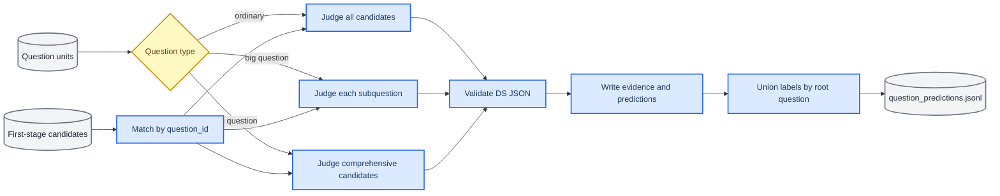
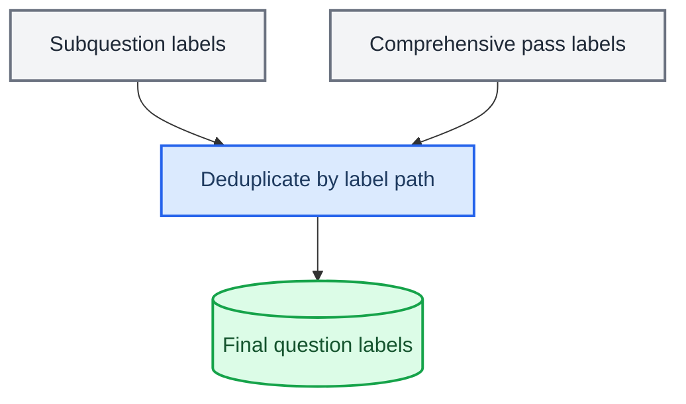

# 地理知识点第二阶段 DS 打标实现方案

_面向导师汇报的技术方案：在第一阶段候选召回结果上，使用 DeepSeek-V4-Flash 完成地理知识点精排、判定与整题结果汇总。_

---

## 🎯 一、方案结论

第二阶段不是把整道大题一次性交给模型，而是根据题型拆分判定任务：

| 题型 | DS 判定方式 | 最终结果 |
|---|---|---|
| 普通题 | 整题一次判断普通、区域、综合候选 | 直接作为整题标签 |
| 大题小题 | 每个小题分别判断普通标签和区域标签；公共题干只作上下文 | 合并所有小题结果 |
| 大题综合标签 | 公共题干 + 全部小题额外判断综合候选 | 与小题结果取并集 |

最终整题标签为：

```text
整题标签 = 所有小题的普通/区域标签 ∪ 整题综合专项标签
```

区域标签可以和普通标签在同一次小题判定中共同判断；综合标签仍单独执行整题专项判定，避免模型因为“多个小题”而机械选择综合标签。

## 📋 二、总体处理流程



## 📥 三、输入数据与数据契约

### 3.1 题目打标单元

由 `question_tagging_units` 将原始题目展开为 DS 可处理的单元：

- 普通题：一个 `input_role=root` 单元
- 大题：一个 `input_role=whole_question_comprehensive` 单元，加上每个 `input_role=subquestion` 单元
- 小题包含 `root_question_id`，并保留 `context_stem` 作为公共题干上下文
- 公共题干的文字图示描述可以传给 DS；仅有原始图片而没有可读描述时，模型必须标记 `context_insufficient`

大题展开后的结构如下：

```text
root_question_id = R
├── R|R|whole_question_comprehensive
├── R|Q1|subquestion
├── R|Q2|subquestion
└── ...
```

### 3.2 第一阶段候选文件

当前使用的候选文件为：

```text
/home/fuxinzhou/bio-geo/runs/tagging/geography-stage1-final-candidates-1826.jsonl
```

每行是一道完整题目的候选记录，核心结构如下：

```json
{
  "question_id": "2139831980453519364",
  "parent_id": "2139831980453519364",
  "combined_candidates": [
    {
      "label_path": "知识点@自然地理@地球的运动@地球运动的基本特征@地球的自转特征",
      "selection_source": "bm25_primary",
      "bm25_rank": 5,
      "bge_rank": 21
    }
  ],
  "candidate_count": 40
}
```

该文件只作为候选结果文件，不是第二阶段的唯一输入，更不会整行发送给 DS。第二阶段只读取记录关联键和候选路径：

```text
question_id
parent_id
combined_candidates[].label_path
```

以下召回与评测字段不读取、不发送：

- `knw_labels` 和其他现有金标字段
- 各种 `missing_labels`
- BM25/BGE 排名与分数
- `selection_source`
- 地点证据类型
- 候选原始排序

候选路径去重后，通过题目 ID 与独立的原始题目单元关联，再按与召回顺序无关的稳定散列顺序打乱，最后补充标签释义。Prompt 中的 `C01`、`C02` 只是打乱后的临时短码。

候选文件内部仍可保留普通、区域和综合召回过程信息，便于第一阶段审计；第二阶段通过标签路径和标签定义识别类型，不使用这些召回特征辅助 DS 判断。

小题关联候选时按以下顺序查找：

```text
小题 question_id → 找不到时使用 root_question_id
```

这样可以复用整道大题的候选召回结果，同时避免只按小题 ID 查找导致漏候选。

### 3.3 地理标签释义文件

```text
/home/fuxinzhou/bio-geo/data/taxonomy/geography-existing-definitions.jsonl
```

地理释义文件与生物版字段不同，当前适配为：

| 地理字段 | DS 内部字段 | 含义 |
|---|---|---|
| `knw_label` | `label_path` | 标签路径和唯一标识 |
| `label_id` | `taxonomy_label_id` | 原始数值标签 ID |
| `existing_interpretation.definition` | `definition` | 标签定义 |
| `existing_interpretation.keywords` | `core_concepts` | 核心概念和关键词 |
| `existing_interpretation.exam_methods` | `assessment_scope` | 常见考查范围 |
| `existing_interpretation.distinction` | `distinctions` | 与相近标签的边界 |

模型判断以 `label_name`、`label_path`、`definition`、`core_concepts` 和 `distinctions` 为主；`assessment_scope` 用于补充标签的考查边界。

## 🔀 四、标签路由与判定边界

### 4.1 普通题

普通题没有小题拆分，直接把 `combined_candidates` 中的普通、区域和综合候选放在同一个 Prompt 中。模型要求每个标签都必须独立支持题目答案中的关键判断：

- 普通标签：题目直接考查该知识范围
- 区域标签：题目必须依赖该区域特有的位置、环境特征、空间差异、区域联系或区域发展知识
- 综合标签：题目确实需要跨模块联动形成不可拆分的综合判断

仅出现地名、行政区名、城市名或案例地点，不足以选择区域标签。

### 4.2 大题小题

每个小题单独调用一次 DS：

- 输入包含公共题干、当前小题题干、选项、答案和解析
- 公共题干只用于补足当前小题明确指代的对象、区域和语境
- 不读取兄弟小题的知识点作为当前小题的考点
- 候选保留所有非综合候选，即普通候选和区域候选
- 区域标签只有在当前小题确实需要区域特有知识时才选择

这种设计使区域标签落到真正使用该区域知识的小题上，而不是在整道大题层面泛化扩散。

### 4.3 整题综合标签专项

大题额外执行一次综合专项判定：

- 输入为公共题干和全部小题
- 候选只保留综合候选
- 只有多个小题或同一小题中的知识必须跨模块联动、共同形成不可拆分的判断时才选择
- 仅仅因为大题包含多个独立知识点，不选择综合标签
- 综合专项不得补选普通标签或区域标签
- 不构成综合考查时返回空选且 `need_expand_recall=false`；只有确实存在综合考查、但正确综合标签不在候选中时才要求扩召

## 🤖 五、DS 调用与输出校验

### 5.1 模型配置

当前运行配置为：

| 参数 | 值 |
|---|---|
| Endpoint | `http://172.22.0.35:9204/v1/chat/completions` |
| Model | `DeepSeek-V4-Flash` |
| Thinking | disabled |
| Temperature | `0`（代码固定，保证判定可复现） |
| Max tokens | `512` |
| 并发 | `30 workers` |
| 超时 | `600 s` |
| 重试 | `3` 次，指数退避 |

客户端通过 OpenAI 兼容接口发送请求，支持多端点轮询、超时、重试、请求间隔控制、响应 JSON 提取和请求元数据记录。

### 5.2 结构化输出

模型输出经过严格 JSON 解析和字段校验，重点检查：

- `selected_labels` 是否为合法数组
- 标签是否来自当前候选集合
- 临时候选短码是否能映射回当前候选路径
- `none_of_candidates`、`need_expand_recall`、`context_insufficient` 和 `needs_review` 是否为布尔值
- 每个选中标签的 evidence 是否存在、非空且不超过300字

Prompt仍要求 evidence 尽量逐字引用题目且不超过60字，用于约束模型输出；程序硬校验与
生物版保持一致，不因概括表达、标点差异或超过60字但未超过300字而丢弃整条标签结果。

校验失败会记录错误并按配置重试，不直接写入可训练结果。

### 5.3 缺图处理

DS 当前不能直接查看原始图片。若题目依赖图片且没有足够的文字描述：

- Prompt 明确禁止根据答案或解析猜测图中信息
- 模型应返回 `context_insufficient=true`
- 该结果进入复核或不可训练集合

## 🧱 六、断点续跑与物化结果

每个打标单元以稳定的 `unit_key` 作为断点键，重复运行时可以跳过已经完成的单元。运行目录建议使用新的版本名，避免不同候选文件、Prompt 或模型配置混用。

典型输出文件：

| 文件 | 内容 |
|---|---|
| `evidence.jsonl` | DS 原始响应、Prompt 版本、耗时和错误信息 |
| `predictions.jsonl` | 逐单元的结构化判定结果 |
| `question_predictions.jsonl` | 按根题合并后的最终标签 |
| `report.json` | 数量、错误、过滤和训练可用性统计 |
| `run_manifest.json` | 输入、模型、Prompt 和运行参数快照 |
| `run.log` | 启动/续跑信息、逐单元进度、错误原因和最终汇总 |

整题汇总时，对同一 `root_question_id` 的结果去重并取并集：

程序还会比较预期打标单元与实际成功单元。任一小题或综合专项缺失时，记录缺失单元、
设置 `components_complete=false`，并禁止该整题进入训练。



## 🧪 七、质量控制与评估方案

### 7.1 工程正确性

当前代码已覆盖以下测试：

- 标签释义字段适配
- 候选去元数据、稳定打乱与短码映射
- 普通/区域/综合候选路由
- 大题展开和公共题干上下文传递
- JSON 响应解析与非法输出处理
- 并发、重试和断点续跑
- 硬排除规则
- 小题标签与综合标签整题并集

本地全量测试结果：`123 passed, 5 skipped`。

### 7.2 DS 结果统计

建议在 100 道题冒烟测试后重点查看：

| 指标 | 关注问题 |
|---|---|
| `context_insufficient` 比例 | 缺图或题干信息不足是否过多 |
| `none_of_candidates` 比例 | 第一阶段召回是否遗漏核心标签 |
| `need_expand_recall` 比例 | 候选上限是否需要调整 |
| 区域标签选择率 | 是否把材料地点误判成区域知识 |
| 综合标签选择率 | 是否因大题结构而过度选择综合标签 |
| `needs_review` 比例 | Prompt 或释义边界是否不清 |
| 可训练比例 | 硬排除、缺图和错误输出后的有效数据规模 |

### 7.3 人工抽样复核

建议至少抽查以下样本：

- 含区域名称但只作材料背景的题目
- 同时召回普通、区域和综合候选的题目
- 多小题但不应产生综合标签的大题
- 图片依赖明显、但只有文字描述的题目
- `none_of_candidates=true` 或 `need_expand_recall=true` 的题目

## ▶️ 八、运行命令

### 8.1 生成第二阶段打标单元

```bash
cd /home/fuxinzhou/bio-geo

git pull --ff-only origin main

PYTHONPATH=src .venv/bin/python -m bio_geo_tagging.question_tagging_units \
  --input data/annotation/geography-high-score-valid-questions-filtered-v2.jsonl \
  --output data/annotation/geography-high-score-valid-tagging-units-filtered-v2.jsonl \
  --log-file runs/logs/geography-high-score-valid-tagging-units-filtered-v2.log
```

### 8.2 冒烟运行

```bash
PYTHONPATH=src .venv/bin/python -m bio_geo_tagging.run_candidate_adjudication \
  --units data/annotation/geography-high-score-valid-tagging-units-filtered-v2.jsonl \
  --candidates runs/tagging/geography-stage1-final-candidates-1826.jsonl \
  --labels data/taxonomy/geography-existing-definitions.jsonl \
  --audited-exclusions configs/geography_adjudication_audited_exclusions.json \
  --run-dir runs/tagging/geography-adjudication-smoke-100-v1.5 \
  --endpoint http://172.22.0.35:9204/v1/chat/completions \
  --model DeepSeek-V4-Flash \
  --disable-thinking \
  --limit 100 \
  --workers 30 \
  --timeout 600 \
  --retries 3 \
  --retry-delay 1 \
  --request-interval 0 \
  --max-tokens 512
```

### 8.3 全量运行

冒烟结果确认后，删除 `--limit 100`，并使用新的 `--run-dir`，例如：

```bash
--run-dir runs/tagging/geography-adjudication-full-v1.5
```

## 🧭 九、当前边界与后续工作

当前方案解决的是“候选集合内的高精度判定与整题汇总”，不替代第一阶段召回。若模型频繁返回 `need_expand_recall=true`，应优先检查候选召回覆盖率、区域候选噪声和综合候选定义，而不是简单放宽 DS 的选标签规则。

后续建议按以下顺序推进：

1. 运行 100 道题冒烟测试并保存 `report.json`
2. 人工复核普通、区域、综合三类边界样本
3. 根据误选和漏选样本修订地理释义的 `distinction`
4. 再扩大到全量运行
5. 用人工复核集估计精确率、召回率和可训练比例

## 🔗 十、代码与配置索引

| 组件 | 文件 |
|---|---|
| 精排主体、Prompt、候选路由、汇总 | `src/bio_geo_tagging/adjudication.py` |
| DS 请求客户端 | `src/bio_geo_tagging/ds.py` |
| 命令行入口 | `src/bio_geo_tagging/run_candidate_adjudication.py` |
| 大题/小题单元展开 | `src/bio_geo_tagging/question_tagging_units.py` |
| 地理标签释义 | `data/taxonomy/geography-existing-definitions.jsonl` |
| 人工硬排除 | `configs/geography_adjudication_audited_exclusions.json` |
| 第一阶段候选 | `runs/tagging/geography-stage1-final-candidates-1826.jsonl` |
